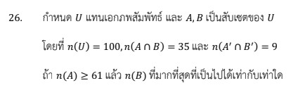

# โจทย์ข้อ 26 ของวิชาคณิตศาสตร์ประยุกต์ 1 (A-Level) ปี 2566

โจทย์ข้อ 26 เป็นโจทย์เกี่ยวกับ **ทฤษฎีเซต (Set Theory)** โดยทดสอบความรู้เรื่องการหาจำนวนสมาชิกของเซต สมบัติของคอมพลีเมนต์ และกฎของเดอมอร์แกนครับ

## โจทย์

กำหนด $U$ แทนเอกภพสัมพัทธ์ และ $A, B$ เป็นสับเซตของ $U$ โดยที่:

* $n(U) = 100$
* $n(A \cap B) = 35$
* $n(A' \cap B') = 9$
ถ้าวางเงื่อนไขว่า **$n(A) \geq 61$** แล้วค่า **$n(B)$ ที่มากที่สุดที่เป็นไปได้** เท่ากับเท่าใด

---

### **วิธีทำอย่างละเอียด**

**ขั้นตอนที่ 1: ใช้กฎของเดอมอร์แกน (De Morgan's Law)**
จากโจทย์ $n(A' \cap B') = 9$ ตามกฎของเดอมอร์แกนเราทราบว่า $A' \cap B' = (A \cup B)'$
ดังนั้นจำนวนสมาชิกข้างนอกเซต $A$ และ $B$ รวมกันคือ **$n(A \cup B)' = 9$**

**ขั้นตอนที่ 2: หาจำนวนสมาชิกของ $n(A \cup B)$**
จำนวนสมาชิกที่อยู่ในเซต $A$ หรือ $B$ (หรือทั้งคู่) หาได้จาก:
$$n(A \cup B) = n(U) - n(A \cup B)'$$
$$n(A \cup B) = 100 - 9 = \mathbf{91}$$

**ขั้นตอนที่ 3: ใช้สูตรหลักการรวมเข้าและการคัดออก (Inclusion-Exclusion Principle)**
จากสูตร $n(A \cup B) = n(A) + n(B) - n(A \cap B)$
แทนค่าที่ทราบลงไป:
$$91 = n(A) + n(B) - 35$$
จัดรูปสมการเพื่อหาความสัมพันธ์ของ $n(A)$ และ $n(B)$:
$$n(A) + n(B) = 91 + 35 = 126$$
จะได้ **$n(B) = 126 - n(A)$**

**ขั้นตอนที่ 4: วิเคราะห์ค่า $n(B)$ ที่มากที่สุด**
เพื่อให้ $n(B)$ มีค่า **มากที่สุด** เราต้องทำให้ค่า $n(A)$ มีค่า **น้อยที่สุด** (เนื่องจากเป็นตัวลบ)
จากเงื่อนไขโจทย์ $n(A) \geq 61$ ค่าที่น้อยที่สุดของ $n(A)$ คือ **61**
แทนค่าลงในสมการ:
$$n(B)_{max} = 126 - 61 = \mathbf{65}$$

**ตอบ:** 65

---

### **เนื้อหาที่เกี่ยวข้องเพื่อศึกษาเพิ่มเติม**

**1. สูตรและสมบัติสำคัญ:**

* **กฎของเดอมอร์แกน:** $(A \cup B)' = A' \cap B'$ และ $(A \cap B)' = A' \cup B'$ ช่วยในการเปลี่ยนรูปตัวดำเนินการเพื่อให้คำนวณง่ายขึ้น
* **หลักการรวมเข้าและคัดออก:** $n(A \cup B) = n(A) + n(B) - n(A \cap B)$ ใช้หาจำนวนสมาชิกเมื่อมีการทับซ้อนกัน

**2. ความหมายของตัวแปรและค่าคงที่:**

* **$n(U)$:** จำนวนสมาชิกทั้งหมดในขอบเขตที่พิจารณา (เอกภพสัมพัทธ์)
* **$A'$ (คอมพลีเมนต์):** สมาชิกที่อยู่ใน $U$ แต่ไม่อยู่ใน $A$
* **$\cap$ (อินเตอร์เซกชัน):** สมาชิกที่อยู่ทั้งใน $A$ และ $B$ (ส่วนที่ซ้ำกัน)
* **$\cup$ (ยูเนียน):** สมาชิกที่อยู่ใน $A$ หรืออยู่ใน $B$ หรืออยู่ทั้งคู่

### **กลยุทธ์แก้โจทย์ประเภทนี้**

* **เปลี่ยน 'พริม' ($'$) ให้เป็นรูปปกติ:** เมื่อเห็นคอมพลีเมนต์จำนวนมาก ให้พยายามใช้กฎเดอมอร์แกนยุบรวมเพื่อหาค่าของ $A \cup B$ หรือ $A \cap B$ ก่อนเสมอ
* **สร้างสมการความสัมพันธ์:** หากโจทย์ให้เงื่อนไขเป็นอสมการ (เช่น $\geq, \leq$) ให้ตั้งสมการหลักไว้ก่อน แล้วพิจารณาการแปรผกผัน (ถ้าตัวหนึ่งน้อย อีกตัวจะมาก) เพื่อหาคำตอบ
* **ตรวจสอบความเป็นไปได้:** จำนวนสมาชิกในเซตใดๆ ต้องไม่เกิน $n(U)$ และส่วนที่ซ้ำกัน $n(A \cap B)$ ต้องไม่มากกว่าจำนวนสมาชิกในเซตแม่ ($A$ หรือ $B$)

---

### **ตัวอย่างโจทย์เพิ่มเติมเพื่อฝึกทำ**

**โจทย์:** กำหนด $n(U) = 50, n(A \cup B)' = 5$ และ $n(A \cap B) = 10$ ถ้า $n(A) \geq 20$ จงหาค่า $n(B)$ ที่มากที่สุดที่เป็นไปได้

**เฉลยแนวคิด:**

1. หา $n(A \cup B) = 50 - 5 = 45$
2. ใช้สูตร: $45 = n(A) + n(B) - 10 \implies n(A) + n(B) = 55$
3. จะได้ $n(B) = 55 - n(A)$
4. ต้องการ $n(B)$ มากที่สุด ต้องใช้ $n(A)$ น้อยที่สุดคือ 20
5. $n(B) = 55 - 20 = 35$
**ตอบ:** 35

การฝึกใช้กฎเดอมอร์แกนร่วมกับสูตรจำนวนสมาชิกจะทำให้คุณแก้โจทย์เซตในระดับ A-Level ได้อย่างรวดเร็วครับ
