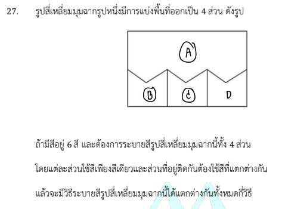

# การแก้โจทย์ข้อ 27 ของวิชาคณิตศาสตร์ประยุกต์ 1 (A-Level) ปี 2566

การแก้โจทย์ข้อนี้เป็นเรื่องเกี่ยวกับ **หลักการนับเบื้องต้น (Fundamental Principles of Counting)** โดยเฉพาะการใช้ **กฎการคูณ** ในปัญหาการระบายสีรูปแผนที่หรือพื้นที่ต่างๆ ครับ

### **โจทย์ข้อ 27**

รูปสี่เหลี่ยมมุมฉากรูปหนึ่งมีการแบ่งพื้นที่ออกเป็น 4 ส่วน (ส่วนบน 1 ส่วน และส่วนล่าง 3 ส่วนเรียงกัน) ดังรูป:

* มีสีอยู่ 6 สี ต้องการระบายสีทั้ง 4 ส่วน
* แต่ละส่วนใช้สีเพียงสีเดียว
* **ส่วนที่อยู่ติดกันต้องใช้สีที่แตกต่างกัน**
จะมีวิธีระบายสีได้ทั้งหมดกี่วิธี,

---

### **วิธีทำอย่างละเอียด**

เพื่อให้เห็นภาพชัดเจน เราจะกำหนดชื่อส่วนต่างๆ ดังนี้:

1. **ส่วน A:** พื้นที่สี่เหลี่ยมชิ้นบนสุด (ติดกับทุกชิ้นด้านล่าง)
2. **ส่วน B:** พื้นที่ชิ้นล่างซ้าย (ติดกับ A และ C)
3. **ส่วน C:** พื้นที่ชิ้นล่างกลาง (ติดกับ A, B และ D)
4. **ส่วน D:** พื้นที่ชิ้นล่างขวา (ติดกับ A และ C)

**ขั้นตอนการวิเคราะห์และระบายสี:**

* **ขั้นที่ 1: เลือกสีระบายส่วน A**
  * มีสีให้เลือกทั้งหมด **6 วิธี**
* **ขั้นที่ 2: เลือกสีระบายส่วน B**
  * ต้องไม่ซ้ำกับสีในส่วน A ดังนั้นเหลือสีให้เลือก $6 - 1 =$ **5 วิธี**
* **ขั้นที่ 3: เลือกสีระบายส่วน C**
  * ต้องไม่ซ้ำกับส่วน A และส่วน B (เพราะติดกับทั้งคู่) ดังนั้นเหลือสีให้เลือก $6 - 2 =$ **4 วิธี**
* **ขั้นที่ 4: เลือกสีระบายส่วน D**
  * ต้องไม่ซ้ำกับส่วน A และส่วน C (เพราะติดกับทั้งคู่ แต่ไม่ติดกับ B) ดังนั้นเหลือสีให้เลือก $6 - 2 =$ **4 วิธี**

**คำนวณผลรวมด้วยกฎการคูณ:**
จำนวนวิธีทั้งหมด $= 6 \times 5 \times 4 \times 4 = \mathbf{480}$ **วิธี**

**ตอบ:** 480 วิธี

---

### **เนื้อหาที่เกี่ยวข้องเพื่อศึกษาเพิ่มเติม**

**1. กฎการคูณ (Multiplication Rule):**

* **นิยาม:** หากงานหนึ่งประกอบด้วย $k$ ขั้นตอน โดยขั้นตอนแรกทำได้ $n_1$ วิธี ขั้นตอนที่สองทำได้ $n_2$ วิธี ไปจนถึงขั้นตอนสุดท้าย งานทั้งหมดจะทำได้ $n_1 \times n_2 \times \dots \times n_k$ วิธี
* **ที่มา:** มาจากแผนภาพต้นไม้ ซึ่งแสดงให้เห็นว่าทุกๆ 1 ทางเลือกในขั้นตอนแรก จะแตกแขนงออกไปเป็นทางเลือกในขั้นตอนถัดไปได้เท่าๆ กัน

**2. ความหมายของตัวแปรและเงื่อนไข:**

* **การระบายสี:** เป็นการเลือกสิ่งของ (สี) ไปใส่ในตำแหน่ง (พื้นที่) โดยที่ตำแหน่งต่างกันถือเป็นคนละชิ้นงาน
* **เงื่อนไข "ติดกัน":** คือการจำกัดขอบเขตของตัวเลือก (Constraints) ในขั้นตอนถัดไป

### **กลยุทธ์แก้โจทย์ประเภทนี้**

* **เริ่มจากส่วนที่ "เรื่องมาก" ที่สุด:** ควรเลือกพิจารณาส่วนที่สัมผัสกับพื้นที่อื่นมากที่สุดก่อน (ในข้อนี้คือส่วน A) เพราะจะทำให้เราทราบข้อจำกัดของพื้นที่อื่นๆ ได้ง่ายขึ้น
* **วาดรูปและใส่ชื่อกำกับ:** การตั้งชื่อส่วนเป็น A, B, C ช่วยลดความสับสนในการเช็คว่าส่วนไหนติดกับส่วนไหนบ้าง
* **ระวังส่วนที่ไม่ติดกัน:** อย่างในข้อนี้ ส่วน B กับ D ไม่ได้มีพรมแดนติดกัน ดังนั้นสีของ D จะซ้ำกับ B ได้ ตราบใดที่ไม่ซ้ำกับ A และ C

---

### **ตัวอย่างโจทย์เพิ่มเติมเพื่อฝึกทำ**

**โจทย์:** มีสี 4 สี ต้องการระบายสีลงในช่อง 3 ช่องเรียงกัน โดยช่องที่ติดกันห้ามใช้สีซ้ำกัน จะทำได้กี่วิธี

**เฉลยแนวคิด:**

1. **ช่องที่ 1:** เลือกสีได้ 4 วิธี
2. **ช่องที่ 2:** เลือกสีได้ 3 วิธี (ห้ามซ้ำช่องที่ 1)
3. **ช่องที่ 3:** เลือกสีได้ 3 วิธี (ห้ามซ้ำช่องที่ 2 แต่ซ้ำช่องที่ 1 ได้)
4. **คำนวณ:** $4 \times 3 \times 3 = 36$ วิธี
**ตอบ:** 36 วิธี

การฝึกไล่ลำดับการเลือกสีจะช่วยให้น้องๆ ทำคะแนนหัวข้อหลักการนับใน A-Level ได้อย่างแม่นยำครับ
