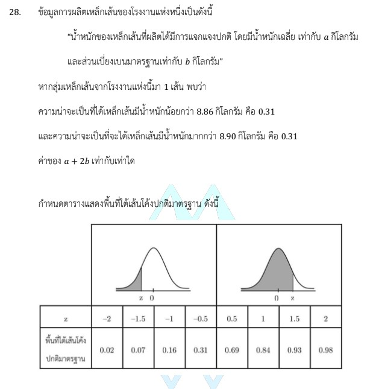

# การแก้โจทย์ข้อ 28 คณิตศาสตร์ประยุกต์ 1 (A-Level) ปี 2566

การแก้โจทย์ข้อ 28 ของวิชาคณิตศาสตร์ประยุกต์ 1 (A-Level) ปี 2566 เป็นเรื่องเกี่ยวกับ **สถิติ (Statistics)** ในหัวข้อ **การแจกแจงปกติ (Normal Distribution)** ซึ่งเป็นการวิเคราะห์ตำแหน่งของข้อมูลผ่านค่ามาตรฐาน (z-score) ครับ

### **โจทย์ข้อ 28**

น้ำหนักของเหล็กเส้นมีการแจกแจงปกติ โดยมีน้ำหนักเฉลี่ยเท่ากับ $o$ กิโลกรัม และส่วนเบี่ยงเบนมาตรฐานเท่ากับ $\beta$ กิโลกรัม

* ความน่าจะเป็นที่เหล็กเส้นมีน้ำหนักน้อยกว่า 8.86 กิโลกรัม คือ 0.31
* ความน่าจะเป็นที่เหล็กเส้นมีน้ำหนักมากกว่า 8.90 กิโลกรัม คือ 0.31
* **จงหาค่าของ $o + 2\beta$**

---

### **วิธีทำอย่างละเอียด**

**ขั้นตอนที่ 1: วิเคราะห์ข้อมูลจากตารางค่ามาตรฐาน (z-score)**
จากตารางพื้นที่ใต้เส้นโค้งปกติที่โจทย์กำหนดให้:

1. พื้นที่ฝั่งซ้ายของ $z$ ที่เท่ากับ **0.31** ตรงกับค่า **$z = -0.5$**
2. พื้นที่ฝั่งซ้ายของ $z$ ที่เท่ากับ **0.69** ตรงกับค่า **$z = 0.5$** (ซึ่งพื้นที่ฝั่งขวาจะเท่ากับ $1 - 0.69 = 0.31$)

**ขั้นตอนที่ 2: แปลงค่าน้ำหนักเป็นค่ามาตรฐาน**
ใช้สูตรค่ามาตรฐาน: $z = \frac{x - \mu}{\sigma}$ (ในที่นี้ $\mu = o$ และ $\sigma = \beta$)

1. **สำหรับน้ำหนักน้อยกว่า 8.86:** พื้นที่เท่ากับ 0.31 จะได้ค่า $z = -0.5$
    $$-0.5 = \frac{8.86 - o}{\beta} \implies -0.5\beta = 8.86 - o \quad ---(1)$$
2. **สำหรับน้ำหนักมากกว่า 8.90:** พื้นที่ฝั่งขวาเท่ากับ 0.31 (หรือฝั่งซ้าย 0.69) จะได้ค่า $z = 0.5$
    $$0.5 = \frac{8.90 - o}{\beta} \implies 0.5\beta = 8.90 - o \quad ---(2)$$

**ขั้นตอนที่ 3: แก้ระบบสมการหาค่า $o$ และ $\beta$**

* **หาค่า $o$:** นำสมการ (1) + (2)
    $$0 = (8.86 - o) + (8.90 - o)$$
    $$2o = 17.76 \implies \mathbf{o = 8.88}$$
* **หาค่า $\beta$:** แทนค่า $o$ ในสมการ (2)
    $$0.5\beta = 8.90 - 8.88 = 0.02$$
    $$\beta = \frac{0.02}{0.5} \implies \mathbf{\beta = 0.04}$$

**ขั้นตอนที่ 4: คำนวณสิ่งที่โจทย์ถาม**
$$o + 2\beta = 8.88 + 2(0.04)$$
$$o + 2\beta = 8.88 + 0.08 = \mathbf{8.96}$$

**ตอบ:** 8.96

---

### **เนื้อหาที่เกี่ยวข้องเพื่อศึกษาเพิ่มเติม**

**1. สูตรค่ามาตรฐาน (z-score):** $z = \frac{x - \mu}{\sigma}$

* **$x$:** ค่าของข้อมูล (น้ำหนักเหล็ก)
* **$\mu$ (ในโจทย์คือ $o$):** ค่าเฉลี่ยเลขคณิต บอกจุดกึ่งกลางของระฆังคว่ำ
* **$\sigma$ (ในโจทย์คือ $\beta$):** ส่วนเบี่ยงเบนมาตรฐาน บอกการกระจายตัวของข้อมูล

**2. คุณสมบัติของเส้นโค้งปกติ:**

* เป็นรูป **ระฆังคว่ำที่สมมาตร** โดยมีค่าเฉลี่ย มัธยฐาน และฐานนิยมอยู่ที่จุดเดียวกัน (ตรงกลาง)
* พื้นที่ทั้งหมดใต้กราฟเท่ากับ 1 หรือ 100%

**3. การอ่านตารางพื้นที่:**
โจทย์ A-Level ปัจจุบันมักให้ตารางพื้นที่สะสมจากฝั่งซ้ายมาให้ เราต้องรู้ว่าถ้าโจทย์บอกพื้นที่ "มากกว่า" (ฝั่งขวา) ต้องนำ 1 มาลบออกก่อนหาค่า $z$ ครับ

### **กลยุทธ์แก้โจทย์ประเภทนี้**

* **ใช้สมบัติความสมมาตร:** หากความน่าจะเป็นของ "น้อยกว่าค่าหนึ่ง" และ "มากกว่าอีกค่าหนึ่ง" มีค่าเท่ากัน (เช่น 0.31 เท่ากันในข้อนี้) แสดงว่า **ค่าเฉลี่ย ($o$) จะอยู่กึ่งกลางระหว่างสองค่านั้นเสมอ** ($o = \frac{8.86 + 8.90}{2} = 8.88$) วิธีนี้ช่วยให้หาค่าเฉลี่ยได้ทันทีโดยไม่ต้องตั้งสมการยาวๆ ครับ
* **วาดรูปเส้นโค้ง:** การวาดกราฟระฆังคว่ำแล้วระบายสีพื้นที่ที่โจทย์กำหนด จะช่วยให้เราเห็นภาพชัดเจนว่าค่า $z$ ควรเป็นบวกหรือลบ

---

### **ตัวอย่างโจทย์เพิ่มเติมเพื่อฝึกทำ**

**โจทย์:** คะแนนสอบมีการแจกแจงปกติ มีค่าเฉลี่ย 60 คะแนน และส่วนเบี่ยงเบนมาตรฐาน 10 คะแนน ถ้าต้องการให้นักเรียน 16% ที่ได้คะแนนสูงสุดได้รับเกรด A จะต้องได้คะแนนอย่างน้อยกี่คะแนน (กำหนดพื้นที่ใต้เส้นโค้งปกติทางซ้ายของ $z=1$ คือ 0.84)

**เฉลย:**

1. นักเรียน 16% สูงสุด หมายถึงพื้นที่ฝั่งขวาเป็น 0.16 ดังนั้นพื้นที่ฝั่งซ้ายคือ $1 - 0.16 = 0.84$
2. จากค่าที่กำหนด $z = 1$
3. แทนในสูตร: $1 = \frac{x - 60}{10} \implies 10 = x - 60 \implies x = 70$
**ตอบ:** ต้องได้คะแนนอย่างน้อย 70 คะแนน

การฝึกแปลงพื้นที่กลับเป็นค่า $z$ จะช่วยให้คุณทำคะแนนบทสถิติได้อย่างแม่นยำครับ
