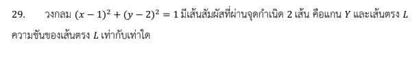

# วิธีแก้โจทย์ข้อ 29 A-Level คณิตศาสตร์ประยุกต์ 1 ปี 2566

การแก้โจทย์ข้อ 29 ในวิชาคณิตศาสตร์ประยุกต์ 1 (A-Level) ปี 2566 เป็นเรื่องเกี่ยวกับ **เรขาคณิตวิเคราะห์** ในหัวข้อ **วงกลมและเส้นสัมผัส** ครับ โดยต้องอาศัยความรู้เรื่องสมการวงกลม สูตรระยะห่างระหว่างจุดกับเส้นตรง และสมบัติของเส้นสัมผัสวงกลม

### **โจทย์ข้อ 29**

วงกลม $(x - 1)^2 + (y - 2)^2 = 1$ มีเส้นสัมผัสที่ผ่านจุดกำเนิด 2 เส้น คือ แกน $Y$ และเส้นตรง $L$ จงหาความชันของเส้นตรง $L$,

---

### **วิธีทำอย่างละเอียด**

**ขั้นตอนที่ 1: วิเคราะห์องค์ประกอบของวงกลม**
จากสมการวงกลมมาตรฐาน $(x - h)^2 + (y - k)^2 = r^2$:

* **จุดศูนย์กลาง $(h, k)$:** อยู่ที่จุด **$(1, 2)$**,
* **รัศมี ($r$):** เนื่องจาก $r^2 = 1$ ดังนั้น **$r = 1$**,
*(หมายเหตุ: จุดศูนย์กลางห่างจากแกน Y เป็นระยะ 1 หน่วยพอดี จึงทำให้แกน Y เป็นเส้นสัมผัสตามที่โจทย์บอก)*

**ขั้นตอนที่ 2: กำหนดสมการเส้นตรง $L$**
เนื่องจากเส้นตรง $L$ ผ่านจุดกำเนิด $(0, 0)$ เราสามารถกำหนดสมการเส้นตรงในรูป $y = mx$ ได้
จัดรูปสมการทั่วไป: **$mx - y = 0$** (โดย $m$ คือความชันที่เราต้องการหา)

**ขั้นตอนที่ 3: ใช้สมบัติ "ระยะจากจุดศูนย์กลางไปยังเส้นสัมผัสเท่ากับรัศมี"**
ใช้สูตรระยะห่างระหว่างจุด $(x_0, y_0)$ กับเส้นตรง $Ax + By + C = 0$:
$$d = \frac{|Ax_0 + By_0 + C|}{\sqrt{A^2 + B^2}}$$
แทนค่าจุดศูนย์กลาง $(1, 2)$, เส้นตรง $mx - y = 0$ และระยะห่าง $d = r = 1$:
$$1 = \frac{|m(1) - (2) + 0|}{\sqrt{m^2 + (-1)^2}}$$
$$1 = \frac{|m - 2|}{\sqrt{m^2 + 1}}$$

**ขั้นตอนที่ 4: แก้สมการหาค่าความชัน $m$**
ยกกำลังสองทั้งสองข้างเพื่อกำจัดค่าสัมบูรณ์และรากที่สอง:
$$1^2 = \frac{(m - 2)^2}{m^2 + 1}$$
$$m^2 + 1 = m^2 - 4m + 4$$
ตัด $m^2$ ออกทั้งสองข้าง:
$$1 = -4m + 4$$
$$4m = 3 \implies \mathbf{m = \frac{3}{4}}$$

**ตอบ:** ความชันของเส้นตรง $L$ เท่ากับ **$3/4$** (หรือ 0.75)

---

### **เนื้อหาที่เกี่ยวข้องเพื่อศึกษาเพิ่มเติม**

**1. สูตรที่สำคัญ:**

* **สมการวงกลม:** $(x - h)^2 + (y - k)^2 = r^2$
* **ระยะห่างจุดกับเส้นตรง:** $d = \frac{|Ax_0 + By_0 + C|}{\sqrt{A^2 + B^2}}$ ใช้บ่อยมากในโจทย์ภาคตัดกรวยที่เกี่ยวกับเส้นสัมผัส
* **สมการเส้นตรงผ่านจุดกำเนิด:** $y = mx$

**2. ความหมายของตัวแปร:**

* **$m$:** ความชัน (Slope) บอกความเอียงของเส้นตรง
* **$(h, k)$:** พิกัดจุดศูนย์กลางของวงกลม
* **$r$:** ความยาวรัศมี ซึ่งต้องตั้งฉากกับเส้นสัมผัส ณ จุดสัมผัสเสมอ

### **กลยุทธ์แก้โจทย์ประเภทนี้**

* **วาดรูปคร่าวๆ:** จะทำให้เห็นว่าจุดศูนย์กลาง $(1, 2)$ อยู่ทางขวาของแกน Y และห่างออกมา 1 หน่วย ทำให้มองออกว่าเส้นสัมผัสอีกเส้น ($L$) ควรจะมีความชันเป็นบวกและเอียงน้อยกว่าเส้นที่ลากผ่านจุดศูนย์กลาง
* **ใช้จุดกำเนิดให้เป็นประโยชน์:** การที่เส้นตรงผ่าน $(0, 0)$ ช่วยให้สมการเส้นตรงเหลือตัวแปรเดียวคือ $m$ ทำให้แก้สมการได้ง่ายขึ้นมาก
* **สมบัติเส้นสัมผัส:** หัวใจของโจทย์เรื่องเส้นสัมผัสภาคตัดกรวยคือการใช้ "ระยะห่างจากจุดไปยังเส้น" มาเท่ากับ "รัศมี" หรือใช้การตรวจสอบค่า $\Delta = 0$ ในสมการกำลังสอง

---

### **ตัวอย่างโจทย์เพิ่มเติมเพื่อฝึกทำ**

**โจทย์:** วงกลมที่มีจุดศูนย์กลางอยู่ที่ $(3, 4)$ และสัมผัสแกน X จงหาความชันของเส้นตรงที่ผ่านจุดกำเนิดและสัมผัสวงกลมนี้ (ไม่รวมแกน X)

**เฉลยแนวคิด:**

1. สัมผัสแกน X ที่จุด $(3, 0)$ แสดงว่ารัศมี $r = 4$
2. สมการเส้นตรง $L$ คือ $mx - y = 0$
3. ระยะจาก $(3, 4)$ ไปยัง $L$ คือ $\frac{|3m - 4|}{\sqrt{m^2 + 1}} = 4$
4. ยกกำลังสอง: $(3m - 4)^2 = 16(m^2 + 1)$
5. $9m^2 - 24m + 16 = 16m^2 + 16$
6. $7m^2 + 24m = 0 \implies m(7m + 24) = 0$
7. ได้ $m = 0$ (แกน X) หรือ **$m = -24/7$**
**ตอบ:** $-24/7$
