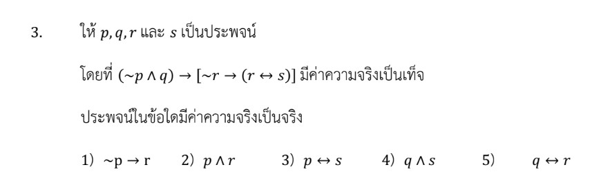

# การแก้โจทย์ปัญหาเรื่อง**ตรรกศาสตร์ (Logic)** ในข้อสอบ A-Level คณิตศาสตร์ 1 ปี 2566 ข้อที่ 3 นี้ เป็นการทดสอบความเข้าใจเรื่องค่าความจริงของประพจน์และการเชื่อมประพจน์หลายตัวแปรครับ

## **เฉลยละเอียดโจทย์ข้อ 3**

**โจทย์:** ให้ $p, q, r$ และ $s$ เป็นประพจน์ โดยที่ $(\sim p \wedge q) \to [\sim r \to (r \leftrightarrow s)]$ มีค่าความจริงเป็น**เท็จ** ประพจน์ในข้อใดมีค่าความจริงเป็น**จริง**

1) $\sim p \to r$
2) $p \wedge s$
3) $p \leftrightarrow s$
4) $q \wedge s$
5) $q \leftrightarrow r$

---

**วิธีทำ:**

**ขั้นตอนที่ 1: หาค่าความจริงของประพจน์ย่อย $p, q, r, s$**
โจทย์กำหนดให้ประพจน์รวมมีค่าความจริงเป็น **เท็จ ($F$)** โดยมีตัวเชื่อมหลักคือ "ถ้า...แล้ว..." ($\to$)

* **สมบัติของ $\to$:** ประพจน์ $A \to B$ จะเป็นเท็จได้กรณีเดียวคือ **หน้าจริง ($T$) หลังเท็จ ($F$)**
* ดังนั้น $(\sim p \wedge q) \equiv T$ และ $[\sim r \to (r \leftrightarrow s)] \equiv F$

**วิเคราะห์ส่วนหน้า: $(\sim p \wedge q) \equiv T$**

* ตัวเชื่อม "และ" ($\wedge$) จะเป็นจริงเมื่อ**จริงทั้งคู่**
* จะได้ $\sim p \equiv T$ (ส่งผลให้ **$p \equiv F$**) และ **$q \equiv T$**

**วิเคราะห์ส่วนหลัง: $[\sim r \to (r \leftrightarrow s)] \equiv F$**

* ตัวเชื่อมหลักคือ $\to$ ดังนั้น **หน้าต้องจริง หลังต้องเท็จ**
* จะได้ $\sim r \equiv T$ (ส่งผลให้ **$r \equiv F$**) และ $(r \leftrightarrow s) \equiv F$
* จาก $r \equiv F$ แทนใน $(r \leftrightarrow s) \equiv F$ จะได้ $(F \leftrightarrow s) \equiv F$
* ตัวเชื่อม "ก็ต่อเมื่อ" ($\leftrightarrow$) จะเป็นเท็จเมื่อค่าความจริง**ต่างกัน** ดังนั้น **$s \equiv T$**

**สรุปค่าความจริง:** $p = F, q = T, r = F, s = T$

---

**ขั้นตอนที่ 2: ตรวจสอบตัวเลือก**

1) $\sim p \to r \equiv \sim F \to F \equiv T \to F \equiv \mathbf{F}$
2) $p \wedge s \equiv F \wedge T \equiv \mathbf{F}$
3) $p \leftrightarrow s \equiv F \leftrightarrow T \equiv \mathbf{F}$
4) **$q \wedge s \equiv T \wedge T \equiv \mathbf{T}$** (ถูกต้อง)
5) $q \leftrightarrow r \equiv T \leftrightarrow F \equiv \mathbf{F}$

**ตอบ:** ตัวเลือกที่ 4

---

### **เนื้อหาที่เกี่ยวข้องเพื่อศึกษาเพิ่มเติม**

**1. ความหมายของตัวแปรและตัวเชื่อม:**

* **$p, q, r, s$:** คือ "ประพจน์" (Propositions) ซึ่งเป็นประโยคที่มีค่าความจริงเป็นจริงหรือเท็จเพียงอย่างเดียว
* **$\sim$ (นิเสธ):** เปลี่ยนค่าความจริงเป็นตรงข้าม
* **$\wedge$ (และ):** เป็นจริงเมื่อจริงทั้งคู่ (T $\wedge$ T = T)
* **$\to$ (ถ้า...แล้ว...):** เป็นเท็จกรณีเดียวคือ "จริงแล้วเท็จ" (T $\to$ F = F)
* **$\leftrightarrow$ (ก็ต่อเมื่อ):** เป็นจริงเมื่อค่าความจริงเหมือนกัน (T $\leftrightarrow$ T = T, F $\leftrightarrow$ F = T)

**2. กลยุทธ์แก้โจทย์ประเภทนี้:**

* **กลยุทธ์ "แกะจากนอกเข้าใน":** เมื่อโจทย์บอกว่าประพจน์รวมเป็นเท็จ ให้เริ่มจากตัวเชื่อมที่ใหญ่ที่สุด (Main Operator) แล้วค่อยๆ แตกแขนงหาค่าความจริงของตัวแปรย่อย
* **จุดเน้น:** จำกรณี "พิเศษ" ของแต่ละตัวเชื่อมให้แม่น เช่น $\wedge$ เน้นกรณีจริงตัวเดียว, $\vee$ เน้นกรณีเท็จตัวเดียว, $\to$ เน้นกรณีหน้าจริงหลังเท็จ

---

### **ตัวอย่างโจทย์เพิ่มเติมเพื่อฝึกทำ**

**โจทย์ฝึกหัด:** กำหนดให้ประพจน์ $(p \vee \sim q) \to (r \wedge s)$ มีค่าความจริงเป็น **เท็จ** จงหาค่าความจริงของ $p, q, r$ และ $s$

**เฉลย:**

1. เป็นเท็จกรณีเดียวคือ หน้าจริง ($T$) หลังเท็จ ($F$)
2. **หน้าจริง:** $(p \vee \sim q) \equiv T$ (ยังสรุปค่าไม่ได้แน่นอน เพราะมีหลายกรณี)
3. **หลังเท็จ:** $(r \wedge s) \equiv F$ (ยังสรุปค่าไม่ได้แน่นอน)
4. **สังเกต:** โจทย์แนวนี้หากไม่ได้กำหนดค่าอื่นมาให้ มักจะมีเงื่อนไขเพิ่มเติมหรือให้ตรวจสอบว่าข้อใดสรุปได้แน่นอน
    * ถ้าสมมติให้ $p$ เป็น $F$ จะบังคับให้ $\sim q$ ต้องเป็น $T$ (คือ $q = F$) เพื่อให้ส่วนหน้าเป็นจริง
    * ถ้าสมมติให้ $r$ เป็น $T$ จะบังคับให้ $s$ ต้องเป็น $F$ เพื่อให้ส่วนหลังเป็นเท็จ
    *(หมายเหตุ: ในข้อสอบจริงมักจะมีประพจน์ย่อยที่มีตัวเชื่อมที่ฟันธงค่าได้ชัดเจนกว่านี้แบบในโจทย์ข้อ 3 ครับ)*

การฝึก "ไล่สาย" ค่าความจริงจากบนลงล่างแบบนี้จะช่วยให้ทำข้อสอบตรรกศาสตร์ได้อย่างแม่นยำครับ
