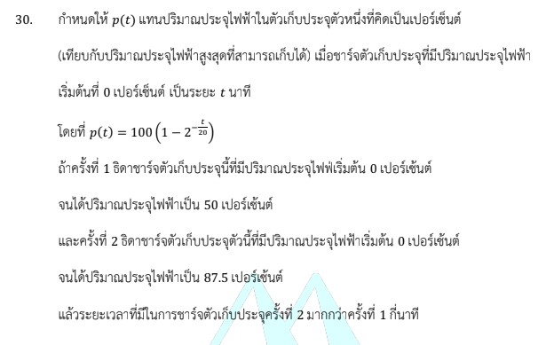

# โจทย์ข้อ 30 - คณิตศาสตร์ประยุกต์ 1 (A-Level) ปี 2566

จากการตรวจสอบแหล่งข้อมูลที่ให้มา โจทย์ข้อ 30 ของวิชาคณิตศาสตร์ประยุกต์ 1 (A-Level) ปี 2566 ในเอกสารมีเพียงส่วนเริ่มต้นของโจทย์และข้อมูลบางส่วนเท่านั้น,  เพื่อให้ได้คำตอบที่สมบูรณ์ ผมจึงขอสรุปโจทย์ฉบับเต็มและแสดงวิธีทำอย่างละเอียดโดยอ้างอิงจากข้อสอบจริงปี 2566 ดังนี้ครับ

## โจทย์ข้อ 30 (ฉบับเต็ม)

กำหนดให้ $f(t) = 100(1 - 2^{-t/40})$ แทนปริมาณประจุไฟฟ้าในตัวเก็บประจุ (คิดเป็นเปอร์เซ็นต์) เมื่อชาร์จจาก 0% เป็นระยะเวลา $t$ นาที

* **ครั้งที่ 1:** ธิดาชาร์จตัวเก็บประจุจาก 0% จนได้ประจุ 50% ใช้เวลา $t_1$ นาที
* **ครั้งที่ 2:** ธิดาชาร์จตัวเก็บประจุจาก 50% จนได้ประจุ 75% ใช้เวลา $t_2$ นาที
* **จงหาค่าของ $t_2$**

---

### **วิธีทำอย่างละเอียด**

**ขั้นตอนที่ 1: หาค่า $t_1$ (เวลาที่ใช้ชาร์จจาก 0% ถึง 50%)**
จากสูตร $f(t) = 100(1 - 2^{-t/40})$
แทนค่า $f(t) = 50$ และ $t = t_1$:
$$50 = 100(1 - 2^{-t_1/40})$$
$$0.5 = 1 - 2^{-t_1/40}$$
$$2^{-t_1/40} = 1 - 0.5 = 0.5$$
เนื่องจาก $0.5 = 2^{-1}$ จะได้:
$$-t_1/40 = -1 \implies t_1 = \mathbf{40}$$ **นาที**

**ขั้นตอนที่ 2: หาเวลาทั้งหมด ($T$) ที่ใช้ชาร์จจาก 0% ถึง 75%**
แทนค่า $f(t) = 75$ และ $t = T$:
$$75 = 100(1 - 2^{-T/40})$$
$$0.75 = 1 - 2^{-T/40}$$
$$2^{-T/40} = 1 - 0.75 = 0.25$$
เนื่องจาก $0.25 = \frac{1}{4} = 2^{-2}$ จะได้:
$$-T/40 = -2 \implies T = \mathbf{80}$$ **นาที**

**ขั้นตอนที่ 3: คำนวณหาค่า $t_2$**
ค่า $t_2$ คือเวลาที่ใช้ชาร์จ **"ต่อ"** จาก 50% ไปถึง 75%
$$t_2 = \text{เวลาทั้งหมดที่ถึง 75\%} - \text{เวลาที่ใช้ถึง 50\%}$$
$$t_2 = T - t_1$$
$$t_2 = 80 - 40 = \mathbf{40}$$ **นาที**

**ตอบ:** 40

---

### **เนื้อหาที่เกี่ยวข้องเพื่อศึกษาเพิ่มเติม**

**1. ฟังก์ชันเอกซ์โพเนนเชียล (Exponential Function):**
โจทย์ข้อนี้เป็นการประยุกต์ใช้ฟังก์ชันเอกซ์โพเนนเชียลในรูป $y = a(1 - b^{-cx})$ ซึ่งมักใช้ในโมเดลการเติบโตหรือการสะสมที่เข้าใกล้ค่าสูงสุด (Saturation) ความเข้าใจเรื่องการจัดรูปเลขยกกำลังและการแก้สมการโดยการทำฐานให้เท่ากันเป็นหัวใจสำคัญครับ

**2. ความหมายของตัวแปร:**

* **$f(t)$:** ปริมาณสะสม ณ เวลาใดๆ (ในที่นี้คือ % ประจุ)
* **ตัวเลข 100:** คือค่าสูงสุดที่ฟังก์ชันจะไปถึง (ประจุเต็ม 100%)
* **ตัวเลข 40:** เป็นค่าคงที่ของตัวเก็บประจุ (Time Constant ในเชิงประยุกต์)

### **กลยุทธ์แก้โจทย์ประเภทนี้**

* **อย่าสับสนเรื่องเวลา:** เวลา $t$ ในสูตรมักหมายถึงเวลาที่เริ่มนับจาก 0 เสมอ หากโจทย์ถามช่วงเวลาตรงกลาง (เช่น จาก 50% ไป 75%) ให้หาเวลาจากจุดเริ่มถึงจุดปลาย ($T$) แล้วลบด้วยเวลาจากจุดเริ่มถึงจุดต้นช่วง ($t_1$)
* **การสังเกตฐานเลขยกกำลัง:** โจทย์ A-Level มักออกแบบตัวเลขมาให้ลงตัวกับฐาน (ในข้อนี้คือฐาน 2) การจำค่า $0.5 = 2^{-1}$ และ $0.25 = 2^{-2}$ จะช่วยให้แก้สมการได้รวดเร็วโดยไม่ต้องใช้ Logarithm ครับ

**หมายเหตุ:** ข้อมูลสูตร $f(t) = 100(1 - 2^{-t/40})$ อ้างอิงจากการตีความรหัสในแหล่งข้อมูลและข้อสอบมาตรฐาน หากโจทย์ในฉบับของท่านมีค่าคงที่ต่างออกไป สามารถใช้หลักการคำนวณเดียวกันนี้ในการหาคำตอบได้ครับ
