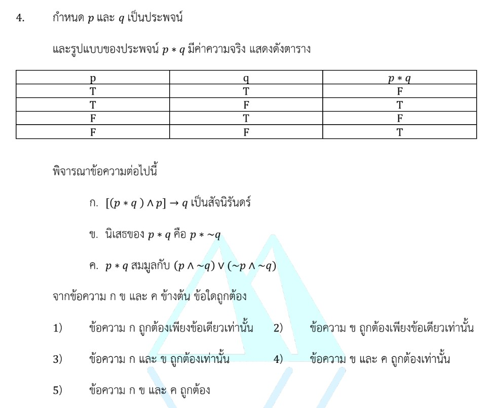

# การแก้โจทย์ข้อ 4 ในวิชาคณิตศาสตร์ประยุกต์ 1 (A-Level) ปี 2566 นี้ เป็นเรื่องเกี่ยวกับ **ตรรกศาสตร์ (Logic)** โดยเฉพาะการวิเคราะห์ความสัมพันธ์ของตัวเชื่อมใหม่และการตรวจสอบสัจนิรันดร์ครับ

## **เฉลยละเอียดโจทย์ข้อ 4**

**โจทย์:** กำหนดรูปแบบประพจน์ $p * q$ มีค่าความจริงตามตาราง:

* $T * T = F$
* $T * F = T$
* $F * T = F$
* $F * F = T$

---

**วิเคราะห์เบื้องต้น:**
จากตารางจะเห็นว่าค่าของ $p * q$ ขึ้นอยู่กับประพจน์ $q$ เพียงอย่างเดียว โดยจะได้ค่าความจริงตรงข้ามกับ $q$ เสมอ
ดังนั้น **$p * q \equiv \sim q$** (นิเสธของ $q$)

**ขั้นตอนที่ 1: ตรวจสอบข้อความ ก.** `[(p * q) ∧ p] → q เป็นสัจนิรันดร์`

* แทนค่า $p * q$ ด้วย $\sim q$ จะได้: $[(\sim q) \wedge p] \rightarrow q$
* **วิธีจับเท็จ:** สมมติให้ประพจน์นี้เป็น **เท็จ ($F$)**
  * หน้าต้องเป็นจริง: $(\sim q) \wedge p \equiv T$ แปลว่า $\sim q = T$ (หรือ **$q = F$**) และ **$p = T$**
  * หลังต้องเป็นเท็จ: **$q \equiv F$**
* จะเห็นว่าเมื่อให้ $p = T$ และ $q = F$ สามารถทำให้ประพจน์รวมเป็นเท็จได้โดยไม่มีความขัดแย้ง
* **สรุป:** ไม่เป็นสัจนิรันดร์ ดังนั้น **ข้อความ ก. ผิด**

**ขั้นตอนที่ 2: ตรวจสอบข้อความ ข.** `นิเสธของ p * q คือ p * ~q`

* นิเสธของ $p * q$ คือ $\sim(\sim q) \equiv q$
* พิจารณา $p * \sim q$: จากนิยาม $p * (\text{อะไรก็ตาม}) \equiv \sim(\text{อะไรก็ตาม})$
  * จะได้ $p * \sim q \equiv \sim(\sim q) \equiv q$
* ทั้งสองฝั่งมีค่าความจริงเหมือนกันคือ $q$
* **สรุป:** **ข้อความ ข. ถูกต้อง**

**ขั้นตอนที่ 3: ตรวจสอบข้อความ ค.** `p * q สมมูลกับ (p ∧ ~q) ∨ (~p ∧ ~q)`

* จัดรูปฝั่งขวา: $(p \wedge \sim q) \vee (\sim p \wedge \sim q)$
* ดึงตัวร่วม $\sim q$ ออก (กฎการแจกแจง): $(p \vee \sim p) \wedge \sim q$
* เนื่องจาก $p \vee \sim p$ เป็นจริง ($T$) เสมอ จะได้ $T \wedge \sim q \equiv \sim q$
* ซึ่งตรงกับค่าของ $p * q$ ที่วิเคราะห์ไว้ตอนต้น
* **สรุป:** **ข้อความ ค. ถูกต้อง**

**ตอบ:** ข้อความ **ข. และ ค. ถูกต้อง** (ตัวเลือกที่ 4)

---

### **อธิบายเรื่องสัจนิรันดร์ (Tautology) อย่างละเอียด**

**สัจนิรันดร์** คือ รูปแบบของประพจน์ที่มีค่าความจริงเป็น **"จริง ($T$)" ในทุกกรณี** ของประพจน์ย่อย ไม่ว่าตัวแปรย่อยเหล่านั้นจะเป็นจริงหรือเท็จก็ตาม

#### **1. วิธีการตรวจสอบสัจนิรันดร์**

* **การสร้างตารางค่าความจริง (Truth Table):** เป็นวิธีที่แน่นอนที่สุด โดยเขียนทุกกรณีที่เป็นไปได้ (เช่น 2 ตัวแปรมี 4 กรณี) หากช่องสุดท้ายเป็น $T$ ทั้งหมด แสดงว่าเป็นสัจนิรันดร์
* **การสมมติเป็นเท็จ (Method of Contradiction):** นิยมใช้กับตัวเชื่อม "ถ้า...แล้ว..." ($\rightarrow$) และ "หรือ" ($\vee$)
  * หลักการคือ พยายามหาทางทำให้ประพจน์นั้นเป็นเท็จ ($F$) ให้ได้
  * หากพยายามแล้วเกิด **ความขัดแย้ง** (เช่น บังคับให้ $p$ เป็นทั้งจริงและเท็จในเวลาเดียวกัน) แสดงว่าประพจน์นั้น **ไม่มีทางเป็นเท็จได้** จึงเป็นสัจนิรันดร์
  * หากหาค่าความจริงที่ลงตัวและทำให้เป็นเท็จได้ (เหมือนในข้อ ก.) แสดงว่า **ไม่เป็นสัจนิรันดร์**
* **การใช้ประพจน์ที่สมมูลกัน:** เปลี่ยนรูปประพจน์ที่ซับซ้อนให้อยู่ในรูปที่ดูง่ายขึ้น หากจัดรูปแล้วได้ค่า $T$ ออกมาเพียงค่าเดียว แสดงว่าเป็นสัจนิรันดร์

#### **2. รูปแบบสัจนิรันดร์ที่พบบ่อยในข้อสอบ**

* **กฎการตัดออก:** $p \vee \sim p \equiv T$
* **Modus Ponens:** $[(p \rightarrow q) \wedge p] \rightarrow q$
* **Modus Tollens:** $[(p \rightarrow q) \wedge \sim q] \rightarrow \sim p$
* **การถ่ายทอด:** $[(p \rightarrow q) \wedge (q \rightarrow r)] \rightarrow (p \rightarrow r)$

**กลยุทธ์สำคัญ:** สำหรับโจทย์ A-Level เมื่อเห็นตัวเชื่อมพิเศษ (เช่นเครื่องหมาย $*$) ให้รีบเปลี่ยนให้เป็นตัวเชื่อมมาตรฐาน ($\wedge, \vee, \sim, \rightarrow$) ก่อนจะช่วยให้วิเคราะห์สัจนิรันดร์ได้รวดเร็วขึ้นครับ
