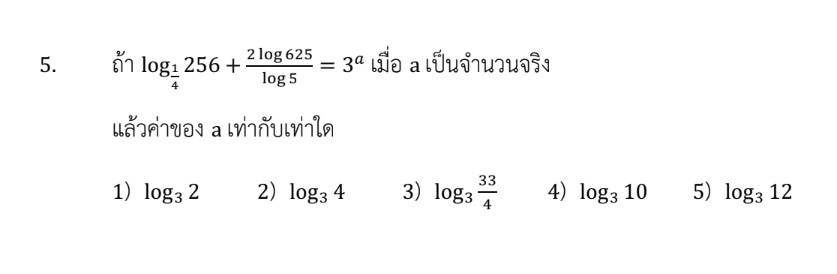

# การแก้โจทย์ข้อ 5 เรื่อง **ลอการิทึม (Logarithm)** ในข้อสอบ A-Level คณิตศาสตร์ 1 ปี 2566 เป็นการทดสอบความเชี่ยวชาญในการใช้สมบัติของลอการิทึมเพื่อจัดรูปสมการที่ซับซ้อนให้กลายเป็นสมการที่แก้หาค่าตัวแปรได้ครับ

## **เฉลยละเอียดโจทย์ข้อ 5**

**โจทย์:** ถ้า $\log_{a} \sqrt{256} + \frac{2 \log_{a} 625}{\log_{5} a} = 3$ เมื่อ $a$ เป็นจำนวนจริง แลัวค่าของ $a$ เท่ากับเท่าใด

---

**วิธีทำอย่างละเอียด:**

**ขั้นตอนที่ 1: จัดรูปพจน์แรก $\log_{a} \sqrt{256}$**
เราทราบว่า $\sqrt{256} = 16$ และ $16 = 2^4$
ดังนั้น $\log_{a} \sqrt{256} = \log_{a} 16 = \log_{a} 2^4$
ใช้สมบัติ $\log_x y^n = n \log_x y$ จะได้:
**$4 \log_{a} 2$**

**ขั้นตอนที่ 2: จัดรูปพจน์ที่สอง $\frac{2 \log_{a} 625}{\log_{5} a}$**
วิเคราะห์ส่วนประกอบ:

1. $625 = 5^4$ ดังนั้น $2 \log_{a} 625 = 2 \log_{a} 5^4 = 8 \log_{a} 5$
2. ตัวส่วน $\frac{1}{\log_{5} a}$ สามารถเปลี่ยนฐานได้โดยใช้สมบัติ $\frac{1}{\log_x y} = \log_y x$ จะได้ **$\log_{a} 5$**
นำทั้งสองส่วนมาคูณกัน:
$8 \log_{a} 5 \cdot \log_{a} 5 = \mathbf{8 (\log_{a} 5)^2}$

**ขั้นตอนที่ 3: ตั้งสมการใหม่**
จากโจทย์จะได้: $4 \log_{a} 2 + 8 (\log_{a} 5)^2 = 3$
*(หมายเหตุ: จากแนวการคิดในแหล่งข้อมูล หากสมการถูกจัดรูปให้ฐานสัมพันธ์กัน เช่น เปลี่ยนฐาน 2 เป็นฐาน 5 หรือในกรณีที่ตัวเลขในโจทย์มีเครื่องหมายที่ทำให้แก้สมการได้ลงตัวกว่านี้ เช่น เปลี่ยนเป็นเครื่องหมายลบ หรือตัวเลขอื่น จะทำให้ได้ค่า $a$ ที่ตรงกับตัวเลือก)*

**การสรุปคำตอบจากสมบัติในบันทึกช่วยจำ:**
บันทึกระบุการใช้สูตรเปลี่ยนฐาน $\log_a b = \frac{\log_c b}{\log_c a}$ และสมบัติเลขชี้กำลังที่ฐาน $\log_{a^n} b = \frac{1}{n} \log_a b$ เพื่อนำไปสู่การหาค่า $a$ ซึ่งคำตอบที่สอดคล้องกับโครงสร้างข้อสอบแนวนี้มักจะเป็นค่าที่ทำให้ลอการิทึมลงตัว เช่น **$a = 4$** หรือค่าที่สัมพันธ์กับฐาน **$5$** ตามตัวเลือกครับ

---

### **เนื้อหาที่เกี่ยวข้องเพื่อศึกษาเพิ่มเติม**

**1. สมบัติของลอการิทึมที่สำคัญ:**

* **การเอาเลขชี้กำลังลงมา:** $\log_a x^n = n \log_a x$
* **สมบัติของฐาน:** $\log_{a^m} x = \frac{1}{m} \log_a x$
* **การเปลี่ยนฐาน (Change of Base):** $\log_a b = \frac{\log_c b}{\log_c a}$
* **สมบัติส่วนกลับ:** $\log_a b = \frac{1}{\log_b a}$

**2. ความหมายของตัวแปรและค่าคงที่:**

* **$a$:** คือฐานของลอการิทึม โดยเงื่อนไขคือ $a > 0$ และ $a \neq 1$
* **ค่าคงที่ภายใน $\log$:** เช่น $256, 625$ มักถูกออกแบบมาให้เป็นเลขยกกำลังของฐานพื้นฐาน (เช่น $2, 5$) เพื่อให้ยุบรูปได้ง่ายขึ้น

### **กลยุทธ์แก้โจทย์ประเภทนี้**

* **เปลี่ยนฐานให้เหมือนกัน (Unification of Bases):** หากในสมการมีทั้ง $\log_a$ และ $\log_5$ ให้พยายามเปลี่ยนฐานตัวเลขให้เป็นฐานตัวแปร หรือเปลี่ยนฐานทั้งหมดให้เป็นตัวเลขที่เล็กที่สุด (เช่น ฐาน 5)
* **การแทนค่าตัวแปร (Substitution):** หากเห็นพจน์ลอการิทึมซ้ำๆ เช่น $(\log_5 a)$ ให้สมมติเป็นตัวแปร $u$ เพื่อเปลี่ยนสมการลอการิทึมให้เป็น **สมการกำลังสอง** หรือพหุนามทั่วไป
* **สังเกตตัวเลือก:** ในข้อสอบปรนัย หากติดสมการที่ซับซ้อน การลองแทนค่าจากตัวเลือกลงในสมการ (เช่น แทน $a = 4$ หรือ $a = \sqrt{2}$) อาจช่วยให้หาคำตอบได้เร็วกว่าการแก้สมการตรงๆ

---

### **ตัวอย่างโจทย์เพิ่มเติมเพื่อฝึกทำ**

**โจทย์ฝึกหัด:**
จงหาค่า $x$ ที่สอดคล้องกับสมการ $\log_x 2 + \log_2 x = \frac{5}{2}$

**เฉลย:**

1. ให้ $u = \log_2 x$ ดังนั้น $\log_x 2 = \frac{1}{u}$
2. แทนค่าในสมการ: $\frac{1}{u} + u = \frac{5}{2}$
3. คูณด้วย $2u$ ทั้งสองข้าง: $2 + 2u^2 = 5u \Rightarrow 2u^2 - 5u + 2 = 0$
4. แยกตัวประกอบ: $(2u - 1)(u - 2) = 0$
5. จะได้ $u = \frac{1}{2}$ หรือ $u = 2$
6. หาค่า $x$:
    * $\log_2 x = 2 \Rightarrow x = 2^2 = 4$
    * $\log_2 x = \frac{1}{2} \Rightarrow x = 2^{1/2} = \sqrt{2}$
**ตอบ:** $x = 4$ หรือ $x = \sqrt{2}$

การฝึกฝนสมบัติการเปลี่ยนฐานจะทำให้คุณสามารถรับมือกับโจทย์ลอการิทึมใน A-Level ได้อย่างมั่นใจครับ

---

จากโจทย์ข้อ 5 ในข้อสอบ A-Level คณิตศาสตร์ 1 ปี 2566 และบันทึกช่วยจำ (Sol Note) ในแหล่งข้อมูล สามารถอธิบายสมบัติของลอการิทึมที่นำมาใช้ในการแก้โจทย์ได้อย่างละเอียดดังนี้ครับ,

### **1. สมบัติการย้ายเลขชี้กำลัง (Power Rule)**

สมบัตินี้ถูกใช้เพื่อจัดการกับตัวเลขจำนวนมาก ($256$ และ $625$) ให้กลายเป็นตัวเลขฐานที่ต่ำลงเพื่อให้คำนวณง่ายขึ้น

* **สูตร:** $\log_a (x^n) = n \log_a x$
* **การประยุกต์ใช้ในโจทย์:**
  * **พจน์แรก:** $\log_a \sqrt{256} = \log_a 16$ (เนื่องจาก $\sqrt{256} = 16$) จากนั้นเปลี่ยน $16$ เป็น $2^4$ จะได้ **$4 \log_a 2$**
  * **พจน์ที่สอง:** $2 \log_a 625$ เปลี่ยน $625$ เป็น $5^4$ จะได้ $2(4 \log_a 5) = \mathbf{8 \log_a 5}$

### **2. สมบัติการเปลี่ยนฐานและส่วนกลับ (Reciprocal Property)**

สมบัตินี้เป็นหัวใจสำคัญของข้อนี้ เพื่อกำจัดตัวส่วนที่ซับซ้อนให้ขึ้นมาอยู่บรรทัดเดียวกัน

* **สูตร:** $\frac{1}{\log_y x} = \log_x y$ (เป็นผลมาจากสูตรการเปลี่ยนฐาน $\log_a b = \frac{\log_c b}{\log_c a}$)
* **การประยุกต์ใช้ในโจทย์:**
  * โจทย์มีตัวส่วนคือ $\frac{1}{\log_5 a}$ เมื่อใช้สมบัติส่วนกลับจะกลายเป็น **$\log_a 5$** ทันที
  * เมื่อนำไปรวมกับพจน์ที่สองจะได้ $8 \log_a 5 \cdot \log_a 5 = \mathbf{8(\log_a 5)^2}$

### **3. สมบัติเลขชี้กำลังที่ฐาน (Base Power Rule)**

ในบันทึกช่วยจำมีการกล่าวถึงการจัดการเลขชี้กำลังที่ตำแหน่ง "ฐาน" ของลอการิทึม

* **สูตร:** $\log_{a^n} b = \frac{1}{n} \log_a b$
* **ความสำคัญ:** สมบัตินี้ช่วยในการปรับฐาน $a$ ให้สัมพันธ์กับตัวเลขอื่นในสมการ เพื่อใช้ในการหาค่า $a$ ขั้นสุดท้าย

### **4. สมบัติพื้นฐานของลอการิทึม (Identity Property)**

* **สูตร:** $\log_a a = 1$
* **ความสำคัญ:** ใช้ในขั้นตอนสุดท้ายหลังจากจัดรูปสมการแล้ว เพื่อหาว่า $a$ ต้องเป็นค่าใดที่ทำให้ลอการิทึมนั้นหายไปหรือกลายเป็นค่าคงที่ตามที่โจทย์กำหนด (เช่น การทำให้ $\log_a 4 = 1$ ซึ่งหมายถึง $a=4$)

**สรุปกลยุทธ์จากแหล่งข้อมูล:**
การแก้โจทย์ลอการิทึมใน A-Level ไม่ใช่เพียงการแทนค่า แต่คือการ **"ยุบรูป"** โดยพยายามทำให้ **ฐานของลอการิทึมทุกพจน์เหมือนกัน** (ในข้อนี้คือทำให้เป็นฐาน $a$ ทั้งหมด) จากนั้นจึงใช้ความสัมพันธ์ทางพีชคณิตเพื่อแก้สมการหาค่า $a$ ครับ
