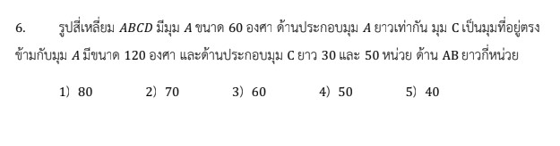

# การแก้โจทย์ข้อ 6 คณิตศาสตร์ประยุกต์ 1 (A-Level) ปี 2566

การแก้โจทย์ข้อ 6 ของวิชาคณิตศาสตร์ประยุกต์ 1 (A-Level) ปี 2566 เป็นเรื่องเกี่ยวกับ **เรขาคณิตและการประยุกต์ใช้ตรีโกณมิติ (Trigonometry)** โดยเฉพาะการใช้กฎของโคไซน์เพื่อหาความยาวด้านในรูปสามเหลี่ยมครับ,

### **โจทย์ข้อ 6**

รูปสี่เหลี่ยม $ABCD$ มีมุม $A$ ขนาด 60 องศา ด้านประกอบมุม $A$ ยาวเท่ากัน มุม $C$ เป็นมุมที่อยู่ตรงข้ามกับมุม $A$ มีขนาด 120 องศา และด้านประกอบมุม $C$ ยาว 30 และ 50 หน่วย ด้าน $AB$ ยาวกี่หน่วย,

---

### **วิธีทำอย่างละเอียด**

**ขั้นตอนที่ 1: วิเคราะห์ลักษณะของรูปสี่เหลี่ยม**

* กำหนดให้ด้านประกอบมุม $A$ ยาวเท่ากัน คือ $AB = AD = x$ หน่วย
* สร้างเส้นทแยงมุม $BD$ เชื่อมจุด $B$ และ $D$ เพื่อแบ่งรูปสี่เหลี่ยมออกเป็นสามเหลี่ยม 2 รูป คือ $\triangle ABD$ และ $\triangle CBD$

**ขั้นตอนที่ 2: พิจารณา $\triangle ABD$**

* โจทย์บอกว่า $AB = AD = x$ และมุม $\angle A = 60^\circ$
* เนื่องจากเป็นสามเหลี่ยมหน้าจั่วที่มีมุมยอด 60 องศา จะส่งผลให้มุมที่ฐานทั้งสองมีขนาด $(180 - 60) / 2 = 60^\circ$ เท่ากันด้วย
* ดังนั้น $\triangle ABD$ จึงเป็น **สามเหลี่ยมด้านเท่า** ทำให้ได้ว่าเส้นทแยงมุม **$BD = x$**

**ขั้นตอนที่ 3: พิจารณา $\triangle CBD$ และใช้กฎของโคไซน์**

* โจทย์กำหนดให้ด้านประกอบมุม $C$ ยาว 30 และ 50 หน่วย (นั่นคือ $CB = 30, CD = 50$) และมุม $\angle C = 120^\circ$
* ใช้กฎของโคไซน์หาความยาวด้าน $BD$:
    $$BD^2 = CB^2 + CD^2 - 2(CB)(CD) \cos(C)$$
    $$x^2 = 30^2 + 50^2 - 2(30)(50) \cos(120^\circ)$$
* แทนค่า $\cos(120^\circ) = -1/2$:
    $$x^2 = 900 + 2500 - 2(1500)(-1/2)$$
    $$x^2 = 3400 + 1500$$
    $$x^2 = 4900$$
    $$x = \sqrt{4900} = 70$$

**สรุป:** ด้าน $AB$ ยาว **70 หน่วย** (ตรงกับตัวเลือกที่ 2)

---

### **เนื้อหาที่เกี่ยวข้องเพื่อศึกษาเพิ่มเติม**

**1. กฎของโคไซน์ (Law of Cosines):**

* **สูตร:** $a^2 = b^2 + c^2 - 2bc \cos A$
* **ที่มาและความหมาย:** ใช้สำหรับหาความยาวด้านที่สามเมื่อทราบด้าน 2 ด้านและมุมระหว่างด้านนั้นๆ หรือใช้หามุมเมื่อทราบความยาวด้านครบทั้ง 3 ด้าน
* **ตัวแปร:** $a, b, c$ คือความยาวด้านตรงข้ามมุม $A, B, C$ ตามลำดับ

**2. สมบัติของสามเหลี่ยมด้านเท่า (Equilateral Triangle):**

* มีด้านยาวเท่ากันทุกด้าน และมุมทุกมุมมีขนาด $60^\circ$
* ในโจทย์ข้อนี้ การที่ $AB = AD$ และมุมตรงกลางเป็น $60^\circ$ เป็นจุดสังเกตสำคัญที่ทำให้เราทราบว่า $BD$ ยาวเท่ากับด้านที่เหลือทันที

### **กลยุทธ์แก้โจทย์ประเภทนี้**

* **ลากเส้นทแยงมุมเพื่อเชื่อมโยง:** เมื่อโจทย์ให้ข้อมูลเกี่ยวกับมุมที่อยู่ตรงข้ามกันในรูปสี่เหลี่ยม การลากเส้นทแยงมุมเพื่อสร้างสามเหลี่ยม 2 รูปที่ใช้ฐานร่วมกัน (ในที่นี้คือด้าน $BD$) เป็นวิธีที่นิยมที่สุด
* **สังเกตมุมพิเศษ:** มุม $60^\circ$ และ $120^\circ$ มักมาคู่กันเพราะค่า $\cos$ มีตัวเลขเดียวกันแต่เครื่องหมายต่างกัน ($1/2$ และ $-1/2$) ซึ่งช่วยให้คำนวณได้ลงตัว
* **เปลี่ยนชื่อด้านเป็นตัวแปรเดียวกัน:** หากโจทย์บอกว่าด้านยาวเท่ากัน ให้กำหนดเป็น $x$ เพื่อให้เห็นความเชื่อมโยงในสมการ

---

### **ตัวอย่างโจทย์เพิ่มเติมเพื่อฝึกทำ**

**โจทย์:** สามเหลี่ยม $PQR$ มีด้าน $PQ = 7$ ซม. และ $PR = 8$ ซม. ถ้ามุม $\angle P = 60^\circ$ จงหาความยาวด้าน $QR$

**เฉลย:**

1. ใช้กฎของโคไซน์: $QR^2 = PQ^2 + PR^2 - 2(PQ)(PR) \cos(60^\circ)$
2. แทนค่า: $QR^2 = 7^2 + 8^2 - 2(7)(8) (1/2)$
3. คำนวณ: $QR^2 = 49 + 64 - 56 = 57$
4. **ตอบ:** $QR = \sqrt{57}$ ซม.

การฝึกฝนการใช้กฎของโคไซน์ร่วมกับสมบัติทางเรขาคณิตจะช่วยให้คุณเก็บคะแนนในส่วนนี้ได้แม่นยำขึ้นครับ

---

**กฎของโคไซน์ (Law of Cosines)** เป็นเครื่องมือทางคณิตศาสตร์ที่สำคัญในการหาความยาวด้านหรือขนาดของมุมในรูปสามเหลี่ยมใดๆ โดยเฉพาะสามเหลี่ยมที่ไม่ใช่สามเหลี่ยมมุมฉาก กฎนี้เป็นส่วนขยายของทฤษฎีบทพีทาโกรัสที่เพิ่มพจน์ปรับแก้สำหรับมุมที่ไม่เป็น 90 องศาเข้าไป

### **สูตรและที่มา**

หากกำหนดให้สามเหลี่ยมรูปหนึ่งมีด้านยาว $a, b, c$ และมีมุมตรงข้ามด้านเหล่านั้นคือ $A, B, C$ ตามลำดับ กฎของโคไซน์ระบุว่า:
**$a^2 = b^2 + c^2 - 2bc \cos A$**
หรือในบริบทของโจทย์ข้อ 6 จากแหล่งข้อมูล คือการหาความยาวด้าน $BD$ ใน $\triangle CBD$ จะเขียนได้เป็น:
**$BD^2 = CB^2 + CD^2 - 2(CB)(CD) \cos(\angle BCD)$**

### **การประยุกต์ใช้ในเรขาคณิตจากตัวอย่างข้อสอบ**

จากแหล่งข้อมูล การใช้กฎของโคไซน์มีขั้นตอนและกลยุทธ์ที่สำคัญดังนี้:

1. **การเชื่อมโยงรูปเรขาคณิตด้วยเส้นทแยงมุม:** ในกรณีโจทย์รูปสี่เหลี่ยม $ABCD$ ที่ให้ข้อมูลมุมและด้านมาไม่ครบ เราสามารถลากเส้นทแยงมุมเพื่อแบ่งรูปสี่เหลี่ยมออกเป็นสามเหลี่ยมสองรูปที่ใช้ด้านร่วมกันได้ ดังเช่นการลากเส้น $BD$ เพื่อเชื่อมโยงความสัมพันธ์ระหว่าง $\triangle ABD$ และ $\triangle CBD$
2. **การหาความยาวด้านที่เหลือ (SAS):** เมื่อทราบความยาวด้านสองด้านและขนาดของมุมระหว่างด้านนั้น (Side-Angle-Side) เราสามารถหาความยาวด้านที่สามได้ทันที เช่น ในโจทย์ระบุว่าด้านประกอบมุม $C$ ยาว 30 และ 50 หน่วย และมุม $C$ มีขนาด 120 องศา การแทนค่าลงในสูตรจะได้ $x^2 = 30^2 + 50^2 - 2(30)(50) \cos(120^\circ)$
3. **การจัดการกับมุมพิเศษ:** ในการสอบ A-Level มักมีการใช้มุมที่มากกว่า 90 องศา เช่น **$\cos(120^\circ)$** ซึ่งมีค่าเท่ากับ **$-1/2$** ค่าลบของโคไซน์จะทำให้พจน์สุดท้ายของสูตรกลายเป็นการบวก ($3400 + 1500 = 4900$) ส่งผลให้ได้ความยาวด้าน $BD$ เท่ากับ $70$ หน่วย
4. **การทำงานร่วมกับสมบัติสามเหลี่ยมอื่น:** โจทย์มักออกแบบมาให้เราต้องใช้สมบัติอื่นก่อนใช้กฎของโคไซน์ เช่น การวิเคราะห์ว่า $\triangle ABD$ เป็นสามเหลี่ยมหน้าจั่วที่มีมุมยอด 60 องศา ซึ่งส่งผลให้เป็น **สามเหลี่ยมด้านเท่า** ทำให้เราสรุปได้ว่าความยาวด้าน $AB$ ที่โจทย์ถามหาจะเท่ากับความยาวด้าน $BD$ ที่คำนวณได้จากกฎของโคไซน์พอดี

### **กลยุทธ์สำคัญในการแก้โจทย์**

* **วาดรูปจำลอง:** การวาดแผนภาพจากข้อความบรรยายจะช่วยให้เห็นว่าควรใช้กฎของโคไซน์กับสามเหลี่ยมรูปใด
* **พิจารณาค่าที่เป็นไปได้:** ความยาวด้านต้องเป็นจำนวนจริงบวกเสมอ แม้การแก้สมการกำลังสองจะได้ค่าบวกและลบ (เช่น $70$ และ $-70$) แต่เราจะเลือกใช้เฉพาะค่าบวกเท่านั้น
* **มองหาด้านร่วม:** กฎของโคไซน์มักถูกใช้เพื่อส่งต่อค่าความยาวจากสามเหลี่ยมรูปหนึ่งไปยังอีกรูปหนึ่งผ่านด้านที่ใช้ร่วมกัน

---
สมบัติของรูปสามเหลี่ยมด้านเท่า (Equilateral Triangle) ที่ปรากฏในแหล่งข้อมูล (โดยเฉพาะในเฉลยละเอียดข้อ 6 ของข้อสอบปี 2566) มีรายละเอียดที่สำคัญดังนี้ครับ:

* **ความยาวด้านเท่ากันทุกด้าน:** รูปสามเหลี่ยมด้านเท่าจะมีด้านทั้งสามยาวเท่ากันทั้งหมด ตัวอย่างเช่น ในโจทย์ข้อ 6 เมื่อเราทราบว่า $\triangle ABD$ เป็นสามเหลี่ยมด้านเท่า เราจึงสรุปได้ทันทีว่าความยาวด้าน $AB = BD = DA$
* **ขนาดของมุมภายในเท่ากันทุกมุม:** มุมทุกมุมภายในรูปสามเหลี่ยมด้านเท่าจะมีขนาด **60 องศา** เท่ากัน
* **การพัฒนามาจากสามเหลี่ยมหน้าจั่ว:** หากรูปสามเหลี่ยมหนึ่งเป็นรูปสามเหลี่ยมหน้าจั่ว (มีด้านประกอบมุมยอดเท่ากัน) และมีมุมยอดขนาด **60 องศา** จะส่งผลให้มุมที่ฐานทั้งสองต้องมีขนาด 60 องศาด้วยเสมอ เพื่อให้ผลรวมมุมภายในเป็น 180 องศา ซึ่งทำให้รูปสามเหลี่ยมนั้นกลายเป็นรูปสามเหลี่ยมด้านเท่าโดยปริยาย
* **การประยุกต์ใช้ในการแก้โจทย์เรขาคณิต:** สมบัติความเท่ากันของทุกด้านช่วยให้เราสามารถ "ส่งต่อ" ค่าความยาวจากสามเหลี่ยมรูปหนึ่งไปยังอีกรูปหนึ่งได้ ดังในโจทย์ที่ใช้การหาความยาวด้านร่วม ($BD$) จากสามเหลี่ยมรูปหนึ่งด้วยกฎของโคไซน์ แล้วนำค่านั้นมาสรุปเป็นความยาวของด้านที่โจทย์ถาม ($AB$) ได้ทันทีเพราะเป็นด้านของสามเหลี่ยมด้านเท่านั่นเอง

**กลยุทธ์เพิ่มเติมจากแหล่งข้อมูล:** ในการทำข้อสอบ A-Level หากเจอโจทย์ที่มีมุม **60 องศา** ร่วมกับเงื่อนไข **ด้านประกอบมุมยาวเท่ากัน** ให้สันนิษฐานและตรวจสอบความเป็นรูปสามเหลี่ยมด้านเท่าก่อนเสมอ เพราะจะช่วยลดขั้นตอนการใช้ตรีโกณมิติที่ซับซ้อนลงได้ครับ
