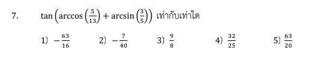

# การแก้โจทย์ปัญหาเรื่อง **ฟังก์ชันตรีโกณมิติผกผัน (Inverse Trigonometric Functions)** ในข้อสอบ A-Level คณิตศาสตร์ 1 ปี 2566 ข้อที่ 7 นี้ มีหัวใจสำคัญอยู่ที่การเปลี่ยนค่าอาร์ค (Arc) ให้เป็นรูปสามเหลี่ยมเพื่อหาค่าตรีโกณมิติอื่นๆ และการใช้สูตรผลบวกของมุมครับ

## **เฉลยละเอียดโจทย์ข้อ 7**

**โจทย์:** $\tan(\arccos(\frac{12}{13}) + \arcsin(\frac{4}{5}))$ มีค่าเท่ากับเท่าใด

---

**วิธีทำ:**

**ขั้นตอนที่ 1: เปลี่ยน $\arccos(\frac{12}{13})$ ให้เป็น $\arctan$**

1. ให้ $A = \arccos(\frac{12}{13})$ จะได้ว่า $\cos A = \frac{12}{13}$
2. วาดรูปสามเหลี่ยมมุมฉาก โดยมีด้านประชิดมุม $A$ ยาว $12$ และด้านตรงข้ามมุมฉากยาว $13$
3. หาด้านตรงข้ามมุม $A$ โดยใช้ทฤษฎีบทพีทาโกรัส: $\sqrt{13^2 - 12^2} = \sqrt{169 - 144} = \sqrt{25} = 5$
4. จะได้ค่า $\tan A = \frac{\text{ข้าม}}{\text{ชิด}} = \frac{5}{12}$ ดังนั้น **$A = \arctan(\frac{5}{12})$**

**ขั้นตอนที่ 2: เปลี่ยน $\arcsin(\frac{4}{5})$ ให้เป็น $\arctan$**

1. ให้ $B = \arcsin(\frac{4}{5})$ จะได้ว่า $\sin B = \frac{4}{5}$
2. วาดรูปสามเหลี่ยมมุมฉาก โดยมีด้านตรงข้ามมุม $B$ ยาว $4$ และด้านตรงข้ามมุมฉากยาว $5$
3. หาด้านประชิดมุม $B$ โดยใช้ทฤษฎีบทพีทาโกรัส: $\sqrt{5^2 - 4^2} = \sqrt{25 - 16} = \sqrt{9} = 3$
4. จะได้ค่า $\tan B = \frac{\text{ข้าม}}{\text{ชิด}} = \frac{4}{3}$ ดังนั้น **$B = \arctan(\frac{4}{3})$**

**ขั้นตอนที่ 3: ใช้สูตร $\tan(A + B)$ เพื่อหาคำตอบ**
จากโจทย์คือการหาค่า $\tan(A + B)$ เมื่อ $A = \arctan(\frac{5}{12})$ และ $B = \arctan(\frac{4}{3})$
ใช้สูตร: **$\tan(A + B) = \frac{\tan A + \tan B}{1 - \tan A \tan B}$**

แทนค่าที่หาได้ลงไป:
$$\tan(A + B) = \frac{\frac{5}{12} + \frac{4}{3}}{1 - (\frac{5}{12} \cdot \frac{4}{3})}$$
$$\tan(A + B) = \frac{\frac{5 + 16}{12}}{1 - \frac{20}{36}} = \frac{\frac{21}{12}}{1 - \frac{5}{9}}$$
$$\tan(A + B) = \frac{\frac{21}{12}}{\frac{4}{9}} = \frac{21}{12} \cdot \frac{9}{4}$$
$$\tan(A + B) = \frac{7}{4} \cdot \frac{9}{4} = \frac{63}{16}$$

**ตอบ:** $\frac{63}{16}$ (ตรงกับตัวเลือกที่ 3)

---

### **เนื้อหาที่เกี่ยวข้องเพื่อศึกษาเพิ่มเติม**

**1. สูตรตรีโกณมิติผลบวกและผลต่างของมุม:**

* $\tan(A \pm B) = \frac{\tan A \pm \tan B}{1 \mp \tan A \tan B}$
* $\sin(A \pm B) = \sin A \cos B \pm \cos A \sin B$ (นอกเหนือจากแหล่งข้อมูล)
* $\cos(A \pm B) = \cos A \cos B \mp \sin A \sin B$ (นอกเหนือจากแหล่งข้อมูล)

**2. ความหมายของฟังก์ชันผกผัน (Inverse):**

* $\arcsin x, \arccos x, \arctan x$ คือการหา **"มุม"** ที่ทำให้ค่าตรีโกณมิตินั้นๆ เท่ากับ $x$
* **ตัวแปร:** $x$ คือค่าอัตราส่วนของด้านสามเหลี่ยม ส่วนผลลัพธ์ของฟังก์ชันคือขนาดของมุมในหน่วยเรเดียนหรือองศา

### **กลยุทธ์แก้โจทย์ประเภทนี้**

* **แปลง Arc ให้เป็นมุมสมมติ:** เมื่อเห็น $\arcsin, \arccos$ ให้กำหนดเป็นตัวแปร $A, B$ ทันทีเพื่อลดความซับซ้อนของหน้าตาโจทย์
* **ใช้สามเหลี่ยมช่วยเสมอ:** วิธีที่เร็วที่สุดคือวาดรูปสามเหลี่ยมมุมฉากเพื่อหาค่าตรีโกณมิติตัวอื่นที่คุณต้องการ (เช่น โจทย์ถาม $\tan$ แต่ให้ $\cos$ มา)
* **ระวังช่วงของมุม (Range):** ฟังก์ชันอินเวอร์สมีขอบเขตของมุมที่ตอบได้ (เช่น $\arcsin$ ตอบในช่วง $[-\frac{\pi}{2}, \frac{\pi}{2}]$) แม้ในโจทย์นี้ค่าเป็นบวกทั้งหมดจึงไม่มีปัญหาเรื่องเครื่องหมาย แต่ควรระวังในโจทย์ที่ค่าติดลบ (นอกเหนือจากแหล่งข้อมูล)

---

### **ตัวอย่างโจทย์เพิ่มเติมเพื่อฝึกทำ**

**โจทย์ฝึกหัด:** จงหาค่าของ $\sin(\arctan(\frac{3}{4}) + \arccos(\frac{4}{5}))$

**เฉลย:**

1. ให้ $A = \arctan(\frac{3}{4})$ จะได้ $\tan A = \frac{3}{4}, \sin A = \frac{3}{5}, \cos A = \frac{4}{5}$ (จากสามเหลี่ยม 3-4-5)
2. ให้ $B = \arccos(\frac{4}{5})$ จะได้ $\cos B = \frac{4}{5}, \sin B = \frac{3}{5}$
3. ใช้สูตร $\sin(A + B) = \sin A \cos B + \cos A \sin B$
4. แทนค่า: $(\frac{3}{5})(\frac{4}{5}) + (\frac{4}{5})(\frac{3}{5}) = \frac{12}{25} + \frac{12}{25} = \frac{24}{25}$
**ตอบ:** $\frac{24}{25}$

การฝึกวาดรูปสามเหลี่ยมควบคู่กับการจำสูตรผลบวกมุมจะช่วยให้ทำโจทย์แนวนี้ได้รวดเร็วขึ้นมากครับ
