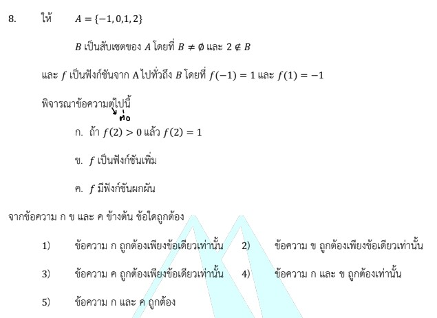

# การแก้โจทย์ข้อ 8 ของวิชาคณิตศาสตร์ประยุกต์ 1 (A-Level) ปี 2566 เป็นเรื่องเกี่ยวกับ **ฟังก์ชัน (Functions)** โดยเน้นความเข้าใจเรื่องประเภทของฟังก์ชัน (ทั่วถึง, เพิ่ม/ลด) และการหาฟังก์ชันผกผันครับ

## **เฉลยละเอียดโจทย์ข้อ 8**

**โจทย์:** กำหนดให้ $A = \{-1, 0, 1, 2\}$ และ $B$ เป็นสับเซตของ $A$ โดยที่ $B \neq \emptyset$ และ $2 \notin B$
ให้ $h$ เป็นฟังก์ชันจาก $A$ ไปทั่วถึง $B$ โดยที่ $h(-1) = 1$ และ $h(1) = -1$
พิจารณาข้อความต่อไปนี้:

* ก. ถ้า $h(2) > 0$ แล้ว $h(2) = 1$
* ข. $h$ เป็นฟังก์ชันเพิ่ม
* ค. $h$ มีฟังก์ชันผกผัน

---

**วิธีทำอย่างละเอียด:**

**ขั้นตอนที่ 1: วิเคราะห์เงื่อนไขของเซต $B$**
จากเงื่อนไข $B \subset A$ และ $2 \notin B$ จะได้ว่าสมาชิกที่เป็นไปได้ของ $B$ คือ $\{-1, 0, 1\}$
โจทย์ระบุว่า $h$ เป็นฟังก์ชันจาก $A$ **ไปทั่วถึง** $B$ และกำหนดค่า $h(-1) = 1$ และ $h(1) = -1$ มาให้
นั่นแปลว่าทั้ง $1$ และ $-1$ ต้องเป็นสมาชิกของ $B$ แน่นอน (เพราะต้องมีตัวรับจากโดเมน) ดังนั้น $B$ อาจจะเป็น $\{-1, 1\}$ หรือ $\{-1, 0, 1\}$

**ขั้นตอนที่ 2: พิจารณาข้อความ ก.**

* โจทย์ถามกรณี $h(2) > 0$
* เราทราบว่าค่า $h(2)$ ต้องเป็นสมาชิกในเซต $B$ ซึ่ง $B \subset \{-1, 0, 1\}$
* ในเซต $\{-1, 0, 1\}$ สมาชิกที่มีค่ามากกว่า 0 มีเพียงตัวเดียวคือ **1**
* ดังนั้น ถ้า $h(2) > 0$ แล้ว $h(2)$ ต้องเท่ากับ **1** เท่านั้น
* **ข้อความ ก. จึงถูกต้อง**

**ขั้นตอนที่ 3: พิจารณาข้อความ ข.**

* ฟังก์ชันเพิ่มมีนิยามว่า ถ้า $x_1 < x_2$ แล้วต้องได้ $h(x_1) \leq h(x_2)$
* พิจารณา $x_1 = -1$ และ $x_2 = 1$ จะเห็นว่า $-1 < 1$
* แต่ $h(-1) = 1$ และ $h(1) = -1$ ซึ่งพบว่า **$h(-1) > h(1)$**
* ค่าของฟังก์ชันลดลงเมื่อ $x$ เพิ่มขึ้น ขัดแย้งกับนิยามฟังก์ชันเพิ่ม
* **ข้อความ ข. จึงผิด**

**ขั้นตอนที่ 4: พิจารณาข้อความ ค.**

* ฟังก์ชันจะมี **ฟังก์ชันผกผัน (Inverse)** ได้ก็ต่อเมื่อเป็นฟังก์ชัน **1-1 (One-to-one)** และ **ทั่วถึง (Onto)**
* ในที่นี้โดเมน $A$ มีสมาชิก 4 ตัว
* ส่วนเรนจ์ $B$ มีสมาชิกที่เป็นไปได้สูงสุดเพียง 3 ตัว คือ $\{-1, 0, 1\}$
* ตาม **หลักการช่องนกพิราบ (Pigeonhole Principle)** หากสมาชิกโดเมนมากกว่าสมาชิกในเรนจ์ ฟังก์ชันนั้นไม่มีทางเป็นแบบ 1-1 ได้ (ต้องมีสมาชิกในโดเมนอย่างน้อย 2 ตัวที่ส่งไปหาค่าเดียวกันใน $B$)
* เมื่อไม่เป็นฟังก์ชัน 1-1 จึงไม่มีฟังก์ชันผกผัน
* **ข้อความ ค. จึงผิด**

**ตอบ:** ข้อความ **ก. ถูกต้องเพียงข้อเดียวเท่านั้น** (ตรงกับตัวเลือกที่ 1)

---

### **เนื้อหาที่เกี่ยวข้องเพื่อศึกษาเพิ่มเติม**

1. **ฟังก์ชันไปทั่วถึง (Surjective/Onto):** คือฟังก์ชันที่สมาชิกทุกตัวในเซตปลายทาง (Codomain) ต้องมีสมาชิกในเซตต้นทาง (Domain) ส่งมาถึง หรือพูดง่ายๆ คือ $Range = Codomain$
2. **ฟังก์ชันเพิ่ม (Increasing Function):** นิยามคือ $x_1 < x_2 \implies f(x_1) \leq f(x_2)$ หากค่า $y$ ลดลงเมื่อ $x$ เพิ่มขึ้นจะเรียกว่าฟังก์ชันลด
3. **เงื่อนไขการมีอินเวอร์ส:** ฟังก์ชัน $f$ มี $f^{-1}$ ได้ก็ต่อเมื่อ $f$ เป็นฟังก์ชันแบบหนึ่งต่อหนึ่งและทั่วถึง (Bijective Function) เท่านั้น

### **กลยุทธ์แก้โจทย์ประเภทนี้**

* **วาดแผนภาพลูกศร:** การวาดการจับคู่สมาชิกจากเซต $A$ ไปยัง $B$ จะช่วยให้เห็นภาพชัดเจนว่าเงื่อนไข "ทั่วถึง" บังคับอะไรเราบ้าง
* **เช็คจำนวนสมาชิก ($n$):** หากจำนวนสมาชิกโดเมนมากกว่าเรนจ์ ฟังก์ชันนั้นไม่ใช่ 1-1 แน่นอน และหากโดเมนน้อยกว่าเรนจ์ ก็ไม่มีทางเป็นฟังก์ชันทั่วถึง
* **หาตัวอย่างค้าน:** สำหรับการเช็คฟังก์ชันเพิ่ม/ลด ให้ลองหยิบสมาชิกคู่ใดก็ได้มาเปรียบเทียบ ถ้าเจอเพียงคู่เดียวที่ไม่เป็นไปตามนิยาม ก็สามารถสรุปได้ทันทีว่าข้อความนั้นผิด

---

### **ตัวอย่างโจทย์เพิ่มเติมเพื่อฝึกทำ**

**โจทย์:** กำหนด $f: \{1, 2, 3\} \to \{a, b\}$ โดยที่ $f$ เป็นฟังก์ชันไปทั่วถึง พิจารณาว่า $f$ เป็นฟังก์ชัน 1-1 หรือไม่ และ $f$ มีฟังก์ชันผกผันหรือไม่

**เฉลย:**

1. **วิเคราะห์:** โดเมนมี 3 สมาชิก เรนจ์มี 2 สมาชิก
2. **1-1 หรือไม่:** ไม่เป็น เพราะสมาชิกในโดเมนมีมากกว่าเรนจ์ ต้องมีสมาชิกอย่างน้อย 2 ตัวที่ส่งไปหาค่าเดียวกัน (เช่น $f(1)=a, f(2)=a, f(3)=b$)
3. **มีอินเวอร์สหรือไม่:** ไม่มี เพราะไม่เป็นฟังก์ชัน 1-1
**ตอบ:** ไม่เป็นฟังก์ชัน 1-1 และไม่มีฟังก์ชันผกผัน
