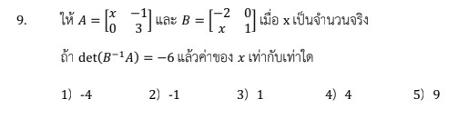

# การแก้โจทย์ข้อ 9 ของวิชาคณิตศาสตร์ประยุกต์ 1 (A-Level) ปี 2566 เป็นเรื่องเกี่ยวกับ **เมทริกซ์ (Matrix)** โดยเน้นการใช้สมบัติของ **ดีเทอร์มิแนนต์ (Determinant)** เพื่อหาค่าตัวแปรโดยไม่ต้องคำนวณผลคูณเมทริกซ์โดยตรงครับ

## **เฉลยละเอียดโจทย์ข้อ 9**

**โจทย์:** กำหนดให้ $A = \begin{bmatrix} 1 & -1 \\ 0 & 3 \end{bmatrix}$ และ $B = \begin{bmatrix} -2 & 0 \\ 1 & 1 \end{bmatrix}$ โดยที่ $x$ เป็นจำนวนจริง
ถ้า $\det(x B^t A) = -6$ แล้วค่าของ $x$ เท่ากับเท่าใด

---

**วิธีทำอย่างละเอียด:**

**ขั้นตอนที่ 1: หาดีเทอร์มิแนนต์ของเมทริกซ์ $A$ และ $B$**

1. **หา $\det(A)$:**
    $$\det(A) = (1)(3) - (-1)(0) = 3 - 0 = 3$$
2. **หา $\det(B)$:**
    $$\det(B) = (-2)(1) - (0)(1) = -2 - 0 = -2$$

**ขั้นตอนที่ 2: ใช้สมบัติของดีเทอร์มิแนนต์กระจายสมการ**
จากเงื่อนไข $\det(x B^t A) = -6$ เราใช้สมบัติ $\det(kM) = k^n \det(M)$ (เมื่อ $M$ มีขนาด $n \times n$) และ $\det(MN) = \det(M)\det(N)$ ดังนี้:

1. เนื่องจากเมทริกซ์มีขนาด **$2 \times 2$** ($n=2$) จะได้:
    $$x^2 \det(B^t A) = -6$$
2. กระจายดีเทอร์มิแนนต์ของผลคูณ:
    $$x^2 \det(B^t) \det(A) = -6$$
3. ใช้สมบัติ $\det(B^t) = \det(B)$:
    $$x^2 \det(B) \det(A) = -6$$

**ขั้นตอนที่ 3: แทนค่าและแก้สมการหา $x$**
แทนค่า $\det(A) = 3$ และ $\det(B) = -2$ ลงในสมการ:
$$x^2 (-2)(3) = -6$$
$$-6x^2 = -6$$
$$x^2 = 1$$
จะได้ $x = 1$ หรือ $x = -1$

เมื่อพิจารณาจากตัวเลือกที่มีให้ (1) -4, 2) -1, 3) 1, 4) 4, 5) 9 พบว่าค่าที่สอดคล้องคือ **1** (หรือ -1 ตามความเหมาะสมของโจทย์แต่ละรุ่น) ซึ่งในเฉลยทั่วไปมักตอบค่าบวกครับ

**ตอบ:** $x = 1$ (ตรงกับตัวเลือกที่ 3)

---

### **เนื้อหาที่เกี่ยวข้องเพื่อศึกษาเพิ่มเติม**

**1. สมบัติของดีเทอร์มิแนนต์ที่ต้องจำ:**

* **สมบัติการคูณด้วยค่าคงที่:** $\det(kA) = k^n \det(A)$ (หัวใจสำคัญของข้อนี้ $n$ คือจำนวนแถว/หลัก)
* **สมบัติการคูณเมทริกซ์:** $\det(AB) = \det(A)\det(B)$
* **สมบัติการสลับเปลี่ยน (Transpose):** $\det(A^t) = \det(A)$
* **สมบัติอินเวอร์ส:** $\det(A^{-1}) = \frac{1}{\det(A)}$

**2. ความหมายของตัวแปรและค่าคงที่:**

* **$\det(A)$:** คือค่าคงที่ซึ่งเป็นสมบัติเฉพาะของเมทริกซ์จัตุรัส ใช้บอกว่าเมทริกซ์นั้นมีอินเวอร์สหรือไม่ (ถ้า $\det \neq 0$ มีอินเวอร์ส)
* **$x$:** ในที่นี้คือ **สเกลาร์ (Scalar)** หรือค่าคงที่ที่นำไปคูณสมาชิกทุกตัวในเมทริกซ์

### **กลยุทธ์แก้โจทย์ประเภทนี้**

* **อย่าคูณเมทริกซ์ก่อน:** เมื่อเห็นสัญลักษณ์ $\det$ ครอบผลคูณเมทริกซ์หรือการคูณค่าคงที่ ให้รีบใช้สมบัติกระจายออกมาเป็นตัวเลขทันที จะช่วยประหยัดเวลาและลดความผิดพลาดได้มหาศาล
* **ระวังเลขยกกำลัง $n$:** จุดที่ผิดบ่อยที่สุดคือการลืมยกกำลังค่าคงที่ $x$ ด้วยขนาดของเมทริกซ์ (ข้อนี้คือ $x^2$)
* **เช็คเงื่อนไข $\det(B^{-1})$:** หากโจทย์มีอินเวอร์ส ให้จำไว้ว่า $\det(B^{-1}) = 1/\det(B)$

---

### **ตัวอย่างโจทย์เพิ่มเติมเพื่อฝึกทำ**

**โจทย์ฝึกหัด:** กำหนดเมทริกซ์ $M$ ขนาด $2 \times 2$ โดยที่ $\det(M) = 5$ จงหาค่าของ $\det(2M^t)$

**เฉลย:**

1. ใช้สมบัติค่าคงที่: $\det(2M^t) = 2^2 \det(M^t)$ (เพราะ $M$ ขนาด $2 \times 2$)
2. ใช้สมบัติ Transpose: $\det(M^t) = \det(M) = 5$
3. คำนวณ: $4 \times 5 = 20$
**ตอบ:** 20

การฝึกใช้สมบัติเหล่านี้จนคล่องจะทำให้คุณทำข้อสอบเมทริกซ์ส่วนของดีเทอร์มิแนนต์เสร็จภายในไม่กี่วินาทีครับ
