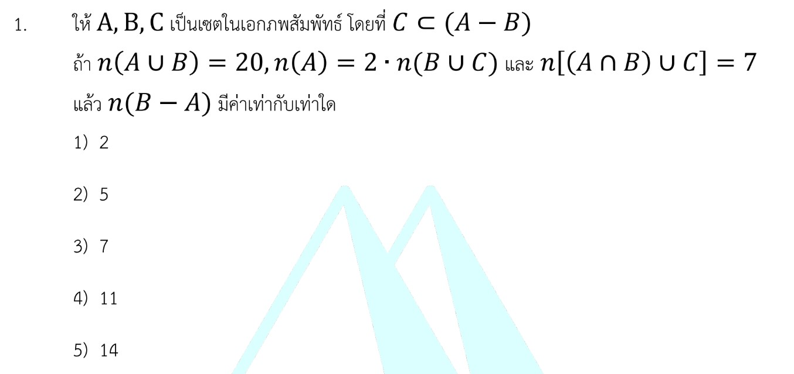

# เฉลยโจทย์เซตอย่างละเอียด

นี่คือเฉลยวิธีทำอย่างละเอียด เนื้อหาเพิ่มเติมที่เกี่ยวข้อง กลยุทธ์ในการทำโจทย์แนวนี้ และโจทย์ตัวอย่างสำหรับฝึกฝนเพิ่มเติมครับ

---

## 1. เฉลยวิธีทำอย่างละเอียด

**โจทย์กำหนด:**

1. $C \subset (A - B)$
2. $n(A \cup B) = 20$
3. $n(A) = 2 \cdot n(B \cup C)$
4. $n[(A \cap B) \cup C] = 7$

**สิ่งที่โจทย์ถาม:** $n(B - A)$

**วิเคราะห์จากสิ่งที่โจทย์กำหนด:**

* จากข้อกำหนด $C \subset (A - B)$ แปลความหมายได้ว่า **เซต $C$ อยู่ภายในเซต $A$ ทั้งหมด แต่ไม่อยู่ในเซต $B$ เลย** * ส่งผลให้ $C \cap B = \emptyset$ (เซต $B$ และ $C$ ไม่มีสมาชิกส่วนใดซ้ำกันเลย)
* และส่งผลให้ $(A \cap B) \cap C = \emptyset$ด้วยเช่นกัน

* จากเงื่อนไขที่ 4: $n[(A \cap B) \cup C] = 7$
เนื่องจากตัวหน้า $(A \cap B)$ กับตัวหลัง $C$ ไม่มีส่วนที่ซ้อนทับกันเลย เราจึงสามารถแยกบวกจำนวนสมาชิกได้โดยตรง:

$$n(A \cap B) + n(C) = 7 \implies n(C) = 7 - n(A \cap B) \quad \text{--- (สมการที่ 1)}$$

* จากเงื่อนไขที่ 3: $n(A) = 2 \cdot n(B \cup C)$
เนื่องจาก $B \cap C = \emptyset$ จะได้ว่า $n(B \cup C) = n(B) + n(C)$
แทนค่าลงในเงื่อนไขจะได้:

$$n(A) = 2[n(B) + n(C)] \quad \text{--- (สมการที่ 2)}$$

* นำสมการที่ 1 แทนลงในสมการที่ 2:

$$n(A) = 2[n(B) + 7 - n(A \cap B)]$$

$$n(A) = 2n(B) + 14 - 2n(A \cap B) \quad \text{--- (สมการที่ 3)}$$

* จากเงื่อนไขที่ 2: $n(A \cup B) = 20$
ใช้สูตรพื้นฐานของพาวเวอร์เซต/จำนวนสมาชิก: $n(A \cup B) = n(A) + n(B) - n(A \cap B)$
แทนค่า $n(A \cup B) = 20$ จะได้:

$$n(A) + n(B) - n(A \cap B) = 20 \quad \text{--- (สมการที่ 4)}$$

* นำ $n(A)$ จากสมการที่ 3 ไปแทนในสมการที่ 4:

$$[2n(B) + 14 - 2n(A \cap B)] + n(B) - n(A \cap B) = 20$$

รวมเทอมที่คล้ายกัน:

$$3n(B) - 3n(A \cap B) + 14 = 20$$

$$3n(B) - 3n(A \cap B) = 20 - 14$$

$$3[n(B) - n(A \cap B)] = 6$$

$$n(B) - n(A \cap B) = \frac{6}{3} = 2$$

**สรุปคำตอบ:**
โจทย์ถามหา $n(B - A)$ ซึ่งตามนิยามแล้ว $n(B - A) = n(B) - n(A \cap B)$
จากการคำนวณข้างต้นเราได้ $n(B) - n(A \cap B) = 2$

ดังนั้น $n(B - A) = 2$ ตรงกับ **ตัวเลือกที่ 1)**

---

### 2. เนื้อหาเพิ่มเติมเพื่อศึกษา

**ความสัมพันธ์และสูตรของเซตที่ควรทราบ:**

1. **การลบกันของเซต (Difference):** $A - B$ คือ เซตที่ประกอบด้วยสมาชิกที่อยู่ใน $A$ แต่ไม่อยู่ใน $B$
2. **การเป็นสับเซต (Subset):** ถ้า $C \subset (A - B)$ หมายความว่าทุกสมาชิกของ $C$ ต้องอยู่เงื่อนไขของ $A - B$ สรุปสั้นๆ คือ $C$ จะไม่ทับซ้อนกับ $B$ เลย
3. **สูตรจำนวนสมาชิกของ 2 เซต:**

$$n(A \cup B) = n(A) + n(B) - n(A \cap B)$$

และสำหรับพื้นที่แยกส่วนชิ้นส่วนหลักๆ:

$$n(A \cup B) = n(A - B) + n(A \cap B) + n(B - A)$$

---

### 3. กลยุทธ์แก้โจทย์ประเภทนี้

เมื่อเจอโจทย์จำนวนสมาชิกของเซตที่มีเงื่อนไขซับซ้อน ให้ใช้กลยุทธ์ต่อไปนี้:

1. **วิเคราะห์เงื่อนไขสับเซตก่อน:** มองหาประโยคเช่น $C \subset (A - B)$ หรือ $A \cap B = \emptyset$ เพราะมันจะช่วยตัดพื้นที่ในแผนภาพเวนน์-ออยเลอร์ออกไป ทำให้เหลือตัวแปรน้อยลง
2. **ตั้งตัวแปรในแผนภาพเวนน์-ออยเลอร์:** หากคิดแบบสมการแล้วสับสน ให้วาดวงกลมตามเงื่อนไข แล้วแทนพื้นที่แต่ละช่องด้วยตัวแปร $x, y, z$ วิธีนี้จะช่วยให้เห็นภาพรวมและสร้างสมการได้ง่ายขึ้น
3. **มองหาสิ่งที่โจทย์ถาม:** บ่อยครั้งเราไม่จำเป็นต้องหาค่าของทุกตัวแปร (เช่น ไม่ต้องรู้ว่า $n(A)$ หรือ $n(B)$ แยกเดี่ยวๆ คืออะไร) แต่เน้นจัดรูปสมการให้ได้ก้อนของสิ่งที่โจทย์ต้องการ เช่น $n(B) - n(A \cap B)$ ได้เลย

---

### 4. ตัวอย่างโจทย์เพิ่มเติมเพื่อฝึกทำ

**โจทย์ข้อที่ 1:**
กำหนดให้ $A$ และ $B$ เป็นเซตจำกัด โดยที่ $n(A - B) = 15$, $n(B - A) = 12$ และ $n(A \cup B) = 35$ จงหาค่าของ $n(A \cap B)$

**วิธีทำ:**
จากสูตรความสัมพันธ์ของพื้นที่ในแผนภาพเซต:

$$n(A \cup B) = n(A - B) + n(A \cap B) + n(B - A)$$

แทนค่าที่โจทย์กำหนดลงในสูตร:

$$35 = 15 + n(A \cap B) + 12$$

$$35 = 27 + n(A \cap B)$$

$$n(A \cap B) = 35 - 27 = 8$$

**ตอบ:** 8

**โจทย์ข้อที่ 2:**
ให้ $A, B$ และ $C$ เป็นเซตในเอกภพสัมพัทธ์ โดยที่ $B \subset A$ และ $A \cap C = \emptyset$
ถ้ากำหนดให้ $n(A) = 25$, $n(B) = 10$ และ $n(C) = 15$ จงหาค่าของ $n(A \cup B \cup C)$

**วิธีทำ:**

1. จากเงื่อนไข $B \subset A$ หมายความว่าเซต $B$ อยู่ในเซต $A$ ทั้งหมด ดังนั้น $A \cup B = A$
2. จากเงื่อนไข $A \cap C = \emptyset$ หมายความว่าเซต $A$ และ $C$ ไม่มีสมาชิกร่วมกันเลย
3. โจทย์ต้องการหา $n(A \cup B \cup C)$ สังเกตว่าเราสามารถเปลี่ยนรูปแบบได้ดังนี้:

$$n(A \cup B \cup C) = n((A \cup B) \cup C)$$

เนื่องจาก $A \cup B = A$ จะได้:

$$= n(A \cup C)$$

และเนื่องจาก $A \cap C = \emptyset$ เราจึงสามารถแยกบวกสมาชิกได้โดยตรง:

$$= n(A) + n(C)$$

$$= 25 + 15 = 40$$

**ตอบ:** 40
