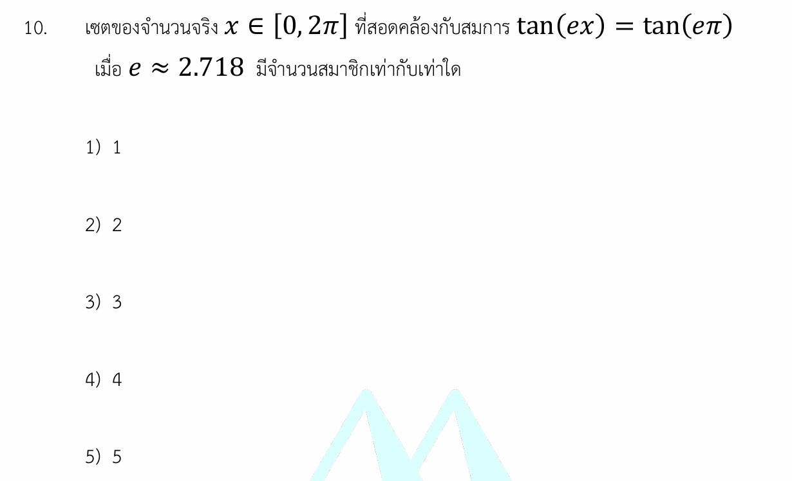

# สมการตรีโกณมิติที่มีเงื่อนไขของช่วง

นี่คือเฉลยอย่างละเอียด แนวคิดทางคณิตศาสตร์ กลยุทธ์ในการทำโจทย์ และโจทย์ซ้อมมือเพิ่มเติมสำหรับสมการตรีโกณมิติที่มีเงื่อนไขของช่วงครับ

---

## 📘 เฉลยอย่างละเอียด

**โจทย์:** เซตของจำนวนจริง $x \in [0, 2\pi]$ ที่สอดคล้องกับสมการ $\tan(ex) = \tan(e\pi)$ เมื่อ $e \approx 2.718$ มีจำนวนสมาชิกเท่ากับเท่าใด

### ขั้นที่ 1: ใช้สูตรคำตอบทั่วไปของฟังก์ชัน Tangent

จากสมบัติของฟังก์ชันตรีโกณมิติ สมการในรูป $\tan \theta = \tan \alpha$ จะมีคำตอบทั่วไป (General Solution) อยู่ในรูป:

$$\theta = n\pi + \alpha \quad \text{เมื่อ } n \text{ เป็นจำนวนเต็ม } (n \in \mathbb{Z})$$

*(เนื่องจากฟังก์ชัน $\tan$ มีคาบหรือความยาวรอบเท่ากับ $\pi$)*

จากโจทย์ กำหนดให้ $\theta = ex$ และ $\alpha = e\pi$ นำมาเข้าสูตรจะได้:

$$ex = n\pi + e\pi$$

#### **ขั้นที่ 2: จัดรูปหาค่า $x$**

หารด้วย $e$ ทั้งสองข้างของสมการ (เนื่องจาก $e \approx 2.718 \neq 0$ จึงหารได้ปกติ):

$$x = \frac{n\pi}{e} + \pi$$

หรือจัดรูปดึงตัวร่วมจะได้:

$$x = \left(\frac{n}{e} + 1\right)\pi$$

#### **ขั้นที่ 3: ใช้เงื่อนไขช่วงที่โจทย์กำหนดเพื่อบีบหาค่า $n$**

โจทย์กำหนดให้ $x \in [0, 2\pi]$ หมายความว่า $0 \le x \le 2\pi$
นำค่า $x$ จากขั้นที่ 2 ไปแทนในอสมการ:

$$0 \le \left(\frac{n}{e} + 1\right)\pi \le 2\pi$$

นำ $\pi$ หารตลอดอสมการ (เนื่องจาก $\pi > 0$ เครื่องหมายอสมการจึงไม่เปลี่ยน):

$$0 \le \frac{n}{e} + 1 \le 2$$

ลบ 1 ออกทุกส่วนของอสมการ:

$$-1 \le \frac{n}{e} \le 1$$

นำ $e$ คูณตลอดอสมการ (เนื่องจาก $e \approx 2.718 > 0$ เครื่องหมายอสมการคงเดิม):

$$-e \le n \le e$$

$$-2.718 \le n \le 2.718$$

#### **ขั้นที่ 4: หาจำนวนเต็ม $n$ ที่เป็นไปได้**

เนื่องจาก $n$ ต้องเป็นจำนวนเต็มเท่านั้น ($\dots, -2, -1, 0, 1, 2, \dots$) ค่า $n$ ที่อยู่ระหว่าง $-2.718$ ถึง $2.718$ ได้แก่:

$$n = -2, -1, 0, 1, 2$$

#### **ขั้นที่ 5: ตรวจสอบเงื่อนไขนิยามของฟังก์ชัน $\tan$**

ตามนิยาม ฟังก์ชัน $\tan \theta$ จะหาค่าไม่ได้เมื่อมุม $\theta = k\pi + \frac{\pi}{2}$ (เมื่อ $k \in \mathbb{Z}$)
ในข้อนี้ มุมคือ $ex = n\pi + e\pi$ หากมุมนี้ไปตรงกับค่าที่หาค่าไม่ได้ จะได้ว่า:

$$n\pi + e\pi = k\pi + \frac{\pi}{2} \implies e = k - n + 0.5$$

เนื่องจาก $k$ และ $n$ เป็นจำนวนเต็ม ค่าของ $k - n + 0.5$ จะต้องเป็นจำนวนตรรกยะที่มีทศนิยมลงท้ายด้วย $.5$ เสมอ แต่ค่า $e$ เป็น **จำนวนอกนิยาม (Irrational Number)** ที่มีทศนิยมไม่รู้จบและไม่ซ้ำ ($2.71828\dots$) ดังนั้น สมการนี้ไม่มีทางเป็นจริง ค่า $ex$ จึงนิยามได้ทุกค่าสำหรับทุกจำนวนเต็ม $n$

ส่งผลให้ค่า $n$ ทั้ง 5 ค่า ทำให้เกิดค่า $x$ ที่แตกต่างกัน 5 ค่าพอดี
จำนวนสมาชิกของเซตคำตอบจึงเท่ากับ **5**

## ตอบ ข้อ 5) 5

---

### 🧠 เนื้อหาเพิ่มเติมเพื่อศึกษา

#### **1. สูตรคำตอบทั่วไปของสมการตรีโกณมิติพื้นฐาน**

เมื่อเราต้องการแก้สมการตรีโกณมิติที่มุมมีความซับซ้อน การใช้คำตอบทั่วไปจะช่วยลดความผิดพลาดได้ดีกว่าการไล่มุมบนวงกลมหนึ่งหน่วย:

* **สมการรูป $\sin \theta = \sin \alpha$** $\implies \theta = n\pi + (-1)^n\alpha$
* **สมการรูป $\cos \theta = \cos \alpha$** $\implies \theta = 2n\pi \pm \alpha$
* **สมการรูป $\tan \theta = \tan \alpha$** $\implies \theta = n\pi + \alpha$
*(ทุกสูตรกำหนดให้ $n \in \mathbb{Z}$)*

---

### 🎯 กลยุทธ์แก้โจทย์ประเภทนี้

1. **มองข้ามค่าคงที่แปลกๆ ไปก่อน:** ในข้อนี้โจทย์ใส่ค่า $e$ มาเพื่อให้ผู้สอบรู้สึกกังวล ให้เรามองว่ามันคือค่าคงที่ตัวหนึ่ง (คล้ายๆ กับ $\pi$) แล้วดำเนินกระบวนการคิดตามปกติ
2. **เปลี่ยนปัญหาตรีโกณมิติให้เป็นปัญหาอสมการพีชคณิต:** การนำคำตอบทั่วไปมาใส่อลสมการตามช่วงที่โจทย์กำหนด จะช่วยแปลงโจทย์จากการนั่งเดามุม ไปเป็นการนับจำนวนเต็ม $n$ ซึ่งมีความแม่นยำและตกหล่นยากกว่ามาก

---

### ✍️ ตัวอย่างโจทย์เพิ่มเติมเพื่อฝึกทำ

#### **โจทย์ข้อที่ 1 (ระดับพื้นฐาน - ฝึกใช้สูตรคำตอบทั่วไปของ $\tan$)**

จงหาจำนวนคำตอบของสมการ $\tan(3x) = \tan\left(\frac{\pi}{4}\right)$ ในช่วง $x \in [0, \pi]$

**วิธีทำ:**

1. ใช้สูตรคำตอบทั่วไปของ $\tan$:

$$3x = n\pi + \frac{\pi}{4}$$

$$x = \frac{n\pi}{3} + \frac{\pi}{12}$$

1. นำไปใส่อสมการตามช่วง $0 \le x \le \pi$:

$$0 \le \frac{n\pi}{3} + \frac{\pi}{12} \le \pi$$

1. หารด้วย $\pi$ ตลอดอสมการ:

$$0 \le \frac{n}{3} + \frac{1}{12} \le 1$$

1. ลบด้วย $\frac{1}{12}$ ตลอดอสมการ:

$$-\frac{1}{12} \le \frac{n}{3} \le \frac{11}{12}$$

1. คูณด้วย 3 ตลอดอสมการ:

$$-\frac{3}{12} \le n \le \frac{33}{12}$$

$$-0.25 \le n \le 2.75$$

1. หาจำนวนเต็ม $n$ ที่เป็นไปได้ในช่วงนี้ ได้แก่ $n = 0, 1, 2$

**คำตอบ:** มีทั้งหมด 3 คำตอบ

---

#### **โจทย์ข้อที่ 2 (ระดับประยุกต์ - ฟังก์ชัน $\sin$ และมีการขยายช่วง)**

จงหาจำนวนคำตอบของสมการ $\sin(2x) = \sin\left(\frac{\pi}{6}\right)$ สำหรับ $x \in [0, 2\pi]$

**วิธีทำ:**
*ข้อนี้สามารถคิดได้สองแบบ คือแยกกรณีคำตอบทั่วไป หรือคิดผ่านการขยายช่วงมุม (ง่ายกว่าสำหรับข้อนี้)*

1. จากโจทย์ ช่วงของ $x$ คือ $0 \le x \le 2\pi$
2. สังเกตว่ามุมในฟังก์ชันคือ $2x$ ดังนั้นเราต้องขยายช่วงโดยคูณ 2 ตลอดอสมการ จะได้ช่วงของมุมคือ:

$$0 \le 2x \le 4\pi \quad \text{(คิดเป็น 2 รอบวงกลม)}$$

1. หาคำตอบของสมการ $\sin(\theta) = \sin\left(\frac{\pi}{6}\right)$ ในช่วง $[0, 4\pi]$

* **รอบที่ 1 ($0$ ถึง $2\pi$):** $\sin$ เป็นบวกในควอดรันต์ที่ 1 และ 2
จะได้มุม $2x = \frac{\pi}{6}$ และ $2x = \pi - \frac{\pi}{6} = \frac{5\pi}{6}$
* **รอบที่ 2 ($2\pi$ ถึง $4\pi$):** บวกเพิ่มไปอีกรอบวงกลม ($+2\pi$) จากมุมในรอบแรก
จะได้มุม $2x = \frac{\pi}{6} + 2\pi = \frac{13\pi}{6}$ และ $2x = \frac{5\pi}{6} + 2\pi = \frac{17\pi}{6}$

1. เมื่อนำไปหาร 2 เพื่อหาค่า $x$ ทุกค่าจะยังคงอยู่ในช่วง $[0, 2\pi]$ ตามเงื่อนไขโจทย์ทั้งหมด

**คำตอบ:** มีทั้งหมด 4 คำตอบ
