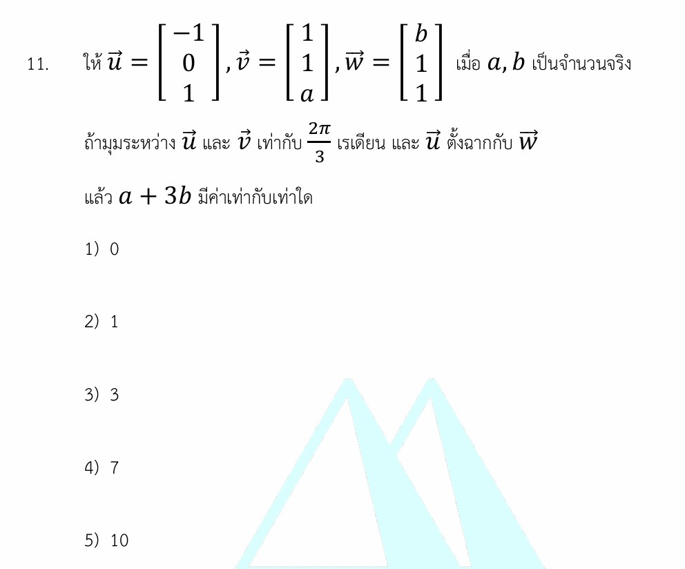

# เวกเตอร์ในสามมิติ (Dot Product และมุมระหว่างเวกเตอร์)

นี่คือเฉลยอย่างละเอียด แนวคิดเกี่ยวกับเวกเตอร์ที่จำเป็น กลยุทธ์ในการทำโจทย์ และโจทย์ซ้อมมือเพิ่มเติมสำหรับเรื่อง **เวกเตอร์ในสามมิติ (Dot Product และมุมระหว่างเวกเตอร์)** ครับ

---

## 📘 เฉลยอย่างละเอียด (โจทย์ข้อ 11)

**โจทย์:** ให้ $\vec{u} = \begin{bmatrix} -1 \\ 0 \\ 1 \end{bmatrix}, \vec{v} = \begin{bmatrix} 1 \\ 1 \\ a \end{bmatrix}, \vec{w} = \begin{bmatrix} b \\ 1 \\ 1 \end{bmatrix}$ เมื่อ $a, b$ เป็นจำนวนจริง ถ้ามุมระหว่าง $\vec{u}$ และ $\vec{v}$ เท่ากับ $\frac{2\pi}{3}$ เรเดียน และ $\vec{u}$ ตั้งฉากกับ $\vec{w}$ แล้ว $a + 3b$ มีค่าเท่ากับเท่าใด

### **ขั้นที่ 1: หาค่า $b$ จากเงื่อนไข "เวกเตอร์ตั้งฉากกัน"**

จากสมบัติของเวกเตอร์ เวกเตอร์สองตัวจะตั้งฉากกันก็ต่อเมื่อผลคูณเชิงสเกลาร์ (Dot Product) มีค่าเท่ากับ $0$

$$\vec{u} \cdot \vec{w} = 0$$

นำส่วนประกอบของเวกเตอร์มาคูณกันทีละตำแหน่งแล้วจับบวกกัน:

$$\begin{bmatrix} -1 \\ 0 \\ 1 \end{bmatrix} \cdot \begin{bmatrix} b \\ 1 \\ 1 \end{bmatrix} = 0$$

$$(-1)(b) + (0)(1) + (1)(1) = 0$$

$$-b + 1 = 0 \implies b = 1$$

 --- **(ได้ค่า $b$ แล้ว)**

#### **ขั้นที่ 2: หาค่า $a$ จากเงื่อนไข "มุมระหว่างเวกเตอร์"**

โจทย์กำหนดให้มุมระหว่าง $\vec{u}$ และ $\vec{v}$ คือ $\theta = \frac{2\pi}{3}$ (หรือ $120^\circ$)
เราจะใช้สูตร:

$$\cos \theta = \frac{\vec{u} \cdot \vec{v}}{|\vec{u}| |\vec{v}|}$$

1. **หาค่า $\cos\left(\frac{2\pi}{3}\right)$:** อยู่ในควอดรันต์ที่ 2 ค่า $\cos$ เป็นลบ จะได้ $-\frac{1}{2}$
2. **หาค่า $\vec{u} \cdot \vec{v}$:**
$$\vec{u} \cdot \vec{v} = (-1)(1) + (0)(1) + (1)(a) = -1 + a$$

3. **หาขนาดของเวกเตอร์ $|\vec{u}|$ และ $|\vec{v}|$:**

$$|\vec{u}| = \sqrt{(-1)^2 + 0^2 + 1^2} = \sqrt{2}$$

$$|\vec{v}| = \sqrt{1^2 + 1^2 + a^2} = \sqrt{2 + a^2}$$

นำค่าทั้งหมดไปแทนในสูตร:

$$-\frac{1}{2} = \frac{a - 1}{\sqrt{2}\sqrt{2 + a^2}}$$

#### **ขั้นที่ 3: แก้สมการหาค่า $a$**

คูณไขว้เพื่อจัดรูปสมการ:

$$-\sqrt{2}\sqrt{2 + a^2} = 2(a - 1)$$

⚠️ **จุดต้องระวังก่อนยกกำลังสอง:** ฝั่งซ้ายของสมการมีเครื่องหมายลบด้านหน้าแสดงว่าเป็นค่าลบแน่นอน ดังนั้นฝั่งขวา $2(a-1)$ ก็ต้องเป็นค่าลบด้วย ซึ่งจะทำให้ได้เงื่อนไขแฝงว่า $a - 1 < 0 \implies a < 1$

ยกกำลังสองทั้งสองข้างเพื่อกำจัดรูท:

$$\left(-\sqrt{2}\sqrt{2 + a^2}\right)^2 = \left(2(a - 1)\right)^2$$

$$2(2 + a^2) = 4(a^2 - 2a + 1)$$

$$4 + 2a^2 = 4a^2 - 8a + 4$$

ย้ายข้างมาอยู่ฝั่งเดียวกันเพื่อแยกตัวประกอบ:

$$0 = 2a^2 - 8a$$

$$2a(a - 4) = 0$$

จะได้ค่า $a = 0$ หรือ $a = 4$

เมื่อนำไปเช็กกับเงื่อนไขแฝง ($a < 1$) หรือลองแทนค่ากลับไปในสมการมุม:

* ถ้า $a = 4 \implies \vec{u} \cdot \vec{v} = 3$ (ค่าเป็นบวก มุมต้องเป็นมุมแหลม ซึ่งขัดแย้งกับ $120^\circ$)
* ถ้า $a = 0 \implies \vec{u} \cdot \vec{v} = -1$ (ถูกต้อง)

ดังนั้น **$a = 0$** เท่านั้น

#### **ขั้นที่ 4: คำนวณหาค่า $a + 3b$**

แทนค่า $a = 0$ และ $b = 1$ ลงไป:

$$a + 3b = 0 + 3(1) = 3$$

### ตอบ ข้อ 3) 3

---

### 🧠 เนื้อหาเพิ่มเติมเพื่อศึกษา

#### **1. ผลคูณเชิงสเกลาร์ (Dot Product)**

กำหนดให้ $\vec{A} = [x_1, y_1, z_1]$ และ $\vec{B} = [x_2, y_2, z_2]$

* นิยามเชิงพิกัดฉาก: $\vec{A} \cdot \vec{B} = x_1x_2 + y_1y_2 + z_1z_2$
* นิยามเชิงเรขาคณิต: $\vec{A} \cdot \vec{B} = |\vec{A}||\vec{B}|\cos\theta$

#### **2. เครื่องหมายของ Dot Product บ่งบอกชนิดของมุม**

* ถ้า $\vec{A} \cdot \vec{B} > 0 \implies \theta$ เป็น**มุมแหลม** ($0^\circ \le \theta < 90^\circ$)
* ถ้า $\vec{A} \cdot \vec{B} = 0 \implies \theta$ เป็น**มุมฉาก** ($\theta = 90^\circ$) เวกเตอร์ตั้งฉากกัน
* ถ้า $\vec{A} \cdot \vec{B} < 0 \implies \theta$ เป็น**มุมป้าน** ($90^\circ < \theta \le 180^\circ$)

---

### 🎯 กลยุทธ์แก้โจทย์ประเภทนี้

1. **ทำจากตัวแปรที่ง่ายก่อน:** โจทย์มักให้เงื่อนไขมา 2 อย่าง ให้มองหาคำว่า **"ตั้งฉาก"** ก่อนเสมอ เพราะการจับ Dot Product เท่ากับ 0 แก้สมการหาตัวแปรได้ง่ายและรวดเร็วที่สุดโดยไม่ต้องยุ่งกับขนาดเวกเตอร์ติดรูท
2. **ระวังการเกิดรากปลอม (Extraneous Root):** เมื่อใดก็ตามที่มีการยกกำลังสองทั้งสองข้างเพื่อแก้สมการ ค่าที่ได้อาจจะมีตัวหนึ่งที่ใช้ไม่ได้ ให้รีบเช็กเครื่องหมายของ Dot Product ทันทีเพื่อคัดคำตอบที่ผิดออกไป

---

### ✍️ ตัวอย่างโจทย์เพิ่มเติมเพื่อฝึกทำ

#### **โจทย์ข้อที่ 1 (ระดับพื้นฐาน - ฝึกความเชี่ยวชาญเรื่องการตั้งฉาก)**

กำหนดให้ $\vec{u} = \begin{bmatrix} 2 \\ 1 \\ -3 \end{bmatrix}$ และ $\vec{v} = \begin{bmatrix} k \\ 4 \\ k \end{bmatrix}$ ถ้าเวกเตอร์ทั้งสองตั้งฉากกัน จงหาค่าของ $k$

**วิธีทำ:**

1. ตั้งสมการจากการตั้งฉาก: $\vec{u} \cdot \vec{v} = 0$
2. นำพิกัดมาคูณกัน:

$$(2)(k) + (1)(4) + (-3)(k) = 0$$

$$2k + 4 - 3k = 0$$

$$-k + 4 = 0$$

$$k = 4$$

**คำตอบ:** $k = 4$

---

#### **โจทย์ข้อที่ 2 (ระดับประยุกต์ - สอบเข้ามหาวิทยาลัย)**

กำหนดให้ $\vec{a}$ และ $\vec{b}$ เป็นเวกเตอร์ที่มุมระหว่างเวกเตอร์ทั้งสองเท่ากับ $60^\circ$ โดยที่ $|\vec{a}| = 3$ และ $|\vec{b}| = 4$ จงหาค่าของ $|\vec{a} + 2\vec{b}|$

**วิธีทำ:**

1. สำหรับโจทย์ที่ถามหาขนาดของการบวก/ลบเวกเตอร์ กลยุทธ์คือให้ยกกำลังสองสมการนั้นก่อน:

$$|\vec{a} + 2\vec{b}|^2 = |\vec{a}|^2 + 4(\vec{a} \cdot \vec{b}) + 4|\vec{b}|^2$$

1. กระจายหาค่า $\vec{a} \cdot \vec{b}$ จากสูตรขนาดและมุม:

$$\vec{a} \cdot \vec{b} = |\vec{a}||\vec{b}|\cos 60^\circ = (3)(4)\left(\frac{1}{2}\right) = 6$$

1. แทนค่าทั้งหมดกลับเข้าในสมการข้อที่ 1:

$$|\vec{a} + 2\vec{b}|^2 = 3^2 + 4(6) + 4(4^2)$$

$$= 9 + 24 + 64 = 97$$

1. ถอดรากที่สองเพื่อเอาเฉพาะค่าขนาดที่เป็นบวก:

$$|\vec{a} + 2\vec{b}| = \sqrt{97}$$

**คำตอบ:** $\sqrt{97}$
