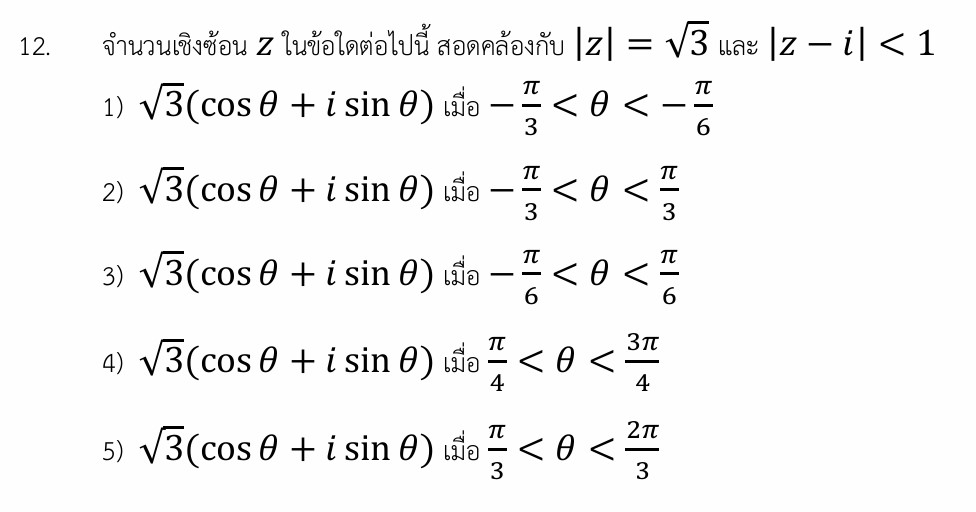

# เฉลยข้อ 12: จำนวนเชิงซ้อนและการตีความเชิงเรขาคณิต

นี่คือเฉลยอย่างละเอียด แนวคิดเชิงเรขาคณิตบนระนาบเชิงซ้อน กลยุทธ์ในการทำโจทย์ และโจทย์ซ้อมมือเพิ่มเติมสำหรับเรื่อง **จำนวนเชิงซ้อน (Complex Numbers) และการตีความเชิงเรขาคณิต** ของโจทย์ข้อ 12 ครับ

---

## 📘 เฉลยอย่างละเอียด (โจทย์ข้อ 12)

**โจทย์:** จำนวนเชิงซ้อน $z$ ในข้อใดต่อไปนี้ สอดคล้องกับ $|z| = \sqrt{3}$ และ $|z - i| < 1$

### **ขั้นที่ 1: พิจารณาเงื่อนไขแรกจากรูปเชิงขั้ว (Polar Form)**

จากตัวเลือกทุกข้อ โจทย์กำหนดให้ $z$ อยู่ในรูปเชิงขั้วคือ:

$$z = \sqrt{3}(\cos \theta + i \sin \theta)$$

ซึ่งรูปแบบนี้บอกเราว่า ค่าสัมบูรณ์หรือโมดูลัสของ $z$ คือ $|z| = \sqrt{3}$ เสมอ ดังนั้น เงื่อนไขแรกของโจทย์จึงถูกตอบสนองโดยตัวเลือกทุกข้ออยู่แล้ว หน้าที่ของเราคือหาช่วงของมุม $\theta$ ที่ทำให้เงื่อนไขที่สอง $|z - i| < 1$ เป็นจริง

### **ขั้นที่ 2: ตีความเงื่อนไขที่สองด้วยเรขาคณิต (Geometric Interpretation)**

บนระนาบเชิงซ้อน (Argand Diagram):

* $|z - z_0| = r$ คือ สมการวงกลมที่มีจุดศูนย์กลางอยู่ที่ $z_0$ และมีรัศมีเท่ากับ $r$
* ดังนั้น $|z - i| < 1$ หมายถึง **พื้นที่ภายในวงกลม (ไม่รวมเส้นขอบ) ที่มีจุดศูนย์กลางอยู่ที่ $i$ หรือพิกัด $(0, 1)$ และมีรัศมีเท่ากับ $1$**

ส่วนเงื่อนไขแรก $|z| = \sqrt{3}$ คือ **เส้นรอบวงของวงกลมที่มีจุดศูนย์กลางอยู่ที่จุดกำเนิด $(0, 0)$ และมีรัศมีเท่ากับ $\sqrt{3} \approx 1.732$**

โจทย์ข้อนี้จึงกลายเป็นการหาว่า **"ส่วนโค้งช่วงไหนของวงกลมวงแรก ที่เข้าไปวิ่งอยู่ภายในวงกลมวงที่สอง"**

### **ขั้นที่ 3: หาจุดตัดของวงกลมทั้งสองวง**

สมมติให้ $z = x + yi$

* จากวงกลมวงแรก: $x^2 + y^2 = (\sqrt{3})^2 \implies x^2 + y^2 = 3$  --- **(สมการที่ 1)**
* จากวงกลมวงที่สอง (หาพิกัดเส้นขอบ): $x^2 + (y - 1)^2 = 1^2 \implies x^2 + y^2 - 2y + 1 = 1 \implies x^2 + y^2 - 2y = 0$  --- **(สมการที่ 2)**

นำสมการที่ 1 แทนลงในสมการที่ 2:

$$3 - 2y = 0 \implies 2y = 3 \implies y = \frac{3}{2}$$

### **ขั้นที่ 4: แปลงพิกัดกลับไปเป็นมุม $\theta$**

จากรูปเชิงขั้ว ส่วนประกอบในแนวแกน Y (แกนจินตภาพ) ของ $z$ คือ $y = \sqrt{3}\sin \theta$
แทนค่า $y = \frac{3}{2}$ ลงไปเพื่อหามุมที่เป็นจุดตัด:

$$\frac{3}{2} = \sqrt{3}\sin \theta \implies \sin \theta = \frac{3}{2\sqrt{3}} = \frac{\sqrt{3}}{2}$$

เนื่องจากพิกัด $y = \frac{3}{2}$ เป็นค่าบวก แสดงว่าจุดตัดอยู่เหนือกน X (ควอดรันต์ที่ 1 และ 2) ค่าของมุม $\theta$ ที่ทำให้ $\sin \theta = \frac{\sqrt{3}}{2}$ คือ:

* ควอดรันต์ที่ 1: $\theta = \frac{\pi}{3}$ ($60^\circ$)
* ควอดรันต์ที่ 2: $\theta = \pi - \frac{\pi}{3} = \frac{2\pi}{3}$ ($120^\circ$)

### **ขั้นที่ 5: สรุปช่วงของคำตอบ**

จุดศูนย์กลางของวงกลมวงที่สองคือ $(0, 1)$ ซึ่งอยู่ด้านบนของแกน Y และจุดบนสุดของวงกลมวงแรกคือ $(0, \sqrt{3})$ ซึ่งเมื่อเช็กระยะห่างแล้วพบว่าอยู่ด้านในของวงกลมวงที่สองพอดี

แสดงว่าส่วนโค้งของวงกลมวงแรกที่อยู่ภายในวงกลมวงที่สองคือส่วนโค้งด้านบนทั้งหมดที่อยู่ระหว่างจุดตัดทั้งสองจุด
นั่นคือมุม $\theta$ จะต้องอยู่ระหว่าง $\frac{\pi}{3}$ และ $\frac{2\pi}{3}$ หรือเขียนเป็นอสมการได้ว่า **$\frac{\pi}{3} < \theta < \frac{2\pi}{3}$**

**ตอบ ข้อ 5) $\sqrt{3}(\cos \theta + i \sin \theta)$ เมื่อ $\frac{\pi}{3} < \theta < \frac{2\pi}{3}$**

---

### 🧠 เนื้อหาเพิ่มเติมเพื่อศึกษา

#### **การแปลความหมายเชิงเรขาคณิตของผลต่างจำนวนเชิงซ้อน**

สัญลักษณ์ $|z_1 - z_2|$ ในทางเรขาคณิตหมายถึง **"ระยะห่างระหว่างจุด $z_1$ และ $z_2$ บนระนาบเชิงซ้อน"** ดังนั้น เมื่อเราเห็นโจทย์ในรูปแบบต่อไปนี้ สามารถวาดรูปกราฟแทนการแก้สมการยาวๆ ได้ทันที:

1. $|z - (a + bi)| = r \implies$ วงกลมจุดศูนย์กลางอยู่ที่ $(a, b)$ รัศมี $r$
2. $|z - z_1| = |z - z_2| \implies$ เส้นตรงที่แบ่งครึ่งและตั้งฉากกับส่วนเส้นตรงที่เชื่อมระหว่าง $z_1$ และ $z_2$
3. $|z - z_1| + |z - z_2| = 2a \implies$ รี (Ellipse) ที่มี $z_1$ และ $z_2$ เป็นจุดโฟกัส

---

### 🎯 กลยุทธ์แก้โจทย์ประเภทนี้

1. **เปลี่ยนพีชคณิตให้เป็นเรขาคณิต:** หากโจทย์ถามหาเซตคำตอบของจำนวนเชิงซ้อนที่ติดค่าสัมบูรณ์ (Modulus) หลายตัว การแปลงโจทย์ให้เป็นรูปวงกลมหรือเส้นตรงบนระนาบจะช่วยให้เข้าใจภาพรวมและสโคปหาคำตอบได้เร็วกว่าการสมมติ $z = x+yi$ แล้วแก้กำลังสองตรงๆ
2. **วาดรูปคร่าวๆ เพื่อตัดช้อยส์:** จากข้อนี้ ถ้าเราวาดวงกลมรัศมี $\sqrt{3}$ รอบจุดกำเนิด และวงกลมรัศมี $1$ รอบจุด $(0,1)$ จะเห็นทันทีว่าพื้นที่ทับซ้อนอยู่ด้านบนของระนาบ (ควอดรันต์ที่ 1 และ 2) ช้อยส์ที่มุมติดลบ (ควอดรันต์ที่ 4) เช่น ข้อ 1, 2, 3 สามารถตัดทิ้งได้ทันทีตั้งแต่แรกครับ

---

### ✍️ ตัวอย่างโจทย์เพิ่มเติมเพื่อฝึกทำ

#### **โจทย์ข้อที่ 1 (ระดับพื้นฐาน - ฝึกตีความพื้นที่วงกลม)**

จงหาพื้นที่ของบริเวณบนระนาบเชิงซ้อนที่สอดคล้องกับอสมการ $1 \le |z - (2 + i)| \le 3$

**วิธีทำ:**

1. ตีความหมายเชิงเรขาคณิต:

* $|z - (2 + i)|$ คือระยะทางจาก $z$ ไปยังจุดศูนย์กลาง $z_0 = 2 + i$ หรือพิกัด $(2, 1)$
* อสมการ $1 \le |z - z_0| \le 3$ หมายถึง บริเวณที่มีระยะห่างตั้งแต่ 1 ถึง 3 หน่วย

1. รูปทรงที่ได้จะเป็น **รูปวงแหวน (Annulus)** ที่มีจุดศูนย์กลางร่วมกันอยู่ที่ $(2, 1)$ โดยมีรัศมีวงใน $r = 1$ และรัศมีวงนอก $R = 3$
2. คำนวณหาพื้นที่วงแหวนจากสูตร: $\text{พื้นที่} = \pi R^2 - \pi r^2$

$$\text{พื้นที่} = \pi(3)^2 - \pi(1)^2 = 9\pi - \pi = 8\pi$$

**คำตอบ:** $8\pi$ ตารางหน่วย

---

#### **โจทย์ข้อที่ 2 (ระดับประยุกต์ - เส้นแบ่งครึ่งตั้งฉาก)**

ถ้าเซตคำตอบของจำนวนเชิงซ้อน $z$ สอดคล้องกับสมการ $|z - 3| = |z - 3i|$ เส้นกราฟของสมการนี้บนระนาบเชิงซ้อนคือเส้นตรงที่มีสมการตรงกับข้อใด ในรูปพิกัดฉาก $(x, y)$

**วิธีทำ:**

* **วิธีที่ 1 (เชิงเรขาคณิต):** โจทย์หมายถึงจุด $z$ ที่อยู่ห่างจากจุด $3$ (หรือพิกัด $(3,0)$) และจุด $3i$ (หรือพิกัด $(0,3)$) เป็นระยะทางเท่ากัน กราฟที่ได้คือเส้นตรงที่ตัดกึ่งกลางระหว่างสองจุดนี้และตั้งฉาก ซึ่งก็คือเส้นตรงที่ลากผ่านจุดกำเนิดและทำมุม $45^\circ$ ในควอดรันต์ที่ 1 และ 3 นั่นคือสมการ $y = x$
* **วิธีที่ 2 (เชิงพีชคณิตเพื่อพิสูจน์):**
ให้ $z = x + yi$ แทนลงในโจทย์:

$$|(x - 3) + yi| = |x + (y - 3)i|$$

ถอดโมดูลัส (ยกกำลังสองทั้งสองข้างเพื่อเอาสแควร์รูทออก):

$$(x - 3)^2 + y^2 = x^2 + (y - 3)^2$$

$$x^2 - 6x + 9 + y^2 = x^2 + y^2 - 6y + 9$$

ตัดตัวแปรที่เหมือนกันออกทั้งสองข้าง:

$$-6x = -6y \implies x = y \text{ หรือ } y - x = 0$$

**คำตอบ:** เส้นตรง $y = x$
