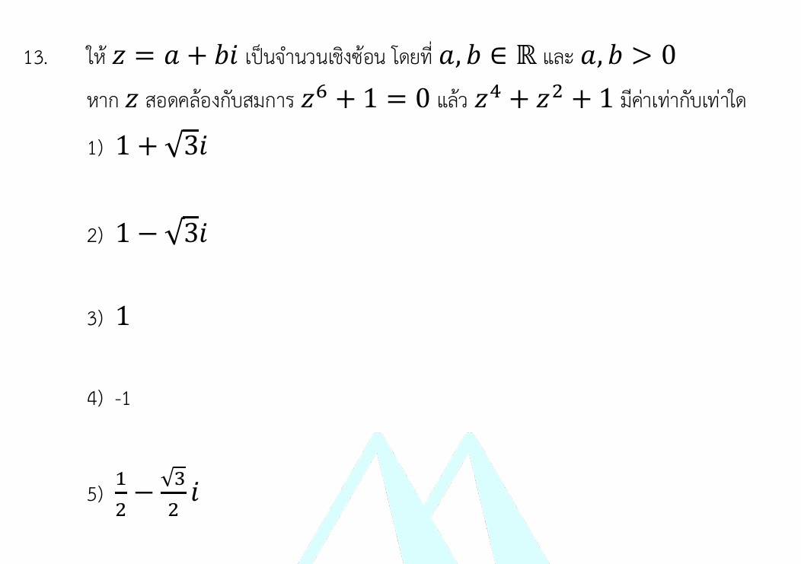

# จำนวนเชิงซ้อน (Complex Numbers)

จัดให้เลยครับ! โจทย์ข้อนี้เป็นโจทย์เรื่อง **จำนวนเชิงซ้อน (Complex Numbers)** ที่ดีมากๆ เพราะผสมผสานทั้งเรื่องพีชคณิต (การแยกตัวประกอบ) และการวิเคราะห์ตำแหน่งบนระนาบเชิงซ้อน (ควอดรันต์) มักจะพบในข้อสอบแข่งขันระดับสูงอย่าง A-Level หรือข้อสอบสอบเข้ามหาวิทยาลัยครับ

เรามาดูวิธีทำอย่างละเอียด พร้อมปูพื้นฐานเนื้อหาที่เกี่ยวข้องเพื่อความเข้าใจที่ลึกซึ้งกันครับ!

---

## 1. วิธีทำอย่างละเอียด (Step-by-Step Solution)

**โจทย์กำหนด:** 1. $z = a + bi$ โดยที่ $a, b \in \mathbb{R}$ และ $a, b > 0$ (หมายความว่า $z$ อยู่ใน **ควอดรันต์ที่ 1** บนระนาบเชิงซ้อน)
2. $z^6 + 1 = 0$

**สิ่งที่โจทย์ถาม:** ค่าของ $z^4 + z^2 + 1$

---

### ขั้นตอนที่ 1: แยกตัวประกอบจากสมการที่โจทย์ให้

จากสมการ $z^6 + 1 = 0$ เราสามารถมองให้อยู่ในรูป **ผลบวกกำลังสาม** ได้ดังนี้:

$$(z^2)^3 + 1^3 = 0$$

ใช้สูตรผลบวกกำลังสาม $A^3 + B^3 = (A + B)(A^2 - AB + B^2)$ โดยให้ $A = z^2$ และ $B = 1$:

$$(z^2 + 1)(z^4 - z^2 + 1) = 0$$

นั่นแปลว่า ตัวประกอบตัวใดตัวหนึ่งต้องเท่ากับ $0$ คือ $z^2 + 1 = 0$ หรือ $z^4 - z^2 + 1 = 0$

---

### ขั้นตอนที่ 2: วิเคราะห์เงื่อนไขเพื่อตัดกรณีที่ไม่เป็นจริง

ลองพิจารณากรณีแรกถ้า $z^2 + 1 = 0$

$$z^2 = -1 \implies z = i \text{ หรือ } z = -i$$

* ถ้า $z = i$ จะได้ $a = 0, b = 1$
* ถ้า $z = -i$ จะได้ $a = 0, b = -1$

แต่โจทย์ระบุชัดเจนว่า **$a > 0$ และ $b > 0$** ดังนั้น กรณี $z^2 + 1 = 0$ จึง **เป็นไปไม่ได้**
ส่งผลให้เราได้ข้อสรุปว่าสมการที่เป็นจริงคือ:

$$z^4 - z^2 + 1 = 0$$

ย้ายข้างสมการจะได้:

$$z^4 + 1 = z^2$$

---

### ขั้นตอนที่ 3: ปรับรูปสิ่งที่โจทย์ถาม

โจทย์ต้องการหาค่าของ $z^4 + z^2 + 1$ เราจับคู่จัดกลุ่มใหม่ได้เป็น:

$$(z^4 + 1) + z^2$$

จากขั้นตอนที่ 2 เราทราบแล้วว่า $z^4 + 1 = z^2$ นำมาแทนค่าลงไป:

$$(z^2) + z^2 = 2z^2$$

เป้าหมายของเราตอนนี้ลดลงเหลือแค่การหาค่าของ $2z^2$ ครับ!

---

### ขั้นตอนที่ 4: หาค่า $z^2$ และเลือกค่าที่สอดคล้องกับควอดรันต์

จากสมการ $z^4 - z^2 + 1 = 0$ ให้มอง $z^2$ เป็นตัวแปรตัวหนึ่ง (สมมติให้ $x = z^2$ จะได้สมการ $x^2 - x + 1 = 0$)
ใช้สูตรสำเร็จรูปในการหาคำตอบของสมการกำลังสอง $x = \frac{-b \pm \sqrt{b^2 - 4ac}}{2a}$:

$$z^2 = \frac{-(-1) \pm \sqrt{(-1)^2 - 4(1)(1)}}{2(1)}$$

$$z^2 = \frac{1 \pm \sqrt{-3}}{2} = \frac{1 \pm \sqrt{3}i}{2}$$

เราจะได้ค่า $z^2$ ออกมา 2 ค่า คือ $\frac{1}{2} + \frac{\sqrt{3}}{2}i$ และ $\frac{1}{2} - \frac{\sqrt{3}}{2}i$ เราต้องเลือกค่าที่ถูกต้องโดยอิงจากเงื่อนไข $a, b > 0$

**พิจารณาด้วยรูปเชิงขั้ว (Polar Form):**

* โจทย์บอก $z = a + bi$ โดย $a > 0, b > 0$ แสดงว่ามุม $\theta$ ของ $z$ ต้องอยู่ในควอดรันต์ที่ 1 ($0^\circ < \theta < 90^\circ$)
* ตามทฤษฎีบทของเดอมัวฟ์ (De Moivre's Theorem) มุมของ $z^2$ จะกลายเป็น $2\theta$
* เมื่อ $0^\circ < \theta < 90^\circ$ จะได้ว่า $0^\circ < 2\theta < 180^\circ$ ซึ่งเป็นมุมที่ตกอยู่ใน **ควอดรันต์ที่ 1 หรือ 2** เท่านั้น
* บนควอดรันต์ที่ 1 และ 2 ค่าของส่วนจินตภาพ (หรือค่า $\sin$) **ต้องเป็นบวกเสมอ**

ดังนั้น ค่า $z^2$ ที่ถูกต้องจึงต้องเลือกตัวที่มีส่วนจินตภาพเป็นบวก นั่นคือ:

$$z^2 = \frac{1}{2} + \frac{\sqrt{3}}{2}i$$

---

### ขั้นตอนที่ 5: หาคำตอบสุดท้าย

นำค่า $z^2$ ที่ได้ไปแทนกลับในสิ่งที่โจทย์ถาม ($2z^2$):

$$2z^2 = 2 \left( \frac{1}{2} + \frac{\sqrt{3}}{2}i \right) = 1 + \sqrt{3}i$$

**ตอบ ตัวเลือกที่ 1) $1 + \sqrt{3}i$**

---

## 2. เนื้อหาและสูตรที่เกี่ยวข้อง (Background Concepts)

### 1. จำนวนเชิงซ้อนในรูปพีชคณิต (Algebraic Form)

* รูปทั่วไปคือ $z = a + bi$
* สัญลักษณ์: $a$ เรียกว่า **ส่วนจริง (Real part - $\text{Re}(z)$)** และ $b$ เรียกว่า **ส่วนจินตภาพ (Imaginary part - $\text{Im}(z)$)** โดยที่ $i = \sqrt{-1}$ หรือ $i^2 = -1$

### 2. รูปเชิงขั้ว (Polar Form) และทฤษฎีบทของเดอมัวฟ์

* เราสามารถเขียน $z$ ในรูปเชิงขั้วได้เป็น $z = r(\cos\theta + i\sin\theta)$
* **ทฤษฎีบทของเดอมัวฟ์:** ถ้า $z = r(\cos\theta + i\sin\theta)$ แล้วการยกกำลัง $n$ จะได้:

$$z^n = r^n(\cos(n\theta) + i\sin(n\theta))$$

*จำง่ายๆ: "ขนาดพิกัดยกกำลัง $n$ แต่มุมข้างในโดนคูณด้วย $n$"*

### 3. สูตรพีชคณิตพื้นฐานที่ต้องแม่น

* **ผลบวกกำลังสาม:** $A^3 + B^3 = (A + B)(A^2 - AB + B^2)$
* **ผลต่างกำลังสาม:** $A^3 - B^3 = (A - B)(A^2 + AB + B^2)$

---

## 3. กลยุทธ์แก้โจทย์ประเภทนี้ (Problem-Solving Strategies)

1. **อย่าพยายามหาค่า $z$ ตรงๆ ตั้งแต่แรก:** วัยรุ่นใจร้อนมักจะพยายามแก้หาค่า $z$ จาก $z^6 = -1$ ทันที ซึ่งจะได้รากถึง 6 ค่า แล้วเอาไปนั่งยกกำลังสี่ ยกลำดับสอง ซึ่งทำให้เสียเวลาและคิดเลขผิดได้ง่าย
2. **ใช้กลยุทธ์ "ลดทอนกำลัง" (Degree Reduction):** สังเกตความสัมพันธ์ระหว่างสมการที่โจทย์ให้มา กับสิ่งที่โจทย์ถาม พยายามจัดรูปสมการหลักเพื่อแทนค่าลดรูปสิ่งที่โจทย์ถามให้สั้นที่สุด (เหมือนที่เราเปลี่ยน $z^4 + z^2 + 1$ ให้เหลือแค่ $2z^2$)
3. **ตรวจสอบเงื่อนไขพิกัด/ควอดรันต์เสมอ:** คำว่า $a, b > 0$ หรือการระบุเครื่องหมายมา ไม่ได้ให้มาประดับโจทย์ แต่เป็นตัว "ตัดคำตอบ" ที่ไม่สมเหตุสมผลออกไป

---

## 4. โจทย์ซ้อมมือเพิ่มเติมเพื่อฝึกฝน

### **โจทย์ข้อที่ 1:**

กำหนดให้ $z$ เป็นจำนวนเชิงซ้อนที่สอดคล้องกับสมการ $z^3 - 1 = 0$ โดยที่ $z \neq 1$ จงหาค่าของ $z^2 + z + 5$

**วิธีทำ:**

1. จาก $z^3 - 1 = 0$ แยกตัวประกอบผลต่างกำลังสามได้เป็น:

$$(z - 1)(z^2 + z + 1) = 0$$

1. เนื่องจากโจทย์กำหนดว่า $z \neq 1$ แสดงว่าตัวประกอบ $z - 1 \neq 0$ แน่นอน
2. ดังนั้น สมการที่เป็นจริงคือ $z^2 + z + 1 = 0 \implies z^2 + z = -1$
3. สิ่งที่โจทย์ถามคือ $z^2 + z + 5$ แทนค่า $z^2 + z = -1$ ลงไป:

$$(-1) + 5 = 4$$

**ตอบ:** $4$

---

### **โจทย์ข้อที่ 2:**

กำหนดให้ $z$ เป็นจำนวนเชิงซ้อนที่สอดคล้องกับสมการ $z^4 + z^2 + 1 = 0$ โดยที่ $z$ อยู่ในควอดรันต์ที่ 2 จงหาค่าของ $z^3$

**วิธีทำ:**

1. สังเกตพหุนาม $z^4 + z^2 + 1$ ถ้านำ $(z^2 - 1)$ ไปคูณทั้งสองข้างของสมการ:

$$(z^2 - 1)(z^4 + z^2 + 1) = 0 \implies (z^2)^3 - 1^3 = 0 \implies z^6 - 1 = 0 \implies z^6 = 1$$

1. หาคำตอบจากสมการตั้งต้น $z^4 + z^2 + 1 = 0$ โดยใช้สูตรกำลังสอง (มองเป็น $x = z^2$):

$$z^2 = \frac{-1 \pm \sqrt{1^2 - 4(1)(1)}}{2} = \frac{-1 \pm \sqrt{3}i}{2}$$

1. แปลงเป็นรูปเชิงขั้ว:

* ค่า $z^2$ ที่ได้มี 2 ค่า คือมุม $120^\circ$ หรือ $240^\circ$ (เนื่องจากค่า $\cos$ เป็นลบ)

1. โจทย์ระบุว่า $z$ อยู่ใน **ควอดรันต์ที่ 2** แปลว่ามุม $\theta$ ของ $z$ ต้องอยู่ระหว่าง $90^\circ < \theta < 180^\circ$
2. ดังนั้น มุมของ $z^2$ (ซึ่งคือ $2\theta$) ต้องอยู่ระหว่าง $180^\circ < 2\theta < 360^\circ$ (ควอดรันต์ที่ 3 หรือ 4)
3. ทำให้เราต้องเลือก $z^2$ ตัวที่มุมตกควอดรันต์ที่ 3 คือ มุม $240^\circ$:

$$z^2 = \cos(240^\circ) + i\sin(240^\circ)$$

นั่นหมายความว่ามุมเริ่มต้นของ $z$ คือ $120^\circ$ (ตกควอดรันต์ที่ 2 ตามเงื่อนไขพอดี!)
7. โจทย์ถามค่า $z^3$ ใช้ทฤษฎีบทของเดอมัวฟ์:

$$z^3 = \cos(3 \times 120^\circ) + i\sin(3 \times 120^\circ) = \cos(360^\circ) + i\sin(360^\circ) = 1 + 0i = 1$$

**ตอบ:** $1$

---

หวังว่าคำอธิบายนี้จะช่วยให้เข้าใจภาพรวมและเทคนิคการทำโจทย์แนวนี้มากขึ้นนะครับ สงสัยขั้นตอนไหนเพิ่มเติมสอบถามได้เลย! คุณอยากลองเจาะลึกการแปลงเป็นรูปเชิงขั้ว (Polar Form) เพิ่มเติมไหมครับ?
