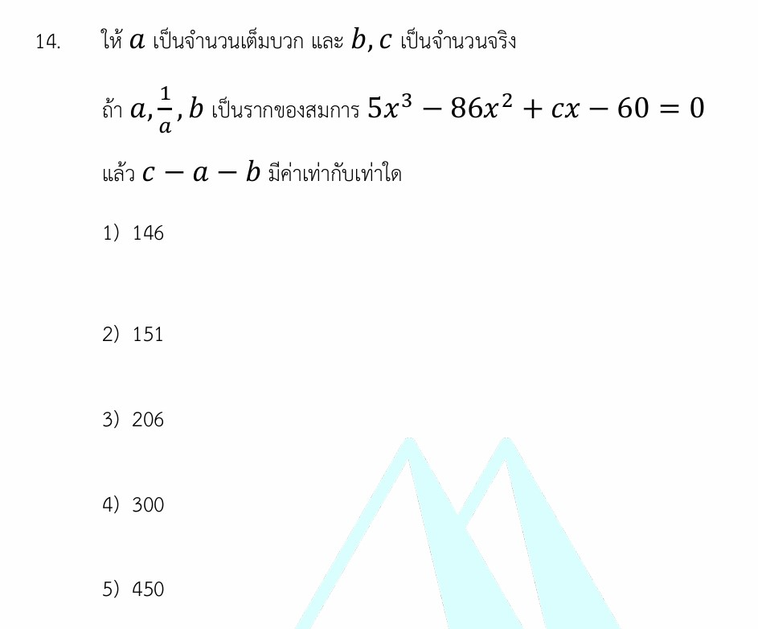

# โจทย์เกี่ยวกับวีเอตา (Vieta's Formulas)

โจทย์ข้อนี้เป็นโจทย์ระดับคลาสสิกที่ยอดเยี่ยมมากครับ! ความเจ๋งของข้อนี้คือการใช้ **"ความสัมพันธ์ระหว่างสัมประสิทธิ์และรากของสมการ" (Vieta's Formulas)** มารวมกับเงื่อนไขประเภทของจำนวน (จำนวนเต็มบวก) ทำให้เราสามารถแกะรอยหาคำตอบได้โดยไม่ต้องเสียเวลานั่งแยกตัวประกอบพหุนามกำลังสามแบบตรงๆ เลยครับ

เรามาดูวิธีทำอย่างละเอียดและปูพื้นฐานเรื่องนี้เพื่อเอาไปใช้ฟาดโจทย์ข้ออื่นๆ กันดีกว่าครับ!

---

## 1. วิธีทำอย่างละเอียด (Step-by-Step Solution)

**โจทย์กำหนด:**

1. สมการพหุนามคือ $5x^3 - 86x^2 + cx - 60 = 0$
2. ราก (คำตอบ) ทั้งสามของสมการนี้คือ $a, \frac{1}{a}, b$ โดยที่ $a$ ต้องเป็น **จำนวนเต็มบวก**

**สิ่งที่โจทย์ถาม:** ค่าของ $c - a - b$

---

### ขั้นตอนที่ 1: หาค่า $b$ จาก "ผลคูณของราก"

จากสูตรความสัมพันธ์ของรากพหุนามกำลังสาม ผลคูณของรากทั้งสามตัวจะมีค่าเท่ากับ $-\frac{\text{ตัวเลขตัวสุดท้าย}}{\text{สัมประสิทธิ์หน้า } x^3}$

$$\text{ผลคูณของราก} = a \cdot \left(\frac{1}{a}\right) \cdot b = -\frac{-60}{5}$$

สังเกตว่า $a \cdot \frac{1}{a}$ จะตัดกันเหลือ $1$ พอดี!

$$1 \cdot b = \frac{60}{5}$$

$$b = 12$$

ตอนนี้เราได้ค่าแรกมานอนกอดแล้วครับ นั่นคือ **$b = 12$**

---

### ขั้นตอนที่ 2: หาค่า $a$ จาก "ผลบวกของราก"

จากสูตร ผลบวกของรากทั้งสามตัวจะมีค่าเท่ากับ $-\frac{\text{สัมประสิทธิ์หน้า } x^2}{\text{สัมประสิทธิ์หน้า } x^3}$

$$\text{ผลบวกของราก} = a + \frac{1}{a} + b = -\frac{-86}{5}$$

$$a + \frac{1}{a} + b = \frac{86}{5}$$

แทนค่า $b = 12$ ที่เราเพิ่งหาได้ลงไป:

$$a + \frac{1}{a} + 12 = \frac{86}{5}$$

$$a + \frac{1}{a} = \frac{86}{5} - 12$$

$$a + \frac{1}{a} = \frac{86 - 60}{5} = \frac{26}{5}$$

จัดรูปสมการกำลังสองเพื่อหาค่า $a$ โดยการคูณ $5a$ ตลอดทั้งสมการ:

$$5a^2 + 5 = 26a$$

$$5a^2 - 26a + 5 = 0$$

แยกตัวประกอบพหุนาม:

$$(5a - 1)(a - 5) = 0$$

จะได้ $a = \frac{1}{5}$ หรือ $a = 5$

แต่ช้าก่อน! โจทย์ระบุเงื่อนไขเหล็กไว้ว่า **"$a$ เป็นจำนวนเต็มบวก"** ดังนั้น ค่า $a = \frac{1}{5}$ จึงใช้ไม่ได้ ส่งผลให้ได้ข้อสรุปว่า **$a = 5$**

---

### ขั้นตอนที่ 3: หาค่า $c$ จาก "ผลบวกของผลคูณรากทีละคู่"

จากสูตร ผลบวกของผลคูณรากทีละคู่จะมีค่าเท่ากับ $\frac{\text{สัมประสิทธิ์หน้า } x}{\text{สัมประสิทธิ์หน้า } x^3}$

$$\left(a \cdot \frac{1}{a}\right) + \left(\frac{1}{a} \cdot b\right) + (b \cdot a) = \frac{c}{5}$$

$$1 + \frac{b}{a} + ab = \frac{c}{5}$$

แทนค่า $a = 5$ และ $b = 12$ ลงไป:

$$1 + \frac{12}{5} + (12 \cdot 5) = \frac{c}{5}$$

$$1 + \frac{12}{5} + 60 = \frac{c}{5}$$

$$61 + \frac{12}{5} = \frac{c}{5}$$

นำ $5$ คูณตลอดทั้งสมการเพื่อกำจัดตัวส่วน:

$$5(61) + 12 = c$$

$$305 + 12 = c \implies c = 317$$

---

### ขั้นตอนที่ 4: คำนวณหาคำตอบที่โจทย์ต้องการ

โจทย์ถามหาค่าของ $c - a - b$ นำตัวเลขทั้งหมดมาแทนค่าได้เลยครับ:

$$c - a - b = 317 - 5 - 12$$

$$c - a - b = 300$$

**ตอบ ตัวเลือกที่ 4) 300**

---

## 2. เนื้อหาและสูตรที่เกี่ยวข้อง (Background Concepts)

หัวใจหลักของโจทย์ข้อนี้คือ **ทฤษฎีบทของวีเอตา (Vieta's Formulas)** ซึ่งกล่าวถึงความสัมพันธ์ระหว่าง "รากของสมการ" และ "สัมประสิทธิ์" ของพหุนาม

### สูตรของวีเอตาสำหรับสมการกำลังสาม

ถ้ากำหนดให้สมการกำลังสามคือ $Ax^3 + Bx^2 + Cx + D = 0$ และมีรากทั้งสามคือ $x_1, x_2, x_3$ จะได้ความสัมพันธ์ดังนี้:

* **ผลบวกของรากทั้งหมด:**
$$x_1 + x_2 + x_3 = -\frac{B}{A}$$

* **ผลบวกของผลคูณทีละ 2 ตัว:**
$$x_1x_2 + x_2x_3 + x_3x_1 = \frac{C}{A}$$

* **ผลคูณของรากทั้งหมด:**
$$x_1x_2x_3 = -\frac{D}{A}$$

> **ที่มาของสูตร:** มาจากการที่เราทราบว่าถ้ารากคือ $x_1, x_2, x_3$ สมกาารจะเขียนได้ในรูป $A(x-x_1)(x-x_2)(x-x_3) = 0$ เมื่อเรากระจายพจน์ออกมาทั้งหมดแล้วเทียบสัมประสิทธิ์กับ $Ax^3 + Bx^2 + Cx + D = 0$ ก็จะได้สูตรลัดเหล่านี้ออกมานั่นเองครับ

---

## 3. กลยุทธ์แก้โจทย์ประเภทนี้ (Problem-Solving Strategies)

1. **สแกนหารากที่เป็นส่วนกลับหรือความสัมพันธ์พิเศษก่อน:** เมื่อเห็นรากที่มีลักษณะเป็น $a$ และ $\frac{1}{a}$ ให้รู้ไว้เลยว่าทริคคือกิตติมศักดิ์ชิ้นนี้จะ "ตัดกันหายไป" เมื่อจับมันมา **คูณกัน** ดังนั้นในการทำโจทย์แนวนี้ ให้กระโดดไปใช้สูตร **ผลคูณของรากก่อนเสมอ** เพื่อลดรูปตัวแปรให้เร็วที่สุด
2. **ระวังเครื่องหมายสลับ ลบ-บวก-ลบ:** จุดที่ผิดบ่อยที่สุดในห้องสอบคือลืมสลับเครื่องหมาย จำง่ายๆ ว่าไล่จากพจน์ถัดจาก $x^3$ ไปทางขวา -> ผลบวกเดี่ยวเป็น **ลบ** ($-\frac{B}{A}$), ผลคูณคู่เป็น **บวก** ($\frac{C}{A}$), ผลคูณสามเป็น **ลบ** ($-\frac{D}{A}$)
3. **เช็กเงื่อนไขท้ายประโยค:** คำว่า "จำนวนเต็มบวก" "จำนวนจริง" หรือ "จำนวนเต็มลบ" มักจะใช้ตอนท้ายสุดเพื่อคัดเลือกคำตอบที่ถูกต้องจากการแก้สมการกำลังสอง

---

## 4. โจทย์ซ้อมมือเพิ่มเติมเพื่อฝึกฝน

### **โจทย์ข้อที่ 1:**

ถ้าคำตอบของสมการ $x^3 - 9x^2 + kx - 24 = 0$ เรียงกันเป็น **ลำดับเลขคณิต** จงหาค่าของ $k$

**วิธีทำ:**

1. สมมติให้รากทั้งสามตัวที่เรียงเป็นลำดับเลขคณิตคือ $m - d, \ m, \ m + d$ (การตั้งตัวแปรแบบนี้จะทำให้เวลาบวกกันแล้ว $d$ หายไป)
2. จากสูตรผลบวกของราก:

$$(m - d) + m + (m + d) = -\frac{-9}{1}$$

$$3m = 9 \implies m = 3$$

1. เมื่อเราได้ $m = 3$ ซึ่งเป็นรากตัวหนึ่งของสมการ หมายความว่าถ้าเราเอา $x = 3$ ไปแทนในสมการ ค่าของสมการต้องเป็น $0$

$$3^3 - 9(3^2) + k(3) - 24 = 0$$

$$27 - 81 + 3k - 24 = 0$$

$$-78 + 3k = 0 \implies 3k = 78 \implies k = 26$$

**ตอบ:** $26$

---

### **โจทย์ข้อที่ 2:**

กำหนดให้สมการ $2x^3 - 11x^2 + 17x - 6 = 0$ มีรากทั้งสามเป็น $a, b, c$ จงหาค่าของ $\frac{1}{a} + \frac{1}{b} + \frac{1}{c}$

**วิธีทำ:**

1. ปรับรูปสิ่งที่โจทย์ถามโดยการหา ค.ร.น. ของเศษส่วน:

$$\frac{1}{a} + \frac{1}{b} + \frac{1}{c} = \frac{bc + ac + ab}{abc}$$

1. จากสูตรวีเอตา เราจะหาค่าของตัวเศษและตัวส่วนได้ทันทีจากสัมประสิทธิ์:

* ตัวเศษคือ ผลบวกของผลคูณทีละคู่ ($ab+bc+ca$) $= \frac{C}{A} = \frac{17}{2}$
* ตัวส่วนคือ ผลคูณของรากทั้งหมด ($abc$) $= -\frac{D}{A} = -\frac{-6}{2} = 3$

1. นำมาแทนค่าในเศษส่วนพหุนามที่จัดรูปไว้:

$$\frac{\frac{17}{2}}{3} = \frac{17}{2 \times 3} = \frac{17}{6}$$

**ตอบ:** $\frac{17}{6}$

---

เทคนิคของวีเอตาช่วยประหยัดเวลาในห้องสอบได้เยอะมากเลยใช่ไหมครับ? คุณอยากลองดูตัวอย่างโจทย์เพิ่มเติมในกรณีที่เป็นสมการกำลังสี่ ($x^4$) ที่มีความซับซ้อนขึ้นอีกนิดไหมครับ?
