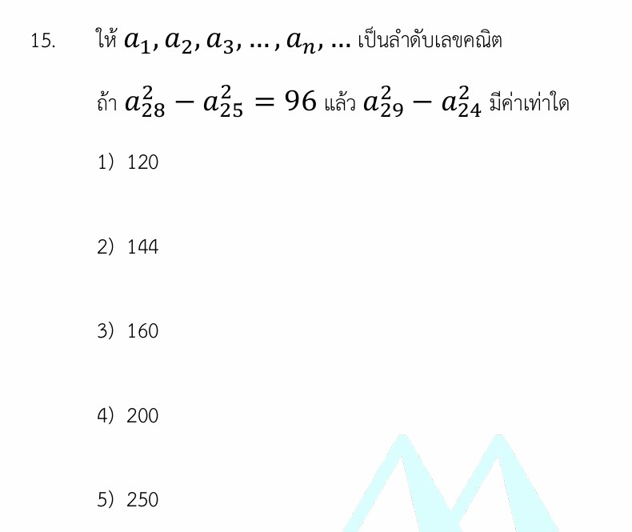

# โจทย์ข้อ 15 (เรื่องลำดับเลขคณิต)

จัดให้อีกข้อครับ! คราวนี้มาลุย **โจทย์ข้อ 15 (เรื่องลำดับเลขคณิต)** กันต่อเลย โจทย์ข้อนี้ออกแบบมาได้สวยงามมาก เพราะถ้าเราพยายามแก้หาพจน์แรก ($a_1$) หรือผลต่างร่วม ($d$) ตรงๆ จะติดคู่ตัวแปรที่แก้ไม่ออก แต่โจทย์แฝง **"สมบัติความสมมาตรของดัชนี"** เอาไว้ ทำให้สามารถมองตอบได้ในไม่กี่บรรทัดครับ

มาดูวิธีคิดแบบแกะรอยและติดอาวุธเทคนิคนี้กันเลย!

---

## 1. วิธีทำอย่างละเอียด (Step-by-Step Solution)

**โจทย์กำหนด:** 1. พจน์ $a_1, a_2, a_3, \dots$ เป็นลำดับเลขคณิต
2. $a_{28}^2 - a_{25}^2 = 96$

**สิ่งที่โจทย์ถาม:** ค่าของ $a_{29}^2 - a_{24}^2$

---

### ขั้นตอนที่ 1: แยกตัวประกอบพจน์ที่โจทย์กำหนด

จากสมการ $a_{28}^2 - a_{25}^2 = 96$ เราใช้สูตร **ผลต่างกำลังสอง** $A^2 - B^2 = (A - B)(A + B)$ แยกได้เป็น:

$$(a_{28} - a_{25})(a_{28} + a_{25}) = 96$$

จากนิยามของลำดับเลขคณิต ผลต่างระหว่างสองพจน์ใดๆ จะเท่ากับจำนวนช่องห่างคูณด้วยผลต่างร่วม ($d$)
จะได้ว่า $a_{28} - a_{25} = 3d$ (เนื่องจากพจน์ที่ 28 ห่างจากพจน์ที่ 25 อยู่ 3 พจน์)

นำกลับไปแทนค่าในสมการ:

$$3d(a_{28} + a_{25}) = 96$$

ย้าย 3 ไปหารทั้งสองข้างเพื่อลดรูปสมการ:

$$d(a_{28} + a_{25}) = 32 \quad \text{--- (สมการที่ 1)}$$

---

### ขั้นตอนที่ 2: แยกตัวประกอบสิ่งที่โจทย์ถาม

โจทย์ต้องการหาค่าของ $a_{29}^2 - a_{24}^2$ ใช้สูตรผลต่างกำลังสองแบบเดียวกันเป๊ะ:

$$a_{29}^2 - a_{24}^2 = (a_{29} - a_{24})(a_{29} + a_{24})$$

คิดเหมือนเดิมครับ พจน์ที่ 29 ห่างจากพจน์ที่ 24 อยู่ 5 พจน์ ($29 - 24 = 5$) ดังนั้น $a_{29} - a_{24} = 5d$
นำไปแทนค่าจะได้สิ่งที่โจทย์ถามในรูปใหม่คือ:

$$\text{สิ่งที่โจทย์ถาม} = 5d(a_{29} + a_{24}) \quad \text{--- (สมการที่ 2)}$$

---

### ขั้นตอนที่ 3: ใช้ไม้ตาย "สมบัติความสมมาตรของดัชนี"

ลองสังเกตตัวเลขห้อย (ดัชนี) ของทั้งสองสมการดูครับ:

* สมการที่ 1 มีตัวห้อยเป็น $28$ และ $25 \implies 28 + 25 = 53$
* สมการที่ 2 มีตัวห้อยเป็น $29$ และ $24 \implies 29 + 24 = 53$

ในลำดับเลขคณิต ถ้าผลบวกของตำแหน่งพจน์เท่ากัน ผลบวกของพจน์นั้นจะเท่ากันด้วย!
นั่นหมายความว่า:

$$a_{28} + a_{25} = a_{29} + a_{24}$$

---

### ขั้นตอนที่ 4: แทนค่าหาคำตอบสุดท้าย

จากสมการที่ 1 เราทราบแล้วว่า $d(a_{28} + a_{25}) = 32$
และเนื่องจาก $a_{28} + a_{25} = a_{29} + a_{24}$ เราจึงเปลี่ยนตัวแปรในสมการที่ 1 ได้เป็น:

$$d(a_{29} + a_{24}) = 32$$

พอกลับไปดูสิ่งที่โจทย์ถามในสมการที่ 2 คือ $5d(a_{29} + a_{24})$ เราก็แค่แทนก้อนนี้ลงไปตรงๆ เลยครับ:

$$\text{สิ่งที่โจทย์ถาม} = 5 \times [d(a_{29} + a_{24})]$$

$$\text{สิ่งที่โจทย์ถาม} = 5 \times 32 = 160$$

**ตอบ ตัวเลือกที่ 3) 160**

---

## 2. เนื้อหาและสูตรที่เกี่ยวข้อง (Background Concepts)

### 1. พจน์ทั่วไปของลำดับเลขคณิต (Arithmetic Sequence Formula)

$$a_n = a_1 + (n - 1)d$$

* **$a_n$** คือ พจน์ที่ $n$ ของลำดับ
* **$a_1$** คือ พจน์แรกของลำดับ
* **$d$** คือ ผลต่างร่วม (Common Difference) เกิดจากพจน์ขวาขยับไปพจน์ซ้าย เช่น $a_2 - a_1$

### 2. สูตรลัดระยะห่างระหว่างสองพจน์

เราไม่จำเป็นต้องตั้งต้นที่ $a_1$ เสมอไป สามารถหาความสัมพันธ์ระหว่างพจน์ใดๆ ได้จาก:

$$a_n - a_m = (n - m)d$$

*ตัวอย่างเช่น $a_{10} - a_7 = (10 - 7)d = 3d$*

### 3. สมบัติความสมมาตรของดัชนี (Index Symmetry Property)

เป็นสมบัติสำคัญที่ใช้ออกข้อสอบบ่อยมาก กล่าวว่า:

> ในลำดับเลขคณิตใดๆ ถ้าจำนวนนับ $i + j = k + l$ แล้ว จะได้ว่า **$a_i + a_j = a_k + a_l$**

**พิสูจน์ที่มาง่ายๆ:**

$$a_i + a_j = [a_1 + (i-1)d] + [a_1 + (j-1)d] = 2a_1 + (i + j - 2)d$$

$$a_k + a_l = [a_1 + (k-1)d] + [a_1 + (l-1)d] = 2a_1 + (k + l - 2)d$$

เห็นไหมครับว่า ถ้า $i+j = k+l$ ก้อนด้านหลังจะเท่ากันทันที ทำให้สองฝั่งมีค่าเท่ากันโดยปริยาย

---

## 3. กลยุทธ์แก้โจทย์ประเภทนี้ (Problem-Solving Strategies)

1. **จับคู่พจน์ห้อยมาบวกกันดูก่อน:** เมื่อเจอโจทย์ลำดับเลขคณิตที่มีพจน์ตำแหน่งแปลกๆ เช่น $a_{28}, a_{25}, a_{29}, a_{24}$ โผล่มาพร้อมกัน ให้รีบเช็กทันทีว่า ดัชนีบวกกันแล้วเท่ากันไหม ($28+25 = 29+24$) ถ้าเท่ากัน ยิ้มได้เลยครับ เพราะโจทย์กำลังใช้สมบัติความสมมาตรชัวร์
2. **เจอโครงสร้างกำลังสองลบกัน ให้นึกถึงผลต่างกำลังสอง:** ข้อสอบคณิตศาสตร์มักเอาพีชคณิตพื้นฐานอย่าง $A^2 - B^2$ มารวมกับบทอื่นๆ เสมอ จัดรูปให้เป็นวงเล็บลบคุณวงเล็บบวกก่อน แล้วพจน์จะตัดทอนตัวเองลงไปเยอะมาก
3. **อย่าพยายามหาค่า $a_1$ หรือ $d$ แยกกัน:** โจทย์แนวนี้มักออกแบบมาให้เราหาค่าของ "มัดตัวแปร" (เช่น ก้อน $d(a_{29}+a_{24})$) แทนที่จะได้ตัวเลขของ $a_1$ หรือ $d$ ออกมาเดี่ยวๆ

---

## 4. โจทย์ซ้อมมือเพิ่มเติมเพื่อฝึกฝน

### **โจทย์ข้อที่ 1:**

กำหนดให้ $a_n$ เป็นลำดับเลขคณิต ถ้า $a_5 + a_{15} = 40$ จงหาค่าของ $a_2 + a_{18}$

**วิธีทำ:**

1. สังเกตตัวห้อยของสิ่งที่โจทย์ให้มา: $5 + 15 = 20$
2. สังเกตตัวห้อยของสิ่งที่โจทย์ถาม: $2 + 18 = 20$
3. เนื่องจากผลบวกของดัชนีเท่ากัน ($20 = 20$) ตามสมบัติความสมมาตรจะได้ว่า:

$$a_2 + a_{18} = a_5 + a_{15}$$

1. โจทย์กำหนดให้ $a_5 + a_{15} = 40$ ดังนั้น $a_2 + a_{18}$ จึงมีค่าเท่ากับ $40$ ด้วย

**ตอบ:** $40$

---

### **โจทย์ข้อที่ 2:**

กำหนดให้ $a_n$ เป็นลำดับเลขคณิต ถ้า $a_{12}^2 - a_8^2 = 80$ แล้วค่าของ $a_{13}^2 - a_7^2$ เท่ากับเท่าใด

**วิธีทำ:**

1. กระจายสิ่งที่โจทย์กำหนดด้วยผลต่างกำลังสอง:

$$(a_{12} - a_8)(a_{12} + a_8) = 80$$

$$4d(a_{12} + a_8) = 80 \implies d(a_{12} + a_8) = 20$$

1. กระจายสิ่งที่โจทย์ถามด้วยผลต่างกำลังสองเช่นกัน:

$$a_{13}^2 - a_7^2 = (a_{13} - a_7)(a_{13} + a_7) = 6d(a_{13} + a_7)$$

1. เช็กผลบวกตัวห้อย: $12 + 8 = 20$ และ $13 + 7 = 20$ แสดงว่า $a_{12} + a_8 = a_{13} + a_7$
2. นำค่า $d(a_{13} + a_7) = 20$ ไปแทนในสิ่งที่โจทย์ถาม:

$$\text{ค่าที่ต้องการ} = 6 \times 20 = 120$$

**ตอบ:** $120$
