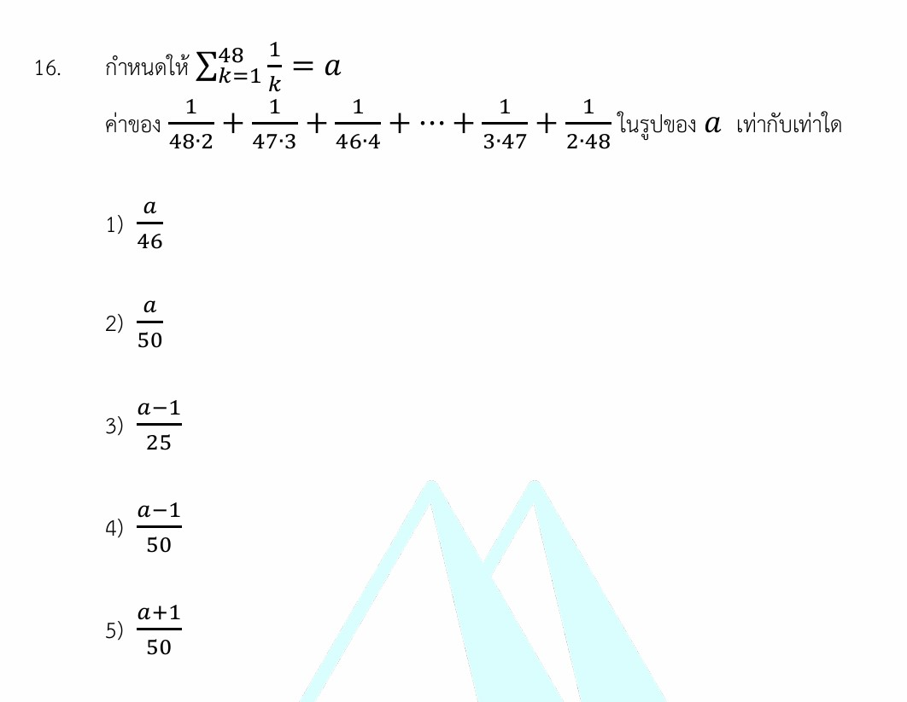

# โจทย์ข้อ 16 (เรื่องอนุกรมและความสมมาตร)

รอบนี้เรามาลุย **โจทย์ข้อ 16 (เรื่องอนุกรมและความสมมาตร)** กันต่อเลยครับ ข้อนี้เป็นข้อสอบที่วัดไหวพริบการสังเกตและความจำได้แม่นยำเกี่ยวกับเทคนิคการจัดรูปคณิตศาสตร์ ถ้าเราพยายามไปบวกเศษส่วนตรงๆ บอกเลยว่าทำถึงพรุ่งนี้ก็ไม่เสร็จครับ แต่ถ้าจับเคล็ดลับ "การแยกเศษส่วนย่อย" ได้ ข้อนี้จะกลายเป็นขนมหวานทันที!

เรามาดูวิธีคิดและเบื้องหลังของโจทย์ข้อนี้กันครับ

---

## 1. วิธีทำอย่างละเอียด (Step-by-Step Solution)

**โจทย์กำหนด:** 1. $\sum_{k=1}^{48} \frac{1}{k} = a$ นั่นแปลว่า $1 + \frac{1}{2} + \frac{1}{3} + \dots + \frac{1}{48} = a$
2. อนุกรมที่ต้องการหาค่าคือ:

$$S = \frac{1}{48 \cdot 2} + \frac{1}{47 \cdot 3} + \frac{1}{46 \cdot 4} + \dots + \frac{1}{2 \cdot 48}$$

**สิ่งที่โจทย์ถาม:** ค่าของอนุกรม $S$ ในรูปของ $a$

---

### ขั้นตอนที่ 1: สังเกตรูปแบบทั่วไปของตัวส่วน (General Term)

ลองสังเกตคู่ตัวเลขที่คูณกันอยู่ในตัวส่วนของแต่ละพจน์ดูครับ:

* พจน์ที่ 1: $48 \cdot 2$ (ผลรวมตัวคูณคือ $48 + 2 = 50$)
* พจน์ที่ 2: $47 \cdot 3$ (ผลรวมตัวคูณคือ $47 + 3 = 50$)
* พจน์ที่ 3: $46 \cdot 4$ (ผลรวมตัวคูณคือ $46 + 4 = 50$)

จะเห็นว่าตัวเลขคู่คูณในตัวส่วน มีผลบวกคงที่เท่ากับ **$50$** เสมอ!
ดังนั้น ถ้าเราให้ตัวแปรหนึ่งเป็น $k$ ตัวคูณอีกตัวหนึ่งก็ต้องเป็น $50 - k$ เราจึงสามารถเขียนอนุกรมนี้ในรูปสัญลักษณ์ซิกมา ($\sum$) ได้เป็น:

$$S = \sum_{k=2}^{48} \frac{1}{k(50 - k)}$$

*(โดย $k$ เริ่มวิ่งตั้งแต่ $2$ ไปจนจบที่ $48$)*

---

### ขั้นตอนที่ 2: ใช้เทคนิค "การแยกเศษส่วนย่อย" (Partial Fractions)

เราต้องการแยกก้อนพจน์ทั่วไป $\frac{1}{k(50 - k)}$ ให้ออกมาเป็นเศษส่วนสองพจน์แยกกัน เพื่อให้ง่ายต่อการคำนวณ ลองนำเศษส่วนที่มีตัวส่วนเป็น $k$ และ $50-k$ มาลองบวกกันตรงๆ ดูครับ:

$$\frac{1}{k} + \frac{1}{50 - k} = \frac{(50 - k) + k}{k(50 - k)} = \frac{50}{k(50 - k)}$$

สังเกตว่าผลบวกที่ได้ ตัวเศษจะกลายเป็น $50$ แต่ในโจทย์ของเราต้องการตัวเศษแค่เลข $1$ เท่านั้น เราจึงแค่เอา $50$ ย้ายไปหารออก จะได้สูตรการแยกพจน์ย่อยดังนี้:

$$\frac{1}{k(50 - k)} = \frac{1}{50} \left( \frac{1}{k} + \frac{1}{50 - k} \right)$$

---

### ขั้นตอนที่ 3: แทนค่ากลับและกระจายพจน์เพื่อดูความสมมาตร

นำสมการพจน์ย่อยที่จัดรูปเสร็จแล้วไปแทนกลับในอนุกรม $S$:

$$S = \sum_{k=2}^{48} \frac{1}{50} \left( \frac{1}{k} + \frac{1}{50 - k} \right)$$

ดึงค่าคงที่ $\frac{1}{50}$ ออกมานอกซิกมา แล้วลองเขียนกระจายพจน์ออกมาให้เห็นภาพชัดๆ:

$$S = \frac{1}{50} \left[ \left(\frac{1}{2} + \frac{1}{48}\right) + \left(\frac{1}{3} + \frac{1}{47}\right) + \left(\frac{1}{4} + \frac{1}{46}\right) + \dots + \left(\frac{1}{48} + \frac{1}{2}\right) \right]$$

พิจารณาไส้ในวงเล็บทั้งหมด:

* พจน์ตัวหน้าจะไล่จาก: $\frac{1}{2} + \frac{1}{3} + \frac{1}{4} + \dots + \frac{1}{48}$
* พจน์ตัวหลังจะไล่สวนทางกันจาก: $\frac{1}{48} + \frac{1}{47} + \frac{1}{46} + \dots + \frac{1}{2}$

เนื่องจากการบวกมีสมบัติการสลับที่ ชุดตัวเลขฝั่งหน้าและฝั่งหลังจึงเป็นชุดเดียวกันเป๊ะ! เมื่อจับมารวมกัน มันก็คือ **$2$ เท่า** ของชุดตัวเลขนั้นเองครับ:

$$S = \frac{1}{50} \left[ 2 \cdot \left( \frac{1}{2} + \frac{1}{3} + \frac{1}{4} + \dots + \frac{1}{48} \right) \right]$$

ตัดทอนตัวเลขจะได้:

$$S = \frac{1}{25} \left( \frac{1}{2} + \frac{1}{3} + \frac{1}{4} + \dots + \frac{1}{48} \right)$$

---

### ขั้นตอนที่ 4: เชื่อมโยงกับพจน์ $a$ และหาคำตอบ

โจทย์กำหนดให้ $a = 1 + \frac{1}{2} + \frac{1}{3} + \dots + \frac{1}{48}$
แต่ก้อนในวงเล็บของอนุกรม $S$ ของเราขาดแค่เลข $1$ พจน์แรกไปตัวเดียวเท่านั้น เราจึงย้ายข้างได้เป็น:

$$\frac{1}{2} + \frac{1}{3} + \frac{1}{4} + \dots + \frac{1}{48} = a - 1$$

นำก้อน $(a - 1)$ ไปแทนค่ากลับในอนุกรม $S$:

$$S = \frac{1}{25} (a - 1) = \frac{a - 1}{25}$$

**ตอบ ตัวเลือกที่ 3) $\frac{a-1}{25}$**

---

## 2. เนื้อหาและสูตรที่เกี่ยวข้อง (Background Concepts)

### 1. การแยกเศษส่วนย่อย (Partial Fraction Decomposition)

เป็นวิธีแยกเศษส่วนที่มีตัวส่วนคูณกันอยู่ ให้ออกมาเป็นเศษส่วนย่อยๆ หลายตัวบวกลบกัน มักจะเจอบ่อยมากในโจทย์อนุกรมแนวที่พจน์สามารถตัดทอนกันได้ (Telescoping Series)

* โครงสร้างทั่วไปที่เจอบ่อย: $\frac{1}{n(n+d)} = \frac{1}{d} \left( \frac{1}{n} - \frac{1}{n+d} \right)$
* โครงสร้างแบบข้อนี้ (ผลบวกตัวส่วนเป็นค่าคงที่ $C$): $\frac{1}{n(C-n)} = \frac{1}{C} \left( \frac{1}{n} + \frac{1}{C-n} \right)$

### 2. สมบัติความสมมาตรของผลรวม (Symmetry of Summation)

เมื่อหาผลรวมของฟังก์ชันที่มีลักษณะย้อนกลับในขอบเขตจำกัด การบวกจากหน้าไปหลังหรือหลังมาหน้าจะได้ค่าเท่ากันเสมอ:

$$\sum_{k=A}^{B} f(k) = \sum_{k=A}^{B} f(A + B - k)$$

---

## 3. กลยุทธ์แก้โจทย์ประเภทนี้ (Problem-Solving Strategies)

1. **สังเกต "ตัวเลขวิ่งสวนทางกัน"**: ถ้าตัวส่วนมีเลขสองตัวคูณกัน โดยตัวหนึ่งเพิ่มขึ้นทีละหนึ่ง แต่อีกตัวลดลงทีละหนึ่ง (เช่น $48 \cdot 2 \rightarrow 47 \cdot 3 \rightarrow 46 \cdot 4$) ให้รู้ทันทีว่าผลรวมของตัวคูณจะคงที่เสมอ และต้องใช้สูตรแยกพจน์ย่อยแบบผลบวกชัวร์ๆ
2. **อย่ากลัวสัญลักษณ์ ให้ลองเขียนกระจาย**: ถ้ามองในรูปซิกมา ($\sum$) แล้วงง ให้รีบเขียนกระจายพจน์แรกๆ กับพจน์ท้ายๆ ออกมาดูทันที มันจะทำให้เราเห็นการจับคู่พจน์ที่หน้าตาเหมือนกันได้ง่ายขึ้นมากครับ
3. **ตรวจสอบพจน์ที่ขาดหายไป**: เวลาเปรียบเทียบกับพจน์ตัวแปรที่โจทย์กำหนด (เช่น ค่า $a$) ต้องดูให้ดีว่าพจน์เริ่มต้นขาดเลขอะไรไปไหม อย่างข้อนี้หลายคนจะเผลอแทนก้อนนั้นเป็น $a$ ตรงๆ จนลืมลบเลข $1$ ออก ทำให้เลือกคำตอบผิดได้ครับ

---

## 4. โจทย์ซ้อมมือเพิ่มเติมเพื่อฝึกฝน

### **โจทย์ข้อที่ 1:**

กำหนดให้ $\sum_{k=1}^{10} \frac{1}{k} = b$ จงหาค่าของ $\frac{1}{1 \cdot 10} + \frac{1}{2 \cdot 9} + \frac{1}{3 \cdot 8} + \dots + \frac{1}{10 \cdot 1}$ ในรูปของ $b$

**วิธีทำ:**

1. สังเกตว่าผลรวมของตัวคูณในตัวส่วนคือ $1+10 = 2+9 = 11$ คงที่เสมอ
2. ใช้เทคนิคแยกเศษส่วนย่อยจะได้:

$$\frac{1}{k(11-k)} = \frac{1}{11} \left( \frac{1}{k} + \frac{1}{11-k} \right)$$

1. นำไปเขียนเป็นรูปผลรวมโดยที่ $k$ วิ่งตั้งแต่ $1$ ถึง $10$:

$$S = \frac{1}{11} \sum_{k=1}^{10} \left( \frac{1}{k} + \frac{1}{11-k} \right)$$

1. เมื่อกระจายพจน์ออกมา ทั้งก้อนหน้าและก้อนหลังจะได้อนุกรมชุดเดียวกันคือ $1 + \frac{1}{2} + \dots + \frac{1}{10}$ รวมกันจึงได้ $2$ เท่าพอดี:

$$S = \frac{1}{11} \left[ 2 \cdot \left(1 + \frac{1}{2} + \dots + \frac{1}{10}\right) \right] = \frac{2}{11} \sum_{k=1}^{10} \frac{1}{k}$$

1. แทนค่าตามที่โจทย์กำหนด $\sum_{k=1}^{10} \frac{1}{k} = b$ จะได้คำตอบคือ $\frac{2b}{11}$

**ตอบ:** $\frac{2b}{11}$

---

### **โจทย์ข้อที่ 2:**

กำหนดให้ $\sum_{k=1}^{50} \frac{1}{k} = m$ จงหาค่าของ $\frac{1}{2 \cdot 50} + \frac{1}{3 \cdot 49} + \frac{1}{4 \cdot 48} + \dots + \frac{1}{50 \cdot 2}$ ในรูปของ $m$

**วิธีทำ:**

1. สังเกตตัวส่วนมีผลบวกคงที่คือ $2+50 = 3+49 = 52$
2. แยกเศษส่วนย่อยได้พจน์ละ: $\frac{1}{52} \left( \frac{1}{k} + \frac{1}{52-k} \right)$ โดย $k$ วิ่งตั้งแต่ $2$ ถึง $50$
3. ดึง $\frac{1}{52}$ ออกมา และรวมพจน์สมมาตรฝั่งหน้า-หลัง จะได้เป็น $2$ เท่าของก้อนสะสม:

$$S = \frac{2}{52} \left( \frac{1}{2} + \frac{1}{3} + \dots + \frac{1}{50} \right) = \frac{1}{26} \left( \frac{1}{2} + \frac{1}{3} + \dots + \frac{1}{50} \right)$$

1. จากเงื่อนไขโจทย์ $m = 1 + \frac{1}{2} + \frac{1}{3} + \dots + \frac{1}{50}$ แสดงว่าก้อนในวงเล็บมีค่าเท่ากับ $m - 1$
2. แทนค่ากลับจะได้คำตอบคือ $\frac{m-1}{26}$

**ตอบ:** $\frac{m-1}{26}$
