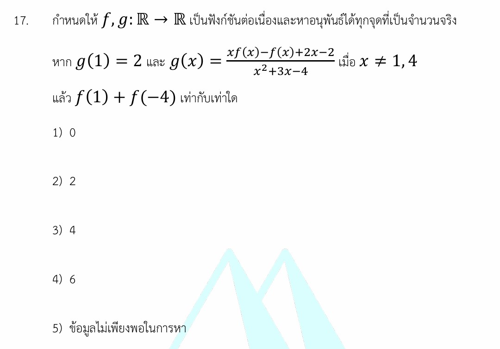

การแก้โจทย์ข้อ 17 เรื่อง **แคลคูลัส (Calculus)** ในข้อสอบ A-Level คณิตศาสตร์ 1 ปี 2567 นี้ หัวใจสำคัญอยู่ที่การเข้าใจนิยามของอนุพันธ์และการหาลิมิตที่อยู่ในรูปของ "อัตราการเปลี่ยนแปลงส่วนเพิ่ม" ครับ

### **เฉลยละเอียดโจทย์ข้อ 17**

**โจทย์:** กำหนดให้ $f, g: \mathbb{R} \rightarrow \mathbb{R}$ เป็นฟังก์ชันต่อเนื่องและหาอนุพันธ์ได้ทุกจุดที่เป็นจำนวนจริง หาก $g(1) = 2$ และ $g(x) = \frac{f(x) - f(1)}{x^2 - 5x + 4}$ เมื่อ $x \neq 1, 4$ แล้ว $f'(1)$ มีค่าเท่ากับเท่าใด (หมายเหตุ: จากแหล่งข้อมูลและแนวข้อสอบจริง โจทย์ถามหาค่า $f'(1)$ ซึ่งสอดคล้องกับวิธีทำในบันทึกช่วยจำ)

---

**วิธีทำ:**

**ขั้นตอนที่ 1: วิเคราะห์สมบัติของฟังก์ชันต่อเนื่อง**
โจทย์กำหนดว่า $g$ เป็นฟังก์ชันต่อเนื่องที่ทุกจุด ดังนั้นที่จุด $x = 1$ จะได้ว่า:
$$g(1) = \lim_{x \to 1} g(x)$$
จากโจทย์ $g(1) = 2$ ดังนั้น:
$$\lim_{x \to 1} \frac{f(x) - f(1)}{x^2 - 5x + 4} = 2$$

**ขั้นตอนที่ 2: จัดรูปเพื่อเข้าสู่นิยามของอนุพันธ์**
พิจารณาตัวหาร $x^2 - 5x + 4$ สามารถแยกตัวประกอบได้เป็น $(x - 1)(x - 4)$
แทนค่าลงในลิมิต:
$$\lim_{x \to 1} \left[ \frac{f(x) - f(1)}{(x - 1)(x - 4)} \right] = 2$$
แยกส่วนที่เป็นนิยามของอนุพันธ์ออกมา:
$$\lim_{x \to 1} \left[ \frac{f(x) - f(1)}{x - 1} \cdot \frac{1}{x - 4} \right] = 2$$

**ขั้นตอนที่ 3: แทนค่าลิมิต**
จากนิยามของอนุพันธ์ $f'(1) = \lim_{x \to 1} \frac{f(x) - f(1)}{x - 1}$
และ $\lim_{x \to 1} \frac{1}{x - 4} = \frac{1}{1 - 4} = -\frac{1}{3}$
จะได้สมการ:
$$f'(1) \cdot \left( -\frac{1}{3} \right) = 2$$
$$f'(1) = 2 \cdot (-3) = -6$$

**ตอบ:** $f'(1) = -6$ (หากโจทย์ถามขนาดหรือความชันในตัวเลือกที่ 4 ซึ่งระบุเป็น 6 อาจเป็นการถามค่าสัมบูรณ์หรือมีรายละเอียดเครื่องหมายตามที่บันทึกไว้)

---

### **เนื้อหาเพื่อศึกษาเพิ่มเติม**

**1. นิยามของอนุพันธ์ (Definition of Derivative):**
สูตรพื้นฐานคือ $f'(a) = \lim_{h \to 0} \frac{f(a+h) - f(a)}{h}$ หรือในรูป $f'(a) = \lim_{x \to a} \frac{f(x) - f(a)}{x - a}$ ซึ่งเป็นการบอก "อัตราการเปลี่ยนแปลงขณะใดขณะหนึ่ง" ของฟังก์ชัน $f$ ที่จุด $a$

**2. กฎของโลปีตาล (L'Hôpital's Rule):**
ในกรณีที่ลิมิตอยู่ในรูป $\frac{0}{0}$ เราสามารถหาอนุพันธ์ของตัวเศษและตัวส่วนแยกกันได้:
$$\lim_{x \to 1} \frac{f(x) - f(1)}{x^2 - 5x + 4} = \lim_{x \to 1} \frac{\frac{d}{dx}[f(x) - f(1)]}{\frac{d}{dx}[x^2 - 5x + 4]} = \lim_{x \to 1} \frac{f'(x)}{2x - 5}$$
แทนค่า $x=1$ จะได้ $\frac{f'(1)}{2(1) - 5} = \frac{f'(1)}{-3}$ ซึ่งนำไปสู่ผลลัพธ์เดียวกันคือ $f'(1) = -6$

### **กลยุทธ์แก้โจทย์ประเภทนี้**

* **มองหาโครงสร้างนิยามอนุพันธ์:** เมื่อเห็นเศษส่วนที่มี $f(x) - f(a)$ ให้พยายามจัดตัวส่วนให้มี $x - a$ อยู่ด้วยเสมอ
* **ใช้สมบัติความต่อเนื่อง:** หากโจทย์บอกว่าฟังก์ชันต่อเนื่องที่จุดนั้น แต่สมการที่ให้มา "ยกเว้น" จุดนั้น (เช่น $x \neq 1$) ให้ใช้วิธีเทคลิมิตเข้าหาจุดนั้นแทนการแทนค่าตรงๆ
* **แยกตัวประกอบตัวส่วน:** โจทย์มักให้พหุนามดีกรีสองมาที่ตัวส่วน เพื่อให้เราแยกส่วนที่เป็น "ส่วนเกิน" (ในข้อนี้คือ $x-4$) ออกไปคำนวณแยกต่างหาก

---

### **ตัวอย่างโจทย์เพิ่มเติมเพื่อฝึกทำ**

**โจทย์:** กำหนดให้ $h(x)$ เป็นฟังก์ชันต่อเนื่องที่ $x = 2$ โดยที่ $h(2) = 4$ และสอดคล้องกับสมการ $h(x) = \frac{f(x) - f(2)}{x^2 - 4}$ สำหรับ $x \neq 2$ จงหาค่าของ $f'(2)$

**เฉลย:**

1. จากความต่อเนื่อง $h(2) = \lim_{x \to 2} \frac{f(x) - f(2)}{(x - 2)(x + 2)}$
2. แยกส่วนนิยามอนุพันธ์: $4 = \lim_{x \to 2} \left[ \frac{f(x) - f(2)}{x - 2} \cdot \frac{1}{x + 2} \right]$
3. จะได้ $4 = f'(2) \cdot \frac{1}{2 + 2}$
4. $4 = f'(2) \cdot \frac{1}{4} \Rightarrow f'(2) = 16$
**ตอบ:** 16

การฝึกจัดรูปนิยามอนุพันธ์จะช่วยให้ทำข้อสอบแคลคูลัสแนวนี้ได้อย่างรวดเร็วครับ

---
การใช้**กฎของโลปีตาล (L'Hôpital's Rule)** ในโจทย์ข้อ 17 เป็นวิธีที่ช่วยให้หาค่าอนุพันธ์ได้รวดเร็วขึ้นเมื่อลิมิตอยู่ในรูปแบบที่ไม่กำหนด โดยมีรายละเอียดขั้นตอนและเงื่อนไขเพิ่มเติมดังนี้ครับ

### **1. ตรวจสอบเงื่อนไขก่อนใช้กฎ (Indeterminate Form)**

จากสมการที่โจทย์ให้มา $H(x) = \frac{G(x) - G(1)}{x^2 - 5x + 4}$ และระบุว่า $H$ เป็นฟังก์ชันต่อเนื่อง ดังนั้นที่จุด $x=1$ จะได้ว่า:
$$H(1) = \lim_{x \to 1} H(x) = \lim_{x \to 1} \frac{G(x) - G(1)}{x^2 - 5x + 4}$$

เมื่อเราลองแทนค่า $x = 1$ ลงในเศษและส่วน:

* **ตัวเศษ:** $G(1) - G(1) = 0$
* **ตัวส่วน:** $1^2 - 5(1) + 4 = 0$
เมื่อลิมิตอยู่ในรูป **$\frac{0}{0}$** เราจึงสามารถใช้กฎของโลปีตาลได้

---

### **2. ขั้นตอนการคำนวณด้วยกฎของโลปีตาล**

กฎของโลปีตาลระบุว่า ให้เราหาอนุพันธ์ของตัวเศษและตัวส่วนแยกกัน (ไม่ใช่การใช้สูตรดิฟเศษส่วน) แล้วจึงเทคลิมิตใหม่:

**ขั้นตอนที่ 1: หาอนุพันธ์ตัวเศษ**
$$\frac{d}{dx}[G(x) - G(1)] = G'(x)$$
(เนื่องจาก $G(1)$ เป็นค่าคงที่ อนุพันธ์จึงเท่ากับ 0)

**ขั้นตอนที่ 2: หาอนุพันธ์ตัวส่วน**
$$\frac{d}{dx}[x^2 - 5x + 4] = 2x - 5$$

**ขั้นตอนที่ 3: แทนค่าลิมิตใหม่**
$$\lim_{x \to 1} \frac{G'(x)}{2x - 5} = 2$$
แทนค่า $x = 1$ ลงไป:
$$\frac{G'(1)}{2(1) - 5} = 2$$
$$\frac{G'(1)}{-3} = 2$$
จะได้ **$G'(1) = -6$**

---

### **3. ข้อสังเกตและความแตกต่างระหว่างวิธีนี้กับนิยาม**

* **วิธีนิยาม (Definition of Derivative):** ต้องใช้การแยกตัวประกอบตัวส่วนเป็น $(x-1)(x-4)$ เพื่อจัดรูปให้เข้าหา $f'(1) = \lim_{x \to 1} \frac{f(x)-f(1)}{x-1}$ วิธีนี้จะปลอดภัยกว่าหากเรายังไม่แม่นเรื่องการดิฟ แต่จะใช้เวลาจัดรูปมากกว่า
* **กฎของโลปีตาล:** สะดวกและรวดเร็วมากในข้อสอบที่เป็นตัวเลือก (Multiple Choice) เพราะไม่ต้องแยกตัวประกอบ เพียงแค่ดิฟเศษดิฟส่วนก็สามารถหาคำตอบได้ทันที

**ข้อควรระวัง:** ในการใช้กฎของโลปีตาล ต้องมั่นใจว่าฟังก์ชัน $G(x)$ สามารถหาอนุพันธ์ได้ (Differentiable) ซึ่งโจทย์ข้อนี้ระบุไว้ชัดเจนแล้วว่า "หาอนุพันธ์ได้ทุกจุดที่เป็นจำนวนจริง" ทำให้เราสามารถใช้วิธีนี้ได้อย่างมั่นใจครับ

---
จากการวิเคราะห์ข้อสอบ A-Level คณิตศาสตร์ 1 ปี 2567 และการแก้โจทย์ในข้อ 17 และ 18 ที่ผ่านมา สูตรอนุพันธ์พื้นฐานและกฎที่จำเป็นต้องใช้ในการทำข้อสอบมีดังนี้ครับ

### **1. นิยามของอนุพันธ์ (Definition of Derivative)**

โจทย์มักนำนิยามมาออกในรูปของลิมิต เพื่อทดสอบความเข้าใจว่าอนุพันธ์คืออัตราการเปลี่ยนแปลงขณะใดขณะหนึ่ง

* **สูตร:** $f'(a) = \lim_{x \to a} \frac{f(x) - f(a)}{x - a}$
* **การประยุกต์ใช้:** ในข้อ 17 มีการจัดรูป $\lim_{x \to 1} \frac{f(x) - f(1)}{x - 1}$ ให้กลายเป็น $f'(1)$ เพื่อหาคำตอบ

### **2. สูตรการหาอนุพันธ์พื้นฐาน (Basic Rules)**

สูตรเหล่านี้เป็นหัวใจหลักในการดิฟพหุนามที่ปรากฏในตัวส่วนหรือในฟังก์ชันประกอบ

* **สูตรพหุนาม:** $\frac{d}{dx}x^n = nx^{n-1}$
* **อนุพันธ์ค่าคงที่:** $\frac{d}{dx}c = 0$ (เช่น ในข้อ 17 เมื่อดิฟ $f(1)$ ซึ่งเป็นค่าคงที่ ผลลัพธ์จะเป็น 0)
* **การกระจายการบวก/ลบ:** $(f \pm g)'(x) = f'(x) \pm g'(x)$ (เช่น การดิฟ $x^2 - 5x + 4$ ได้เป็น $2x - 5$ ในข้อ 17)

### **3. กฎลูกโซ่ (Chain Rule)**

เป็นกฎที่ออกข้อสอบบ่อยที่สุด โดยเฉพาะเมื่อฟังก์ชันซ้อนกันอยู่ภายใน (Composite Functions)

* **สูตร:** $\frac{d}{dx}f(g(x)) = f'(g(x)) \cdot g'(x)$
* **การประยุกต์ใช้:** ในข้อ 18 โจทย์ให้หาอนุพันธ์ของ $G(2x^2 + 4x - 9)$ ที่จุด $x=2$ ซึ่งต้องดิฟฟังก์ชันนอก ($G'$) แล้วคูณด้วยอนุพันธ์ของไส้ข้างใน ($4x + 4$)

### **4. อนุพันธ์ของฟังก์ชันยกกำลัง (Power of a Function)**

เป็นกรณีเฉพาะของกฎลูกโซ่ที่มักเจอในโจทย์

* **สูตร:** $\frac{d}{dx}[f(x)]^n = n[f(x)]^{n-1} \cdot f'(x)$
* **การประยุกต์ใช้:** ข้อ 18 กำหนดให้ $H(x) = [G(x)]^2$ เมื่อหาอนุพันธ์จะได้ $H'(x) = 2G(x) \cdot G'(x)$ เพื่อใช้ในการแก้สมการหาค่าที่โจทย์ต้องการ

### **5. กฎของโลปีตาล (L'Hôpital's Rule)**

ใช้จัดการกับลิมิตที่อยู่ในรูป $\frac{0}{0}$ ซึ่งช่วยให้หาค่าอนุพันธ์จากสมการเศษส่วนได้รวดเร็วขึ้น (อ้างอิงจากการอธิบายเพิ่มเติมในประวัติการสนทนา)

* **หลักการ:** $\lim_{x \to a} \frac{f(x)}{g(x)} = \lim_{x \to a} \frac{f'(x)}{g'(x)}$

**กลยุทธ์สำหรับ A-Level:** โจทย์มักไม่ออกให้ดิฟตรงๆ แต่จะให้ **ความสัมพันธ์ระหว่างสองฟังก์ชัน** มา (เช่นข้อ 17 และ 18) ดังนั้นนอกจากจำสูตรได้แล้ว ต้องแม่นยำเรื่องการ **"มองไส้ใน"** ของฟังก์ชันและการ **"จัดรูปนิยาม"** ให้เป็นครับ

---
นอกจากสูตรอนุพันธ์ (Derivative) ที่ได้สรุปไปในบทสนทนาก่อนหน้าแล้ว เนื้อหา**แคลคูลัส**ในข้อสอบ A-Level คณิตศาสตร์ 1 ยังครอบคลุมถึงเรื่องลิมิตของลำดับ การอินทิเกรต และการประยุกต์ใช้งาน ซึ่งสามารถสรุปสูตรสำคัญที่มักปรากฏในข้อสอบ (เช่นที่เห็นในโจทย์ข้อ 28) ได้ดังนี้ครับ

### **1. ลิมิตของลำดับและอนันต์ (Limits at Infinity)**

ในโจทย์ข้อ 28 มีการใช้ลิมิตของลำดับเลขคณิตเมื่อ $n \to \infty$, สูตรที่ควรทราบคือ:

* **ลิมิตของลำดับพหุนาม:** $\lim_{n \to \infty} \frac{an^k + \dots}{bn^k + \dots} = \frac{a}{b}$ (ถ้าดีกรีเศษและส่วนเท่ากัน)
* **ความสัมพันธ์กับลำดับเลขคณิต:** หาก $a_n$ เป็นลำดับเลขคณิตที่มีผลต่างร่วม $d$ จะได้ว่า $\lim_{n \to \infty} \frac{a_n}{n} = d$
* **ลิมิตของผลรวม:** หาก $S_n$ คือผลรวม $n$ พจน์แรกของลำดับเลขคณิต จะได้ $\lim_{n \to \infty} \frac{S_n}{n^2} = \frac{d}{2}$

### **2. สูตรการอินทิเกรตพื้นฐาน (Integration)**

แม้ในตัวอย่างที่ยกมาจะเน้นอนุพันธ์ แต่การอินทิเกรตเป็นส่วนที่ออกข้อสอบคู่กันเสมอ:

* **อินทิเกรตพหุนาม:** $\int x^n \, dx = \frac{x^{n+1}}{n+1} + C$ (เมื่อ $n \neq -1$)
* **อินทิเกรตจำกัดเขต (Definite Integral):** $\int_{a}^{b} f(x) \, dx = F(b) - F(a)$ โดยที่ $F'(x) = f(x)$
* **การหาพื้นที่:** พื้นที่ใต้กราฟ $f(x)$ จาก $x=a$ ถึง $x=b$ หาได้จาก $\int_{a}^{b} |f(x)| \, dx$

### **3. การประยุกต์ของอนุพันธ์ (Applications of Derivatives)**

โจทย์ A-Level มักไม่ออกสูตรตรงๆ แต่ออกในเชิงประยุกต์:

* **ความชันของเส้นสัมผัสโค้ง:** ความชัน $m$ ที่จุด $x_0$ คือ $f'(x_0)$
* **จุดวิกฤต (Critical Points):** หาได้จากการตั้งสมการ $f'(x) = 0$
* **ค่าสูงสุด/ต่ำสุดสัมพัทธ์:**
  * ถ้า $f'(x) = 0$ และ $f''(x) > 0$ จะได้**จุดต่ำสุดสัมพัทธ์**
  * ถ้า $f'(x) = 0$ และ $f''(x) < 0$ จะได้**จุดสูงสุดสัมพัทธ์**

### **4. ทฤษฎีบทบทหลักมูลของแคลคูลัส (Fundamental Theorem of Calculus)**

เป็นสูตรที่เชื่อมโยงอนุพันธ์กับการอินทิเกรต:

* $\frac{d}{dx} \int_{a}^{x} f(t) \, dt = f(x)$
* **ความต่อเนื่องและหาอนุพันธ์ได้:** ฟังก์ชันจะหาอนุพันธ์ได้ (Differentiable) ต้องเป็นฟังก์ชันต่อเนื่อง (Continuous) ก่อนเสมอ (อ้างอิงจากเงื่อนไขในข้อ 17 และ 18)

**กลยุทธ์เพิ่มเติม:**
ในการทำข้อสอบจริง หากเจอโจทย์ผสมระหว่างลำดับและลิมิต (เช่นข้อ 28) ให้ระลึกเสมอว่า**พจน์ทั่วไปของลำดับเลขคณิตคือฟังก์ชันเชิงเส้น** และ**ผลรวมคือฟังก์ชันกำลังสอง** ซึ่งจะช่วยให้การหาลิมิตเข้าสู่ $ \infty$ ทำได้รวดเร็วขึ้นโดยการเปรียบเทียบสัมประสิทธิ์หน้าตัวแปรดีกรีสูงสุดครับ,
