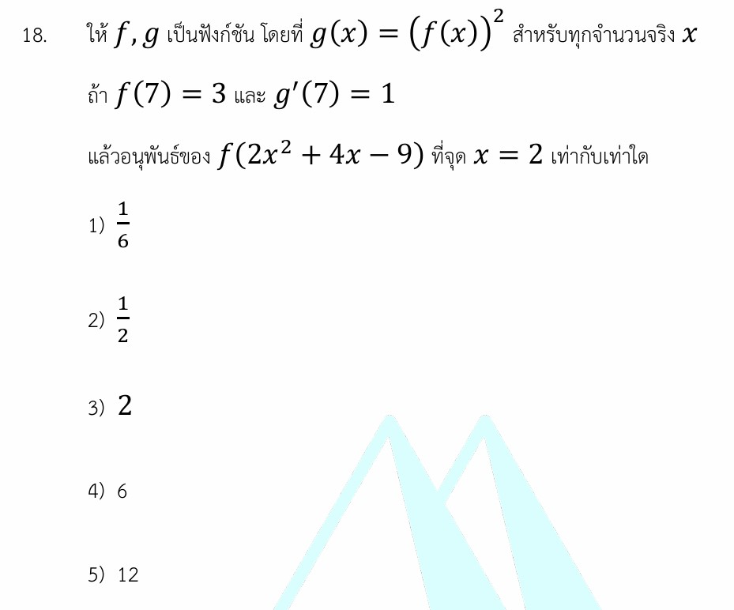

# อนุพันธ์ของฟังก์ชันคอมโพสิท (Chain Rule)

ยินดีครับ! โจทย์ข้อนี้เป็นโจทย์เรื่อง **แคลคูลัส (Calculus)** ในหัวข้อ **อนุพันธ์ของฟังก์ชัน (Derivative)** ซึ่งคีย์เวิร์ดสำคัญของข้อนี้คือการใช้ **"กฎลูกโซ่" (Chain Rule)** ในการหาอนุพันธ์ของฟังก์ชันพหุนามและฟังก์ชันคอมโพสิทครับ

คำตอบของโจทย์ข้อนี้คือ **ตัวเลือกที่ 3) 2** เรามาดูวิธีทำอย่างละเอียดและเนื้อหาที่เกี่ยวข้องกันเลยครับ

---

## 1. วิธีทำอย่างละเอียด

**โจทย์กำหนดให้:**

1. $g(x) = (f(x))^2$
2. $f(7) = 3$
3. $g'(7) = 1$
4. หาอนุพันธ์ของ $f(2x^2 + 4x - 9)$ ที่จุด $x = 2$

---

### **ขั้นตอนที่ 1: หาค่า $f'(7)$ จากความสัมพันธ์ที่โจทย์ให้มา**

จาก $g(x) = (f(x))^2$ เมื่อเราดิฟ (หาอนุพันธ์) ทั้งสองข้าง โดยใช้ **กฎลูกโซ่ (Chain Rule)** จะได้:

$$g'(x) = 2(f(x))^{2-1} \cdot \frac{d}{dx}[f(x)]$$

$$g'(x) = 2f(x) \cdot f'(x)$$

แทนค่า $x = 7$ ลงในสมการเพื่อใช้ข้อมูลที่โจทย์ให้มา:

$$g'(7) = 2f(7) \cdot f'(7)$$

แทนค่า $g'(7) = 1$ และ $f(7) = 3$:

$$1 = 2(3) \cdot f'(7)$$

$$1 = 6 \cdot f'(7)$$

$$f'(7) = \frac{1}{6}$$

---

### **ขั้นตอนที่ 2: หาอนุพันธ์ของฟังก์ชันที่โจทย์ถาม**

โจทย์ต้องการให้อะนุมันธ์ของ $f(2x^2 + 4x - 9)$ ที่ $x = 2$
สมมติให้ฟังก์ชันนี้คือ $h(x) = f(2x^2 + 4x - 9)$

หาอนุพันธ์ $h'(x)$ โดยใช้ **กฎลูกโซ่** (ดิฟนอก คูณ ดิฟใน):

$$h'(x) = f'(2x^2 + 4x - 9) \cdot \frac{d}{dx}(2x^2 + 4x - 9)$$

ทำการดิฟไส้ใน $\frac{d}{dx}(2x^2 + 4x - 9) = 4x + 4$ จะได้:

$$h'(x) = f'(2x^2 + 4x - 9) \cdot (4x + 4)$$

---

### **ขั้นตอนที่ 3: แทนค่า $x = 2$ เพื่อหาคำตอบ**

แทนค่า $x = 2$ ลงใน $h'(x)$:

$$h'(2) = f'(2(2)^2 + 4(2) - 9) \cdot (4(2) + 4)$$

คำนวณค่าในวงเล็บของ $f'$:

* $2(2)^2 + 4(2) - 9 = 2(4) + 8 - 9 = 8 + 8 - 9 = 7$

คำนวณค่าในวงเล็บหลัง:

* $4(2) + 4 = 8 + 4 = 12$

จะได้สมการคือ:

$$h'(2) = f'(7) \cdot 12$$

แทนค่า $f'(7) = \frac{1}{6}$ ที่เราหาไว้ในขั้นตอนที่ 1:

$$h'(2) = \frac{1}{6} \cdot 12 = 2$$

**สรุปตอบ** อนุพันธ์ของ $f(2x^2 + 4x - 9)$ ที่จุด $x = 2$ เท่ากับ **2** (ตัวเลือกที่ 3)

---

## 2. เนื้อหาและสูตรที่เกี่ยวข้อง

### **กฎลูกโซ่ (Chain Rule)**

เป็นกฎที่ใช้ในการหาอนุพันธ์ของ **ฟังก์ชันคอมโพสิท (Composite Function)** หรือฟังก์ชันที่ซ้อนกันอยู่ เช่น $y = f(g(x))$

> **สูตรคอมโพสิททั่วไป:** >
> $$\frac{d}{dx}[f(g(x))] = f'(g(x)) \cdot g'(x)$$
>
>
>
> *(หลักการจำง่ายๆ: "ดิฟฟังก์ชันตัวนอกก่อน โดยคงตัวไส้ในไว้เหมือนเดิม แล้วคูณด้วยดิฟไส้ใน")*

> **สูตรฟังก์ชันยกกำลัง (Power Rule ร่วมกับ Chain Rule):**
>
> $$\frac{d}{dx}[f(x)]^n = n[f(x)]^{n-1} \cdot f'(x)$$
>
>

### **ความหมายของตัวแปรและสัญลักษณ์**

* $f(x), g(x)$ คือ ฟังก์ชันของ $x$
* $f'(x)$ หรือ $g'(x)$ คือ อนุพันธ์ (อัตราการเปลี่ยนแปลง) ของฟังก์ชันนั้นๆ เทียบกับ變数 $x$
* $f(7) = 3$ หมายความว่า ที่จุด $x = 7$ ฟังก์ชัน $f$ จะมีค่าเครื่องหมายเป็น 3
* $g'(7) = 1$ หมายความว่า ที่จุด $x = 7$ ความชันของกราฟ $g$ มีค่าเท่ากับ 1

---

## 3. กลยุทธ์การแก้โจทย์ประเภทนี้

1. **มองภาพรวมและเป้าหมาย:** ดูว่าสิ่งที่โจทย์ถามหาต้องการค่าอะไร (ในที่นี้คือต้องการค่าของฟังก์ชันอนุพันธ์ ณ จุด $x=2$)
2. **ดิฟฟังก์ชันเป้าหมายติดตัวแปรไว้ก่อน:** ใช้กฎลูกโซ่แตกฟังก์ชันคอมโพสิทออกมาให้อยู่ในรูปที่มี $f'(...) \cdot (...)$
3. **หาความเชื่อมโยงของตัวเลข:** ลองแทนค่า $x$ ที่โจทย์ต้องการลงไป แล้วดูว่าก้อน "ไส้ใน" เปลี่ยนเป็นเลขอะไร (โจทย์มักจะออกแบบมาให้ตัวเลขสอดคล้องกับสิ่งที่บอกมาในตอนแรก เช่น ในข้อนี้ไส้ในกลายเป็นเลข 7 พอดี)
4. **แกะรอยย้อนกลับ:** ย้อนไปหาข้อมูลที่ขาด (ในข้อนี้คือ $f'(7)$) จากสมการเงื่อนไขอื่นๆ ที่โจทย์ให้มา

---

## 4. โจทย์ตัวอย่างเพิ่มเติมสำหรับฝึกฝน

### **โจทย์:**

ให้ $f, g$ เป็นฟังก์ชัน โดยที่ $g(x) = (f(x))^3$ สำหรับทุกจำนวนจริง $x$
ถ้า $f(5) = 2$ และ $g'(5) = 36$
แล้วอนุพันธ์ของ $f(x^2 - 4x + 8)$ ที่จุด $x = 3$ เท่ากับเท่าใด

### **เฉลยอย่างย่อ:**

1. **หา $f'(5)$ จากเงื่อนไขแรก:**
จาก $g(x) = (f(x))^3$
ดิฟได้ $g'(x) = 3(f(x))^2 \cdot f'(x)$
แทนค่า $x = 5 \implies g'(5) = 3(f(5))^2 \cdot f'(5)$
แทนค่าตัวเลข $\implies 36 = 3(2)^2 \cdot f'(5) \implies 36 = 12 \cdot f'(5) \implies f'(5) = 3$
2. **หาอนุพันธ์ของสิ่งที่โจทย์ถาม:**
ดิฟ $f(x^2 - 4x + 8)$ ได้เป็น $f'(x^2 - 4x + 8) \cdot (2x - 4)$
แทนค่า $x = 3$:

* ไส้ใน: $3^2 - 4(3) + 8 = 9 - 12 + 8 = 5$
* ตัวคูณข้างหลัง: $2(3) - 4 = 2$
จะได้ $f'(5) \cdot 2$

1. **คิดคำตอบ:**
แทนค่า $f'(5) = 3$ ลงไป จะได้คำตอบคือ $3 \cdot 2 = \mathbf{6}$
