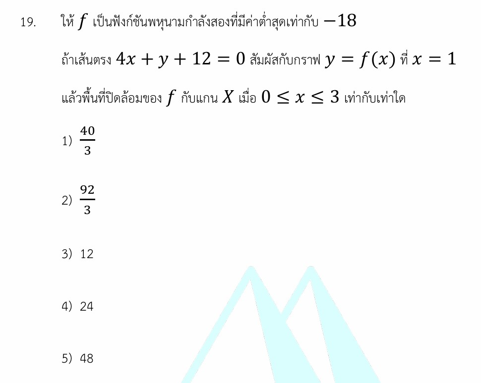

โจทย์ข้อนี้เป็นโจทย์ที่ผสมผสานระหว่าง **เรขาคณิตวิเคราะห์ (พาราโบลา)** และ **แคลคูลัส (อนุพันธ์และการอินทิเกรตหาพื้นที่)** ครับ ถือเป็นแนวข้อสอบที่ยอดเยี่ยมในการทดสอบความเข้าใจเชิงเชื่อมโยง

คำตอบของโจทย์ข้อนี้คือ **ตัวเลือกที่ 5) 48** เรามาดูวิธีคิดและเนื้อหาอย่างละเอียดกันครับ

---

## 1. วิธีทำอย่างละเอียด

**โจทย์กำหนดให้:**

1. $f(x)$ เป็นฟังก์ชันพหุนามกำลังสอง มีค่าต่ำสุดเท่ากับ $-18$
2. เส้นตรง $4x + y + 12 = 0$ สัมผัสกราฟ $y = f(x)$ ที่จุด $x = 1$
3. หาพื้นที่ปิดล้อมด้วยกราฟ $f$ กับแกน $X$ ในช่วง $0 \le x \le 3$

---

### **ขั้นตอนที่ 1: วิเคราะห์รูปแบบฟังก์ชันจากค่าต่ำสุด**

ฟังก์ชันพหุนามกำลังสองคือกราฟพาราโบลา การที่โจทย์บอกว่ามี **"ค่าต่ำสุด"** แปลว่าเป็นพาราโบลาหงาย และค่าต่ำสุดนั้นจะเกิดขึ้นที่จุดยอด (Vertex) เสมอ

เราสามารถเขียนฟังก์ชันพาราโบลาในรูปจุดยอดได้ว่า:

$$f(x) = a(x - h)^2 + k$$

โดยที่ $(h, k)$ คือพิกัดของจุดยอด และ $k$ คือค่าต่ำสุด ซึ่งโจทย์บอกมาแล้วว่าคือ $-18$ จึงได้:

$$f(x) = a(x - h)^2 - 18 \quad (\text{โดยที่ } a > 0)$$

### **ขั้นตอนที่ 2: ถอดรหัสจากเงื่อนไขเส้นสัมผัสกราฟ**

โจทย์บอกว่า เส้นตรง $4x + y + 12 = 0$ สัมผัสกับกราฟที่ $x = 1$
จัดรูปสมการเส้นตรงให้อยู่ในรูป $y = mx + c$ เพื่อดูความชัน:

$$y = -4x - 12$$

จากนิยามของอนุพันธ์ ความชันของเส้นสัมผัสกราฟ ณ จุดใดๆ จะเท่ากับค่าดิฟของฟังก์ชัน ณ จุดนั้น และจุดสัมผัสต้องเป็นจุดที่อยู่ร่วมกันทั้งบนเส้นตรงและบนโค้ง ทำให้เราได้ข้อมูล 2 อย่างคือ:

1. **ความชันที่จุดสัมผัส ($x=1$):** $f'(1) = -4$
2. **พิกัด $y$ ที่จุดสัมผัส ($x=1$):** แทน $x = 1$ ในสมการเส้นตรง จะได้ $f(1) = -4(1) - 12 = -16$

### **ขั้นตอนที่ 3: แก้สมการหาฟังก์ชัน $f(x)$ ที่สมบูรณ์**

จาก $f(x) = a(x - h)^2 - 18$ เมื่อหาอนุพันธ์ (ดิฟ) โดยใช้กฎลูกโซ่จะได้:

$$f'(x) = 2a(x - h)$$

* แทนค่าเงื่อนไขความชัน $f'(1) = -4$:

$$2a(1 - h) = -4 \implies a(1 - h) = -2 \quad \text{--- (สมการที่ 1)}$$

* แทนค่าเงื่อนไขพิกัดจุด $f(1) = -16$:

$$a(1 - h)^2 - 18 = -16 \implies a(1 - h)^2 = 2 \quad \text{--- (สมการที่ 2)}$$

นำสมการที่ 2 หารด้วยสมการที่ 1 เพื่อตัดตัวแปร $a$:

$$\frac{a(1 - h)^2}{a(1 - h)} = \frac{2}{-2}$$

$$1 - h = -1 \implies h = 2$$

นำค่า $1 - h = -1$ ย้อนกลับไปแทนในสมการที่ 1:

$$a(-1) = -2 \implies a = 2$$

กระจายสมการเพื่อหาฟังก์ชัน $f(x)$ ในรูปทั่วไป:

$$f(x) = 2(x - 2)^2 - 18$$

$$f(x) = 2(x^2 - 4x + 4) - 18 = 2x^2 - 8x + 8 - 18$$

$$f(x) = 2x^2 - 8x - 10$$

### **ขั้นตอนที่ 4: คำนวณหาพื้นที่ปิดล้อมด้วยการอินทิเกรต**

โจทย์ต้องการพื้นที่ในช่วง $0 \le x \le 3$ ก่อนอื่นเราหาจุดตัดแกน $X$ ของกราฟนี้ก่อนโดยให้ $f(x) = 0$:

$$2x^2 - 8x - 10 = 0 \implies x^2 - 4x - 5 = 0$$

$$(x - 5)(x + 1) = 0 \implies x = -1, 5$$

จุดที่กราฟตัดแกน $X$ คือ $x = -1$ และ $x = 5$ ซึ่งไม่อยู่ในช่วง $[0, 3]$ หมายความว่าในช่วงนี้ กราฟไม่ตัดผ่านแกน $X$ เลย และเมื่อลองแทนค่าช่วงนี้ เช่น $f(0) = -10$ แสดงว่า**กราฟอยู่ใต้แกน $X$ ตลอดทั้งช่วง**

สูตรการหาพื้นที่ปิดล้อมใต้แกน $X$ จึงต้องใส่เครื่องหมายลบเติมเข้าไปเพื่อให้ได้ค่าพื้นที่ที่เป็นบวก:

$$\text{พื้นที่} = \int_{0}^{3} -f(x) \, dx$$

$$\text{พื้นที่} = \int_{0}^{3} -(2x^2 - 8x - 10) \, dx = \int_{0}^{3} (-2x^2 + 8x + 10) \, dx$$

ทำการอินทิเกรตจำกัดเขต:

$$\int_{0}^{3} (-2x^2 + 8x + 10) \, dx = \left[ -\frac{2}{3}x^3 + 4x^2 + 10x \right]_{0}^{3}$$

$$= \left( -\frac{2}{3}(3)^3 + 4(3)^2 + 10(3) \right) - (0)$$

$$= (-18 + 36 + 30) = 48$$

**สรุปตอบ** พื้นที่ปิดล้อมทั้งหมดเท่ากับ **48** ตารางหน่วย

---

## 2. เนื้อหาและสูตรที่เกี่ยวข้อง

### **1. รูปแบบสมการพาราโบลา (จุดยอด)**

$$f(x) = a(x-h)^2 + k$$

* **$a$ (สัมประสิทธิ์):** ควบคุมความคว่ำ/หงาย และความกว้างขรึมของกราฟ ($a>0$ พาราโบลาหงาย มีค่าต่ำสุด, $a<0$ พาราโบลาคว่ำ มีค่าสูงสุด)
* **$(h, k)$:** พิกัดของจุดยอด โดยที่ $k$ คือตัวระบุค่าสูงสุดหรือต่ำสุดของฟังก์ชันนั้นๆ

### **2. เส้นสัมผัสส่วนโค้ง (Tangent Line)**

ในทางแคลคูลัส ถ้าเส้นตรงสัมผัสกับฟังก์ชัน $f(x)$ ที่จุด $x_0$ จะได้ความสัมพันธ์ว่า:

$$\text{ความชันของเส้นตรง } (m) = f'(x_0)$$

### **3. การหาพื้นที่ปิดล้อม (Area Under the Curve)**

การหาพื้นที่ระหว่างเส้นโค้งกับแกน $X$ จาก $x = a$ ถึง $x = b$ หาได้จากการอินทิเกรต:

$$\text{Area} = \int_{a}^{b} |f(x)| \, dx$$

* หากกราฟอยู่ **เหนือแกน X** ($f(x) \ge 0$) $\implies \text{Area} = \int_{a}^{b} f(x) \, dx$
* หากกราฟอยู่ **ใต้แกน X** ($f(x) \le 0$) $\implies \text{Area} = \int_{a}^{b} -f(x) \, dx$

---

## 3. กลยุทธ์การแก้โจทย์ประเภทนี้

1. **ถอดรหัสพหุนามกำลังสองให้ไว:** เมื่อเจอคำว่าฟังก์ชันกำลังสองบวกกับคำว่า "ค่าสูงสุด/ต่ำสุด" ให้ตั้งต้นด้วยสมการรูปแบบจุดยอด $a(x-h)^2 + k$ ทันที จะช่วยลดจำนวนตัวแปรได้เร็วกว่ารูปทั่วไป $ax^2+bx+c$
2. **ใช้เงื่อนไขเส้นสัมผัสให้คุ้ม:** เส้นสัมผัสให้ข้อมูลเราขนานกัน 2 ทางเสมอ คือ 1) ความชัน และ 2) พิกัดจุดผ่าน ห้ามลืมนำพิกัด $x$ ไปแทนในเส้นตรงเพื่อหาพิกัด $y$
3. **ตรวจสอบพฤติกรรมกราฟก่อนอินทิเกรตหาพื้นที่เสมอ:** อย่าเพิ่งรีบอินทิเกรตตรงๆ ต้องหาจุดตัดแกน $X$ ก่อน เพื่อเช็คว่ากราฟมีการข้ามฝั่งเหนือแกน/ใต้แกนในช่วงนั้นหรือไม่ เพราะหากมีจุดตัดข้ามฝั่ง เราจำเป็นต้องแยกช่วงอินทิเกรต มิฉะนั้นค่าพื้นที่ที่ได้จะหักล้างกันจนผิดพลาด

---

## 4. ตัวอย่างโจทย์เพิ่มเติมสำหรับฝึกฝน

**โจทย์:**
ให้ $f$ เป็นฟังก์ชันพหุนามกำลังสองที่มีค่าสูงสุดเท่ากับ $4$
ถ้าเส้นตรง $2x + y - 7 = 0$ สัมผัสกับกราฟ $y = f(x)$ ที่ $x = 2$
แล้วพื้นที่ปิดล้อมของ $f$ กับแกน $X$ เมื่อ $0 \le x \le 3$ เท่ากับเท่าใด

**เฉลยอย่างย่อ:**

1. จากเงื่อนไขค่าสูงสุด จะได้สมการในฟอร์มจุดยอดคือ $f(x) = a(x-h)^2 + 4$ (โดยที่ $a < 0$)
2. จัดรูปเส้นตรงได้ $y = -2x + 7$ หาข้อมูลที่จุดสัมผัส $x = 2$:

* ความชัน $f'(2) = -2$
* พิกัดจุด $f(2) = -2(2) + 7 = 3$

1. หาอนุพันธ์ฟังก์ชัน $f'(x) = 2a(x-h)$ และตั้งระบบสมการ:

* $2a(2-h) = -2 \implies a(2-h) = -1$
* $a(2-h)^2 + 4 = 3 \implies a(2-h)^2 = -1$
* นำสมการมาหารกันได้ $2-h = 1 \implies h = 1$ นำไปแทนกลับได้ $a = -1$

1. จะได้ฟังก์ชันที่สมบูรณ์คือ $f(x) = -(x-1)^2 + 4 = -x^2 + 2x + 3$
2. หาจุดตัดแกน $X$ โดยให้ $-x^2 + 2x + 3 = 0 \implies x = -1, 3$ ซึ่งในช่วง $[0, 3]$ กราฟอยู่เหนือแกน $X$ ตลอดช่วงพอดี
3. อินทิเกรตหาพื้นที่:

$$\text{พื้นที่} = \int_{0}^{3} (-x^2 + 2x + 3) \, dx = \left[ -\frac{x^3}{3} + x^2 + 3x \right]_{0}^{3} = (-9 + 9 + 9) - 0 = \mathbf{9}$$
