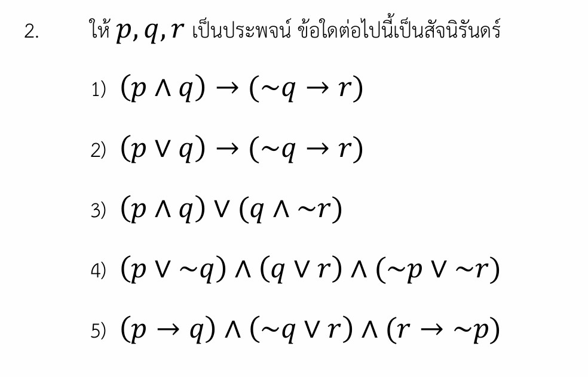

# การแก้โจทย์ตรรกศาสตร์ A-Level ปี 2567

การแก้โจทย์ปัญหาเรื่องตรรกศาสตร์ (Logic) ในข้อสอบ A-Level คณิตศาสตร์ 1 ปี 2567 นี้ หัวใจสำคัญคือการตรวจสอบความเป็น **"สัจนิรันดร์" (Tautology)** ครับ

## เฉลยละเอียดโจทย์ข้อ 2

**โจทย์:** ให้ $p, q, r$ เป็นประพจน์ ข้อใดต่อไปนี้เป็นสัจนิรันดร์

1) $(p \wedge q) \rightarrow (\sim q \rightarrow r)$
2) $(p \vee q) \rightarrow (\sim q \rightarrow r)$
3) $(p \wedge q) \vee (q \wedge \sim r)$
4) $(p \vee \sim q) \wedge (q \vee r) \wedge (\sim p \vee \sim r)$
5) $(p \rightarrow q) \wedge (\sim q \vee r) \wedge (r \rightarrow \sim p)$

---

**วิธีทำ:**

กลยุทธ์ที่รวดเร็วที่สุดสำหรับโจทย์แนวนี้คือ **"การสมมติให้เป็นเท็จ" (จับเท็จ)** โดยเฉพาะประพจน์ที่อยู่ในรูปของ "ถ้า...แล้ว..." ($\rightarrow$)

**พิจารณาตัวเลือกที่ 1: $(p \wedge q) \rightarrow (\sim q \rightarrow r)$**
เราทราบว่า $\sim q \rightarrow r$ สมมูลกับ $q \vee r$ (จากสูตร $A \rightarrow B \equiv \sim A \vee B$)
ดังนั้นประพจน์คือ $(p \wedge q) \rightarrow (q \vee r)$

* **ขั้นที่ 1:** สมมติให้ประพจน์นี้เป็น **เท็จ (F)**
* **ขั้นที่ 2:** การที่ประพจน์รูป $A \rightarrow B$ จะเป็นเท็จได้ ต้องเกิดจาก **หน้าจริง ($T$) และ หลังเท็จ ($F$)**
  * ด้านหน้า: $p \wedge q \equiv T$ หมายความว่า **$p$ ต้องเป็น $T$ และ $q$ ต้องเป็น $T$**
  * ด้านหลัง: $q \vee r \equiv F$ หมายความว่า **$q$ ต้องเป็น $F$ และ $r$ ต้องเป็น $F$**
* **ขั้นที่ 3:** เกิดความขัดแย้งกันที่ค่า $q$ (ด้านหน้าบังคับให้ $q$ เป็น $T$ แต่ด้านหลังบังคับให้ $q$ เป็น $F$)
* **สรุป:** เมื่อสมมติให้เป็นเท็จแล้วเกิดความขัดแย้ง แสดงว่าประพจน์นี้ **ไม่มีโอกาสเป็นเท็จเลย** จึงเป็น **สัจนิรันดร์**

**พิจารณาตัวเลือกที่ 2 (เพื่อความเข้าใจ): $(p \vee q) \rightarrow (\sim q \rightarrow r)$**
สมมูลกับ $(p \vee q) \rightarrow (q \vee r)$

* สมมติให้เป็นเท็จ ($F$):
  * ด้านหน้า: $p \vee q \equiv T$
  * ด้านหลัง: $q \vee r \equiv F \Rightarrow q = F, r = F$
* แทนค่า $q = F$ ในด้านหน้า: $p \vee F \equiv T \Rightarrow p = T$
* กรณี $p=T, q=F, r=F$ สามารถทำให้ประพจน์นี้เป็นเท็จได้ จึง **ไม่เป็นสัจนิรันดร์**

## ตอบ: ตัวเลือกที่ 1

---

### เนื้อหาที่ใช้ในการแก้โจทย์

1. **การเชื่อมประพจน์:** ต้องแม่นยำค่าความจริงของ $\wedge, \vee, \rightarrow, \leftrightarrow$ และ $\sim$
2. **สัจนิรันดร์ (Tautology):** คือประพจน์ที่มีค่าความจริงเป็น "จริง" ในทุกๆ กรณีของตัวแปรย่อย
3. **การสมมูล (Equivalence):** รูปแบบที่สำคัญมากคือ $p \rightarrow q \equiv \sim p \vee q$ และกฎของเดอมอร์แกน (De Morgan's Laws)
4. **วิธีตรวจสอบสัจนิรันดร์:**
    * **การสร้างตารางค่าความจริง:** วิธีมาตรฐานแต่ใช้เวลานานถ้ามีหลายตัวแปร
    * **การสมมติเป็นเท็จ (Method of Contradiction):** นิยมใช้กับเครื่องหมาย $\rightarrow$ และ $\vee$
    * **การใช้ประพจน์ที่สมมูลกัน:** ยุบรูปประพจน์ให้อยู่ในรูปที่ดูง่ายขึ้น

---

### **กลยุทธ์แก้โจทย์ประเภทนี้**

* **เน้น "จับเท็จ":** หากโจทย์เป็นเครื่องหมาย "ถ้า...แล้ว..." ให้เล็งไปที่กรณีเดียวที่จะพังคือ $T \rightarrow F$
* **เปลี่ยนรูปประพจน์:** พยายามเปลี่ยนเครื่องหมาย $\rightarrow$ ให้เป็น $\vee$ เพื่อให้เห็นความสัมพันธ์ของตัวแปรได้ง่ายขึ้น เช่นตัวเลือกที่ 1 เมื่อเปลี่ยนรูปแล้วจะเห็นทันทีว่ามี $q$ อยู่ทั้งสองข้าง
* **ตัดตัวเลือก:** ประพจน์ที่เป็นการเชื่อมด้วย $\wedge$ อย่างเดียว (เช่นข้อ 4 และ 5) มักจะไม่ใช่สัจนิรันดร์ เพราะถ้ามีส่วนใดส่วนหนึ่งเป็นเท็จ ค่าความจริงทั้งหมดจะเป็นเท็จทันที

---

### **ตัวอย่างโจทย์เพิ่มเติมเพื่อฝึกทำ**

**โจทย์ฝึกหัด:** ประพจน์ใดต่อไปนี้เป็นสัจนิรันดร์
ก. $[(p \rightarrow q) \wedge \sim q] \rightarrow \sim p$
ข. $(p \vee q) \leftrightarrow (p \wedge q)$

**เฉลย:**

* **ข้อ ก:** ลองสมมติให้เป็นเท็จ ($F$)
  * หน้าจริง: $(p \rightarrow q) \wedge \sim q = T \Rightarrow (p \rightarrow q) = T$ และ $\sim q = T$ (แปลว่า $q = F$)
  * หลังเท็จ: $\sim p = F$ (แปลว่า $p = T$)
  * แทนค่า $p=T, q=F$ ใน $p \rightarrow q$ จะได้ $T \rightarrow F$ ซึ่งเป็น $F$ ขัดแย้งกับที่หน้าต้องเป็น $T$
  * ดังนั้น **ข้อ ก เป็นสัจนิรันดร์** (รูปแบบนี้เรียกว่า Modus Tollens)
* **ข้อ ข:** หาก $p=T, q=F$ จะได้ $T \leftrightarrow F$ ซึ่งเป็น $F$ จึง **ไม่เป็นสัจนิรันดร์**

พยายามฝึกฝนการ "จับเท็จ" บ่อยๆ จะช่วยให้ทำข้อสอบแนวตรรกศาสตร์ได้เร็วขึ้นมากครับ

นี่คือเฉลยวิธีทำอย่างละเอียดของโจทย์ข้อนี้ พร้อมสรุปเนื้อหา กลยุทธ์ในการทำข้อสอบตรรกศาสตร์ และโจทย์ฝึกฝนเพิ่มเติมครับ

---

## 1. เฉลยวิธีทำอย่างละเอียด

**โจทย์ถาม:** ข้อใดต่อไปนี้เป็น **สัจนิรันดร์** (ประพจน์ที่เป็นจริงในทุกๆ กรณี)

เราสามารถตรวจสอบได้หลายวิธี แต่มี **2 วิธีที่นิยมและรวดเร็วที่สุด** คือ **วิธีสมมติให้เป็นเท็จเพื่อหาข้อขัดแย้ง** และ **วิธีจัดรูปด้วยสมมูล** ครับ

### วิธีที่ 1: การสมมติให้เป็นเท็จเพื่อหาข้อขัดแย้ง (Proof by Contradiction)

วิธีนี้เหมาะมากกับประพจน์ที่เชื่อมด้วยตัวเชื่อม **"ถ้า...แล้ว..." ($\rightarrow$)** เป็นหลัก เพราะตัวเชื่อมนี้จะเป็นเท็จ ($F$) ได้เพียงกรณีเดียวเท่านั้น คือ **หน้าจริง ($T$) หลังเท็จ ($F$)**

ลองตรวจสอบ **ตัวเลือกที่ 1):** $(p \wedge q) \rightarrow (\sim q \rightarrow r)$

1. สมมติให้ประพจน์รวมทั้งหมดมีค่าความจริงเป็น **เท็จ ($F$)**

$$(p \wedge q) \rightarrow (\sim q \rightarrow r) \equiv F$$

1. จากสมบัติของ $\rightarrow$ จะได้ว่า:

* ก้อนหน้าต้องเป็นจริง: $p \wedge q \equiv T$
* ก้อนหลังต้องเป็นเท็จ: $\sim q \rightarrow r \equiv F$

1. แยกหาค่าความจริงของประพจน์ย่อย:

* จาก $p \wedge q \equiv T$ แสดงว่า **$p \equiv T$** และ **$q \equiv T$**
* จาก $\sim q \rightarrow r \equiv F$ แสดงว่า ก้อนหน้าของประพจน์นี้ต้องจริงนั่นคือ $\sim q \equiv T$ (ส่งผลให้ **$q \equiv F$**) และตัวหลังต้องเท็จนั่นคือ **$r \equiv F$**

1. **พบข้อขัดแย้ง:** * จากฝั่งซ้ายเราได้ $q \equiv T$

* แต่จากฝั่งขวาเราได้ $q \equiv F$

> **สรุปจากวิธีที่ 1:** เกิดข้อขัดแย้งขึ้น แปลว่าสิ่งที่เราสมมติไว้ตอนแรกว่าประพจน์นี้สามารถเป็น "เท็จ" ได้นั้น **เป็นไปไม่ได้** ดังนั้นประพจน์นี้จึงต้องเป็นจริงเสมอในทุกกรณี หรือเป็น **สัจนิรันดร์** นั่นเอง

---

### วิธีที่ 2: การจัดรูปประพจน์ด้วยกฎสมมูล (Logical Equivalence)

วิธีนี้ทำได้โดยใช้สูตรที่เราคุ้นเคยคือ $A \rightarrow B \equiv \sim A \vee B$

ลองจัดรูป **ตัวเลือกที่ 1):**

### ขั้นตอนการแปลงประพจน์

1. เปลี่ยนโครงสร้างในวงเล็บหลังก่อน:

$$\sim q \rightarrow r \equiv \sim(\sim q) \vee r \equiv q \vee r$$

1. นำกลับไปแทนในโจทย์ จะได้:

$$(p \wedge q) \rightarrow (q \vee r)$$

1. เปลี่ยนตัวเชื่อมถ้า...แล้ว ตัวหลักให้เป็น หรือ ($\vee$):

$$\equiv \sim(p \wedge q) \vee (q \vee r)$$

1. ใช้กฎเดอมอร์แกนกระจายนิเสธเข้าไปในวงเล็บแรก:

$$\equiv (\sim p \vee \sim q) \vee (q \vee r)$$

1. เนื่องจากทุกตัวเชื่อมด้วย หรือ ($\vee$) ทั้งหมด เราสามารถถอดวงเล็บและสลับที่การจัดหมู่ได้:

$$\equiv \sim p \vee (\sim q \vee q) \vee r$$

1. สังเกตในวงเล็บ $(\sim q \vee q)$ ประพจน์ใดๆ หรือกับ นิเสธของตัวมันเอง จะได้ผลลัพธ์เป็น **จริง ($T$) เสมอ**:

$$\equiv \sim p \vee T \vee r$$

1. ประพจน์ใดๆ ก็ตามที่ หรือ ($\vee$) กับ $T$ จะได้ผลลัพธ์เป็น **จริง ($T$) เสมอ**

### ดังนั้น ตัวเลือกที่ 1) จึงเป็นสัจนิรันดร์อย่างแน่นอน

## หมายเหตุ: ตัวเลือก 2, 3, 4, 5

สำหรับตัวเลือก 2, 3, 4, 5 หากเราลองสุ่มแทนค่าความจริงหรือใช้วิธีสมมติเป็นเท็จ จะสามารถหาตัวอย่างที่ทำให้ประพจน์พังจนเป็นเท็จได้ง่ายดาย จึงไม่เป็นสัจนิรันดร์

**ตอบ ตัวเลือกที่ 1)**

---

## 2. เนื้อหาเพิ่มเติมเพื่อศึกษา

### รูปแบบประพจน์ที่สมมูลกันที่พบบ่อยในการทำข้อสอบ

* **กฎการเปลี่ยนถ้า...แล้ว:** $p \rightarrow q \equiv \sim p \vee q$ และ $\sim p \rightarrow q \equiv p \vee q$
* **กฎแย้งสลับที่:** $p \rightarrow q \equiv \sim q \rightarrow \sim p$
* **กฎเดอมอร์แกน (De Morgan's Laws):** * $\sim(p \wedge q) \equiv \sim p \vee \sim q$
* $\sim(p \vee q) \equiv \sim p \wedge \sim q$

* **กฎการลดรูปเอกลักษณ์:** $p \vee T \equiv T$ และ $p \wedge F \equiv F$

---

## 3. กลยุทธ์แก้โจทย์ประเภทนี้

เมื่อไปเจอข้อสอบแนว "ข้อใดเป็นสัจนิรันดร์" ในห้องสอบ ให้ไล่สแกนทีละช้อยส์ด้วยกลยุทธ์นี้:

1. **เล็งตัวเชื่อมหลักก่อน:** หากช้อยส์ไหนเชื่อมด้วย $\rightarrow$ หรือ $\vee$ ให้ใช้ **วิธีจับเท็จ (Contradiction)** ก่อนเป็นอันดับแรก เพราะมีโอกาสเช็กแล้วเจอข้อขัดแย้งได้เร็วมาก
2. **ช้อยส์ที่เชื่อมด้วย $\wedge$ มักจะไม่ใช่สัจนิรันดร์:** เพราะการที่ประพจน์เชื่อมด้วย "และ" จะเป็นสัจนิรันดร์ได้ ทุกๆ ก้อนย่อยที่ขนาบข้างต้องเป็นจริงทั้งหมดตลอดเวลา ซึ่งเกิดขึ้นได้ยากมากในโจทย์ช้อยส์ (เช่น ตัวเลือก 4 และ 5 ในโจทย์ตัดทิ้งได้เร็วมาก)
3. **ใช้การจัดรูปเมื่อมองเห็นโครงสร้างซ้ำ:** ถ้าในข้อนั้นมีตัวแปรหน้าตาคล้ายๆ กันกระจายอยู่ เช่น $q$ กับ $\sim q$ การใช้กฎสมมูลจัดรูปมักจะทำให้ตัดทอนเหลือค่า $T$ ได้ภายในไม่กี่บรรทัด

---

## 4. ตัวอย่างโจทย์เพิ่มเติมเพื่อฝึกทำพร้อมเฉลย

**โจทย์ข้อที่ 1:** ประพจน์ $[(p \rightarrow q) \wedge p] \rightarrow q$ เป็นสัจนิรันดร์หรือไม่?

**วิธีทำ (ใช้วิธีจับเท็จ):**

1. สมมติให้ $[(p \rightarrow q) \wedge p] \rightarrow q \equiv F$
2. จะได้ก้อนหน้า $[(p \rightarrow q) \wedge p] \equiv T$ และก้อนหลัง $q \equiv F$
3. พิจารณาก้อนหน้าจากตัวเชื่อม $\wedge$ จะได้ว่า:

* $p \rightarrow q \equiv T$
* $p \equiv T$

1. นำค่า $p \equiv T$ และ $q \equiv F$ ไปแทนใน $p \rightarrow q$ จะได้ $T \rightarrow F \equiv F$ ซึ่งขัดแย้งกับที่สรุปไว้ก่อนหน้าว่าต้องได้ $T$
2. เกิดข้อขัดแย้ง แสดงว่าเป็นสัจนิรันดร์

**ตอบ:** เป็นสัจนิรันดร์ (รูปแบบนี้เรียกว่า Modus Ponens เป็นสัจนิรันดร์พื้นฐานที่ควรรู้)

**โจทย์ข้อที่ 2:**
ประพจน์ใดต่อไปนี้เป็นสัจนิรันดร์

1. $(p \wedge \sim p) \rightarrow q$
2. $(p \vee q) \rightarrow p$

**วิธีทำ:**

* **พิจารณาตัวเลือก 1):** $(p \wedge \sim p) \rightarrow q$
เนื่องจาก $p \wedge \sim p$ จะได้ค่าความจริงเป็น **เท็จ ($F$) เสมอ** เสมอ (เพราะประพจน์ตรงข้ามกันไม่มีทางเป็นจริงพร้อมกันได้)
เมื่อนำไปเข้าตัวเชื่อมถ้า...แล้ว จะได้รูปฟอร์มเป็น $F \rightarrow q$ ซึ่งในตรรกศาสตร์ถ้าเหตุเป็นเท็จ ผลลัพธ์ของประพจน์ $\rightarrow$ จะได้ **จริง ($T$) เสมอ** โดยไม่ต้องสนใจว่า $q$ จะเป็นอะไรเลย
ดังนั้น ตัวเลือก 1) เป็นสัจนิรันดร์
* **พิจารณาตัวเลือก 2):** $(p \vee q) \rightarrow p$
ลองสุ่มให้ $p \equiv F$ และ $q \equiv T$ จะได้ว่า $(F \vee T) \rightarrow F \equiv T \rightarrow F \equiv F$ สามารถทำให้เป็นเท็จได้ จึงไม่เป็นสัจนิรันดร์

**ตอบ:** ตัวเลือก 1)
