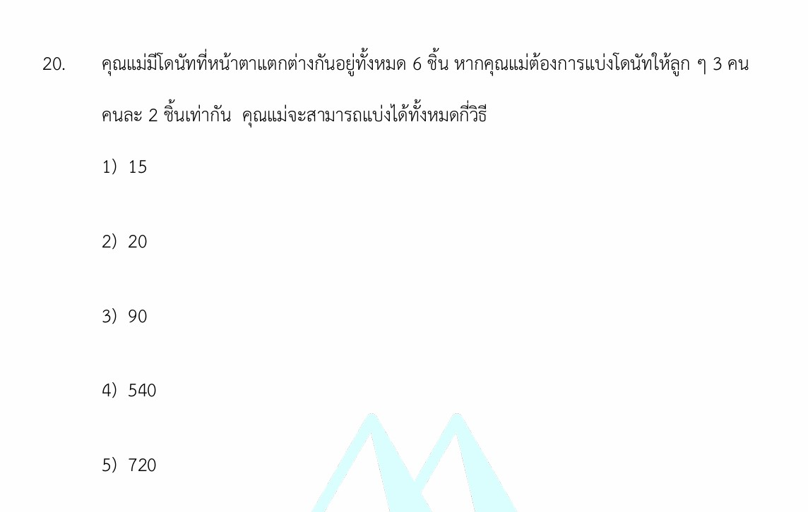

# โดนัท 6 ชิ้นแบ่งให้ลูก 3 คน

ยินดีครับ! โจทย์ข้อนี้เป็นโจทย์คลาสสิกในเรื่อง **"ความน่าจะเป็นและหลักการนับเบื้องต้น"** ซึ่งทดสอบความเข้าใจเกี่ยวกับการจัดหมู่และการแบ่งกลุ่มสิ่งของที่แตกต่างกันครับ

คำตอบที่ถูกต้องของโจทย์ข้อนี้คือ **ข้อ 3) 90** ---

## 1. เฉลยวิธีทำอย่างละเอียด

จากโจทย์ คุณแม่มีโดนัทที่ **หน้าตาแตกต่างกันทั้งหมด 6 ชิ้น** ต้องการแบ่งให้ลูก **3 คน คนละ 2 ชิ้นเท่ากัน** เราสามารถมองการทำงานนี้เป็น 3 ขั้นตอนต่อเนื่องกัน โดยแจกโดนัทให้ลูกทีละคน ดังนี้ครับ

* **ขั้นตอนที่ 1: เลือกโดนัทให้ลูกคนที่ 1**
มีโดนัทอยู่ 6 ชิ้น เลือกออกมา 2 ชิ้น
จำนวนวิธี = $\binom{6}{2} = \frac{6 \times 5}{2 \times 1} =$ **15 วิธี**
* **ขั้นตอนที่ 2: เลือกโดนัทให้ลูกคนที่ 2**
เหลือโดนัทให้เลือกอีก $6 - 2 = 4$ ชิ้น เลือกออกมา 2 ชิ้น
จำนวนวิธี = $\binom{4}{2} = \frac{4 \times 3}{2 \times 1} =$ **6 วิธี**
* **ขั้นตอนที่ 3: เลือกโดนัทให้ลูกคนที่ 3**
เหลือโดนัทอยู่ 2 ชิ้นสุดท้าย เลือกออกมา 2 ชิ้น (ให้หมดเลย)
จำนวนวิธี = $\binom{2}{2} =$ **1 วิธี**

> **ใช้กฎการคูณ (Multiplication Principle):** เมื่อการทำงานมีหลายขั้นตอนต่อเนื่องกัน ให้นำจำนวนวิธีในแต่ละขั้นตอนมาคูณกัน
> จำนวนวิธีทั้งหมด $= 15 \times 6 \times 1 =$ **90 วิธี**

---

## 2. เนื้อหาและสูตรที่เกี่ยวข้องเพื่อศึกษาเพิ่มเติม

### สูตรการจัดหมู่ (Combination)

การจัดหมู่คือการเลือกสิ่งของออกมาเป็นกลุ่ม โดย**ไม่สนใจลำดับ**ก่อนหลังในการเลือก (เช่น การเลือกโดนัท 2 ชิ้น ไม่ว่าจะหยิบชิ้นไหนขึ้นมาก่อน ก็ถือว่าเป็นโดนัทชุดเดียวกัน)

$$\binom{n}{r} = \frac{n!}{(n-r)!r!}$$

**ความหมายของตัวแปร:**

* $n$ คือ จำนวนสิ่งของทั้งหมดที่มีอยู่และแตกต่างกัน
* $r$ คือ จำนวนสิ่งของที่เราต้องการเลือกออกมาในรอบนั้นๆ
* $!$ (Factorial: แฟกทอเรียล) คือ ผลคูณของจำนวนเต็มบวกตั้งแต่ 1 ถึงค่านั้น เช่น $4! = 4 \times 3 \times 2 \times 1 = 24$

### สูตรลัด: การแบ่งกลุ่มสิ่งของที่แตกต่างกัน (Multinomial Coefficient)

ถ้าเราต้องการแบ่งของที่ต่างกันทั้งหมด $n$ ชิ้น ออกเป็นกลุ่มย่อยๆ ที่**มีความแตกต่างกันชัดเจน** (ในโจทย์นี้คือลูก 3 คน ถือเป็นกลุ่มที่ต่างกัน) โดยแบ่งเป็นกลุ่มละ $n_1, n_2, n_3, \dots$ ชิ้น ตามลำดับ เราสามารถใช้สูตรนี้ได้ทันที:

$$\frac{n!}{n_1! \times n_2! \times n_3! \times \dots}$$

**ลองแทนค่าจากโจทย์:** มีของต่างกัน 6 ชิ้น ($n=6$) แบ่งเป็น 3 กลุ่ม กลุ่มละ 2 ชิ้นเท่ากัน ($n_1=2, n_2=2, n_3=2$)

$$\text{จำนวนวิธี} = \frac{6!}{2! \times 2! \times 2!} = \frac{720}{2 \times 2 \times 2} = \frac{720}{8} = \mathbf{90\text{ วิธี}}$$

---

## 3. กลยุทธ์ในการแก้โจทย์ประเภทนี้

เมื่อเจอโจทย์แนว "การแบ่งกลุ่ม" หรือ "การแจกจ่ายสิ่งของ" ให้เช็ก 2 จุดสำคัญนี้เสมอเพื่อป้องกันการโดนหลอกครับ:

1. **ของที่นำมาแบ่ง เหมือนกัน หรือ แตกต่างกัน?**

* **ถ้าของต่างกัน** (เหมือนโจทย์โดนัทข้อนี้) $\rightarrow$ ใช้สูตรการจัดหมู่ $\binom{n}{r}$ หรือ แฟกทอเรียล ($!$)
* **ถ้าของเหมือนกันทุกประการ** (เช่น โดนัทรสเดียวกันหมด หน้าตาเหมือนกันเป๊ะ) $\rightarrow$ จะใช้สูตรอื่น เช่น วิธี Stars and Bars (ไม้กั้นและลูกบอล)

1. **กลุ่มผู้รับ เหมือนกัน หรือ แตกต่างกัน?**

* **ถ้ากลุ่มต่างกัน** (เช่น แจกให้เด็ก 3 คน, ใส่กล่อง 3 ใบคนละสี) $\rightarrow$ คิดเลขตามปกติได้เลย
* **ถ้ากลุ่มเหมือนกัน** (เช่น แบ่งเป็น 3 กองเท่าๆ กันวางไว้บนโต๊ะ โดยยังไม่ระบุว่ากองไหนเป็นของใคร) $\rightarrow$ **ต้องหารด้วย $k!$** (เมื่อ $k$ คือจำนวนกลุ่มที่มีขนาดซ้ำกัน) เพื่อตัดวิธีที่ซ้ำกันออกจากการสลับที่ของกองของ

---

## 4. ตัวอย่างโจทย์เพิ่มเติมเพื่อฝึกฝน

### โจทย์ข้อที่ 1 (แนวเดียวกับข้อเดิม เพื่อทบทวนทักษะ)

> **โจทย์:** มีหนังสือที่แตกต่างกัน 7 เล่ม ต้องการแบ่งให้นักเรียน 3 คน โดยคนแรกได้ 3 เล่ม คนที่สองได้ 2 เล่ม และคนที่สามได้ 2 เล่ม จะมีวิธีแบ่งได้ทั้งหมดกี่วิธี?

**วิธีทำ:** * **ขั้นที่ 1:** เลือกหนังสือให้คนแรกได้ $\binom{7}{3} = \frac{7 \times 6 \times 5}{3 \times 2 \times 1} = 35$ วิธี

* **ขั้นที่ 2:** เหลือหนังสือ 4 เล่ม เลือกให้คนที่สองได้ $\binom{4}{2} = \frac{4 \times 3}{2 \times 1} = 6$ วิธี
* **ขั้นที่ 3:** เหลือหนังสือ 2 เล่มสุดท้าย ให้คนที่สามได้ $\binom{2}{2} = 1$ วิธี
* **คำตอบ:** จำนวนวิธีทั้งหมด $= 35 \times 6 \times 1 =$ **210 วิธี** *(หรือใช้สูตรลัด: $\frac{7!}{3!2!2!} = 210$ วิธี)*

### โจทย์ข้อที่ 2 (แนวประยุกต์: กลุ่มเหมือนกัน เพื่อให้เห็นความต่าง)

> **โจทย์:** มีนักเรียน 6 คน ต้องการแบ่งเป็นกลุ่ม กลุ่มละ 2 คน จำนวน 3 กลุ่ม เพื่อช่วยกันทำความสะอาดห้องเรียน (ไม่มีการตั้งชื่อกลุ่ม ทุกกลุ่มทำหน้าที่เหมือนกัน) จะมีวิธีแบ่งได้ทั้งหมดกี่วิธี?

**วิธีทำ:**

* โจทย์ข้อนี้แตกต่างตรงที่ **"กลุ่มเหมือนกัน"** (แบ่งเป็น 3 กองเฉยๆ ไม่ได้แจกให้คนเจาะจง)
* **ขั้นแรก:** คิดแบบสลับกลุ่มก่อน (เหมือนสูตรลัดข้อโดนัท) จะได้ $\frac{6!}{2!2!2!} = 90$ วิธี
* **ขั้นที่สอง:** เนื่องจากกลุ่มทั้ง 3 กลุ่มมีขนาดเท่ากันคือ 2 คน และไม่ระบุชื่อกลุ่ม การสลับที่ของกลุ่มจึงถือว่าเป็นวิธีเดียวกัน เราจึงต้องหารออกด้วยจำนวนกลุ่มที่หน้าตาเหมือนกันสลับที่กันได้ นั่นคือ $3!$ (เพราะมี 3 กลุ่ม)
* **คำตอบ:** จำนวนวิธีทั้งหมด $= \frac{90}{3!} = \frac{90}{3 \times 2 \times 1} = \frac{90}{6} =$ **15 วิธี**
