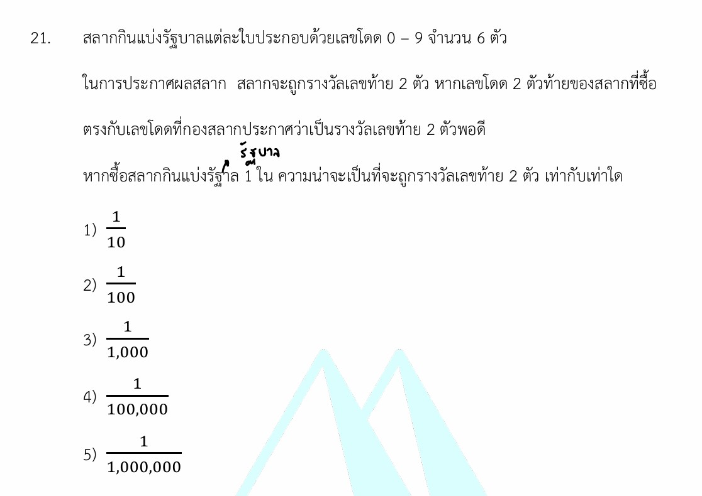

# ความน่าจะเป็น (Probability) - รางวัลเลขท้าย 2 ตัว

โจทย์ข้อนี้เป็นเรื่อง **"ความน่าจะเป็น (Probability)"** ที่ประยุกต์ใช้ในชีวิตประจำวันได้อย่างเห็นภาพชัดเจนมากครับ

คำตอบที่ถูกต้องของโจทย์ข้อนี้คือ **ข้อ 2) $\frac{1}{100}$** ---

## 1. เฉลยวิธีทำอย่างละเอียด (คิดได้ 2 วิธี)

เพื่อให้เข้าใจที่มาอย่างลึกซึ้ง เราสามารถมองโจทย์ข้อนี้ได้ 2 มุมมอง ซึ่งจะได้คำตอบเท่ากันครับ

### วิธีที่ 1: คิดเฉพาะ 2 หลักท้ายที่สนใจ (วิธีลัดและรวดเร็ว)

เนื่องจากโจทย์ถามถึงความน่าจะเป็นในการถูก **"รางวัลเลขท้าย 2 ตัว"** ตัวเลขใน 4 หลักแรกจะเป็นอะไรก็ได้ ไม่มีผลต่อรางวัลนี้ ดังนั้นเราจึงสนใจแค่ช่องเลขท้าย 2 ตัวหลังสุดเท่านั้น

* **หาจำนวนผลลัพธ์ทั้งหมดที่เกิดขึ้นได้ของเลขท้าย 2 ตัว ($n(S)$):**
เลขท้าย 2 ตัว เริ่มตั้งแต่ `00, 01, 02, ... ไปจนถึง 99` รวมทั้งหมด **100 จำนวน**
*(หรือคิดจาก หลักสิบเลือกได้ 10 วิธี (0-9) และหลักหน่วยเลือกได้ 10 วิธี (0-9) $\rightarrow 10 \times 10 = 100$ วิธี)*
* **หาจำนวนผลลัพธ์ที่ถูกรางวัล ($n(E)$):**
ในงวดนั้นๆ กองสลากจะประกาศเลขรางวัลท้าย 2 ตัว ออกมาเพียง **1 หมายเลขเท่านั้น** (เช่น ประกาศเลข 58) ดังนั้น สลากที่เราซื้อจะมีโอกาสตรงกับเลขนั้นแค่ **1 วิธี**

$$\text{ความน่าจะเป็น } P(E) = \frac{n(E)}{n(S)} = \frac{1}{100}$$

---

### วิธีที่ 2: คิดจากสลากเต็มใบ 6 หลัก (วิธีเต็มตามโครงสร้างสลาก)

* **หาจำนวนสลากทั้งหมดที่เป็นไปได้ ($n(S)$):**
สลากมี 6 หลัก แต่ละหลักเลือกเลขโดดได้ 10 ตัว (0-9)
$n(S) = 10 \times 10 \times 10 \times 10 \times 10 \times 10 = 1,000,000$ ใบ (ตั้งแต่ 000000 ถึง 999999)
* **หาจำนวนสลากที่จะถูกรางวัลเลขท้าย 2 ตัว ($n(E)$):**
สมมติให้เลขท้าย 2 ตัวที่ออกคือ "XX"
* 4 หลักแรก เป็นเลขอะไรก็ได้ $\rightarrow 10 \times 10 \times 10 \times 10 = 10,000$ วิธี
* 2 หลักสุดท้าย ต้องเป็นเลขที่ออกเท่านั้น $\rightarrow 1 \times 1 = 1$ วิธี
* จะมีสลากที่ถูกรางวัลทั้งหมด $10,000 \times 1 = 10,000$ ใบ

$$\text{ความน่าจะเป็น } P(E) = \frac{10,000}{1,000,000} = \frac{1}{100}$$

---

## 2. เนื้อหาและสูตรที่เกี่ยวข้อง

### สูตรความน่าจะเป็นของเหตุการณ์ (Probability)

$$\text{P(E)} = \frac{\text{n(E)}}{\text{n(S)}}$$

**ความหมายของตัวแปร:**

* $P(E)$ คือ ความน่าจะเป็นของเหตุการณ์ที่เราสนใจ (Probability of an Event) โดยค่าของ $P(E)$ จะอยู่ระหว่าง $0$ ถึง $1$ เสมอ (หรือ 0% ถึง 100%)
* $n(E)$ คือ จำนวนผลลัพธ์ของเหตุการณ์ที่เราสนใจ (Number of Favorable Outcomes)
* $n(S)$ คือ จำนวนผลลัพธ์ทั้งหมดที่อาจจะเกิดขึ้นได้ในแซมเปิลสเปซ (Number of All Possible Outcomes in Sample Space)

### หลักการนับเบื้องต้น: กฎการคูณ (Multiplication Principle)

หากการทำงานหนึ่งประกอบด้วย $k$ ขั้นตอน โดยที่ขั้นตอนแรกทำได้ $n_1$ วิธี ขั้นตอนที่สองทำได้ $n_2$ วิธี ไปเรื่อยๆ จำนวนวิธีทั้งหมดจะเท่ากับ **$n_1 \times n_2 \times \dots \times n_k$**

---

## 3. กลยุทธ์ในการแก้โจทย์ประเภทนี้

1. **ตัดสิ่งที่ไม่เกี่ยวข้องออกไป (Isolate the Focus):** เหมือนกับโจทย์ข้อนี้ แม้สลากจะมี 6 หลัก แต่รางวัลพิจารณาแค่ 2 หลักท้าย เราสามารถลดรูปปัญหาลงมาคิดแค่เลข 2 หลักได้ทันที เพื่อความรวดเร็วและลดการผิดพลาดในการคำนวณเลขจำนวนมาก
2. **ระวังเงื่อนไข "เลขโดด":** คำว่าเลขโดดหมายถึงเลข `0, 1, 2, 3, 4, 5, 6, 7, 8, 9` ซึ่งมีทั้งหมด **10 ตัว** (เด็กส่วนใหญ่มักจะลืมนับเลข 0 ทำให้คิดว่ามีแค่ 9 ตัว)
3. **ตรวจสอบว่าแต่ละตำแหน่งใช้เลขซ้ำกันได้หรือไม่:** ในกรณีของสลากกินแบ่งหรือรหัสผ่าน เลขแต่ละหลักสามารถซ้ำกันได้ (เช่น ออกเลข 99 ได้) จึงใช้ $10 \times 10$ ได้เลย

---

## 4. ตัวอย่างโจทย์เพิ่มเติมเพื่อฝึกฝน

### โจทย์ข้อที่ 1 (แนวรางวัลเลขท้าย 3 ตัว)

> **โจทย์:** หากกองสลากประกาศรางวัลเลขท้าย 3 ตัว เพียงแค่ 1 รางวัล ความน่าจะเป็นที่สลาก 1 ใบที่เราซื้อจะถูกรางวัลเลขท้าย 3 ตัวนี้ เท่ากับเท่าใด

**วิธีทำ:**

* **คิดเฉพาะ 3 หลักท้าย:** แต่ละหลักเป็นเลขโดดได้ 10 ตัว
* จำนวนผลลัพธ์ทั้งหมดของเลขท้าย 3 ตัว ($n(S)$) $= 10 \times 10 \times 10 = 1,000$ (คือเลข 000 ถึง 999)
* จำนวนเลขที่ถูกรางวัล ($n(E)$) $= 1$ (มีเพียงเลขเดียวที่กองสลากหมุนขึ้นมา)
* **คำตอบ:** ความน่าจะเป็นเท่ากับ **$\frac{1}{1,000}$**

### โจทย์ข้อที่ 2 (แนวประยุกต์: รหัสผ่าน)

> **โจทย์:** หน้าจอโทรศัพท์ของเพื่อนล็อกด้วยรหัสผ่านเป็นตัวเลข 4 หลัก (ตั้งเลขซ้ำกันได้) ถ้าคุณสุ่มกดรหัสเพื่อเปิดเครื่อง 1 ครั้ง ความน่าจะเป็นที่จะเปิดเครื่องได้สำเร็จเป็นเท่าใด

**วิธีทำ:**

* **หา $n(S)$:** รหัส 4 หลัก แต่ละหลักเป็นเลข 0-9 ได้ 10 ตัว $\rightarrow n(S) = 10 \times 10 \times 10 \times 10 = 10,000$ วิธี (ตั้งแต่รหัส 0000 ถึง 9999)
* **หา $n(E)$:** รหัสที่ถูกต้องของเครื่องนั้นมีเพียงรหัสเดียวเท่านั้น $\rightarrow n(E) = 1$
* **คำตอบ:** ความน่าจะเป็นเท่ากับ **$\frac{1}{10,000}$**
