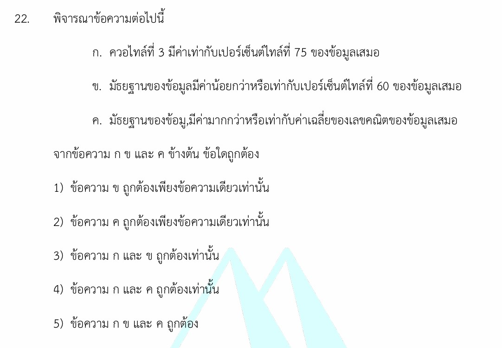

# โจทย์เชิงมโนทัศน์สถิติศาสตร์

โจทย์ข้อนี้เป็นข้อสอบวัดความเข้าใจเชิงมโนทัศน์ (Conceptual Question) ในวิชา **สถิติศาสตร์** เรื่องการวัดตำแหน่งที่ของข้อมูลและการแจกแจงข้อมูลครับ

คำตอบที่ถูกต้องของโจทย์ข้อนี้คือ **ข้อ 3) ข้อความ ก และ ข ถูกต้องเท่านั้น**

---

## 1. เฉลยและวิเคราะห์คำตอบอย่างละเอียด

เรามาพิจารณาความถูกต้องของแต่ละข้อความกันทีละข้อครับ

### **พิจารณาข้อความ ก:** > *"ควอไทล์ที่ 3 มีค่าเท่ากับเปอร์เซ็นต์ไทล์ที่ 75 ของข้อมูลเสมอ"*

* **วิเคราะห์:** การวัดตำแหน่งข้อมูลมีหลักการแบ่งข้อมูลที่เรียงจากน้อยไปมากเหมือนกัน แต่ต่างกันที่จำนวนส่วนที่แบ่ง
* **ควอไทล์ ($Q$)** แบ่งข้อมูลออกเป็น 4 ส่วนเท่าๆ กัน ดังนั้น ควอไทล์ที่ 3 ($Q_3$) หมายถึงตำแหน่งที่มีข้อมูลอยู่ข้างหลังมันอยู่ 3 ส่วนจาก 4 ส่วน (คิดเป็น $\frac{3}{4} \times 100 = 75\%$)
* **เปอร์เซ็นต์ไทล์ ($P$)** แบ่งข้อมูลออกเป็น 100 ส่วนเท่าๆ กัน ดังนั้น เปอร์เซ็นต์ไทล์ที่ 75 ($P_{75}$) ก็คือตำแหน่งที่มีข้อมูลอยู่ข้างหลังมันอยู่ 75 ส่วนจาก 100 ส่วน (คิดเป็น $75\%$)

* เนื่องจากทั้งสองคำนิยามหมายถึงตำแหน่งเดียวกันที่บอกว่ามีข้อมูลน้อยกว่าค่านี้อยู่ $75\%$ ดังนั้น **ข้อความ ก จึงถูกต้องเสมอ**

### **พิจารณาข้อความ ข:** > *"มัธยฐานของข้อมูลมีค่าน้อยกว่าหรือเท่ากับเปอร์เซ็นต์ไทล์ที่ 60 ของข้อมูลเสมอ"*

* **วิเคราะห์:** มัธยฐาน (Median) คือค่าที่อยู่ตรงกลางพอดีเมื่อเรียงข้อมูลจากน้อยไปมาก ซึ่งเทียบเท่ากับเปอร์เซ็นต์ไทล์ที่ 50 ($P_{50}$)
* เนื่องจากข้อมูลถูกเรียงลำดับจากน้อยไปหามาก ข้อมูลในตำแหน่งที่สูงกว่าย่อมต้องมีค่า "มากกว่าหรือเท่ากับ" ข้อมูลในตำแหน่งที่ต่ำกว่าเสมอ
* เมื่อเราเปรียบเทียบตำแหน่งของ $P_{50}$ (มัธยฐาน) กับ $P_{60}$ จะได้ว่าตำแหน่งของ $P_{50}$ มาก่อนหรือต่ำกว่า $P_{60}$ เสมอ ดังนั้น ค่าของ $P_{50}$ จึงต้องน้อยกว่าหรือเท่ากับ $P_{60}$ เสมอ **ข้อความ ข จึงถูกต้อง**

### **พิจารณาข้อความ ค:** > *"มัธยฐานของข้อมูลมีค่ามากกว่าหรือเท่ากับค่าเฉลี่ยของเลขคณิตของข้อมูลเสมอ"*

* **วิเคราะห์:** ข้อความนี้ **ไม่จริงเสมอไป** ความสัมพันธ์ระหว่างมัธยฐาน (Median) และค่าเฉลี่ยเลขคณิต (Mean หรือ $\bar{x}$) ขึ้นอยู่กับ **ลักษณะความเบ้ของเส้นโค้งความถี่ของข้อมูล**
* **ตัวอย่างค้าน (Counterexample):** ถ้าข้อมูลเป็นแบบ **"แจกแจงเบ้ขวา"** (ข้อมูลส่วนใหญ่กองอยู่ทางซ้าย แต่มีค่าสูงๆ บางค่าดึงค่าเฉลี่ยไปทางขวา) จะทำให้ ค่าเฉลี่ยเลขคณิต มีค่ามากกว่า มัธยฐาน
* *สมมติข้อมูลกลุ่มหนึ่งคือ:* $1, 2, 3, 100$
* มัธยฐาน (ค่ากึ่งกลางระหว่าง 2 กับ 3) $= \frac{2+3}{2} = 2.5$
* ค่าเฉลี่ยเลขคณิต $= \frac{1+2+3+100}{4} = \frac{106}{4} = 26.5$
* จะเห็นว่า มัธยฐาน ($2.5$) **น้อยกว่า** ค่าเฉลี่ยเลขคณิต ($26.5$) ดังนั้น **ข้อความ ค จึงผิด**

---

## 2. เนื้อหาและสถิติศาสตร์ที่เกี่ยวข้องเพื่อศึกษาเพิ่มเติม

### การวัดตำแหน่งที่ของข้อมูล (Measures of Position)

เมื่อเรียงข้อมูลจากน้อยไปหามาก เราสามารถแบ่งข้อมูลออกเป็นส่วนๆ ด้วยตัววัด 3 ประเภทหลัก ดังนี้ครับ:

| ตัววัดตำแหน่ง | สัญลักษณ์ | จำนวนส่วนที่แบ่ง | สูตรหาตำแหน่ง (ข้อมูลไม่แจกแจงความถี่) |
| --- | --- | --- | --- |
| **ควอไทล์** (Quartile) | $Q_r$ | 4 ส่วน | $\text{ตำแหน่ง } Q_r = \frac{r(n+1)}{4}$ |
| **เดไซล์** (Decile) | $D_r$ | 10 ส่วน | $\text{ตำแหน่ง } D_r = \frac{r(n+1)}{10}$ |
| **เปอร์เซ็นต์ไทล์** (Percentile) | $P_r$ | 100 ส่วน | $\text{ตำแหน่ง } P_r = \frac{r(n+1)}{100}$ |

> **ความสัมพันธ์สำคัญที่ควรจำ:**
>
> $$\text{มัธยฐาน (Median)} = Q_2 = D_5 = P_{50}$$
>
>
> $$Q_1 = P_{25}$$
>
>
> $$Q_3 = P_{75}$$
>
>

### ความสัมพันธ์ระหว่าง ค่าเฉลี่ย, มัธยฐาน และฐานนิยม กับรูปร่างข้อมูล

รูปร่างการแจกแจงของข้อมูลส่งผลต่อค่ากลางทั้ง 3 ชนิดโดยตรง ดังนี้:

1. **แจกแจงแบบสมมาตร (Symmetric / Normal Distribution):** ข้อมูลสมดุลสองข้าง โค้งเป็นรูปเบลควีน

$$\text{ค่าเฉลี่ยเลขคณิต} = \text{มัธยฐาน} = \text{ฐานนิยม}$$

1. **แจกแจงเบ้ขวา (Right-Skewed Distribution):** ข้อมูลส่วนใหญ่มีค่าน้อย แต่มีบางค่าที่มีค่าสูงมากดึงให้หางกราฟลากไปทางขวา

$$\text{ค่าเฉลี่ยเลขคณิต} > \text{มัธยฐาน} > \text{ฐานนิยม}$$

1. **แจกแจงเบ้ซ้าย (Left-Skewed Distribution):** ข้อมูลส่วนใหญ่มีค่ามาก แต่มีบางค่าที่มีค่าน้อยมากดึงให้หางกราฟลากไปทางซ้าย

$$\text{ฐานนิยม} > \text{มัธยฐาน} > \text{ค่าเฉลี่ยเลขคณิต}$$

---

## 3. กลยุทธ์แก้โจทย์ประเภทนี้ (โจทย์แนวทฤษฎี/มโนทัศน์)

1. **แปลงสัญลักษณ์ให้อยู่ในระบบเดียวกันก่อน:** ยุบควอไทล์ เดไซล์ หรือมัธยฐาน ให้กลายเป็น "เปอร์เซ็นต์ไทล์ ($P$)" ทั้งหมด เพื่อให้เปรียบเทียบความสัมพันธ์ของตำแหน่ง (Index) ได้ง่ายและไม่สับสน
2. **ระวังคำว่า "เสมอ" (Always):** ในทางคณิตศาสตร์/สถิติ ข้อความที่มีคำว่า "เสมอ" จะถูกต้องก็ต่อเมื่อมันเป็นจริงในทุกๆ กรณีไม่มีข้อยกเว้น หากคุณสามารถจินตนาการหรือยกตัวอย่างชุดตัวเลขแปลกๆ (เช่น ข้อมูลเบ้มากๆ) ขึ้นมาค้านได้แม้เพียงกรณีเดียว ข้อความนั้นจะถือว่า **"ผิด"** ทันที
3. **ใช้แผนภาพเส้นโค้งความถี่ช่วยคิด:** สำหรับข้อความที่พูดถึงความสัมพันธ์ระหว่าง ค่าเฉลี่ย มัธยฐาน และฐานนิยม การวาดกราฟเส้นโค้งเบ้ซ้าย-เบ้ขวาในใจ จะช่วยให้เช็กความถูกผิดของสัญลักษณ์มากกว่า/น้อยกว่าได้อย่างแม่นยำครับ

---

## 4. ตัวอย่างโจทย์เพิ่มเติมเพื่อฝึกทำพร้อมเฉลย

### โจทย์ข้อที่ 1

> **โจทย์:** พิจารณาข้อความต่อไปนี้ ข้อใดถูกต้องบ้าง?
> ก. เดไซล์ที่ 7 ($D_7$) มีค่ามากกว่าควอไทล์ที่ 2 ($Q_2$) เสมอ สำหรับทุกชุดข้อมูล
> ข. เปอร์เซ็นต์ไทล์ที่ 25 ($P_{25}$) มีค่าเท่ากับควอไทล์ที่ 1 ($Q_1$) เสมอ

**เฉลยและวิธีคิด:**

* **พิจารณา ก:** แปลงให้อยู่ในรูปเปอร์เซ็นต์ไทล์ จะได้ $D_7 = P_{70}$ และ $Q_2 = P_{50}$ เนื่องจากข้อมูลเรียงจากน้อยไปมาก ค่าที่ตำแหน่งที่ 70 ย่อมต้อง **มากกว่าหรือเท่ากับ** ค่าที่ตำแหน่งที่ 50 เสมอ แต่โจทย์ใช้คำว่า *"มากกว่า...เสมอ"* (Strictly greater than)
* *กรณีข้อยกเว้น:* ถ้าข้อมูลทุกตัวในชุดนั้นมีค่าเท่ากันหมด เช่น $5, 5, 5, 5, 5$ จะได้ว่า $P_{70} = 5$ และ $P_{50} = 5$ ซึ่งมัน **เท่ากัน** ไม่ได้มากกว่า ดังนั้น ข้อความ ก **ผิด** (ต้องใช้คำว่า มากกว่าหรือเท่ากับ)

* **พิจารณา ข:** ตามนิยาม $Q_1$ คือข้อมูลตัวที่แบ่งส่วนที่ 1 จาก 4 ส่วน ซึ่งตรงกับ $P_{25}$ ที่แบ่ง 25 จาก 100 ส่วนพอดี ดังนั้น ข้อความ ข **ถูกต้อง**
* **คำตอบ:** ข้อความ ก ผิด แต่ข้อความ ข ถูกต้อง

### โจทย์ข้อที่ 2

> **โจทย์:** ในการสอบวิชาคณิตศาสตร์ของนักเรียนห้องหนึ่ง พบว่าเส้นโค้งความถี่ของคะแนนสอบมีลักษณะ **เบ้ซ้าย** หากนายปัญญา สอบได้คะแนนเท่ากับค่าเฉลี่ยเลขคณิตพอดี และนางสาวเรณู สอบได้คะแนนเท่ากับมัธยฐานพอดี ใครสอบได้คะแนนมากกว่ากัน?

**เฉลยและวิธีคิด:**

* จากโจทย์ระบุชัดเจนว่าข้อมูลมีการแจกแจงแบบ **"เบ้ซ้าย"**
* ตามสมบัติทางสถิติของเส้นโค้งเบ้ซ้าย ความสัมพันธ์ของค่ากลางจะเป็น: $\text{ฐานนิยม} > \text{มัธยฐาน} > \text{ค่าเฉลี่ยเลขคณิต}$
* แทนชื่อคนลงในความสัมพันธ์: คะแนนของเรณู (มัธยฐาน) $>$ คะแนนของปัญญา (ค่าเฉลี่ยเลขคณิต)
* **คำตอบ:** **นางสาวเรณู** สอบได้คะแนนมากกว่านายปัญญา
