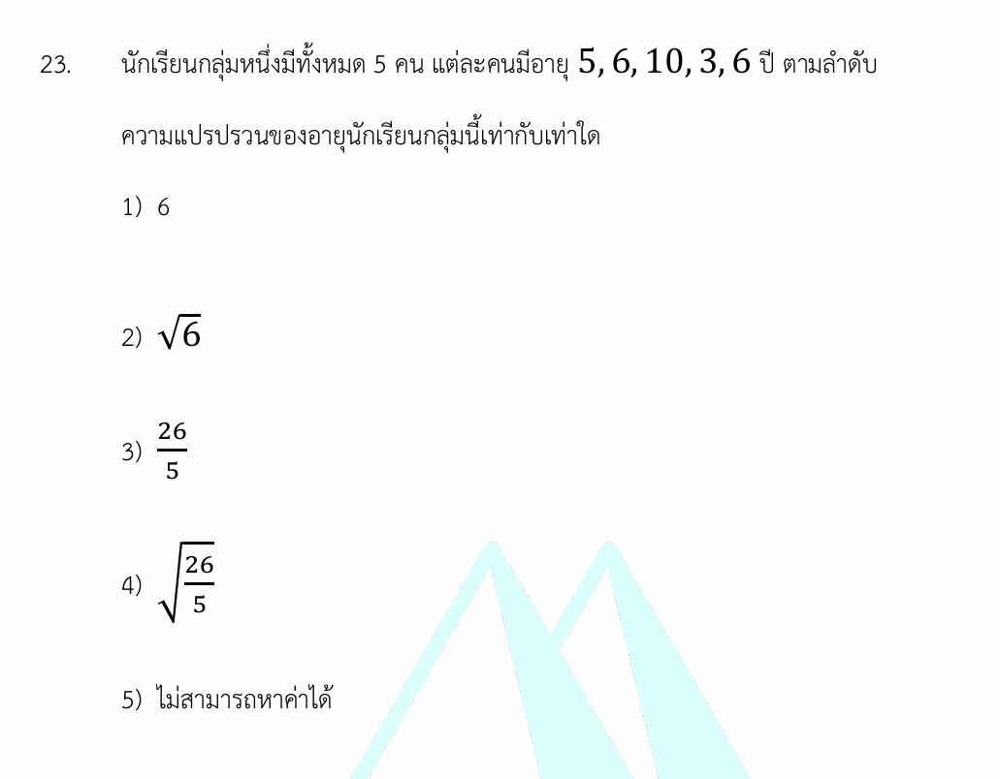

# สถิติ: ความแปรปรวน (Variance)

ยินดีครับ! โจทย์ข้อนี้เป็นเรื่อง **สถิติ (Statistics)** ในหัวข้อ **"การวัดการกระจายของข้อมูล"** ซึ่งตัวพระเอกของงานนี้คือ **ความแปรปรวน (Variance)** มาดูเฉลย วิธีทำอย่างละเอียด และเนื้อหาที่จะช่วยให้คุณเข้าใจที่มาที่ไปของสูตรอย่างลึกซึ้งกันครับ

---

## 🎯 เฉลยคำตอบ

คำตอบที่ถูกต้องคือ **ตัวเลือกที่ 3) $\frac{26}{5}$**

---

## 📝 วิธีทำอย่างละเอียด

โจทย์กำหนดข้อมูลอายุของนักเรียน 5 คน มาให้ดังนี้: $5, 6, 10, 3, 6$ (จำนวนข้อมูล $N = 5$)

### ขั้นตอนที่ 1: หาค่าเฉลี่ยเลขคณิต ($\mu$)

ก่อนจะรู้ว่าข้อมูลกระจายห่างกันแค่ไหน เราต้องหา "จุดศูนย์กลาง" หรือค่าเฉลี่ยของกลุ่มนี้ก่อน

$$\mu = \frac{\sum x_i}{N} = \frac{5 + 6 + 10 + 3 + 6}{5} = \frac{30}{5} = 6 \text{ ปี}$$

### ขั้นตอนที่ 2: หาค่าเบี่ยงเบนจากค่าเฉลี่ยยกกำลังสอง $(x_i - \mu)^2$

ขั้นตอนนี้คือการดูว่า นักเรียนแต่ละคนมีอายุห่างจากค่าเฉลี่ย ($6$ ปี) อยู่เท่าไหร่ แล้วจับยกกำลังสองเพื่อไม่ให้ค่าติดลบมาหักล้างกัน

* คนที่ 1: $(5 - 6)^2 = (-1)^2 = 1$
* คนที่ 2: $(6 - 6)^2 = (0)^2 = 0$
* คนที่ 3: $(10 - 6)^2 = (4)^2 = 16$
* คนที่ 4: $(3 - 6)^2 = (-3)^2 = 9$
* คนที่ 5: $(6 - 6)^2 = (0)^2 = 0$

### ขั้นตอนที่ 3: หาผลรวมของผลต่างยกกำลังสอง ($\sum (x_i - \mu)^2$)

$$\sum (x_i - \mu)^2 = 1 + 0 + 16 + 9 + 0 = 26$$

### ขั้นตอนที่ 4: คำนวณหาความแปรปรวน ($\sigma^2$)

นำผลรวมที่ได้ในขั้นตอนที่ 3 มาหารด้วยจำนวนนักเรียนทั้งหมด ($N = 5$)

$$\sigma^2 = \frac{26}{5}$$

*(ถ้าทอนเป็นทศนิยมจะได้ $5.2$ แต่ในช้อยส์ติดรูปเศษส่วนไว้ จึงตอบข้อ 3 ได้ทันที)*

---

## 📚 เนื้อหาเพิ่มเติมเพื่อการศึกษา

### ความหมายของความแปรปรวน (Variance)

**ความแปรปรวน** คือ ค่าที่ใช้วัดการกระจายของข้อมูล ยิ่งค่านี้**มาก** แปลว่าข้อมูลในกลุ่มนั้นมีความแตกต่างกันมาก (กระจายตัวห่างจากค่าเฉลี่ย) แต่ถ้าค่านี้น้อยหรือเป็น **0** แปลว่าทุกคนในกลุ่มมีค่าเท่ากันหมด

### อธิบายสูตรและตัวแปรที่เกี่ยวข้อง

ในการคำนวณความแปรปรวน จะมีสูตรหลักๆ อยู่ 2 แบบ ขึ้นอยู่กับว่าข้อมูลที่เราได้มาเป็น **"ประชากรทั้งหมด (Population)"** หรือ **"กลุ่มตัวอย่าง (Sample)"**

#### 1. สูตรความแปรปรวนประชากร ($\sigma^2$)

(ใช้กับโจทย์ข้อนี้ เพราะโจทย์ระบุว่า "นักเรียนกลุ่มหนึ่งมีทั้งหมด 5 คน" และนำข้อมูลของทุกคนมาคิด)

$$\sigma^2 = \frac{\sum_{i=1}^{N} (x_i - \mu)^2}{N}$$

#### 2. สูตรความแปรปรวนกลุ่มตัวอย่าง ($s^2$)

ใช้เมื่อโจทย์สุ่มเลือกตัวแทนออกมาจากกลุ่มใหญ่ ตัวหารจะถูกหักออก 1 เพื่อลดความคลาดเคลื่อน

$$s^2 = \frac{\sum_{i=1}^{n} (x_i - \bar{x})^2}{n - 1}$$

**ความหมายของตัวแปรและค่าคงที่:**

* $\sigma^2$ (อ่านว่า ซิกมาสู่วี หรือ ซิกมายกกำลังสอง) = ความแปรปรวนของประชากร
* $s^2$ = ความแปรปรวนของกลุ่มตัวอย่าง
* $x_i$ = ข้อมูลตัวที่ $i$ (เช่น อายุของนักเรียนแต่ละคน)
* $\mu$ (อ่านว่า มิว) = ค่าเฉลี่ยเลขคณิตของประชากร
* $\bar{x}$ (อ่านว่า เอ็กซ์บาร์) = ค่าเฉลี่ยเลขคณิตของกลุ่มตัวอย่าง
* $N$ = จำนวนข้อมูลทั้งหมดของประชากร
* $n$ = จำนวนข้อมูลของกลุ่มตัวอย่าง
* $\sum$ (Sigma) = เครื่องหมายผลรวมทางคณิตศาสตร์

---

## 💡 กลยุทธ์และทริคในการแก้โจทย์ประเภทนี้

1. **ระวังโดนโจทย์หลอกเรื่อง "สแควรูท" ($\sqrt{\dots}$):** * **ความแปรปรวน** จะติดยกกำลังสองเสมอ ($\sigma^2$) ผลลัพธ์ที่ได้จึง**ไม่ต้องใส่รูท** (ตอบข้อ 3)

* แต่ถ้าโจทย์ถามหา **"ส่วนเบี่ยงเบนมาตรฐาน (Standard Deviation: $\sigma$)"** เราจะต้องนำความแปรปรวนมาใส่รูท (ซึ่งจะตรงกับข้อ 4) โจทย์มักจะเอาช้อยส์สองข้อนี้มาดักควายบ่อยๆ ครับ!

1. **สูตรลัดช่วยชีวิต (กรณีเลขเยอะ):**
นอกจากสูตรปกติแล้ว ยังมีสูตรจัดรูปใหม่ที่บางครั้งช่วยให้คิดเลขเร็วขึ้น ไม่ต้องคอยลบเลขทีละตัว:

$$\sigma^2 = \frac{\sum x_i^2}{N} - \mu^2$$

*ลองแทนค่าข้อนี้:* $\sum x_i^2 = 5^2+6^2+10^2+3^2+6^2 = 25+36+100+9+36 = 206$
จะได้ $\sigma^2 = \frac{206}{5} - 6^2 = 41.2 - 36 = 5.2$ ซึ่งเท่ากับ $\frac{26}{5}$ เช่นกัน!

---

## ✍️ โจทย์เพิ่มเติมสำหรับฝึกฝน

### โจทย์ข้อที่ 1 (แนวประชากร)

คะแนนสอบวิชาคณิตศาสตร์ของนักเรียน 4 คน ได้แก่ $2, 4, 6, 8$ คะแนน翴 จงหาความแปรปรวนของคะแนนสอบกลุ่มนี้

* **วิธีคิด:**

1. หาค่าเฉลี่ย ($\mu$): $\frac{2+4+6+8}{4} = \frac{20}{4} = 5$ คะแนน
2. หา $(x_i - \mu)^2$: $(2-5)^2=9$, $(4-5)^2=1$, $(6-5)^2=1$, $(8-5)^2=9$
3. ผลรวม: $9 + 1 + 1 + 9 = 20$
4. ความแปรปรวน ($\sigma^2$): $\frac{20}{4} = 5$

* **เฉลย:** ความแปรปรวนเท่ากับ **5**

### โจทย์ข้อที่ 2 (ระวังโดนหลอกเรื่องคำถาม)

จากข้อมูลชุดหนึ่งได้แก่ $1, 3, 5, 7, 9$ จงหา **ส่วนเบี่ยงเบนมาตรฐาน** ของข้อมูลประชากรชุดนี้

* **วิธีคิด:**

1. หาค่าเฉลี่ย ($\mu$): $\frac{1+3+5+7+9}{5} = \frac{25}{5} = 5$
2. หา $(x_i - \mu)^2$: $(-4)^2=16$, $(-2)^2=4$, $(0)^2=0$, $(2)^2=4$, $(4)^2=16$
3. ผลรวม: $16 + 4 + 0 + 4 + 16 = 40$
4. หาความแปรปรวน ($\sigma^2$): $\frac{40}{5} = 8$
5. โจทย์ถาม **ส่วนเบี่ยงเบนมาตรฐาน ($\sigma$)** ดังนั้นต้องถอดรูท: $\sigma = \sqrt{8} = 2\sqrt{2}$

* **เฉลย:** ส่วนเบี่ยงเบนมาตรฐานเท่ากับ **$\sqrt{8}$ หรือ $2\sqrt{2}$**
