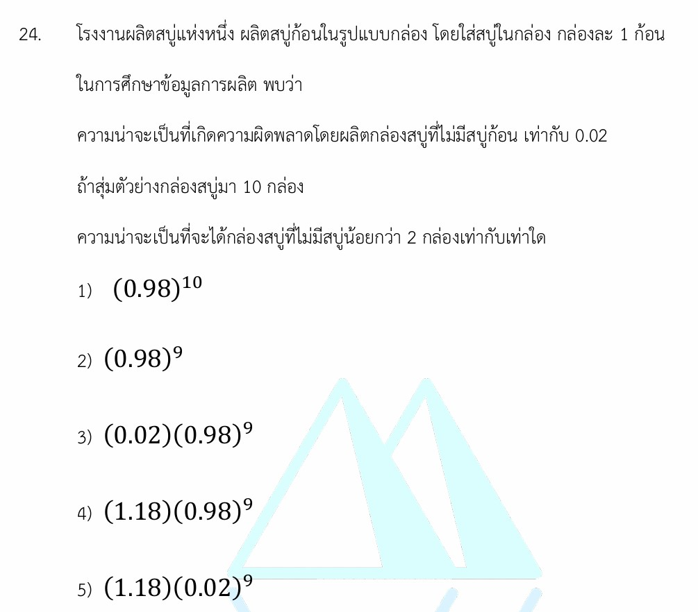

โจทย์ข้อนี้เป็นเรื่อง **ความน่าจะเป็น (Probability)** ในหัวข้อ **"การแจกแจงทวินาม (Binomial Distribution)"** ซึ่งมักจะพบได้บ่อยในโจทย์สถิติประยุกต์และการควบคุมคุณภาพโรงงาน มาดูเฉลย วิธีทำอย่างละเอียด และทฤษฎีที่เกี่ยวข้องเพื่อเพิ่มความเข้าใจกันครับ

---

## 🎯 เฉลยคำตอบ

คำตอบที่ถูกต้องคือ **ตัวเลือกที่ 4) $(1.18)(0.98)^9$**

---

## 📝 วิธีทำอย่างละเอียด

จากโจทย์ สถานการณ์นี้ระบุว่ามีการสุ่มกล่องสบู่ขึ้นมา $10$ กล่อง โดยแต่ละกล่องมีโอกาสที่จะผิดพลาด (ไม่มีสบู่) หรือปกติ แยกออกจากกันอย่างเป็นอิสระ ซึ่งเป็นลักษณะเฉพาะของการแจกแจงทวินาม

### ขั้นตอนที่ 1: กำหนดและจำแนกตัวแปร

* จำนวนกล่องที่สุ่มมาทั้งหมด ($n$) = $10$
* ความน่าจะเป็นที่จะเกิดข้อผิดพลาด/กล่องไม่มีสบู่ ($p$) = $0.02$
* ความน่าจะเป็นที่กล่องจะปกติ มีสบู่ครบ ($q = 1 - p$) = $1 - 0.02 = 0.98$

โจทย์ต้องการหาความน่าจะเป็นที่จะได้กล่องสบู่ที่ไม่มีสบู่ก้อน **"น้อยกว่า 2 กล่อง"**
คำว่า "น้อยกว่า 2" หมายถึง เหตุการณ์ที่เราสุ่มเจอ $0$ กล่อง หรือ $1$ กล่อง เท่านั้น ($X = 0$ หรือ $X = 1$)
ดังนั้นเราต้องหาค่าของ $P(X < 2) = P(X = 0) + P(X = 1)$

### ขั้นตอนที่ 2: คำนวณความน่าจะเป็นของแต่ละกรณี

ใช้สูตรการแจกแจงทวินาม $P(X = x) = \binom{n}{x} p^x q^{n-x}$

1. **กรณีไม่พบกล่องผิดพลาดเลย ($X = 0$):**

$$P(X = 0) = \binom{10}{0} (0.02)^0 (0.98)^{10-0}$$

$$P(X = 0) = 1 \times 1 \times (0.98)^{10} = (0.98)^{10}$$

1. **กรณีพบกล่องผิดพลาดเพียง 1 กล่อง ($X = 1$):**

$$P(X = 1) = \binom{10}{1} (0.02)^1 (0.98)^{10-1}$$

$$P(X = 1) = 10 \times 0.02 \times (0.98)^9 = 0.2 \times (0.98)^9$$

### ขั้นตอนที่ 3: นำผลลัพธ์มารวมกันและจัดรูปพีชคณิต

$$P(X < 2) = (0.98)^{10} + 0.2 \times (0.98)^9$$

สังเกตจากช้อยส์จะเห็นว่ามีการดึงตัวร่วมเป็นเลขยกกำลังเก้า ตัวเราจึงต้องแยกแปลงประพจน์ตัวแรกจาก $(0.98)^{10}$ ให้กลายเป็น $(0.98) \times (0.98)^9$ เพื่อให้ดึงตัวร่วมได้ง่ายขึ้น:

$$P(X < 2) = \mathbf{0.98} \times (0.98)^9 + \mathbf{0.2} \times (0.98)^9$$

$$P(X < 2) = (0.98 + 0.2) \times (0.98)^9$$

$$P(X < 2) = (1.18)(0.98)^9$$

---

## 📚 เนื้อหาเพิ่มเติมเพื่อการศึกษา

### การแจกแจงทวินาม (Binomial Distribution) คืออะไร?

เป็นการแจกแจงความน่าจะเป็นของตัวแปรสุ่มชนิดไม่ต่อเนื่อง โดยสถานการณ์ที่จะใช้แนวคิดนี้ได้ จะต้องผ่านเงื่อนไขสำคัญ 4 ข้อ:

1. **มีจำนวนการทดลองที่แน่นอน** ($n$ ครั้งชัดเจน)
2. **เกิดผลลัพธ์ได้เพียง 2 หน้าเท่านั้น** (เช่น สำเร็จ/ล้มเหลว, ชำรุด/ปกติ, หัว/ก้อย)
3. **ความน่าจะเป็นในการสำเร็จ ($p$) ต้องคงที่** ในการทดลองทุกๆ ครั้ง
4. **การทดลองแต่ละครั้งต้องเป็นอิสระต่อกัน** (ผลครั้งแรกไม่มีส่วนได้ส่วนเสียกับครั้งถัดไป)

### อธิบายสูตรและตัวแปร

$$P(X = x) = \binom{n}{x} p^x q^{n-x}$$

* **$P(X = x)$** = ความน่าจะเป็นที่จะเกิดเหตุการณ์ที่เราสนใจจำนวน $x$ ครั้ง จากการทดลองทั้งหมด
* **$\binom{n}{x}$** = จำนวนวิธีในการเลือกตำแหน่งสุ่ม ค้นหาจากสูตรจัดหมู่คอมบิเนชัน $\frac{n!}{x!(n-x)!}$ (เช่น $\binom{10}{1} = 10$)
* **$p$** = ความน่าจะเป็นที่จะเกิดเหตุการณ์ที่เราสนใจใน 1 ครั้ง
* **$q$** = ความน่าจะเป็นที่ไม่เกิดเหตุการณ์นั้นใน 1 ครั้ง โดยค่า $q = 1 - p$ เสมอ
* **$n$** = จำนวนครั้งทั้งหมดของการทดลอง
* **$x$** = จำนวนครั้งของเหตุการณ์ที่เราสนใจที่จะคำนวณ

---

## 💡 กลยุทธ์แก้โจทย์ประเภทนี้

1. **แปลความหมายคำว่า "จำนวน" ให้ถูกต้อง:**

* *น้อยกว่า 2* $\rightarrow$ คิดแค่ $0, 1$
* *ไม่เกิน 2* หรือ *น้อยกว่าหรือเท่ากับ 2* $\rightarrow$ คิด $0, 1, 2$
* *อย่างน้อย 1* $\rightarrow$ แทนที่จะคิด $1, 2, 3, \dots, n$ ให้คิดทางตรงข้ามคือ $1 - P(X = 0)$ จะเร็วกว่ามาก

1. **อย่าเพิ่งรีบคูณเลขทศนิยมจนหมด:** โจทย์ส่วนใหญ่ที่ค่า $n$ เยอะๆ มักจะติดค่าเลขยกกำลังเอาไว้ในช้อยส์ ให้เน้นเรื่อง **"การดึงตัวร่วม"** เพื่อรวมสัมประสิทธิ์ข้างหน้าแทน

---

## ✍️ ตัวอย่างโจทย์เพิ่มเติมเพื่อฝึกฝน

### โจทย์ข้อที่ 1 (แนวติดรูปเลขยกกำลัง)

ความน่าจะเป็นที่เครื่องจักรจะผลิตชิ้นส่วนรถยนต์ชำรุดเท่ากับ $0.1$ ถ้าสุ่มหยิบชิ้นส่วนมา $5$ ชิ้น จงหาความน่าจะเป็นที่จะพบชิ้นส่วนชำรุด**อย่างมาก 1 ชิ้น**

* **วิธีคิด:**
* $n = 5, p = 0.1, q = 0.9$
* คำว่า "อย่างมาก 1 ชิ้น" หมายถึง ชำรุด 0 ชิ้น หรือ 1 ชิ้น ($P(X \le 1) = P(X=0) + P(X=1)$)
* $P(X=0) = \binom{5}{0}(0.1)^0(0.9)^5 = (0.9)^5$
* $P(X=1) = \binom{5}{1}(0.1)^1(0.9)^4 = 5 \times 0.1 \times (0.9)^4 = 0.5 \times (0.9)^4$
* รวมกัน: $(0.9)^5 + 0.5 \times (0.9)^4 = (0.9)(0.9)^4 + 0.5 \times (0.9)^4 = (0.9 + 0.5)(0.9)^4 = (1.4)(0.9)^4$

* **เฉลย:** $(1.4)(0.9)^4$

### โจทย์ข้อที่ 2 (แนวคำนวณทศนิยม)

โอกาสที่นักยิงปืนคนหนึ่งจะยิงเป้าเข้าจุดดำคือ $0.8$ ถ้าเขายิงทั้งหมด $3$ ครั้ง จงหาความน่าจะเป็นที่เขาจะยิงเข้าจุดดำ**อย่างน้อย 2 ครั้ง**

* **วิธีคิด:**
* $n = 3, p = 0.8, q = 0.2$
* คำว่า "อย่างน้อย 2 ครั้ง" หมายถึง เข้า 2 ครั้ง หรือ เข้า 3 ครั้ง ($P(X \ge 2) = P(X=2) + P(X=3)$)
* $P(X=2) = \binom{3}{2}(0.8)^2(0.2)^1 = 3 \times 0.64 \times 0.2 = 0.384$
* $P(X=3) = \binom{3}{3}(0.8)^3(0.2)^0 = 1 \times 0.512 \times 1 = 0.512$
* รวมค่าความน่าจะเป็น: $0.384 + 0.512 = 0.896$

* **เฉลย:** $0.896$
