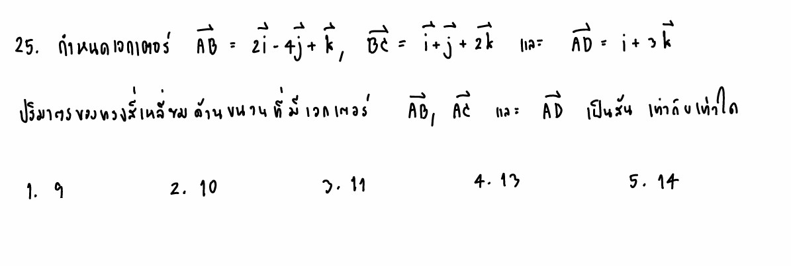

โจทย์ข้อนี้เป็นข้อสอบที่ทดสอบความเข้าใจเรื่อง **"เวกเตอร์ในสามมิติ"** โดยเฉพาะการประยุกต์ใช้เพื่อหา **ปริมาตรของทรงสี่เหลี่ยมด้านขนาน (Volume of a Parallelepiped)** จุดเด่นของโจทย์ข้อนี้ที่มีการสับขาหลอกเล็กน้อยคือ **โจทย์ไม่ได้ให้เวกเตอร์ที่เป็นสันจากจุดเริ่มต้นเดียวกันมาตรง ๆ** แต่เราต้องคำนวณหาเวกเตอร์เส้นนั้นก่อนครับ

คำตอบที่ถูกต้องของโจทย์ข้อนี้คือ **ตัวเลือกที่ 1. 9** ---

## 1. วิธีทำอย่างละเอียด

### **ขั้นตอนที่ 1: หาเวกเตอร์ที่เป็นสันทั้ง 3 เส้นจากจุดเริ่มต้นเดียวกัน**

โจทย์ต้องการปริมาตรที่มีเวกเตอร์ $\vec{AB}$, $\vec{AC}$ และ $\vec{AD}$ เป็นสัน (สังเกตว่าทุกเส้นเริ่มจากจุด $A$ เหมือนกัน)
แต่สิ่งที่โจทย์กำหนดมาให้คือ:

* $\vec{AB} = 2\vec{i} - 4\vec{j} + \vec{k}$
* $\vec{BC} = \vec{i} + \vec{j} + 2\vec{k}$
* $\vec{AD} = \vec{i} + 3\vec{k}$ *(หมายความว่าส่วนของ $\vec{j}$ มีค่าเป็น 0)*

เรายังขาดเวกเตอร์ $\vec{AC}$ ซึ่งสามารถหาได้จากความสัมพันธ์ของการบวกเวกเตอร์:

$$\vec{AC} = \vec{AB} + \vec{BC}$$

แทนค่าเวกเตอร์ที่โจทย์ให้มา:

$$\vec{AC} = (2\vec{i} - 4\vec{j} + \vec{k}) + (\vec{i} + \vec{j} + 2\vec{k})$$

$$\vec{AC} = (2+1)\vec{i} + (-4+1)\vec{j} + (1+2)\vec{k}$$

$$\vec{AC} = 3\vec{i} - 3\vec{j} + 3\vec{k}$$

ตอนนี้เราได้เวกเตอร์ที่เป็นสันทั้ง 3 เส้นครบแล้วในรูปแบบส่วนประกอบ $[i, j, k]$:

* $\vec{AB} = [2, -4, 1]$
* $\vec{AC} = [3, -3, 3]$
* $\vec{AD} = [1, 0, 3]$

### **ขั้นตอนที่ 2: คำนวณหาปริมาตรโดยใช้ดีเทอร์มิแนนต์ (Determinant)**

ปริมาตรของทรงสี่เหลี่ยมด้านขนานหาได้จากค่าสัมบูรณ์ของ **ผลคูณเชิงสเกลาร์ของสามเวกเตอร์ (Scalar Triple Product)** หรือการหา Determinant ของเมทริกซ์ขนาด $3 \times 3$ ที่นำเวกเตอร์ทั้งสามมาเรียงต่อกัน

$$V = \left| \det \begin{pmatrix} 2 & -4 & 1 \\ 3 & -3 & 3 \\ 1 & 0 & 3 \end{pmatrix} \right|$$

ตั้งคำนวณหา Determinant (ใช้วิธีต่อพ่วง 2 หลักแรก หรือกระจายโคแฟกเตอร์ก็ได้ ในที่นี้ลองใช้วิธีคูณลงลบคูณขึ้น):

```
  2   -4    1  |  2   -4
  3   -3    3  |  3   -3
  1    0    3  |  1    0

```

* **ผลคูณแนวเฉียงลง:**
* $(2) \times (-3) \times (3) = -18$
* $(-4) \times (3) \times (1) = -12$
* $(1) \times (3) \times (0) = 0$
* รวมผลคูณลง = $(-18) + (-12) + 0 = -30$

* **ผลคูณแนวเฉียงขึ้น:**
* $(1) \times (-3) \times (1) = -3$
* $(0) \times (3) \times (2) = 0$
* $(3) \times (3) \times (-4) = -36$
* รวมผลคูณขึ้น = $(-3) + 0 + (-36) = -39$

* **คำนวณค่า Determinant:**

$$\det = \text{ผลรวมคูณลง} - \text{ผลรวมคูณขึ้น}$$

$$\det = -30 - (-39) = -30 + 39 = 9$$

* **หาค่าสัมบูรณ์เพื่อเป็นปริมาตร:**

$$\text{ปริมาตร} = |9| = 9\text{ ลูกบาศก์หน่วย}$$

---

## 2. เนื้อหาและสูตรที่เกี่ยวข้อง

### **ผลคูณเชิงสเกลาร์ของสามเวกเตอร์ (Scalar Triple Product)**

เมื่อเรามีเวกเตอร์ 3 ตัวในระบบพิกัดฉาก คือ $\vec{u}, \vec{v}, \vec{w}$ ที่ไม่ อยู่บนระนาบเดียวกัน เวกเตอร์ทั้งสามนี้จะสามารถกางออกกลายเป็นขอบหรือ "สัน" ของรูปทรงสี่เหลี่ยมด้านขนานสามมิติได้

> **สูตรการหาปริมาตร:**
>
> $$\text{ปริมาตร} = |\vec{u} \cdot (\vec{v} \times \vec{w})|$$
>
>

### **ที่มาและความหมายทางเรขาคณิต**

1. **$\vec{v} \times \vec{w}$ (Cross Product):** จะได้เวกเตอร์ใหม่ที่มีขนาดเท่ากับ **พื้นที่ผิวของฐาน** ทรงสี่เหลี่ยมด้านขนาน และมีทิศทางตั้งฉากกับระนาบฐาน
2. **$\cdot \vec{u}$ (Dot Product):** เป็นการหาผลคูณของพื้นที่ฐานกับ **ความสูงแนวตั้งฉาก** ของรูปทรงนั้น (เพราะการ Dot กับเวกเตอร์ที่ตั้งฉากฐานจะสะท้อนความสูงเชิงเรขาคณิตออกมาพอดี)
3. **ค่าสัมบูรณ์ (Absolute Value):** เนื่องจากค่า Determinant หรือผลการ Dot Product สามารถติดลบได้ขึ้นอยู่กับทิศทางการเรียงเวกเตอร์ แต่ปริมาตรต้องเป็นบวกเสมอ จึงต้องครอบด้วยค่าสัมบูรณ์

---

## 3. กลยุทธ์ในการแก้โจทย์ประเภทนี้

* **เช็คจุดเริ่มต้น (Common Vertex):** สิ่งแรกที่ต้องดูคือ เวกเตอร์ทั้ง 3 เส้นลากออกจากจุดเดียวกันหรือไม่ เช่น $\vec{AB}, \vec{AC}, \vec{AD}$ ทุกเส้นมีจุดเริ่มต้นที่ $A$ ถือว่าใช้ได้ หากโจทย์ให้เวกเตอร์ที่ต่อกันมา เช่น $\vec{BC}$ ต้องใช้สมบัติการบวกเวกเตอร์เพื่อแปลงให้เป็นจุดเริ่มต้นเดียวกันก่อน
* **ระวังส่วนประกอบที่เป็น 0:** เวลาเขียนเวกเตอร์ในรูปเมทริกซ์ ให้ระวังตัวแปรที่หายไป อย่างในโจทย์ $\vec{AD} = \vec{i} + 3\vec{k}$ แปลว่าตำแหน่งของ $\vec{j}$ คือ $0$ ห้ามใส่ข้ามหลักเด็ดขาด
* **เลือกแถว/หลักในการหา Det ให้ฉลาด:** หากใช้วิธีการกระจายโคแฟกเตอร์ (Cofactor Expansion) ให้เลือกแถวหรือหลักที่มีเลข $0$ เยอะ จะช่วยให้คำนวณได้เร็วและลดโอกาสคิดเลขผิด

---

## 4. โจทย์ซ้อมมือเพิ่มเติมสำหรับฝึกฝน

### **โจทย์ข้อที่ 1 (ระดับพื้นฐาน)**

กำหนดให้ $\vec{u} = \vec{i} + \vec{j}$, $\vec{v} = \vec{j} + \vec{k}$ และ $\vec{w} = \vec{i} + \vec{k}$ จงหาปริมาตรของทรงสี่เหลี่ยมด้านขนานที่มีเวกเตอร์ทั้งสามนี้เป็นสัน

**วิธีทำ:**
เขียนเวกเตอร์ในรูปแบบพิกัด:
$\vec{u} = [1, 1, 0]$
$\vec{v} = [0, 1, 1]$
$\vec{w} = [1, 0, 1]$

ตั้งเมทริกซ์เพื่อหา Determinant:

$$\det = \begin{pmatrix} 1 & 1 & 0 \\ 0 & 1 & 1 \\ 1 & 0 & 1 \end{pmatrix}$$

คำนวณคูณลง-คูณขึ้น:

* คูณลง: $(1\times1\times1) + (1\times1\times1) + (0\times0\times0) = 1 + 1 + 0 = 2$
* คูณขึ้น: $(1\times1\times0) + (0\times1\times1) + (1\times0\times1) = 0 + 0 + 0 = 0$
* $\det = 2 - 0 = 2$

**ตอบ:** ปริมาตรเท่ากับ $|2| = 2$ ลูกบาศก์หน่วย

---

### **โจทย์ข้อที่ 2 (ระดับประยุกต์เลียนแบบข้อสอบจริง)**

กำหนดเวกเตอร์ $\vec{PQ} = \vec{i} + \vec{j}$ และ $\vec{QR} = 2\vec{j} + \vec{k}$ และมีเวกเตอร์ $\vec{PS} = \vec{i} + 2\vec{k}$ จงหาปริมาตรของทรงสี่เหลี่ยมด้านขนานที่มีเวกเตอร์ $\vec{PQ}, \vec{PR}$ และ $\vec{PS}$ เป็นสัน

**วิธีทำ:**

1. สังเกตว่า สันที่ต้องการคือ $\vec{PQ}, \vec{PR}, \vec{PS}$ (จุดเริ่มต้นร่วมคือ $P$) แต่โจทย์ให้ $\vec{QR}$ มา
2. หา $\vec{PR} = \vec{PQ} + \vec{QR} = (\vec{i} + \vec{j}) + (2\vec{j} + \vec{k}) = \vec{i} + 3\vec{j} + \vec{k}$
3. สรุปเวกเตอร์ทั้งสามที่จะนำมาคิดปริมาตร:

* $\vec{PQ} = [1, 1, 0]$
* $\vec{PR} = [1, 3, 1]$
* $\vec{PS} = [1, 0, 2]$

1. คำนวณ Det ของเมทริกซ์:

$$\det = \begin{pmatrix} 1 & 1 & 0 \\ 1 & 3 & 1 \\ 1 & 0 & 2 \end{pmatrix}$$

* คูณลง: $(1\times3\times2) + (1\times1\times1) + (0\times1\times0) = 6 + 1 + 0 = 7$
* คูณขึ้น: $(1\times3\times0) + (0\times1\times1) + (2\times1\times1) = 0 + 0 + 2 = 2$
* $\det = 7 - 2 = 5$

**ตอบ:** ปริมาตรเท่ากับ $|5| = 5$ ลูกบาศก์หน่วย
