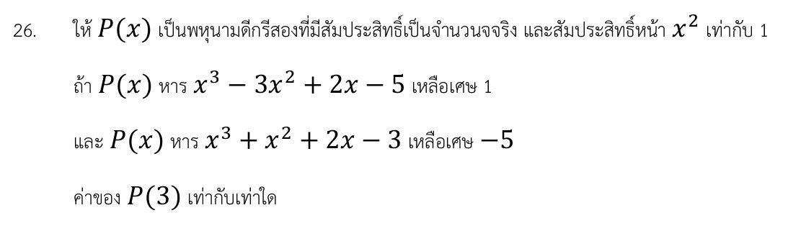

# แก้โจทย์พหุนามโดยใช้สมบัติการหารลงตัว

โจทย์ข้อนี้เป็นข้อสอบพีชคณิตที่ทดสอบความเข้าใจเรื่อง **"ทฤษฎีบทการหารพหุนาม"** และ **"สมบัติการหารลงตัว"** ความน่าสนใจของโจทย์ข้อนี้คือเราไม่จำเป็นต้องตั้งหารยาวให้เหนื่อย แต่ใช้การพิจารณาผลต่างของพหุนามมาช่วยตัดตัวแปรทำให้แก้หาพหุนาม $P(x)$ ได้อย่างรวดเร็วครับ

คำตอบสุดท้ายของโจทย์ข้อนี้คือ **$P(3) = 11$**

---

## 1. วิธีทำอย่างละเอียด

### **ขั้นตอนที่ 1: เปลี่ยนประโยคบอกเล่าให้เป็นสมการคณิตศาสตร์**

จากนิยามของการหารพหุนาม: **ตัวตั้ง = (ตัวหาร $\times$ ผลหาร) + เศษ**
โจทย์กำหนดให้ $P(x)$ เป็นพหุนามดีกรีสองที่มีสัมประสิทธิ์หน้า $x^2$ เป็น 1 นั่นคือ $P(x) = x^2 + bx + c$

* **เงื่อนไขที่ 1:** $P(x)$ หาร $x^3 - 3x^2 + 2x - 5$ เหลือเศษ 1

$$x^3 - 3x^2 + 2x - 5 = Q_1(x) \cdot P(x) + 1$$

ย้าย 1 ไปลบออกเพื่อทำให้ฝั่งซ้ายหารด้วย $P(x)$ ลงตัว:

$$x^3 - 3x^2 + 2x - 6 = Q_1(x) \cdot P(x) \quad \text{--- (สมการที่ 1)}$$

* **เงื่อนไขที่ 2:** $P(x)$ หาร $x^3 + x^2 + 2x - 3$ เหลือเศษ $-5$

$$x^3 + x^2 + 2x - 3 = Q_2(x) \cdot P(x) - 5$$

ย้าย $-5$ ไปบวกเพื่อทำให้ฝั่งซ้ายหารด้วย $P(x)$ ลงตัว:

$$x^3 + x^2 + 2x + 2 = Q_2(x) \cdot P(x) \quad \text{--- (สมการที่ 2)}$$

### **ขั้นตอนที่ 2: ใช้สมบัติการลบพหุนามเพื่อหา $P(x)$**

เนื่องจาก $P(x)$ เป็นตัวหารร่วม (Common Factor) ของทั้งสมการที่ 1 และสมการที่ 2 ดังนั้น **$P(x)$ จะต้องหารผลต่างของทั้งสองสมการลงตัวด้วย**

นำ **(สมการที่ 2) $-$ (สมการที่ 1)**:

$$(x^3 + x^2 + 2x + 2) - (x^3 - 3x^2 + 2x - 6) = [Q_2(x) - Q_1(x)] \cdot P(x)$$

$$x^3 + x^2 + 2x + 2 - x^3 + 3x^2 - 2x + 6 = [Q_2(x) - Q_1(x)] \cdot P(x)$$

$$4x^2 + 8 = [Q_2(x) - Q_1(x)] \cdot P(x)$$

ดึงตัวร่วมฝั่งซ้ายออกมา:

$$4(x^2 + 2) = [Q_2(x) - Q_1(x)] \cdot P(x)$$

### **ขั้นตอนที่ 3: วิเคราะห์หาพหุนาม $P(x)$**

โจทย์ระบุว่า $P(x)$ เป็นพหุนามดีกรีสองที่มีสัมประสิทธิ์หน้า $x^2$ เท่ากับ 1
เมื่อเราดูจากสมการ $4(x^2 + 2) = \text{ผลหาร} \cdot P(x)$ พหุนามดีกรีสองเพียงตัวเดียวที่เป็นไปได้และมีสัมประสิทธิ์หน้า $x^2$ เป็น 1 ก็คือ:

$$P(x) = x^2 + 2$$

*(โดยที่กลุ่มผลหาร $[Q_2(x) - Q_1(x)]$ มีค่าเท่ากับค่าคงที่ 4 พอดี)*

> **ลองตรวจคำตอบย้อนกลับ:**
>
> * ถ้าเอา $x^3 - 3x^2 + 2x - 6$ แยกตัวประกอบ จะได้ $(x-3)(x^2+2)$ $\rightarrow$ หารด้วย $x^2+2$ ลงตัวจริง!
> * ถ้าเอา $x^3 + x^2 + 2x + 2$ แยกตัวประกอบ จะได้ $(x+1)(x^2+2)$ $\rightarrow$ หารด้วย $x^2+2$ ลงตัวจริง!
>
>

### **ขั้นตอนที่ 4: หาค่า $P(3)$**

แทนค่า $x = 3$ ลงในพหุนาม $P(x)$ ที่เราหาได้:

$$P(3) = 3^2 + 2$$

$$P(3) = 9 + 2 = 11$$

---

## 2. เนื้อหาและสูตรที่เกี่ยวข้อง

### **ขั้นตอนการหารพหุนาม (Division Algorithm for Polynomials)**

ถ้ามีพหุนาม $F(x)$ และ $P(x)$ โดยที่ $P(x) \neq 0$ จะมีพหุนาม $Q(x)$ และ $R(x)$ เพียงชุดเดียวที่ทำให้:

$$F(x) = Q(x)P(x) + R(x)$$

| ตัวแปร | ความหมาย | เงื่อนไขเพิ่มเติม |
| --- | --- | --- |
| $F(x)$ | **ตัวตั้ง (Dividend)** | ดีกรีต้องมากกว่าหรือเท่ากับตัวหาร |
| $P(x)$ | **ตัวหาร (Divisor)** | ในโจทย์ข้อนี้ดีกรีสอง ($x^2+bx+c$) |
| $Q(x)$ | **ผลหาร (Quotient)** | ดีกรีจะเท่ากับ (ดีกรีตัวตั้ง $-$ ดีกรีตัวหาร) |
| $R(x)$ | **เศษเหลือ (Remainder)** | ดีกรีของ $R(x)$ ต้องน้อยกว่าดีกรีของ $P(x)$ เสมอ |

### **สมบัติการหารลงตัวที่นำมาประยุกต์ใช้**

> ถ้าพหุนาม $P(x)$ หาร $A(x)$ ลงตัว และ $P(x)$ หาร $B(x)$ ลงตัว
> แล้ว $P(x)$ จะหาร $A(x) \pm B(x)$ หรือหาร $k \cdot A(x)$ ลงตัวด้วย (เมื่อ $k$ เป็นค่าคงที่)

---

## 3. กลยุทธ์แก้โจทย์ประเภทนี้

เมื่อเจอโจทย์ลักษณะที่บอกว่า **"พหุนามตัวเดียวกัน ไปหารพหุนามอื่นสองตัวแล้วเหลือเศษต่างกัน"** ให้ใช้สูตรลัดทางความคิดดังนี้ครับ:

1. **กำจัดเศษ:** เอาเศษที่โจทย์บอกไปลบออกจากตัวตั้งเดิม เพื่อเปลี่ยนให้เป็นสถานการณ์ "หารลงตัว"
2. **จับลบกัน:** นำพหุนามใหม่ทั้งสองชุดที่ได้มาลบกัน เพื่อกำจัดเทอมดีกรีสูง ๆ (เช่น $x^3$) ออกไป
3. **เทียบดีกรีและสัมประสิทธิ์:** พหุนามผลต่างที่เหลือจะถูกบังคับให้มี $P(x)$ เป็นตัวประกอบเสมอ ให้จัดรูปดึงตัวร่วมสเกลาร์ออก แล้วเทียบหน้าตาพหุนามได้ทันที

---

## 4. โจทย์เพิ่มเติมเพื่อฝึกทำพร้อมเฉลย

**โจทย์:** ให้ $P(x)$ เป็นพหุนามดีกรีสองที่มีสัมประสิทธิ์หน้า $x^2$ เท่ากับ 1
ถ้า $P(x)$ หาร $x^3 + x^2 - x + 6$ เหลือเศษ 4
และ $P(x)$ หาร $x^3 - 2x^2 + 2x - 3$ เหลือเศษ $-2$
จงหาค่าของ $P(2)$

**วิธีทำ:**

1. จัดรูปให้อยู่ในรูปการหารลงตัวโดยลบเศษออก:

* ชุดแรก: $(x^3 + x^2 - x + 6) - 4 = x^3 + x^2 - x + 2$
* ชุดสอง: $(x^3 - 2x^2 + 2x - 3) - (-2) = x^3 - 2x^2 + 2x - 1$

1. นำพหุนามทั้งสองชุดมาลบกันเพื่อหาผลต่าง:

$$(x^3 + x^2 - x + 2) - (x^3 - 2x^2 + 2x - 1)$$

$$= x^3 + x^2 - x + 2 - x^3 + 2x^2 - 2x + 1$$

$$= 3x^2 - 3x + 3$$

1. ดึงตัวร่วมออกเพื่อหา $P(x)$ ที่มีสัมประสิทธิ์หน้า $x^2$ เป็น 1:

$$3x^2 - 3x + 3 = 3(x^2 - x + 1)$$

จะได้ว่า $P(x) = x^2 - x + 1$
4. หาค่า $P(2)$:

$$P(2) = 2^2 - 2 + 1 = 4 - 2 + 1 = 3$$

**ตอบ:** $P(2) = 3$

---

คุณกำลังเตรียมตัวสอบระดับไหนอยู่หรือเปล่าครับ? หากอยากให้เน้นเทคนิคหรือหัวข้อไหนเป็นพิเศษในบทเรียนพหุนามและระบบจำนวนจริง บอกเพิ่มได้เลยนะ!
