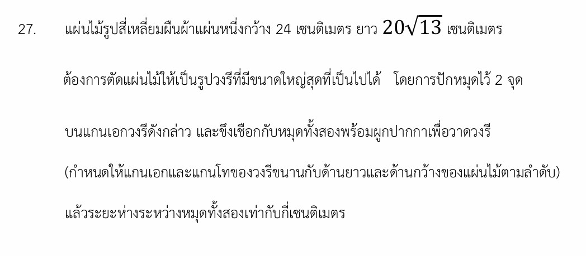

# โจทย์วงรีและการปักหมุด

โจทย์ข้อนี้เป็นแนวประยุกต์เชิงเรขาคณิตที่ยอดเยี่ยมครับ เพราะผสมผสาน **"ภาคตัดกรวย (วงรี)"** เข้ากับการแก้ปัญหาในชีวิตจริง สิ่งสำคัญที่โจทย์ข้อนี้กำลังทดสอบเราคือ **ความเข้าใจเกี่ยวกับนิยามและวิธีการสร้างวงรีในเชิงปฏิบัติ** คำตอบของโจทย์ข้อนี้คือ **ระยะห่างระหว่างหมุดทั้งสองเท่ากับ 68 เซนติเมตร**

---

## 1. วิธีทำอย่างละเอียด

### **ขั้นตอนที่ 1: วิเคราะห์ขนาดของวงรีที่ใหญ่ที่สุด**

การตัดแผ่นไม้สี่เหลี่ยมผืนผ้าให้เป็นวงรีที่ใหญ่ที่สุด โดยแกนเอกและแกนโทขนานกับด้านยาวและด้านกว้าง หมายความว่าเส้นขอบของวงรีจะต้องสัมผัสกับขอบของไม้ทั้ง 4 ด้านพอดี

* **แกนโท (Minor Axis):** ยาวเท่ากับความกว้างของแผ่นไม้พอดี

$$2b = 24 \implies b = 12\text{ เซนติเมตร}$$

* **แกนเอก (Major Axis):** ยาวเท่ากับความยาวของแผ่นไม้พอดี

$$2a = 20\sqrt{13} \implies a = 10\sqrt{13}\text{ เซนติเมตร}$$

### **ขั้นตอนที่ 2: เชื่อมโยง "หมุด" กับองค์ประกอบของวงรี**

ตามนิยามของการวาดวงรีด้วยวิธีขึงเชือก (Pins and String Method) **ตำแหน่งของหมุดทั้งสองจุดก็คือ "จุดโฟกัส (Foci)" ของวงรีนั่นเอง**
ดังนั้น โจทย์คำถามที่ว่า *"ระยะห่างระหว่างหมุดทั้งสองเท่ากับกี่เซนติเมตร"* จึงหมายถึง **การหาระยะห่างระหว่างจุดโฟกัสทั้งสอง (ซึ่งมีค่าเท่ากับ $2c$)**

### **ขั้นตอนที่ 3: คำนวณหาค่า $c$ จากความสัมพันธ์ของวงรี**

ความสัมพันธ์ระหว่างครึ่งแกนเอก ($a$), ครึ่งแกนโท ($b$) และระยะโฟกัส ($c$) คือ:

$$a^2 = b^2 + c^2$$

เราต้องการหา $c$ จึงจัดรูปใหม่ได้เป็น:

$$c^2 = a^2 - b^2$$

แทนค่า $a = 10\sqrt{13}$ และ $b = 12$ ลงไปในสมการ:

$$c^2 = (10\sqrt{13})^2 - (12)^2$$

$$c^2 = (100 \times 13) - 144$$

$$c^2 = 1300 - 144$$

$$c^2 = 1156$$

ถอดรากที่สองเพื่อหาค่า $c$:

$$c = \sqrt{1156} = 34\text{ เซนติเมตร}$$

### **ขั้นตอนที่ 4: สรุประยะห่างระหว่างหมุด**

ระยะห่างระหว่างหมุดสองตัวคือระยะระหว่างจุดโฟกัสสองจุด ($2c$)

$$\text{ระยะห่างระหว่างหมุด} = 2c = 2 \times 34 = 68\text{ เซนติเมตร}$$

---

## 2. เนื้อหาและสูตรที่เกี่ยวข้อง

### **นิยามของวงรีผ่าน "วิธีขึงเชือก" (String Construction)**

วงรี คือ เซตของจุดทั้งหมดบนระนาบซึ่งผลรวมของระยะทางจากจุดใด ๆ ไปยังจุดคงที่สองจุด (จุดโฟกัส) มีค่าคงตัวเสมอ และค่าคงตัวนั้นจะเท่ากับ **ความยาวของแกนเอก ($2a$)** เสมอ

> **ความหมายของตัวแปรและค่าคงที่:**
>
> * $a$ คือ **ความยาวครึ่งแกนเอก** (ระยะจากจุดศูนย์กลางไปยังจุดยอด)
> * $b$ คือ **ความยาวครึ่งแกนโท** (ระยะจากจุดศูนย์กลางไปยังจุดปลายแกนโท)
> * $c$ คือ **ระยะโฟกัส** (ระยะจากจุดศูนย์กลางไปยังจุดโฟกัสแต่ละข้าง)
> * **ความยาวเชือกทั้งหมด** ที่ต้องใช้ผูกกับหมุดแล้วดึงให้ตึงเพื่อวาด จะมีค่าเท่ากับ $2a + 2c$ (หากผูกเป็นบ่วงรอบหมุดทั้งสอง) หรือถ้าขึงปลายเชือกตรึงไว้ที่หมุดทั้งสอง ความยาวเชือกส่วนที่ขึงจะยาวเท่ากับ $2a$ พอดี
>
>

---

## 3. กลยุทธ์แก้โจทย์ประเภทนี้

เมื่อเจอโจทย์แนวเอาวงรีไปใส่ในรูปทรงสี่เหลี่ยม หรือโจทย์ที่เล่าเรื่องการปักหมุดผูกเชือก ให้ใช้สูตรลัดความคิดตามนี้ครับ:

1. **จับคู่ด้าน:** ด้านที่สั้นกว่าของสี่เหลี่ยมจะเป็นตัวกำหนดแกนโท ($2b$) และด้านที่ยาวกว่าจะเป็นตัวกำหนดแกนเอก ($2a$) เสมอ
2. **แปลไทยเป็นไทย:** คำว่า "หมุด" = จุดโฟกัส, คำว่า "ระยะระหว่างหมุด" = $2c$, คำว่า "ตำแหน่งหมุด" = พิกัด $(h \pm c, k)$
3. **ระวังกำลังสอง:** เวลาคิดเลขจำพวกติด Root เช่น $(10\sqrt{13})^2$ ให้กระจายกำลังสองไปที่ตัวเลขข้างหน้าด้วย จะได้เป็น $100 \times 13 = 1300$ เพื่อป้องกันความผิดพลาดในห้องสอบ

---

## 4. โจทย์เพิ่มเติมเพื่อฝึกทำพร้อมเฉลย

**โจทย์:** ช่างไม้ต้องการวาดวงรีลงบนแผ่นเหล็กรูปสี่เหลี่ยมผืนผ้าแผ่นหนึ่งซึ่งกว้าง 16 เซนติเมตร และยาว 20 เซนติเมตร โดยใช้หมุด 2 ตัวปักบนแกนเอกและใช้เชือกขึงเพื่อวาดวงรีให้มีขนาดใหญ่ที่สุดที่จะอยู่ในแผ่นเหล็กนี้ได้ จงหาว่าช่างไม้ต้องปักหมุดทั้งสองให้ห่างกันกี่เซนติเมตร

**วิธีทำ:**

1. หาขนาดแกนของวงรีที่ใหญ่ที่สุด:

* แกนโท ($2b$) จะเท่ากับด้านกว้าง $\implies 2b = 16 \implies b = 8$ เซนติเมตร
* แกนเอก ($2a$) จะเท่ากับด้านยาว $\implies 2a = 20 \implies a = 10$ เซนติเมตร

1. ใช้ความสัมพันธ์ของวงรีเพื่อหาระยะโฟกัส ($c$):

$$c^2 = a^2 - b^2$$

$$c^2 = 10^2 - 8^2$$

$$c^2 = 100 - 64 = 36$$

$$c = 6\text{ เซนติเมตร}$$

1. ระยะห่างระหว่างหมุดทั้งสองคือระยะโฟกัสทั้งหมด ($2c$):

$$\text{ระยะห่างระหว่างหมุด} = 2c = 2 \times 6 = 12\text{ เซนติเมตร}$$

**ตอบ:** ช่างไม้ต้องปักหมุดทั้งสองห่างกัน 12 เซนติเมตร
