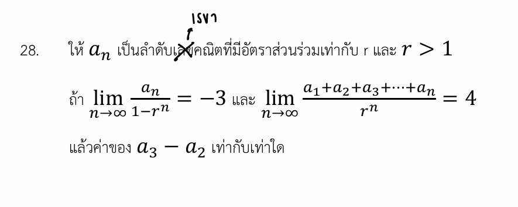

# โจทย์ข้อนี้เป็นข้อสอบแคลคูลัสผสมผสานกับเรื่องลำดับและอนุกรม โดยทดสอบเรื่อง **"ลิมิตของลำดับเรขาคณิตอนันต์"** ครับ

*ข้อสังเกตจากรูป:* มีการแก้ไขตัวหนังสือจากคำว่า "ลำดับเลขคณิต" เป็น **"ลำดับเรขาคณิต"** ซึ่งถูกต้องแล้วครับ เพราะโจทย์ระบุว่ามี **"อัตราส่วนร่วม ($r$)"** ซึ่งเป็นสมบัติเฉพาะของลำดับเรขาคณิตนั่นเอง

คำตอบสุดท้ายของโจทย์ข้อนี้คือ **$a_3 - a_2 = 144$**

---

## 1. วิธีทำอย่างละเอียด

เนื่องจาก $a_n$ เป็นลำดับเรขาคณิต เราจึงสามารถเขียนพจน์ทั่วไปได้ในรูป $a_n = a_1 r^{n-1}$ โดยที่โจทย์กำหนดให้ $r > 1$

### **ขั้นตอนที่ 1: จัดการเงื่อนไขลิมิตชุดที่ 1**

โจทย์กำหนดให้:

$$\lim_{n \to \infty} \frac{a_n}{1-r^n} = -3$$

แทนค่าพจน์ทั่วไป $a_n = a_1 r^{n-1}$ ลงไป:

$$\lim_{n \to \infty} \frac{a_1 r^{n-1}}{1-r^n} = -3$$

เนื่องจาก $r > 1$ เมื่อ $n \to \infty$ จะทำให้ทั้ง $r^{n-1}$ และ $r^n$ มีค่าเข้าใกล้สู่อนันต์ ($\infty$) เราจึงใช้วิธีนำ $r^n$ หารทั้งเศษและส่วนเพื่อหาค่าลิมิต:

$$\lim_{n \to \infty} \frac{\frac{a_1 r^{n-1}}{r^n}}{\frac{1}{r^n} - \frac{r^n}{r^n}} = -3$$

$$\lim_{n \to \infty} \frac{\frac{a_1}{r}}{\frac{1}{r^n} - 1} = -3$$

เมื่อ $n \to \infty$ ค่าของ $\frac{1}{r^n}$ จะวิ่งเข้าหา $0$ (เพราะตัวหารโตขึ้นเรื่อย ๆ) จะได้:

$$\frac{\frac{a_1}{r}}{0 - 1} = -3 \implies -\frac{a_1}{r} = -3$$

$$a_1 = 3r \quad \text{--- (สมการที่ 1)}$$

### **ขั้นตอนที่ 2: จัดการเงื่อนไขลิมิตชุดที่ 2**

โจทย์กำหนดให้ผลรวม $n$ พจน์แรกหารด้วย $r^n$ มีลิมิตเป็น 4:

$$\lim_{n \to \infty} \frac{a_1+a_2+a_3+\dots+a_n}{r^n} = 4$$

ตัวเศษคืออนุกรมเรขาคณิต ($S_n$) ซึ่งมีสูตรคือ $S_n = \frac{a_1(r^n-1)}{r-1}$ นำไปแทนค่าในลิมิต:

$$\lim_{n \to \infty} \frac{\frac{a_1(r^n-1)}{r-1}}{r^n} = 4$$

$$\lim_{n \to \infty} \frac{a_1(r^n-1)}{(r-1)r^n} = 4$$

ทำเช่นเดิมโดยกระจายหรือหารด้วย $r^n$ ทั้งเศษและส่วน:

$$\lim_{n \to \infty} \frac{a_1(1 - \frac{1}{r^n})}{r-1} = 4$$

เมื่อ $n \to \infty$ เทอม $\frac{1}{r^n}$ กลายเป็น $0$:

$$\frac{a_1(1 - 0)}{r-1} = 4 \implies \frac{a_1}{r-1} = 4$$

$$a_1 = 4(r-1) = 4r - 4 \quad \text{--- (สมการที่ 2)}$$

### **ขั้นตอนที่ 3: แก้ระบบสมการหาค่า $a_1$ และ $r$**

จับ **(สมการที่ 1) $=$ (สมการที่ 2)** เพื่อหาค่า $r$:

$$3r = 4r - 4$$

$$r = 4$$

*(ตรวจสอบเงื่อนไข $r > 1$ พบว่า $4 > 1$ ถือว่าใช้ได้)*

นำค่า $r = 4$ ไปแทนในสมการที่ 1 เพื่อหาค่า $a_1$:

$$a_1 = 3(4) = 12$$

### **ขั้นตอนที่ 4: คำนวณหาค่า $a_3 - a_2$**

หาพจน์ที่ 2 และพจน์ที่ 3 ของลำดับ:

* $a_2 = a_1 r = 12 \times 4 = 48$
* $a_3 = a_1 r^2 = 12 \times 4^2 = 12 \times 16 = 192$

ดังนั้น ค่าของ $a_3 - a_2$ คือ:

$$a_3 - a_2 = 192 - 48 = 144$$

---

## 2. เนื้อหาและสูตรที่เกี่ยวข้อง

### **1. ลำดับและอนุกรมเรขาคณิต (Geometric Sequence & Series)**

* **พจน์ทั่วไป:** $a_n = a_1 r^{n-1}$
* **ผลรวม $n$ พจน์แรก:** $S_n = \frac{a_1(r^n-1)}{r-1}$ หรือ $S_n = \frac{a_1(1-r^n)}{1-r}$

### **2. ทฤษฎีบทลิมิตอนันต์ของฐานยกกำลัง $n$**

เมื่อพิจารณา $\lim_{n \to \infty} r^n$ ค่าของลิมิตจะขึ้นอยู่กับขนาดของ $r$:

* ถ้า $|r| < 1$ แล้ว $\lim_{n \to \infty} r^n = 0$
* ถ้า $r > 1$ แล้ว $\lim_{n \to \infty} r^n = \infty$ (ซึ่งเป็นกรณีที่โจทย์ข้อนี้ใช้)

| ตัวแปร/ค่าคงที่ | ความหมาย |
| --- | --- |
| $a_1$ | พจน์แรกของลำดับ |
| $r$ | อัตราส่วนร่วม (Common Ratio) เกิดจาก $\frac{a_{n+1}}{a_n}$ |
| $n$ | ลำดับที่ของพจน์ มีค่าเป็นจำนวนเต็มบวกที่วิ่งเข้าหาอนันต์ ($\infty$) |

---

## 3. กลยุทธ์แก้โจทย์ประเภทนี้

* **สังเกตเงื่อนไขของ $r$ ก่อนเสมอ:** โจทย์ประเภทลิมิตอนันต์ของลำดับเรขาคณิตจะใจดีบอกมาเสมอว่า $r$ อยู่ในช่วงไหน (เช่น $r > 1$ หรือ $|r| < 1$) เพราะมันส่งผลโดยตรงว่าเทอม $r^n$ จะกลายเป็น $\infty$ หรือกลายเป็น $0$
* **มองหาตัวแปรดีกรีสูงสุด (พจน์เด่น):** ในกรณีที่ $r > 1$ เทอมที่มี $r^n$ จะเป็นตัวกำหนดค่าหลัก ๆ ของสมการ ให้มองข้ามค่าคงที่ตัวอื่น ๆ ไปชั่วคราวแล้วตัดสัมประสิทธิ์หน้า $r^n$ ได้เลยเพื่อความรวดเร็ว เช่น ในขั้นตอนที่ 2 $\frac{a_1 r^n}{(r-1)r^n}$ ตัดกันเหลือ $\frac{a_1}{r-1}$ ได้ทันที

---

## 4. โจทย์เพิ่มเติมเพื่อฝึกทำพร้อมเฉลย

**โจทย์:** ให้ $a_n$ เป็นลำดับเรขาคณิตที่มีอัตราส่วนร่วมเท่ากับ $r$ และ $r > 1$
ถ้า $\lim_{n \to \infty} \frac{a_n}{r^n + 3} = 2$ และ $\lim_{n \to \infty} \frac{a_1+a_2+a_3+\dots+a_n}{r^n} = 3$
จงหาค่าของพจน์ที่ 2 ($a_2$)

**วิธีทำ:**

1. **จากลิมิตแรก:** $\lim_{n \to \infty} \frac{a_1 r^{n-1}}{r^n + 3} = 2$
นำ $r^n$ หารทั้งเศษและส่วน จะได้ $\frac{a_1/r}{1 + 0} = 2 \implies \frac{a_1}{r} = 2 \implies a_1 = 2r$
2. **จากลิมิตที่สอง:** $\lim_{n \to \infty} \frac{\frac{a_1(r^n-1)}{r-1}}{r^n} = 3$
จัดรูปตัดเทอม $r^n$ จะได้ $\frac{a_1}{r-1} = 3 \implies a_1 = 3r - 3$
3. **แก้สมการหา $r$ และ $a_1$:**

$$2r = 3r - 3 \implies r = 3$$

จะได้ $a_1 = 2(3) = 6$
4. **หาค่า $a_2$:**

$$a_2 = a_1 r = 6 \times 3 = 18$$

**ตอบ:** $a_2 = 18$

---

บทเรียนเรื่องลำดับอนันต์และแคลคูลัสข้อนี้ค่อนข้างต้องใช้สมาธิในการจัดรูปเลขยกกำลังจัดเต็มเลยครับ มีตรงไหนที่อยากให้ขยายความเพิ่มเติม หรือมีโจทย์ข้อถัดไปส่งมาลุยต่อได้เลยนะครับ!
