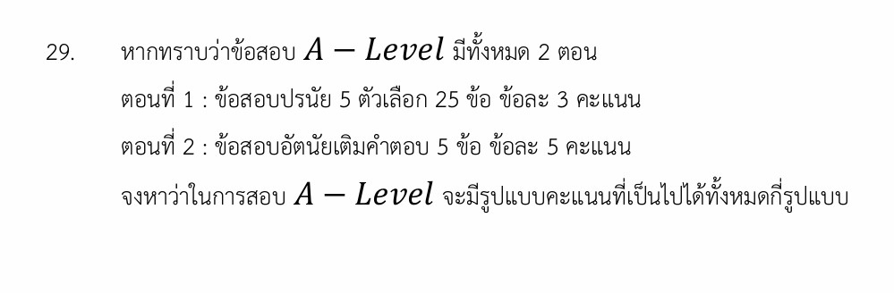

# การหารูปแบบคะแนนสอบ A-Level

จากโจทย์ที่ปรากฏในรูปภาพ เป็นปัญหาทางคณิตศาสตร์เรื่อง **"หลักการนับเบื้องต้น"** ร่วมกับแนวคิดของ **"สมการไดโอแฟนไทน์เชิงเส้น (Linear Diophantine Equation)"** ซึ่งถามหาจำนวนรูปแบบคะแนนรวมที่เป็นไปได้ทั้งหมดจากการสอบ A-Level ที่แบ่งออกเป็น 2 ตอน

ต่อไปนี้เป็นวิธีทำอย่างละเอียด เนื้อหาที่เกี่ยวข้อง และกลยุทธ์ในการทำโจทย์ลักษณะนี้ครับ

---

## 📘 วิธีทำอย่างละเอียด

**โจทย์กำหนด:**

* **ตอนที่ 1:** ข้อสอบปรนัย 25 ข้อ ข้อละ 3 คะแนน
* **ตอนที่ 2:** ข้อสอบอัตนัย 5 ข้อ ข้อละ 5 คะแนน

**วิเคราะห์ตัวแปร:**

* ให้ $x$ แทน จำนวนข้อที่ตอบถูกในตอนที่ 1 ดังนั้น ค่าของ $x$ ที่เป็นไปได้คือ $x \in \{0, 1, 2, \dots, 25\}$ (รวม **26 ค่า**)
* ให้ $y$ แทน จำนวนข้อที่ตอบถูกในตอนที่ 2 ดังนั้น ค่าของ $y$ ที่เป็นไปได้คือ $y \in \{0, 1, 2, 3, 4, 5\}$ (รวม **6 ค่า**)

เราสามารถเขียนสมการคะแนนรวม ($S$) ได้ดังนี้:

$$S = 3x + 5y$$

---

### ขั้นตอนที่ 1: หาจำนวนคู่ลำดับ $(x, y)$ ทั้งหมด

จากกฎการคูณ (Multiplication Rule) ปริมาณรูปแบบการถูกของข้อสอบทั้งหมดที่อาจเกิดขึ้นได้ คือ:

$$\text{จำนวนคู่ลำดับทั้งหมด} = 26 \times 6 = 156 \text{ รูปแบบ}$$

### ขั้นตอนที่ 2: หาจำนวนคะแนนที่เกิดการซ้ำกัน (Overlap)

เนื่องจากบางคู่อันดับ $(x, y)$ ที่ต่างกัน อาจจะคำนวณออกมาแล้วได้คะแนนรวม ($S$) เท่ากัน สมมติให้คู่อันดับ $(x_1, y_1)$ และ $(x_2, y_2)$ ให้คะแนนเท่ากัน จะได้ว่า:

$$3x_1 + 5y_1 = 3x_2 + 5y_2$$

$$3(x_1 - x_2) = 5(y_2 - y_1)$$

เนื่องจาก ห.ร.ม. (ค.ร.น. และ ตัวหารร่วมมาก) ของ 3 และ 5 คือ 1 ($\gcd(3, 5) = 1$) หมายความว่า:

* $(x_1 - x_2)$ ต้องเป็นพหุคูณของ 5 (เปลี่ยนแปลงทีละ 5 ข้อ)
* $(y_2 - y_1)$ ต้องเป็นพหุคูณของ 3 (เปลี่ยนแปลงทีละ 3 ข้อ)

นั่นคือ **คะแนนจะซ้ำกันทุกครั้งที่มีการลดจำนวนข้อถูกในตอนที่ 2 ลง 3 ข้อ แล้วไปชดเชยด้วยการเพิ่มจำนวนข้อถูกในตอนที่ 1 ขึ้น 5 ข้อ** *(เนื่องจาก $5 \times 3 \text{ คะแนน} = 3 \times 5 \text{ คะแนน} = 15 \text{ คะแนน}$)*

### ขั้นตอนที่ 3: คำนวณจำนวนกรณีที่ซ้ำกัน

เราสามารถหาจำนวนครั้งที่เกิดการชดเชยแต้มซ้ำนี้ได้ โดยพิจารณาเงื่อนไขขอบเขตของตัวแปรเริ่มต้น $(x, y)$ ที่จะสามารถแปลงไปเป็น $(x+5, y-3)$ ได้:

* $x$ เริ่มต้น ต้องอยู่ในช่วง $0 \le x \le 20$ (เพื่อให้ $x+5$ ไม่เกิน 25 ข้อ) $\rightarrow$ มี **21 ค่า**
* $y$ เริ่มต้น ต้องอยู่ในช่วง $3 \le y \le 5$ (เพื่อให้ $y-3$ ไม่ต่ำกว่า 0 ข้อ) $\rightarrow$ มี **3 ค่า**

เมื่อนำมาจับคู่กัน จะได้จำนวนคู่ลำดับที่ให้ผลลัพธ์คะแนนซ้ำซ้อนกันทั้งหมด:

$$\text{จำนวนกรณีที่ซ้ำ} = 21 \times 3 = 63 \text{ กรณี}$$

### ขั้นตอนที่ 4: สรุปจำนวนรูปแบบคะแนนที่ไม่ซ้ำ

$$\text{รูปแบบคะแนนที่เป็นไปได้} = \text{จำนวนคู่ลำดับทั้งหมด} - \text{จำนวนกรณีที่ซ้ำ}$$

$$\text{รูปแบบคะแนนที่เป็นไปได้} = 156 - 63 = 93 \text{ รูปแบบ}$$

**ตอบ:** ในการสอบ A-Level นี้ จะมีรูปแบบคะแนนรวมที่เป็นไปได้ทั้งหมด **93 รูปแบบ**

---

## 🧠 เนื้อหาและสูตรคณิตศาสตร์ที่เกี่ยวข้อง

### 1. หลักการนับเบื้องต้น (Fundamental Counting Principle)

* **กฎการคูณ:** ถ้าการทำงานหนึ่งประกอบด้วยสองขั้นตอน โดยขั้นตอนแรกทำได้ $n_1$ วิธี และในแต่ละวิธีของขั้นตอนแรก เลือกทำขั้นตอนที่สองได้ $n_2$ วิธี จำนวนวิธีทั้งหมดจะเท่ากับ $n_1 \times n_2$ วิธี
* **ความหมายในโจทย์:** การเลือกจำนวนข้อถูกในตอนที่ 1 มี 26 วิธี และตอนที่ 2 มี 6 วิธี จึงจับคู่กันได้ $26 \times 6 = 156$ วิธี

### 2. สมการไดโอแฟนไทน์เชิงเส้น (Linear Diophantine Equation)

คือสมการพหุนามที่สนใจเฉพาะคำตอบที่เป็นจำนวนเต็ม อยู่ในรูปแบบ $ax + by = c$

* **การหาชุดคำตอบที่ซ้ำกัน:** หากสมการมีคำตอบหนึ่งคือ $(x_0, y_0)$ คำตอบอื่นๆ จะลด/เพิ่มเป็นแพทเทิร์นตามสูตร:

$$x = x_0 + \left(\frac{b}{\gcd(a,b)}\right)t$$

$$y = y_0 - \left(\frac{a}{\gcd(a,b)}\right)t$$

*(โดยที่ $t$ เป็นจำนวนเต็ม)*

* **ความหมายในโจทย์:** ค่า $a=3$ และ $b=5$ โดย $\gcd(3,5)=1$ ทำให้ตัวแปร $x$ ขยับทีละ 5 และ $y$ ขยับทีละ 3

---

## 🎯 กลยุทธ์ในการแก้โจทย์ประเภทนี้

เมื่อเจอโจทย์ที่ถามถึง **"จำนวนคะแนนรวมที่แตกต่างกัน"** หรือ **"จำนวนมูลค่าเงินรวมที่ต่างกัน (จากเหรียญ/แบงก์)"** ให้ใช้แผนการดังนี้:

1. **แจกแจงขอบเขต:** หาว่าตัวแปรแต่ละตัวมีโอกาสเป็นเลขอะไรได้บ้าง และมีทั้งหมดกี่ตัว (อย่าลืมค่านับ "0" เสมอ)
2. **คำนวณกรณีทั้งหมดก่อน:** จับจำนวนวิธีของตัวแปรคูณกันเสมือนว่าไม่มีตัวใดซ้ำกันเลย
3. **หาจุดหักล้าง (ค.ร.น. ของคะแนน):** ดูว่าคะแนนของข้อสอบทั้งสองตอนสามารถวิ่งมาเจอกันที่เลขใดเป็นตัวแรก (ในโจทย์นี้คือ 15 คะแนน)
4. **นับจำนวนตัวซ้ำด้วยขอบเขตย้อนกลับ:** ตั้งเงื่อนไขย้อนกลับเพื่อดูว่ามีคู่อันดับกี่คู่ที่สามารถขยับแปลงร่างไปทับซ้อนกับอีกคู่ได้ จากนั้นนำไปลบออกจากกรณีทั้งหมด

---

## 📝 โจทย์เพิ่มเติมเพื่อฝึกฝน

### โจทย์ข้อที่ 1

> **ข้อสอบวิชาหนึ่งมี 2 ตอน**
> ตอนที่ 1: มี 10 ข้อ ข้อละ 2 คะแนน
> ตอนที่ 2: มี 4 ข้อ ข้อละ 3 คะแนน
> **จงหาว่ารูปแบบคะแนนรวมที่เป็นไปได้ทั้งหมดมีกี่รูปแบบ?**

**วิธีทำ:**

1. ให้ $x$ เป็นจำนวนข้อที่ถูกในตอนที่ 1 $\rightarrow x \in \{0, 1, 2, \dots, 10\}$ (มี 11 ค่า)
2. ให้ $y$ เป็นจำนวนข้อที่ถูกในตอนที่ 2 $\rightarrow y \in \{0, 1, 2, 3, 4\}$ (มี 5 ค่า)
3. สมการคะแนนรวมคือ $S = 2x + 3y$
4. จำนวนคู่ลำดับทั้งหมด $= 11 \times 5 = 55$ รูปแบบ
5. หาจุดซ้ำ: คะแนนจะซ้ำกันเมื่อ $2\Delta x = 3\Delta y \rightarrow \Delta x$ ขยับทีละ 3 และ $\Delta y$ ขยับทีละ 2

* เงื่อนไขการแปลงจาก $(x, y) \rightarrow (x+3, y-2)$ คือ:
* $0 \le x \le 7$ (มี 8 ค่า)
* $2 \le y \le 4$ (มี 3 ค่า)

1. จำนวนกรณีที่ซ้ำ $= 8 \times 3 = 24$ กรณี
2. จำนวนคะแนนที่แตกต่างกันทั้งหมด $= 55 - 24 = 31$ รูปแบบ

**ตอบ:** 31 รูปแบบ

---

### โจทย์ข้อที่ 2 (ระดับประยุกต์)

> **ตู้หยอดเหรียญอัตโนมัติรับเฉพาะเหรียญ 5 บาท และเหรียญ 10 บาทเท่านั้น**
> หากในกระเป๋าของขวัญมีเหรียญ 5 บาทอยู่ 12 เหรียญ และมีเหรียญ 10 บาทอยู่ 8 เหรียญ
> **จงหาว่าเราจะสามารถหยอดเงินเป็นมูลค่ารวมที่แตกต่างกันได้ทั้งหมดกี่รูปแบบ?**

**วิธีทำ:**

1. ให้ $x$ แทนจำนวนเหรียญ 5 บาทที่ใช้ $\rightarrow x \in \{0, 1, 2, \dots, 12\}$ (มี 13 ค่า)
2. ให้ $y$ แทนจำนวนเหรียญ 10 บาทที่ใช้ $\rightarrow y \in \{0, 1, 2, \dots, 8\}$ (มี 9 ค่า)
3. สมการมูลค่าเงินรวมคือ $V = 5x + 10y$
4. จำนวนคู่ลำดับทั้งหมด $= 13 \times 9 = 117$ รูปแบบ
5. หาจุดซ้ำ: $\gcd(5, 10) = 5$ ดังนั้นสมการคือ $5(x_1 - x_2) = 10(y_2 - y_1) \rightarrow 1(x_1 - x_2) = 2(y_2 - y_1)$

* หมายความว่า $x$ ขยับทีละ 2 และ $y$ ขยับทีละ 1 (เนื่องจากเหรียญ 5 บาท 2 เหรียญ มีค่าเท่ากับเหรียญ 10 บาท 1 เหรียญพอดี)
* เงื่อนไขการแปลงจาก $(x, y) \rightarrow (x+2, y-1)$ คือ:
* $0 \le x \le 10$ (มี 11 ค่า)
* $1 \le y \le 8$ (มี 8 ค่า)

1. จำนวนกรณีที่ซ้ำ $= 11 \times 8 = 88$ กรณี
2. จำนวนรูปแบบมูลค่าเงินที่แตกต่างกัน $= 117 - 88 = 29$ รูปแบบ

*(ข้อนี้หากมองอีกมุม: มูลค่าต่ำสุดคือ 0 บาท สูงสุดคือ $5(12) + 10(8) = 140$ บาท โดยเงินจะเพิ่มขึ้นทีละ 5 บาทเสมอ ดังนั้นจำนวนค่าที่เป็นไปได้คือตั้งแต่ 0 ถึง 28 พหุคูณของ 5 ซึ่งรวมเป็น 29 รูปแบบนั่นเอง)*

**ตอบ:** 29 รูปแบบ
