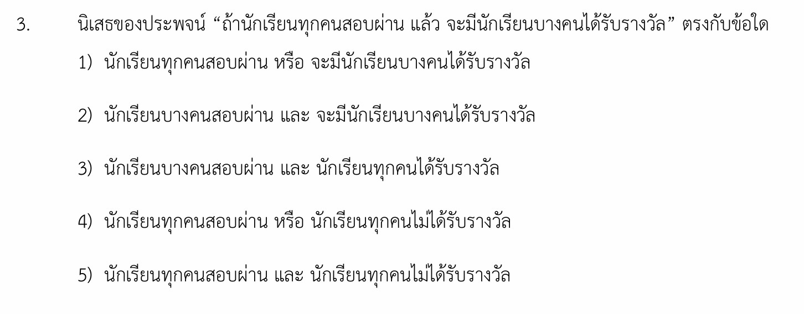

# เฉลยโจทย์ข้อที่ 3: นิเสธของประพจน์เชิงประกอบ

นี่คือเฉลยวิธีทำอย่างละเอียดของโจทย์ข้อที่ 3 พร้อมเนื้อหาอธิบายเพิ่มเติมเกี่ยวกับตรรกศาสตร์ของประพจน์เชิงประกอบและตัวบ่งปริมาณ รวมถึงกลยุทธ์การทำโจทย์แบบรวดเร็วครับ

---

## 1. เฉลยวิธีทำอย่างละเอียด

**โจทย์ถาม:** นิเสธของประพจน์ **“ถ้านักเรียนทุกคนสอบผ่าน แล้ว จะมีนักเรียนบางคนได้รับรางวัล”** ตรงกับข้อใด

**ขั้นตอนที่ 1: แยกโครงสร้างประพจน์หลัก**
ประพจน์ที่โจทย์ให้มาเชื่อมด้วยตัวเชื่อมหลักคือ **"ถ้า...แล้ว..." ($\rightarrow$)**

* ให้ประพจน์หน้า ($P$) คือ: "นักเรียนทุกคนสอบผ่าน"
* ให้ประพจน์หลัง ($Q$) คือ: "จะมีนักเรียนบางคนได้รับรางวัล"
เขียนในรูปโครงสร้างสัญลักษณ์ตรรกศาสตร์ได้เป็น: $P \rightarrow Q$

**ขั้นตอนที่ 2: หานิเสธของโครงสร้างหลัก**
โจทย์ต้องการหา "นิเสธ" ของประพจน์ทั้งหมด นั่นคือ $\sim(P \rightarrow Q)$
ตามกฎความสมมูลในตรรกศาสตร์ นิเสธของถ้า...แล้ว จะต้องเปลี่ยนตัวเชื่อมเป็น **"และ" ($\wedge$)** ตามความสัมพันธ์ด้านล่างนี้:

$$\sim(P \rightarrow Q) \equiv P \wedge \sim Q$$

*(หรือจำหลักการง่ายๆ ว่า: นิเสธของ "ถ้าหน้าแล้วหลัง" คือ **"หน้า และ ไม่หลัง"**)*

**ขั้นตอนที่ 3: หานิเสธของประพจน์ย่อยที่มีตัวบ่งปริมาณ ($\sim Q$)**

* ประพจน์หลัง ($Q$) คือ: "จะมีนักเรียน**บางคน**ได้รับรางวัล" (มีตัวบ่งปริมาณคำว่า "บางคน")
* ตามกฎตรรกศาสตร์ นิเสธของตัวบ่งปริมาณคำว่า **"บางคน..."** คือ **"ทุกคนไม่..."**
* ดังนั้น นิเสธของประพจน์หลัง ($\sim Q$) จึงเปลี่ยนเป็น: **"นักเรียนทุกคนไม่ได้รับรางวัล"**

**ขั้นตอนที่ 4: รวมประพจน์ตามรูปแบบ $P \wedge \sim Q$**
นำข้อความจากขั้นตอนที่ 1 ($P$) และขั้นตอนที่ 3 ($\sim Q$) มาเชื่อมกันด้วยคำว่า **"และ"** จะได้ประพจน์ที่เป็นนิเสธคือ:

> **"นักเรียนทุกคนสอบผ่าน และ นักเรียนทุกคนไม่ได้รับรางวัล"**

เมื่อตรวจสอบกับตัวเลือกในโจทย์ จะตรงกับ **ตัวเลือกที่ 5)**

---

## 2. เนื้อหารายละเอียดเพื่อศึกษาเพิ่มเติม

โจทย์ข้อนี้เป็นการผสมผสานระหว่าง **นิเสธของตัวเชื่อมประพจน์** และ **นิเสธของข้อความที่มีตัวบ่งปริมาณ (Quantifiers)** ซึ่งมีหลักการสำคัญที่ออกสอบบ่อยดังนี้ครับ:

### ก. นิเสธของตัวเชื่อมประพจน์หลัก

* **นิเสธของ ถ้า...แล้ว:** $\sim(p \rightarrow q) \equiv p \wedge \sim q$ *(ข้อควรระวัง: ประพจน์ตัวหน้าจะยังคงเดิม ไม่ต้องใส่นิเสธ)*
* **นิเสธของ และ:** $\sim(p \wedge q) \equiv \sim p \vee \sim q$
* **นิเสธของ หรือ:** $\sim(p \vee q) \equiv \sim p \wedge \sim q$

### ข. นิเสธของตัวบ่งปริมาณ

เมื่อต้องหาปฏิเสธหรือนิเสธของข้อความที่มีคำระบุจำนวน ให้สลับขั้วตามตารางนี้:

| ข้อความตั้งต้น | ข้อความที่เป็นนิเสธ |
| --- | --- |
| **ทุกคน / ทั้งหมด / ทุกสิ่ง** | **มีบางคน...ไม่ / มีบางสิ่ง...ไม่** |
| **มีบางคน / มีบางอย่าง** | **ทุกคน...ไม่ / ทุกสิ่ง...ไม่** |

---

## 3. กลยุทธ์แก้โจทย์ประเภทนี้ (เทคนิค "ตัดช้อยส์")

ในห้องสอบเราสามารถหาคำตอบที่ถูกต้องได้ภายใน 10 วินาที โดยใช้ **"กลยุทธ์ 3 สเต็ปตัด"** ดังนี้:

1. **สเต็ปที่ 1 (ดูตัวเชื่อม):** นิเสธของประพจน์ "ถ้า...แล้ว..." ผลลัพธ์สุดท้ายปลายทาง**ต้องเชื่อมด้วยคำว่า "และ" เท่านั้น** * ช้อยส์ 1) และ 4) เชื่อมด้วย "หรือ" $\rightarrow$ **ตัดทิ้งทันที** (เหลือช้อยส์ 2, 3, 5)
2. **สเต็ปที่ 2 (ดูตัวหน้า):** จากสูตร $P \wedge \sim Q$ จะเห็นว่าตัวหน้าสุด ($P$) ต้องเหมือนเดิมทุกประการ ไม่มีการเปลี่ยนคำใดๆ ดังนั้นตัวหน้าต้องเป็น "นักเรียนทุกคนสอบผ่าน"

* ช้อยส์ 2) และ 3) เปลี่ยนคำข้างหน้าเป็น "นักเรียนบางคน..." $\rightarrow$ **ตัดทิ้งทันที**

1. **สเต็ปที่ 3 (เลือกคำตอบ):** เมื่อตัดช้อยส์อื่นหมดแล้ว จะเหลือเพียง **ตัวเลือกที่ 5)** ซึ่งเป็นคำตอบที่ถูกต้องทันทีโดยไม่ต้องเสียเวลาแปลประพจน์ท่อนหลัง

---

## 4. ตัวอย่างโจทย์เพิ่มเติมเพื่อฝึกทำพร้อมเฉลย

**โจทย์ข้อที่ 1:** จงหานิเสธของประพจน์ "ถ้าประชาชนทุกคนเสียภาษี แล้ว จะมีถนนบางสายชำรุด"

**วิธีทำ:**

1. จัดให้อยู่ในรูปโครงสร้าง $P \rightarrow Q$ โดย $P$ คือ "ประชาชนทุกคนเสียภาษี" และ $Q$ คือ "มีถนนบางสายชำรุด"
2. สูตรนิเสธของโครงสร้างนี้คือ $P \wedge \sim Q$
3. หานิเสธของก้อนหลัง ($\sim Q$): นิเสธของ "มีถนนบางสายชำรุด" คือ **"ถนนทุกสายไม่ชำรุด"**
4. นำมารวมกันโดยเชื่อมด้วยคำว่า "และ":
**"ประชาชนทุกคนเสียภาษี และ ถนนทุกสายไม่ชำรุด"**

**โจทย์ข้อที่ 2:**
นิเสธของข้อความ "คนบางคนชอบสุนัข หรือ คนทุกคนชอบแมว" ตรงกับข้อใด

**วิธีทำ:**

1. จัดโครงสร้างประพจน์หลัก: ข้อความเชื่อมด้วย **"หรือ" ($\vee$)** รูปฟอร์มคือ $P \vee Q$
2. หานิเสธของโครงสร้างหลักตามกฎเดอมอร์แกน: $\sim(P \vee Q) \equiv \sim P \wedge \sim Q$ (ต้องเปลี่ยน "หรือ" เป็น "และ" พร้อมสลับเป็นนิเสธทั้งคู่)
3. หา $\sim P$: นิเสธของ "คนบางคนชอบสุนัข" คือ **"คนทุกคนไม่ชอบสุนัข"**
4. หา $\sim Q$: นิเสธของ "คนทุกคนชอบแมว" คือ **"คนบางคนไม่ชอบแมว"**
5. นำมาประกอบกันด้วยตัวเชื่อม "และ":
**"คนทุกคนไม่ชอบสุนัข และ คนบางคนไม่ชอบแมว"**
