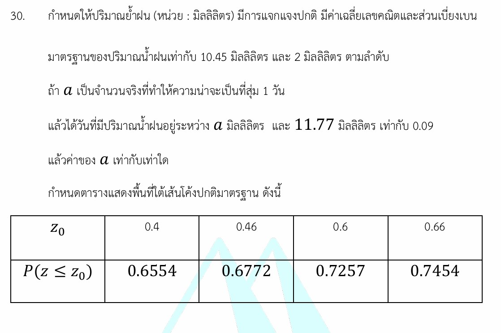

# การแจกแจงปกติ (Normal Distribution)

จากโจทย์ที่ปรากฏในรูปภาพ เป็นปัญหาทางคณิตศาสตร์เรื่อง **"การแจกแจงปกติ (Normal Distribution)"** ซึ่งเป็นหัวข้อสำคัญในวิชาสถิติ โดยโจทย์ข้อนี้ทดสอบการแปลงค่าข้อมูลจริงให้เป็นคะแนนมาตรฐาน ($z$-score) และการอ่านตารางพื้นที่ใต้เส้นโค้งปกติ

ต่อไปนี้เป็นวิธีทำอย่างละเอียด เนื้อหาหลักการ และกลยุทธ์ในการทำโจทย์ลักษณะนี้ครับ

---

## 📘 วิธีทำอย่างละเอียด

**โจทย์กำหนด:**

* ค่าเฉลี่ยเลขคณิต ($\mu$) = 10.45 มิลลิเมตร
* ส่วนเบี่ยงเบนมาตรฐาน ($\sigma$) = 2 มิลลิเมตร
* ความน่าจะเป็นที่ปริมาณน้ำฝนอยู่ระหว่าง $a$ มิลลิเมตร และ 11.77 มิลลิเมตร เท่ากับ 0.09

**ขั้นตอนที่ 1: แปลงปริมาณน้ำฝนที่ทราบค่า ($X = 11.77$) ให้เป็นคะแนนมาตรฐาน ($z$)**
จากสูตรการหาคะแนนมาตรฐาน:

$$z = \frac{X - \mu}{\sigma}$$

แทนค่าเข้าไปในสูตรเพื่อหาค่า $z$ ของ 11.77:

$$z_{11.77} = \frac{11.77 - 10.45}{2} = \frac{1.32}{2} = 0.66$$

**ขั้นตอนที่ 2: หาพื้นที่สะสมทางซ้ายของ $z = 0.66$ จากตาราง**
เมื่อพิจารณาตารางที่โจทย์กำหนดให้ ในช่องที่ $z_0 = 0.66$ จะได้ค่าความน่าจะเป็นสะสมคือ:

$$P(z \le 0.66) = 0.7454$$

**ขั้นตอนที่ 3: วิเคราะห์หาพื้นที่สะสมของค่า $a$**
โจทย์บอกว่า ความน่าจะเป็น (หรือพื้นที่ใต้เส้นโค้ง) ที่อยู่ระหว่าง $a$ และ 11.77 มีค่าเท่ากับ 0.09 สามารถเขียนเป็นประโยคสัญลักษณ์ได้ว่า:

$$P(z_a \le z \le 0.66) = 0.09$$

จากคุณสมบัติของพื้นที่ใต้เส้นโค้ง ความกว้างของพื้นที่ตรงกลางหาได้จากพื้นที่สะสมตัวมาก ลบด้วยพื้นที่สะสมตัวน้อย:

$$P(z \le 0.66) - P(z \le z_a) = 0.09$$

$$0.7454 - P(z \le z_a) = 0.09$$

$$P(z \le z_a) = 0.7454 - 0.09 = 0.6554$$

**ขั้นตอนที่ 4: นำค่าพื้นที่ที่ได้ไปเปิดตารางย้อนกลับเพื่อหาค่า $z_a$**
เมื่อดูในตาราง ค่า $P(z \le z_0) = 0.6554$ จะตรงกับค่าค่า $z_0 = 0.4$ พอดี
ดังนั้น คะแนนมาตรฐานของ $a$ คือ **$z_a = 0.4$**

**ขั้นตอนที่ 5: แปลงค่าคะแนนมาตรฐาน ($z_a$) กลับเป็นค่าข้อมูลดิบ ($a$)**
จากสูตรเดิมย้ายข้างเพื่อหา $X$:

$$X = \mu + z\cdot\sigma$$

$$a = 10.45 + (0.4 \times 2)$$

$$a = 10.45 + 0.8 = 11.25$$

**ตอบ:** ค่าของ $a$ เท่ากับ **11.25**

---

## 🧠 เนื้อหาที่เกี่ยวข้องและสูตรคณิตศาสตร์

### 1. การแจกแจงปกติ (Normal Distribution)

ข้อมูลในธรรมชาติส่วนใหญ่มักมีการกระจายตัวในลักษณะสมมาตรซ้ายขวา เรียกว่า **"เส้นโค้งรูประฆังคว่ำ"** จุดที่อยู่ตรงกลางสูงที่สุดคือค่าเฉลี่ยเลขคณิต ($\mu$) ซึ่งจะแบ่งข้อมูลออกเป็นสองฝั่ง ฝั่งละ 50% หรือคิดเป็นพื้นที่ 0.5 เท่ากันทั้งสองข้าง

### 2. ความหมายของสูตรและตัวแปร

เนื่องจากข้อมูลดิบแต่ละประเภทมีหน่วยและฐานที่แตกต่างกัน สถาปนิกทางสถิติจึงคิดค้น **คะแนนมาตรฐาน ($z$-score)** เพื่อปรับฐานข้อมูลให้เป็นมาตรฐานเดียวกัน (มีเฉลี่ยเป็น 0 และส่วนเบี่ยงเบนเป็น 1 เสมอ)

$$z = \frac{X - \mu}{\sigma}$$

* **$z$ (คะแนนมาตรฐาน):** ค่าที่บอกว่าข้อมูลดิบนั้นๆ อยู่ห่างจากค่าเฉลี่ยไปกี่หน่วยของส่วนเบี่ยงเบนมาตรฐาน (ถ้าค่า $z$ เป็นบวก แปลว่ามากกว่าค่าเฉลี่ย)
* **$X$ (ข้อมูลดิบ):** ค่าตัวแปรที่โจทย์สนใจ ณ จุดนั้นๆ (ในโจทย์นี้คือ ปริมาณน้ำฝน)
* **$\mu$ (มิว - ค่าเฉลี่ยเลขคณิต):** ค่ากลางของข้อมูลทั้งหมด
* **$\sigma$ (ซิกมา - ส่วนเบี่ยงเบนมาตรฐาน):** ค่าที่วัดความกระจายตัวของข้อมูลออกจากค่ากลาง

### 3. การอ่านตารางพื้นที่สะสม $P(z \le z_0)$

ตารางในโจทย์ข้อนี้เป็นแบบ **"พื้นที่สะสมนับจากหางฝั่งซ้ายสุดมาจนถึงจุด $z_0$"** ค่าที่ได้จะเริ่มต้นจากใกล้ๆ 0 (ฝั่งซ้ายสุด) วิ่งผ่านตรงกลางที่ $z=0$ (พื้นที่เท่ากับ 0.5) และสะสมขึ้นไปเรื่อยๆ จนเกือบเต็ม 1 ที่ฝั่งขวาสุด

---

## 🎯 กลยุทธ์ในการแก้โจทย์ประเภทนี้

1. **สเกตช์ภาพเส้นโค้งคว่ำระฆังคร่าวๆ ทุกครั้ง:** ลงจุดตำแหน่ง $z = 0$ ไว้ตรงกลาง แล้วระบายสีพื้นที่ที่โจทย์กำหนด จะช่วยให้เห็นภาพชัดเจนว่าต้องนำพื้นที่ไปบวกหรือลบกันแน่
2. **เดินทีละก้าวเชื่อมผ่าน $z$:** * หากโจทย์ให้ข้อมูลจริง $\rightarrow$ หาค่า $z$ $\rightarrow$ นำ $z$ ไปหาพื้นที่ในตาราง

* หากโจทย์ให้พื้นที่/ความน่าจะเป็น $\rightarrow$ เปิดตารางหา $z$ $\rightarrow$ นำ $z$ ไปถอดกลับเป็นข้อมูลจริง

1. **เช็กประเภทตาราง:** ระวังหัวตารางให้ดี ในระดับข้อสอบสากลหรือ A-Level มักจะให้ตารางแบบพื้นที่สะสมฝั่งซ้าย ($P(z \le z_0)$) แต่ต้องดูให้แน่ใจทุกครั้งก่อนคำนวณ

---

## 📝 โจทย์เพิ่มเติมเพื่อฝึกฝน

### โจทย์ข้อที่ 1

> คะแนนสอบวิชาคณิตศาสตร์ของนักเรียนกลุ่มหนึ่งมีการแจกแจงปกติ โดยมีค่าเฉลี่ยเท่ากับ 60 คะแนน และส่วนเบี่ยงเบนมาตรฐานเท่ากับ 5 คะแนน ถ้าสุ่มเลือกนักเรียนมา 1 คน พบว่าความน่าจะเป็นที่เขาจะได้คะแนนอยู่ระหว่าง 60 ถึง $b$ คะแนน เท่ากับ 0.3413 จงหาค่าของ $b$
> *(กำหนดให้ $P(z \le 0) = 0.5000$ และ $P(z \le 1.0) = 0.8413$)*

**วิธีทำ:**

1. แปลงคะแนน 60 เป็นค่า $z$: จะได้ $z_{60} = \frac{60-60}{5} = 0$
2. ค่า $z=0$ อยู่ที่จุดกึ่งกลางพอดี มีพื้นที่สะสมฝั่งซ้ายเท่ากับ 0.5000
3. โจทย์ต้องการพื้นที่ระหว่าง 60 ถึง $b$ ซึ่งเท่ากับ 0.3413 แสดงว่าคะแนน $b$ อยู่ฝั่งขวาของค่ากลาง พื้นที่สะสมทั้งหมดถึงจุด $b$ จึงเท่ากับ $0.5000 + 0.3413 = 0.8413$
4. เปิดตารางย้อนกลับ: พื้นที่สะสม 0.8413 ตรงกับค่า $z_b = 1.0$
5. แปลง $z_b$ กลับเป็นคะแนนจริง:

$$1.0 = \frac{b - 60}{5}$$

$$5 = b - 60 \implies b = 65$$

**ตอบ:** ค่าของ $b$ เท่ากับ **65 คะแนน**

---

### โจทย์ข้อที่ 2

> อายุการใช้งานของหลอดไฟยี่ห้อหนึ่งมีการแจกแจงปกติ มีค่าเฉลี่ย 1,200 ชั่วโมง และส่วนเบี่ยงเบนมาตรฐาน 100 ชั่วโมง ถ้าสุ่มหลอดไฟมา 1 หลอด พบว่าความน่าจะเป็นที่หลอดไฟจะมีอายุการใช้งานอยู่ระหว่าง $c$ ชั่วโมง และ 1,400 ชั่วโมง เท่ากับ 0.3218 จงหาค่า $c$
> *(กำหนดให้ $P(z \le 2.0) = 0.9772$ และ $P(z \le 0.4) = 0.6554$)*

**วิธีทำ:**

1. แปลงอายุการใช้งาน 1,400 ชั่วโมงเป็นค่า $z$:

$$z_{1400} = \frac{1400 - 1200}{100} = \frac{200}{100} = 2.0$$

1. จากข้อมูลที่กำหนดให้ พื้นที่สะสมของ $z=2.0$ คือ $P(z \le 2.0) = 0.9772$
2. โจทย์ระบุว่าพื้นที่ระหว่าง $c$ ถึง 1,400 เท่ากับ 0.3218 เขียนสมการได้เป็น:

$$P(z \le 2.0) - P(z \le z_c) = 0.3218$$

$$0.9772 - P(z \le z_c) = 0.3218$$

$$P(z \le z_c) = 0.9772 - 0.3218 = 0.6554$$

1. เปิดตารางย้อนกลับ: พื้นที่สะสม 0.6554 ตรงกับค่า $z_c = 0.4$
2. แปลง $z_c$ กลับเป็นอายุการใช้งานจริง ($c$):

$$0.4 = \frac{c - 1200}{100}$$

$$40 = c - 1200 \implies c = 1240$$

**ตอบ:** ค่าของ $c$ เท่ากับ **1,240 ชั่วโมง**
