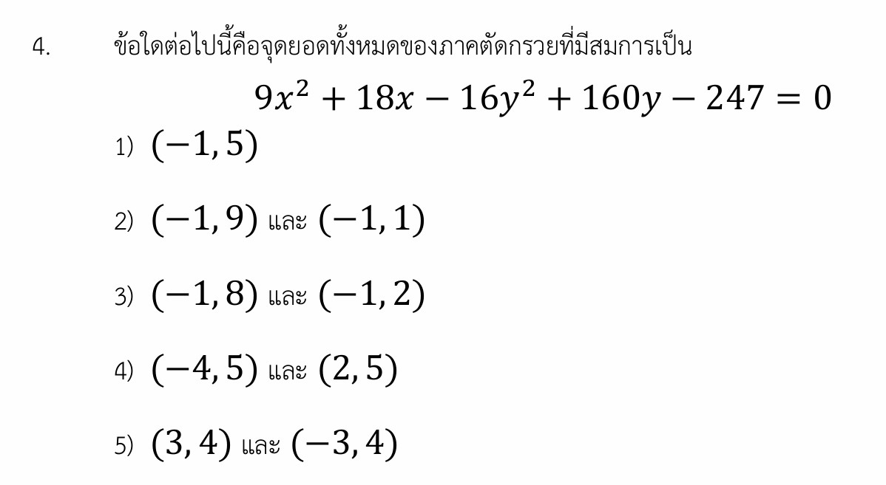

# โจทย์ข้อที่ 4: ภาคตัดกรวย (ไฮเพอร์โบลา)

นี่คือเฉลยวิธีทำอย่างละเอียดของโจทย์ข้อที่ 4 เรื่องภาคตัดกรวย (ไฮเพอร์โบลา) พร้อมสรุปเนื้อหาที่จำเป็น กลยุทธ์ในการจัดรูปสมการอย่างรวดเร็ว และโจทย์ฝึกฝนเพิ่มเติมครับ

---

## 1. เฉลยวิธีทำอย่างละเอียด

**โจทย์กำหนด:** สมการภาคตัดกรวย $9x^2 + 18x - 16y^2 + 160y - 247 = 0$
**สิ่งที่โจทย์ถาม:** จุดยอดทั้งหมดของภาคตัดกรวยนี้คือจุดใด

### ขั้นตอนที่ 1: แยกกลุ่มตัวแปรและจัดรูปเพื่อกำลังสองสมบูรณ์

เราจะสังเกตเห็นว่าสัมประสิทธิ์หน้า $x^2$ เป็นบวก ($+9$) และหน้า $y^2$ เป็นลบ ($-16$) แสดงว่ากราฟนี้คือ **ไฮเพอร์โบลา (Hyperbola)** แน่นอน ให้เราทำการแยกกลุ่ม $x$ และ $y$ แล้วย้ายตัวเลขไปฝั่งขวา:

$$(9x^2 + 18x) - (16y^2 - 160y) = 247$$

ดึงตัวร่วมสัมประสิทธิ์หน้า $x^2$ และ $y^2$ ออกมาเพื่อให้ภายในวงเล็บเหลือแค่ตัวแปรเดี่ยว ๆ:

$$9(x^2 + 2x) - 16(y^2 - 10y) = 247$$

### ขั้นตอนที่ 2: บวกเข้าด้วยพจน์ท้ายเพื่อทำเป็นกำลังสองสมบูรณ์

* สำหรับกลุ่ม $x$: พจน์กลางคือ $2$ ครึ่งหนึ่งคือ $1$ นำไปยกกำลังสองได้ $1$ $\rightarrow$ บวกเข้าด้วย $1$
* สำหรับกลุ่ม $y$: พจน์กลางคือ $-10$ ครึ่งหนึ่งคือ $-5$ นำไปยกกำลังสองได้ $25$ $\rightarrow$ บวกเข้าด้วย $25$

**ข้อควรระวัง:** เวลาบวกเข้าฝั่งขวา ต้องคูณกับตัวเลขที่ดึงตัวร่วมไว้หน้าวงเล็บด้วยนะครับ:

$$9(x^2 + 2x + 1) - 16(y^2 - 10y + 25) = 247 + 9(1) - 16(25)$$

$$9(x + 1)^2 - 16(y - 5)^2 = 247 + 9 - 400$$

$$9(x + 1)^2 - 16(y - 5)^2 = -144$$

### ขั้นตอนที่ 3: ปรับให้ฝั่งขวาเป็น 1 เพื่อเข้าสู่สมการมาตรฐาน

นำ $-144$ ไปหารตลอดทั้งสมการ เพื่อให้ฝั่งขวากลายเป็น $1$:

$$\frac{9(x + 1)^2}{-144} - \frac{16(y - 5)^2}{-144} = \frac{-144}{-144}$$

$$-\frac{(x + 1)^2}{16} + \frac{(y - 5)^2}{9} = 1$$

สลับที่เอาตัวที่เป็นบวกขึ้นก่อนเพื่อให้ดูง่ายตามฟอร์มมาตรฐาน:

$$\frac{(y - 5)^2}{9} - \frac{(x + 1)^2}{16} = 1$$

### ขั้นตอนที่ 4: วิเคราะห์หาจุดยอด (Vertices)

จากสมการมาตรฐานของไฮเพอร์โบลาแนวตั้ง: $\frac{(y - k)^2}{a^2} - \frac{(x - h)^2}{b^2} = 1$

* **จุดศูนย์กลาง $(h, k)$:** อยู่ที่ $(-1, 5)$
* **ค่า $a^2 = 9$:** จะได้ $a = 3$ (ระยะทางจากจุดศูนย์กลางไปยังจุดยอด)
* **ทิศทางของกราฟ:** เนื่องจากวงเล็บของ $y$ เป็นบวก กราฟจึงเป็น **ไฮเพอร์โบลาแนวตั้ง** (เปิดบน-ล่าง)

ดังนั้น พิกัด $x$ ของจุดยอดจะคงที่เท่ากับ $h$ ส่วนพิกัด $y$ จะขยับขึ้นและลงจาก $k$ เป็นระยะเท่ากับ $a$:

* จุดยอดที่ 1: $(h, k + a) = (-1, 5 + 3) = (-1, 8)$
* จุดยอดที่ 2: $(h, k - a) = (-1, 5 - 3) = (-1, 2)$

### ตอบ ตัวเลือกที่ 3)

---

## 2. เนื้อหารายละเอียดเพื่อศึกษาเพิ่มเติม

เพื่อให้เข้าใจภาพรวมของไฮเพอร์โบลาและการนำไปใช้ในข้อสอบ มาทบทวนรูปแบบมาตรฐานทั้ง 2 แบบกันครับ:

### ตารางสรุปส่วนประกอบของไฮเพอร์โบลา

| คุณสมบัติ | ไฮเพอร์โบลาแนวขวาง (เปิดซ้าย-ขวา) | ไฮเพอร์โบลาแนวตั้ง (เปิดบน-ล่าง) |
| --- | --- | --- |
| **สมการมาตรฐาน** | $\frac{(x-h)^2}{a^2} - \frac{(y-k)^2}{b^2} = 1$ | $\frac{(y-k)^2}{a^2} - \frac{(x-h)^2}{b^2} = 1$ |
| **จุดศูนย์กลาง** | $(h, k)$ | $(h, k)$ |
| **จุดยอด (Vertices)** | $(h \pm a, k)$ | $(h, k \pm a)$ |
| **จุดโฟกัส (Foci)** | $(h \pm c, k)$ โดยที่ $c^2 = a^2 + b^2$ | $(h, k \pm c)$ โดยที่ $c^2 = a^2 + b^2$ |
| **แกนตามขวางยาว** | $2a$ | $2a$ |

---

## 3. กลยุทธ์แก้โจทย์ประเภทนี้ (เทคนิคทำข้อสอบเร็ว)

1. **หาจุดศูนย์กลาง $(h, k)$ ทางลัดด้วยสูตรสำเร็จ:**
เราสามารถหาจุดศูนย์กลางจากรูปแบบทั่วไป $Ax^2 + Cy^2 + Dx + Ey + F = 0$ ได้ทันทีโดยไม่ต้องจัดรูปเต็มจากสูตร:

$$h = \frac{-D}{2A} \quad \text{และ} \quad k = \frac{-E}{2C}$$

*จากโจทย์:* $h = \frac{-18}{2(9)} = -1$ และ $k = \frac{-160}{2(-16)} = 5$ ทำให้ได้จุดศูนย์กลางอย่างรวดเร็วคือ $(-1, 5)$
2. **ใช้จุดศูนย์กลางตัดช้อยส์:**
เนื่องจากจุดยอดของไฮเพอร์โบลาจะต้องอยู่ในแนวเดียวกับจุดศูนย์กลางเสมอ (ไม่แนวเดียวก่อนหน้าในพิกัด $x$ ก็พิกัด $y$)

* ถ้ารู้ว่าจุดศูนย์กลางคือ $(-1, 5)$ จุดยอดต้องมีตัวเลข $-1$ อยู่ที่ตำแหน่ง $x$ หรือมีเลข $5$ อยู่ที่ตำแหน่ง $y$ แน่นอน
* เมื่อดูจากช้อยส์ จะเห็นว่ามีเพียงช้อยส์ 2) และ 3) เท่านั้นที่มี $x = -1$ ทั้งสองจุด ช่วยประหยัดเวลาคำนวณไปได้เยอะมากครับ

---

## 4. ตัวอย่างโจทย์เพิ่มเติมเพื่อฝึกทำพร้อมเฉลย

**โจทย์ข้อที่ 1:** จงหาจุดศูนย์กลางและจุดยอดของวงรีที่มีสมการเป็น $4x^2 + 9y^2 - 16x + 18y - 11 = 0$

**วิธีทำ:**

1. หาจุดศูนย์กลางทางลัด:

$$h = \frac{-(-16)}{2(4)} = 2$$

$$k = \frac{-18}{2(9)} = -1$$

ได้จุดศูนย์กลาง $(h, k) = (2, -1)$
2. จัดรูปเต็มเพื่อหาค่า $a$:

$$4(x^2 - 4x + 4) + 9(y^2 + 2y + 1) = 11 + 16 + 9$$

$$4(x - 2)^2 + 9(y + 1)^2 = 36$$

หารด้วย 36 ตลอดทั้งสมการ:

$$\frac{(x - 2)^2}{9} + \frac{(y + 1)^2}{4} = 1$$

1. สังเกตว่าเป็นวงรีแนวนอนเพราะตัวหารใต้ $x$ มากกว่า ($a^2 = 9 \implies a = 3$)
2. จุดยอดจะขยับซ้าย-ขวาจากจุดศูนย์กลาง: $(h \pm a, k) = (2 \pm 3, -1)$
จะได้จุดยอดคือ $(5, -1)$ และ $(-1, -1)$

**ตอบ:** จุดศูนย์กลางคือ $(2, -1)$ และ จุดยอดคือ $(5, -1), (-1, -1)$

**โจทย์ข้อที่ 2:** จงหาจุดยอดของไฮเพอร์โบลาที่มีสมการเป็น $9x^2 - 16y^2 - 36x - 32y - 124 = 0$

**วิธีทำ:**

1. จัดกลุ่มตัวแปรและดึงตัวร่วม:

$$9(x^2 - 4x) - 16(y^2 + 2y) = 124$$

1. ทำเป็นกำลังสองสมบูรณ์:

$$9(x^2 - 4x + 4) - 16(y^2 + 2y + 1) = 124 + 36 - 16$$

$$9(x - 2)^2 - 16(y + 1)^2 = 144$$

1. หารด้วย 144 ตลอดสมการเพื่อให้ฝั่งขวาเป็น 1:

$$\frac{(x - 2)^2}{16} - \frac{(y + 1)^2}{9} = 1$$

1. วิเคราะห์สมการ:

* จุดศูนย์กลาง $(h, k) = (2, -1)$
* กราฟเปิดตามแนวแกน $x$ (แนวนอน) เพราะกลุ่ม $x$ เป็นบวก
* ค่า $a^2 = 16 \implies a = 4$

1. หาจุดยอดโดยการขยับค่า $x$: $(h \pm a, k) = (2 \pm 4, -1)$
จะได้จุดยอดคือ $(6, -1)$ และ $(-2, -1)$

**ตอบ:** จุดยอดคือ $(6, -1)$ และ $(-2, -1)$
