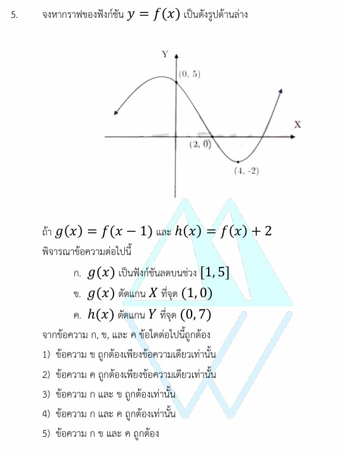

# โจทย์ข้อที่ 5: การเลื่อนขนานกราฟของฟังก์ชัน

นี่คือเฉลยวิธีทำอย่างละเอียดของโจทย์ข้อที่ 5 ซึ่งเป็นเรื่อง **การเลื่อนขนานกราฟของฟังก์ชัน (Function Transformations)** พร้อมสรุปเนื้อหา กลยุทธ์ในการมองกราฟ และโจทย์ฝึกฝนเพิ่มเติมเพื่อความเข้าใจครับ

---

## 1. เฉลยวิธีทำอย่างละเอียด

**โจทย์กำหนด:** กราฟของฟังก์ชัน $y = f(x)$ โดยมีจุดสำคัญบนกราฟที่เห็นได้ชัดเจนคือ:

1. จุดตัดแกน Y อยู่ที่ $(0, 5)$ หมายความว่า $f(0) = 5$
2. จุดตัดแกน X อยู่ที่ $(2, 0)$ หมายความว่า $f(2) = 0$
3. จุดต่ำสุดสัมพัทธ์ (จุดวกกลับ) อยู่ที่ $(4, -2)$ หมายความว่า $f(4) = -2$
4. **พฤติกรรมของกราฟ:** จาก $x = 0$ ไปจนถึง $x = 4$ กราฟมีลักษณะทอดตัวดิ่งลงอย่างต่อเนื่อง แสดงว่า $f(x)$ เป็น **"ฟังก์ชันลด" บนช่วง $[0, 4]$**

โจทย์นิยามฟังก์ชันใหม่สองฟังก์ชันคือ:

* $g(x) = f(x - 1)$
* $h(x) = f(x) + 2$

---

### พิจารณาข้อความ ก

> **" $g(x)$ เป็นฟังก์ชันลดบนช่วง $[1, 5]$ "**

* **หลักการ:** $g(x) = f(x - 1)$ คือการเลื่อนขนานกราฟ $f(x)$ ไปทาง **ขวา 1 หน่วย**
* จากเดิมที่ $f(x)$ เป็นฟังก์ชันลดบนช่วง $[0, 4]$ เมื่อกราฟทั้งหมดถูกขยับไปทางขวา 1 หน่วย ช่วงที่เป็นฟังก์ชันลดก็จะต้องถูกบวกเพิ่มไป 1 หน่วยด้วยเช่นกัน
* ช่วงใหม่จึงกลายเป็น $[0 + 1, 4 + 1] = [1, 5]$
* **สรุป:** ข้อความ ก. **ถูกต้อง**

---

### พิจารณาข้อความ ข

> **" $g(x)$ ตัดแกน X ที่จุด $(1, 0)$ "**

* **หลักการ:** การหาจุดตัดแกน X ของ $g(x)$ ทำได้โดยการแทนค่า $g(x) = 0$

$$g(x) = 0 \implies f(x - 1) = 0$$

* จากข้อมูลกราฟเดิม เราทราบว่า $f(2) = 0$ ดังนั้นจับพจน์ในวงเล็บมาเท่ากัน:

$$x - 1 = 2 \implies x = 3$$

* แสดงว่ากราฟ $g(x)$ จะตัดแกน X ที่จุด **$(3, 0)$** * *(หมายเหตุ: ถ้าลองแทน $x = 1$ จะได้ $g(1) = f(1 - 1) = f(0) = 5$ ซึ่งเป็นจุด $(1, 5)$ ไม่ใช่จุดตัดแกน X)*
* **สรุป:** ข้อความ ข. **ผิด**

---

### พิจารณาข้อความ ค

> **" $h(x)$ ตัดแกน Y ที่จุด $(0, 7)$ "**

* **หลักการ:** การหาจุดตัดแกน Y ของ $h(x)$ ทำได้โดยการแทนค่า $x = 0$

$$h(0) = f(0) + 2$$

* จากข้อมูลกราฟเดิม เราทราบว่า $f(0) = 5$ นำไปแทนค่าในสมการ:

$$h(0) = 5 + 2 = 7$$

* แสดงว่ากราฟ $h(x)$ ตัดแกน Y ที่จุด **$(0, 7)$** จริงตามที่โจทย์กล่าว
* **สรุป:** ข้อความ ค. **ถูกต้อง**

---

### สรุปคำตอบ

เนื่องจากข้อความ **ก. และ ค. ถูกต้องเท่านั้น** จึงตรงกับ **ตัวเลือกที่ 4)**

---

## 2. เนื้อหารายละเอียดเพื่อศึกษาเพิ่มเติม

การแปลงกราฟของฟังก์ชัน (Function Transformation) เป็นหัวข้อที่ช่วยให้เราวาดกราฟใหม่ได้โดยไม่ต้องคำนวณตารางค่าใหม่ทั้งหมด หากเรามีกราฟต้นแบบ $y = f(x)$ และมีค่าคงที่ $c > 0$:

### 1. การเลื่อนขนานแนวตั้ง (Vertical Shifts)

* $y = f(x) + c$ $\rightarrow$ เลื่อนกราฟขึ้นข้างบน $c$ หน่วย (ส่งผลให้ค่า $y$ เดิมบวกเพิ่มขึ้น $c$)
* $y = f(x) - c$ $\rightarrow$ เลื่อนกราฟลงข้างล่าง $c$ หน่วย (ส่งผลให้ค่า $y$ เดิมลดลง $c$)

### 2. การเลื่อนขนานแนวนอน (Horizontal Shifts)

* $y = f(x - c)$ $\rightarrow$ เลื่อนกราฟไปทาง **ขวา** $c$ หน่วย (ส่งผลให้พิกัด $x$ เดิมเพิ่มขึ้น $c$)
* $y = f(x + c)$ $\rightarrow$ เลื่อนกราฟไปทาง **ซ้าย** $c$ หน่วย (ส่งผลให้พิกัด $x$ เดิมลดลง $c$)

---

## 3. กลยุทธ์แก้โจทย์ประเภทนี้

1. **ถอดรหัสจุดสำคัญจากกราฟก่อน:** สละเวลา 5 วินาทีแรกเขียนจุดพิกัดเด่น ๆ ที่โจทย์ให้มาให้อยู่ในรูปฟังก์ชัน เช่น จากจุด $(a, b)$ ให้เขียนทดไว้เลยว่า $f(a) = b$
2. **ท่องจำทิศทางวงเล็บให้แม่น:** จำไว้เสมอว่า ในเรื่องการเลื่อนขนานแนวนอน ค่าในวงเล็บจะ "คิดตรงข้ามกับความรู้สึก" เสมอ ลบคือไปขวา ($x-c$) และบวกคือไปซ้าย ($x+c$)
3. **ตรวจสอบนิยามจุดตัด:** * หาจุดตัดแกน X $\rightarrow$ ให้ผลลัพธ์ $y = 0$

* หาจุดตัดแกน Y $\rightarrow$ ให้ตัวแปรอินพุต $x = 0$

---

## 4. ตัวอย่างโจทย์เพิ่มเติมเพื่อฝึกทำพร้อมเฉลย

**โจทย์ข้อที่ 1:** กำหนดให้กราฟ $y = f(x)$ มีจุดยอดสูงสุด (Local Maximum) อยู่ที่พิกัด $(2, 4)$ จงหาพิกัดจุดยอดสูงสุดของฟังก์ชัน $g(x) = f(x + 3) - 5$

**วิธีทำ:**

1. พิจารณาตัวแปรภายในวงเล็บ: $f(x + 3)$ หมายถึงการเลื่อนขนานไปทาง **ซ้าย 3 หน่วย**

* พิกัด $x$ ใหม่จะเท่ากับ $2 - 3 = -1$

1. พิจารณาตัวเลขด้านนอก: $- 5$ หมายถึงการเลื่อนขนานลง **ข้างล่าง 5 หน่วย**

* พิกัด $y$ ใหม่จะเท่ากับ $4 - 5 = -1$

1. นำพิกัดใหม่มารวมกัน จะได้จุดยอดสูงสุดของ $g(x)$ อยู่ที่ $(-1, -1)$

**ตอบ:** $(-1, -1)$

**โจทย์ข้อที่ 2:**
ถ้าฟังก์ชัน $f(x)$ เป็นฟังก์ชันเพิ่มบนช่วง $[-2, 3]$ จงหาช่วงที่เป็นฟังก์ชันเพิ่มของ $h(x) = f(x - 4)$

**วิธีทำ:**

1. ฟังก์ชัน $h(x) = f(x - 4)$ มีโครงสร้างลบสี่ในวงเล็บ หมายถึงกราฟทั้งหมดจะถูกเลื่อนขนานไปทาง **ขวา 4 หน่วย**
2. พฤติกรรมความเป็นฟังก์ชันเพิ่มจะคงเดิม แต่ย้ายขยับช่วงตามพิกัด $x$ ที่เปลี่ยนไป
3. นำขอบเขตของช่วงเดิมมาบวกเพิ่มตัวละ 4 หน่วย:

* ขอบซ้าย: $-2 + 4 = 2$
* ขอบขวา: $3 + 4 = 7$

1. จะได้ช่วงใหม่คือ $[2, 7]$

**ตอบ:** $[2, 7]$
