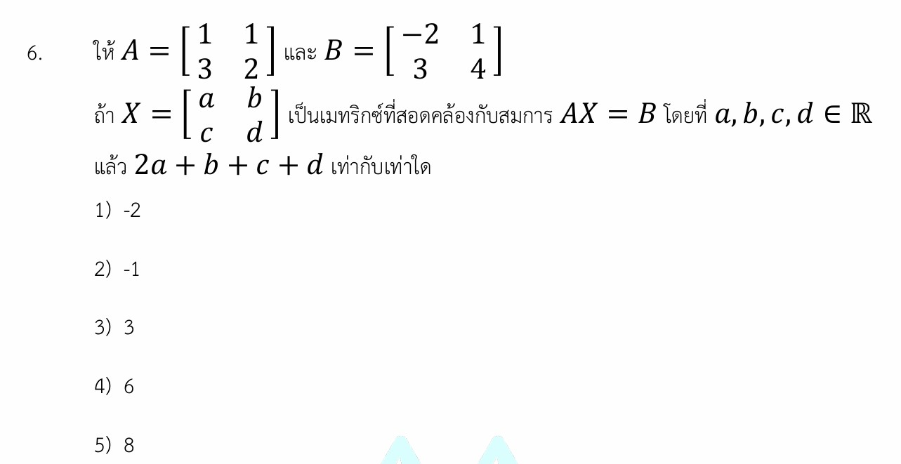

# เมทริกซ์ (Matrix) - ข้อสอบ A-Level คณิตศาสตร์ 1 ปี 2567

การแก้โจทย์ปัญหาเรื่อง **เมทริกซ์ (Matrix)** ในข้อสอบ A-Level คณิตศาสตร์ 1 ปี 2567 ข้อนี้ หัวใจสำคัญคือการแก้สมการเมทริกซ์เพื่อหาค่าของตัวแปรในเมทริกซ์ที่ไม่ทราบค่าครับ

## **เฉลยละเอียดโจทย์ข้อ 6**

**โจทย์:** ให้ $A = \begin{bmatrix} 1 & 1 \\ 3 & 2 \end{bmatrix}$ และ $B = \begin{bmatrix} -2 & 1 \\ 3 & 4 \end{bmatrix}$ ถ้า $X = \begin{bmatrix} a & b \\ c & d \end{bmatrix}$ เป็นเมทริกซ์ที่สอดคล้องกับสมการ $AX = B$ โดยที่ $a, b, c, d \in \mathbb{R}$ แล้ว $2a + b + c + d$ มีค่าเท่ากับเท่าใด

---

**วิธีทำ:**

**ขั้นตอนที่ 1: วิเคราะห์วิธีการหาเมทริกซ์ $X$**
จากสมการ $AX = B$ เราสามารถหา $X$ ได้โดยการนำอินเวอร์สของเมทริกซ์ $A$ (คือ $A^{-1}$) มาคูณเข้าทางด้านซ้ายทั้งสองข้างของสมการ:
$A^{-1}(AX) = A^{-1}B$
$IX = A^{-1}B$ (เมื่อ $I$ คือเมทริกซ์เอกลักษณ์)
ดังนั้น **$X = A^{-1}B$**

**ขั้นตอนที่ 2: หา $A^{-1}$**
สูตรสำหรับเมทริกซ์ $2 \times 2$: ถ้า $A = \begin{bmatrix} p & q \\ r & s \end{bmatrix}$ แล้ว $A^{-1} = \frac{1}{\text{det}(A)} \begin{bmatrix} s & -q \\ -r & p \end{bmatrix}$

1. หา $\text{det}(A) = (1)(2) - (1)(3) = 2 - 3 = -1$
2. หา $A^{-1} = \frac{1}{-1} \begin{bmatrix} 2 & -1 \\ -3 & 1 \end{bmatrix} = \begin{bmatrix} -2 & 1 \\ 3 & -1 \end{bmatrix}$

**ขั้นตอนที่ 3: หาเมทริกซ์ $X$ โดยนำ $A^{-1}$ คูณกับ $B$**
$X = \begin{bmatrix} -2 & 1 \\ 3 & -1 \end{bmatrix} \begin{bmatrix} -2 & 1 \\ 3 & 4 \end{bmatrix}$
$X = \begin{bmatrix} (-2)(-2) + (1)(3) & (-2)(1) + (1)(4) \\ (3)(-2) + (-1)(3) & (3)(1) + (-1)(4) \end{bmatrix}$
$X = \begin{bmatrix} 4 + 3 & -2 + 4 \\ -6 - 3 & 3 - 4 \end{bmatrix} = \begin{bmatrix} 7 & 2 \\ -9 & -1 \end{bmatrix}$

จะได้ค่า $a = 7, b = 2, c = -9, d = -1$

**ขั้นตอนที่ 4: คำนวณหาค่าที่โจทย์ถาม**
$2a + b + c + d = 2(7) + 2 + (-9) + (-1)$
$= 14 + 2 - 9 - 1$
$= 6$

**ตอบ:** 6 (ตรงกับตัวเลือกที่ 4)

---

### **เนื้อหาที่ใช้ในการแก้โจทย์**

1. **การคูณเมทริกซ์ (Matrix Multiplication):** ต้องจำหลักการ "แถวคูณหลัก" ให้แม่นยำ
2. **การหาดีเทอร์มิแนนต์ (Determinant):** สำหรับเมทริกซ์ $2 \times 2$ คือ (คูณลง - คูณขึ้น)
3. **อินเวอร์สการคูณของเมทริกซ์ (Inverse Matrix):** การสลับที่สมาชิกในแนวทแยงหลักและเปลี่ยนเครื่องหมายสมาชิกในแนวทแยงรอง
4. **สมบัติของสมการเมทริกซ์:** การกำจัดตัวแปร $A$ ออกจาก $AX = B$ ต้องคูณ $A^{-1}$ จากด้านหน้า (ซ้าย) เท่านั้น เพราะเมทริกซ์ไม่มีสมบัติการสลับที่การคูณ

### **กลยุทธ์แก้โจทย์ประเภทนี้**

* **ตรวจสอบ $\text{det}$ ก่อนเสมอ:** หาก $\text{det} = 0$ จะหา $A^{-1}$ ไม่ได้
* **ระวังลำดับการคูณ:** ถ้าโจทย์ให้ $XA = B$ การหา $X$ จะต้องใช้ $X = BA^{-1}$ (คูณจากด้านหลัง)
* **ใช้วิธีระบบสมการเชิงเส้น:** หากจำสูตร $A^{-1}$ ไม่ได้ สามารถใช้วิธีคูณ $AX$ ออกมาเป็นเมทริกซ์ที่มีตัวแปร $a, b, c, d$ แล้วจับสมาชิกที่ตำแหน่งเดียวกันมาเท่ากับค่าในเมทริกซ์ $B$ เพื่อแก้สมการหาตัวแปรทีละตัวได้เช่นกัน

---

### **ตัวอย่างโจทย์เพิ่มเติมเพื่อฝึกทำ**

**โจทย์ฝึกหัด:**
กำหนดให้ $M = \begin{bmatrix} 2 & 1 \\ 1 & 1 \end{bmatrix}$ และ $N = \begin{bmatrix} 4 & 5 \\ 3 & 2 \end{bmatrix}$
ถ้า $MX = N$ จงหาค่าของสมาชิกในแถวที่ 1 หลักที่ 1 ของเมทริกซ์ $X$

**เฉลย:**

1. หา $\text{det}(M) = (2)(1) - (1)(1) = 1$
2. หา $M^{-1} = \frac{1}{1} \begin{bmatrix} 1 & -1 \\ -1 & 2 \end{bmatrix} = \begin{bmatrix} 1 & -1 \\ -1 & 2 \end{bmatrix}$
3. หา $X = M^{-1}N = \begin{bmatrix} 1 & -1 \\ -1 & 2 \end{bmatrix} \begin{bmatrix} 4 & 5 \\ 3 & 2 \end{bmatrix}$
4. สมาชิกแถว 1 หลัก 1 คือ $(1)(4) + (-1)(3) = 4 - 3 = 1$
**ตอบ:** 1

การฝึกฝนการคูณและหาอินเวอร์สบ่อยๆ จะช่วยลดความผิดพลาดเรื่องเครื่องหมายซึ่งเป็นจุดที่นักเรียนมักพลาดบ่อยที่สุดครับ
