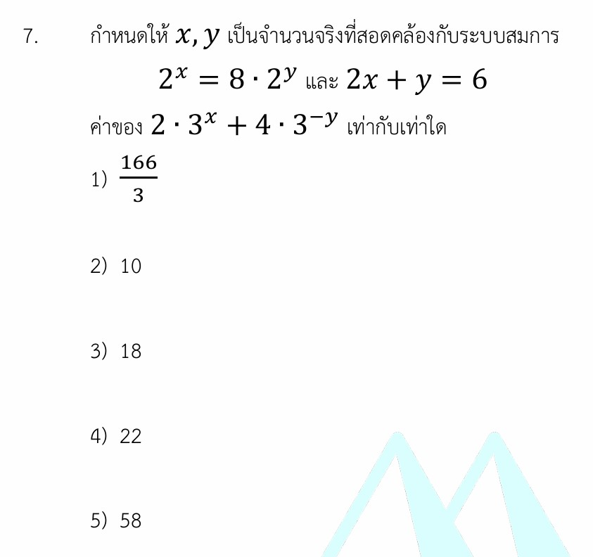

# เฉลยโจทย์ข้อที่ 7: ระบบสมการเอ็กซ์โพเนนเชียล

นี่คือเฉลยวิธีทำอย่างละเอียดของ**โจทย์ข้อที่ 7** ซึ่งเป็นเรื่อง **ระบบสมการเอ็กซ์โพเนนเชียล (Exponential Simultaneous Equations)** พร้อมสรุปสมบัติเลขยกกำลังที่ต้องรู้ เทคนิคการเดาคำตอบอย่างมีตรรกะในห้องสอบ และโจทย์ฝึกฝนเพิ่มเติมครับ

---

## 1. เฉลยวิธีทำอย่างละเอียด

**โจทย์กำหนด:** 1. $2^x = 8 \cdot 2^y$
2. $2x + y = 6$

**สิ่งที่โจทย์ถาม:** ค่าของ $2 \cdot 3^x + 4 \cdot 3^{-y}$ เท่ากับเท่าใด

## ขั้นตอนที่ 1: จัดรูปสมการเอ็กซ์โพเนนเชียลให้ฐานเท่ากัน

จากสมการแรก: $2^x = 8 \cdot 2^y$
เราจะสังเกตเห็นว่าเลข $8$ สามารถแปลงให้เป็นเลขฐาน $2$ ได้ นั่นคือ $8 = 2^3$ เพื่อให้ทุกพจน์กลายเป็นฐานเดียวกัน:

$$2^x = 2^3 \cdot 2^y$$

ใช้สมบัติเลขยกกำลัง พจน์ฐานเดียวกันคูณกัน ให้นำเลขชี้กำลังมาบวกกัน ($a^m \cdot a^n = a^{m+n}$):

$$2^x = 2^{3+y}$$

เมื่อฐานทั้งสองฝั่งเท่ากันแล้ว (ฐานเป็น $2$ เหมือนกัน) เราสามารถจับเลขชี้กำลังด้านบนมาเท่ากันได้เลยครับ:

$$x = 3 + y \quad \text{--- (สมการที่ 1)}$$

### ขั้นตอนที่ 2: แทนค่าเพื่อแก้ระบบสมการหา $x$ และ $y$

โจทย์ให้สมการที่สองมาคือ $2x + y = 6$ ให้เรานำ $x = 3 + y$ จากขั้นตอนแรกเข้าไปแทนที่ตำแหน่ง $x$:

$$2(3 + y) + y = 6$$

$$6 + 2y + y = 6$$

$$6 + 3y = 6$$

ย้าย $6$ ไปลบอีกฝั่ง:

$$3y = 6 - 6$$

$$3y = 0 \implies y = 0$$

เมื่อได้ค่า $y = 0$ แล้ว ก็นำกลับไปแทนในสมการที่ 1 เพื่อหาค่า $x$:

$$x = 3 + 0 \implies x = 3$$

### ขั้นตอนที่ 3: คำนวณหาคำตอบสุดท้าย

นำค่า $x = 3$ และ $y = 0$ ไปแทนในสิ่งที่โจทย์ถามหา: $2 \cdot 3^x + 4 \cdot 3^{-y}$

$$2 \cdot 3^3 + 4 \cdot 3^{-0}$$

$$2 \cdot (27) + 4 \cdot 3^0$$

> **ข้อควรระวัง:** จำนวนใด ๆ ที่ไม่เท่ากับศูนย์ เมื่อยกกำลัง $0$ จะมีค่าเท่ากับ $1$ เสมอ ($3^0 = 1$) ไม่ใช่ได้ $0$ นะครับ

$$54 + 4(1) = 54 + 4 = 58$$

## ตอบ ตัวเลือกที่ 5)

---

## 2. เนื้อหารายละเอียดเพื่อศึกษาเพิ่มเติม

หัวใจสำคัญของการเล่นกับโจทย์เอ็กซ์โพเนนเชียลคือการแม่นยำในกฎของเลขยกกำลัง ซึ่งกฎพื้นฐานที่มักจะสอดแทรกอยู่ในข้อสอบเสมอมีดังนี้ครับ:

* **กฎการคูณ:** $a^m \cdot a^n = a^{m+n}$
* **กฎการหาร:** $\frac{a^m}{a^n} = a^{m-n}$
* **กำลังซ้อนกัน:** $(a^m)^n = a^{m \cdot n}$
* **กำลังติดลบ:** $a^{-n} = \frac{1}{a^n}$
* **นิยามกำลังศูนย์:** $a^0 = 1$ (เมื่อ $a \neq 0$)

---

## 3. กลยุทธ์แก้โจทย์ประเภทนี้ (เทคนิคทำข้อสอบเร็ว)

1. **กลยุทธ์ "ฐานเดียวกันคือคำตอบ":** ทุกครั้งที่เจอสมการที่มีตัวแปรอยู่ที่เลขชี้กำลัง (Exponential) สิ่งแรกที่ต้องทำไม่ใช่การพยายามย้ายข้างแบบสุ่มสี่สุ่มห้า แต่คือการมองตัวเลขฐานให้ออกว่ามันเปลี่ยนเป็นเลขชี้กำลังของฐานขั้นต่ำได้ไหม (เช่น เจอ $4, 8, 16 \rightarrow$ ปรับเป็นฐาน $2$ หรือเจอ $9, 27, 81 \rightarrow$ ปรับเป็นฐาน $3$)
2. **เทคนิค "สุ่มตรวจคำตอบ" (Logical Guessing):** * ในห้องสอบถ้าเวลาใกล้หมดแล้วจัดรูปสมการไม่ออก ให้สังเกตสิ่งที่โจทย์ถาม $2 \cdot 3^x + 4 \cdot 3^{-y}$ และสังเกตช้อยส์ที่เป็นจำนวนเต็มกลม ๆ

* มันเป็นการใบ้กลาย ๆ ว่า $x$ และ $y$ น่าจะเป็นจำนวนเต็มธรรมดา (เช่น $0, 1, 2, 3$)
* ลองมองสมการ $2x + y = 6$ แล้วลองแทนค่าในใจดู เช่น ถ้า $x = 3, y = 0$ จะได้สมการเป็นจริง ลองเอาคู่นี้ไปเช็กกับสมการแรก $2^3 = 8 \cdot 2^0 \implies 8 = 8 \cdot 1$ ซึ่งจริงทันที! เราจะสามารถหาค่า $x, y$ ได้ภายใน 10 วินาทีโดยไม่ต้องแสดงวิธีทำเต็มเลยครับ

---

## 4. ตัวอย่างโจทย์เพิ่มเติมเพื่อฝึกทำพร้อมเฉลย

**โจทย์ข้อที่ 1:** จงหาค่าของ $x$ และ $y$ ที่สอดคล้องกับระบบสมการ $3^{x-y} = 9$ และ $2^{x+y} = 32$

**วิธีทำ:**

1. ปรับฐานสมการแรก: $3^{x-y} = 3^2 \implies x - y = 2 \quad \text{--- (สมการที่ 1)}$
2. ปรับฐานสมการที่สอง: $2^{x+y} = 2^5 \implies x + y = 5 \quad \text{--- (สมการที่ 2)}$
3. นำสมการที่ 1 + สมการที่ 2 เพื่อกำจัด $y$:

$$(x - y) + (x + y) = 2 + 5$$

$$2x = 7 \implies x = 3.5$$

1. แทนค่า $x = 3.5$ ลงในสมการที่ 2 เพื่อหา $y$:

$$3.5 + y = 5 \implies y = 1.5$$

**ตอบ:** $x = 3.5$ และ $y = 1.5$

**โจทย์ข้อที่ 2:** กำหนดให้ $5^{2x-1} = 25^{y}$ และ $x + 3y = 7$ จงหาค่าของ $x \cdot y$

**วิธีทำ:**

1. จัดรูปสมการแรกโดยเปลี่ยน $25$ ให้เป็น $5^2$:

$$5^{2x-1} = (5^2)^y \implies 5^{2x-1} = 5^{2y}$$

1. จับเลขชี้กำลังมาเท่ากัน:

$$2x - 1 = 2y \implies 2x - 2y = 1 \quad \text{--- (สมการที่ 1)}$$

1. จากสมการที่สอง $x + 3y = 7$ นำมาคูณ $2$ ตลอดเพื่อปรับสัมประสิทธิ์หน้า $x$ ให้เท่ากัน:

$$2x + 6y = 14 \quad \text{--- (สมการที่ 2)}$$

1. นำสมการที่ 2 ลบด้วยสมการที่ 1:

$$(2x + 6y) - (2x - 2y) = 14 - 1$$

$$8y = 13 \implies y = \frac{13}{8}$$

1. หาค่า $x$ โดยนำกลับไปแทนใน $x + 3y = 7$:

$$x + 3\left(\frac{13}{8}\right) = 7 \implies x = 7 - \frac{39}{8} = \frac{56 - 39}{8} = \frac{17}{8}$$

1. คำนวณค่าที่โจทย์ถาม $x \cdot y$:

$$x \cdot y = \frac{17}{8} \cdot \frac{13}{8} = \frac{221}{64}$$

**ตอบ:** $\frac{221}{64}$
