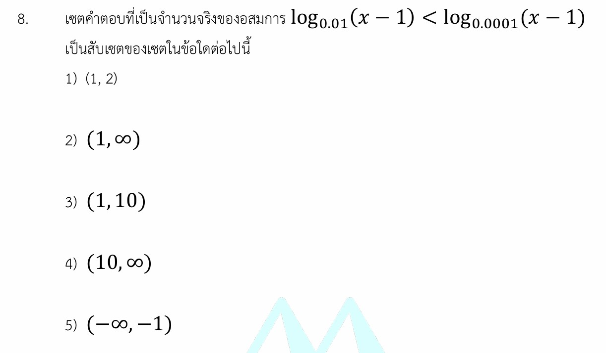

# เฉลยและกลยุทธ์อสมการลอการิทึม

นี่คือเฉลยอย่างละเอียด แนวคิดสำคัญ กลยุทธ์ในการทำโจทย์ และโจทย์ซ้อมมือเพิ่มเติมสำหรับอสมการลอการิทึม (Logarithmic Inequality) ครับ

---

### 📘 เฉลยอย่างละเอียด

**โจทย์:** เซตคำตอบที่เป็นจำนวนจริงของอสมการ $\log_{0.01}(x-1) < \log_{0.0001}(x-1)$ เป็นสับเซตของเซตในข้อใด

#### **ขั้นที่ 1: หาเงื่อนไขของค่าหลัง Log (Domain Restriction)**

สิ่งสำคัญที่สุดของเรื่อง Logarithm คือ ค่าหลัง log ต้องมากกว่า 0 เสมอ

* จากโจทย์ ค่าหลัง log คือ $x - 1$
* จะได้เงื่อนไข: $x - 1 > 0 \implies x > 1$  --- **(เงื่อนไขที่ 1)**

#### **ขั้นที่ 2: จัดฐานของ Log ให้เท่ากัน**

สังเกตว่าฐานของ log ทั้งสองฝั่งคือ $0.01$ และ $0.0001$ ซึ่งมีความสัมพันธ์กันคือ $0.0001 = (0.01)^2$
เราสามารถใช้สมบัติของ log: $\log_{a^n} M = \frac{1}{n} \log_a M$ เปลี่ยนฐานฝั่งขวาได้ดังนี้:

$$\log_{0.0001}(x-1) = \log_{(0.01)^2}(x-1) = \frac{1}{2}\log_{0.01}(x-1)$$

นำกลับไปแทนในอสมการเดิม จะได้:

$$\log_{0.01}(x-1) < \frac{1}{2}\log_{0.01}(x-1)$$

#### **ขั้นที่ 3: แก้หาค่าอสมการ**

ย้ายข้างมาลบกันเพื่อความง่ายในการคำนวณ:

$$\log_{0.01}(x-1) - \frac{1}{2}\log_{0.01}(x-1) < 0$$

$$\frac{1}{2}\log_{0.01}(x-1) < 0$$

คูณ 2 ทั้งสองข้างของอสมการ จะได้:

$$\log_{0.01}(x-1) < 0$$

#### **ขั้นที่ 4: ปลด Log (ระวังเรื่องฟังก์ชันลด!)**

เปลี่ยนเลข $0$ ทางขวาให้อยู่ในรูป log ฐาน $0.01$ ยึดตามสมบัติ $\log_a 1 = 0$

$$\log_{0.01}(x-1) < \log_{0.01} 1$$

⚠️ **จุดต้องระวัง:** เนื่องจากฐานคือ $0.01$ ซึ่งมีค่าอยู่ระหว่าง $0$ ถึง $1$ ($0 < 0.01 < 1$) ลอการิทึมนี้จึงเป็น **ฟังก์ชันลด** เมื่อเราปลด log ออก **เครื่องหมายอสมการต้องกลับข้าง** จาก $<$ เป็น $>$
จะได้:

$$x - 1 > 1$$

$$x > 2$$

 --- **(เงื่อนไขที่ 2)**

#### **ขั้นที่ 5: นำเงื่อนไขมารวมกัน (Intersect)**

นำ **(เงื่อนไขที่ 1)** $x > 1$ และ **(เงื่อนไขที่ 2)** $x > 2$ มาหาพื้นที่ทับซ้อนกันบนเส้นจำนวน
จะได้เซตคำตอบของอสมการนี้คือ $x > 2$ หรือเขียนเป็นช่วงได้ว่า **$(2, \infty)$**

#### **ขั้นที่ 6: พิจารณาตัวเลือก (หาตัวเลือกที่เป็น Super-set หรือคลุมคำตอบ)**

โจทย์ไม่ได้ถามเซตคำตอบตรงๆ แต่ถามว่าเซตคำตอบนี้เป็น **สับเซต (Subset)** ของข้อใด (หมายความว่า เซตในข้อเลือกนั้นต้องครอบคลุมช่วง $(2, \infty)$ ทั้งหมด)

* ตัวเลือก 1) $(1, 2)$ — ไม่ครอบคลุม
* ตัวเลือก 2) $(1, \infty)$ — **ครอบคลุม** (เพราะช่วงตั้งแต่ 2 ขึ้นไป อยู่ในเซตตั้งแต่ 1 ขึ้นไปทั้งหมด หรือ $(2, \infty) \subset (1, \infty)$)
* ตัวเลือก 3) $(1, 10)$ — ไม่ครอบคลุมเลขที่มากกว่า 10
* ตัวเลือก 4) $(10, \infty)$ — สลับกัน (อันนี้เป็นสับเซตของคำตอบ ไม่ใช่คำตอบเป็นสับเซตของอันนี้)

**ตอบ ข้อ 2) $(1, \infty)$**

---

### 🧠 เนื้อหาเพิ่มเติมและกลยุทธ์ในการแก้โจทย์

#### **1. สมบัติลอการิทึมที่ใช้บ่อยในข้อสอบ**

* **การโยกกำลังที่ฐาน:** $\log_{a^n} M = \frac{1}{n}\log_a M$
* **เงื่อนไขนิยาม:** สำหรับ $\log_a M$ ย้ำเสมอว่า $M > 0$ และ $a > 0, a \neq 1$

#### **2. หัวใจหลักของ "อสมการลอการิทึม" (ฟังก์ชันเพิ่ม vs ฟังก์ชันลด)**

* **ฟังก์ชันเพิ่ม (ฐาน $a > 1$):** เมื่อปลด log แล้ว **เครื่องหมายอสมการคงเดิม**
* ถ้า $\log_a X > \log_a Y$ จะได้ $X > Y$

* **ฟังก์ชันลด (ฐาน $0 < a < 1$):** เมื่อปลด log แล้ว **เครื่องหมายอสมการต้องกลับข้าง**
* ถ้า $\log_a X > \log_a Y$ จะได้ $X < Y$

💡 **กลยุทธ์ลับ:** เพื่อป้องกันการลืมกลับเครื่องหมายอสมการตอนท้าย เราสามารถแปลงฐานให้เป็นจำนวนเต็มที่มากกว่า 1 ตั้งแต่แรกได้ เช่น ข้อนี้สามารถมองเป็นฐาน 10 ได้ดังนี้:

* $\log_{10^{-2}}(x-1) < \log_{10^{-4}}(x-1)$
* $-\frac{1}{2}\log_{10}(x-1) < -\frac{1}{4}\log_{10}(x-1)$
* นำ $-4$ คูณตลอดอสมการ (ตัวลบคูณทำให้อสมการเปลี่ยนเครื่องหมาย) จะได้ $2\log_{10}(x-1) > \log_{10}(x-1) \implies \log_{10}(x-1) > 0$ ซึ่งได้ผลลัพธ์ $x > 2$ เท่ากันโดยไม่ต้องกังวลเรื่องฟังก์ชันลดตอนปลด log ครับ

---

### ✍️ ตัวอย่างโจทย์เพิ่มเติมเพื่อฝึกทำ

#### **โจทย์ข้อที่ 1 (ระดับพื้นฐาน - ฐานฟังก์ชันเพิ่ม)**

จงหาเซตคำตอบของอสมการ $\log_3(2x - 1) \le 2$

**วิธีทำ:**

1. **หาเงื่อนไขหลัง log:**
$2x - 1 > 0 \implies 2x > 1 \implies x > \frac{1}{2}$
2. **แก้สมาการ:**
เปลี่ยน $2$ เป็น log ฐาน 3 จะได้ $2 = \log_3(3^2) = \log_3 9$
$\log_3(2x - 1) \le \log_3 9$
เนื่องจากฐานเป็น 3 ($3 > 1$) เป็นฟังก์ชันเพิ่ม ปลด log เครื่องหมายคงเดิม:
$2x - 1 \le 9 \implies 2x \le 10 \implies x \le 5$
3. **อินเตอร์เซกต์เงื่อนไข:**
นำ $x > \frac{1}{2}$ และ $x \le 5$ มารวมกัน
**คำตอบ:** $(\frac{1}{2}, 5]$

---

#### **โจทย์ข้อที่ 2 (ระดับประยุกต์ - ฐานฟังก์ชันลด)**

จงหาเซตคำตอบของอสมการ $\log_{0.5}(x^2 - 5x + 7) \ge 0$

**วิธีทำ:**

1. **หาเงื่อนไขหลัง log:**
$x^2 - 5x + 7 > 0$
เมื่อเช็กดิสคริมิแนนต์ ($b^2 - 4ac$) จะได้ $(-5)^2 - 4(1)(7) = 25 - 28 = -3$ (ค่าน้อยกว่า 0 แสดงว่าสมการนี้เป็นบวกเสมอสำหรับทุกจำนวนจริง $x$) ดังนั้นเงื่อนไขแรกคือ $x \in \mathbb{R}$
2. **แก้สมการ:**
เปลี่ยน $0$ เป็น log ฐาน 0.5 จะได้ $0 = \log_{0.5} 1$
$\log_{0.5}(x^2 - 5x + 7) \ge \log_{0.5} 1$
เนื่องจากฐานคือ $0.5$ ($0 < 0.5 < 1$) เป็นฟังก์ชันลด ปลด log แล้วต้อง**กลับเครื่องหมาย**จาก $\ge$ เป็น $\le$
$x^2 - 5x + 7 \le 1$
$x^2 - 5x + 6 \le 0$
แยกตัวประกอบ: $(x - 2)(x - 3) \le 0$
จะได้ช่วงคำตอบคือ $2 \le x \le 3$
3. **อินเตอร์เซกต์เงื่อนไข:**
เนื่องจากเงื่อนไขหลัง log ผ่านฉลุยสำหรับทุกจำนวนจริง คำตอบจึงเป็นช่วงที่หาได้เลย
**คำตอบ:** $[2, 3]$
