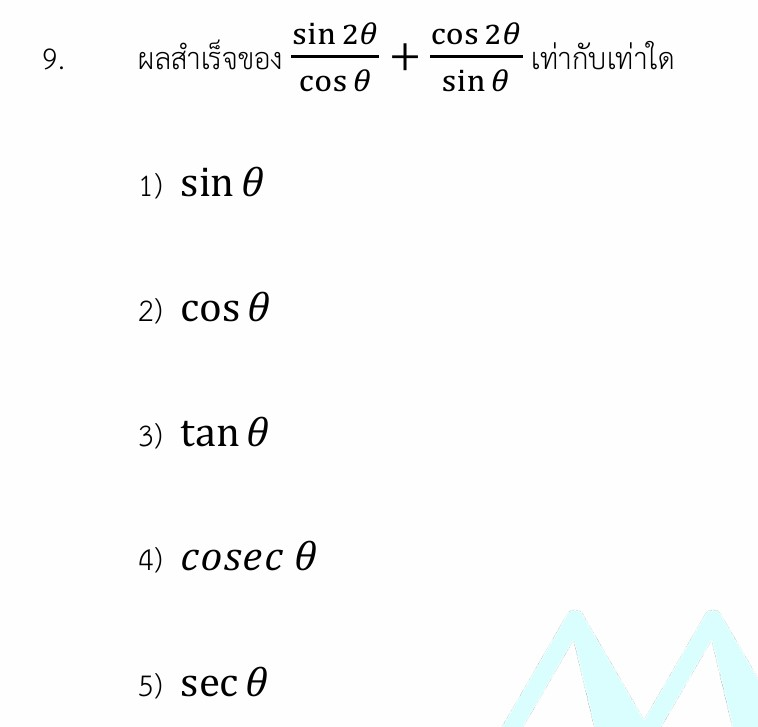

# เฉลยและกลยุทธ์: ฟังก์ชันตรีโกณมิติมุมสองเท่าและมุมประกอบ

นี่คือเฉลยอย่างละเอียด แนวคิดสูตรตรีโกณมิติที่เกี่ยวข้อง กลยุทธ์ในการทำโจทย์ และโจทย์ซ้อมมือเพิ่มเติมสำหรับเรื่อง **ฟังก์ชันตรีโกณมิติมุมสองเท่าและมุมประกอบ** ครับ

---

## 📘 เฉลยอย่างละเอียด

**โจทย์:** ผลสำเร็จของ $\frac{\sin 2\theta}{\cos \theta} + \frac{\cos 2\theta}{\sin \theta}$ เท่ากับเท่าใด

การแก้โจทย์ข้อนี้สามารถทำได้ 2 วิธีหลักๆ ซึ่งให้ผลลัพธ์เท่ากัน ดังนี้ครับ

### **วิธีที่ 1: การหา ครน. และใช้สูตรมุมประกอบ (วิธีนี้รวดเร็วที่สุด)**

**ขั้นที่ 1: ทำส่วนให้เท่ากัน (หา ครน.)**
ครน. ของส่วนคือ $\cos \theta \cdot \sin \theta$ เมื่อปรับเศษส่วนจะได้:

$$\frac{\sin 2\theta \cdot \sin \theta + \cos 2\theta \cdot \cos \theta}{\cos \theta \cdot \sin \theta}$$

**ขั้นที่ 2: สลับที่ตัวเศษเพื่อให้มองเห็นรูปสูตรชัดเจนขึ้น**

$$\frac{\cos 2\theta \cdot \cos \theta + \sin 2\theta \cdot \sin \theta}{\cos \theta \cdot \sin \theta}$$

**ขั้นที่ 3: ยุบสูตรตัวเศษ**
จากสูตรผลต่างของฟังก์ชันโคไซน์ (Cosine Subtraction Formula):

$$\cos(A - B) = \cos A \cos B + \sin A \sin B$$

เมื่อเราแทน $A = 2\theta$ และ $B = \theta$ จะได้ตัวเศษลดรูปเหลือ:

$$\cos(2\theta - \theta) = \cos \theta$$

**ขั้นที่ 4: แทนค่ากลับและตัดทอน**

$$\frac{\cos \theta}{\cos \theta \cdot \sin \theta} = \frac{1}{\sin \theta}$$

เนื่องจากส่วนกลับของ $\sin \theta$ คือ $\csc \theta$ (หรือเขียนอีกแบบว่า $\operatorname{cosec} \theta$)

**ตอบ ข้อ 4) $\operatorname{cosec} \theta$**

---

#### **วิธีที่ 2: การกระจายมุมสองเท่าโดยตรง**

**ขั้นที่ 1: ใช้สูตรมุมสองเท่ากระจายแต่ละก้อน**

* จากสูตร $\sin 2\theta = 2\sin \theta \cos \theta$
* จากสูตร $\cos 2\theta = 1 - 2\sin^2 \theta$

นำไปแทนในโจทย์เดิม:

$$\frac{2\sin \theta \cos \theta}{\cos \theta} + \frac{1 - 2\sin^2 \theta}{\sin \theta}$$

**ขั้นที่ 2: ตัดทอนก้อนแรก**

$$2\sin \theta + \frac{1 - 2\sin^2 \theta}{\sin \theta}$$

**ขั้นที่ 3: ทำส่วนให้เท่ากันเพื่อรวมก้อน**

$$\frac{2\sin^2 \theta + (1 - 2\sin^2 \theta)}{\sin \theta}$$

$$= \frac{1}{\sin \theta} = \operatorname{cosec} \theta$$

**ตอบ ข้อ 4) $\operatorname{cosec} \theta$** (ได้คำตอบตรงกัน)

---

### 🧠 เนื้อหาเพิ่มเติมเพื่อศึกษา

ในการสอบเรื่องตรีโกณมิติ ชุดสูตรที่ถูกนำมาออกข้อสอบบ่อยที่สุดคือ **มุมสองเท่า ($2\theta$)** และ **มุมประกอบ ($A \pm B$)** #### **1. สูตรมุมสองเท่าที่ต้องจำให้ขึ้นใจ**

* $$\sin 2\theta = 2\sin \theta \cos \theta$$

* $$\cos 2\theta = \cos^2 \theta - \sin^2 \theta = 2\cos^2 \theta - 1 = 1 - 2\sin^2 \theta$$

* $$\tan 2\theta = \frac{2\tan \theta}{1 - \tan^2 \theta}$$

#### **2. สูตรมุมประกอบ (Compound Angles)**

* $$\sin(A \pm B) = \sin A \cos B \pm \cos A \sin B$$

* $$\cos(A \pm B) = \cos A \cos B \mp \sin A \sin B$$

 *(ระวัง! เครื่องหมายจะสลับกัน)*

---

### 🎯 กลยุทธ์การแก้โจทย์ประเภทนี้

1. **สังเกตขนาดของมุมก่อนเสมอ:** หากโจทย์มีทั้งมุม $\theta$ และมุม $2\theta$ ปนกัน เป้าหมายหลักคือ **"การทำมุมให้เท่ากัน"** ซึ่งเลือกได้ว่าจะยุบรวมเศษส่วน (แบบวิธีที่ 1) หรือแตกมุมใหญ่ให้เล็กลง (แบบวิธีที่ 2)
2. **เลือกสูตร $\cos 2\theta$ ให้เหมาะกับสถานการณ์:** สูตร $\cos 2\theta$ มีถึง 3 รูปแบบหลัก การเลือกใช้ตัวที่มีเลข $1$ หรือ $-1$ มักจะเอาไว้ใช้หักล้างกับตัวเลขอื่นในโจทย์เพื่อให้ตัดทอนง่ายขึ้น
3. **จัดรูปในรูป $\sin$ และ $\cos$ เป็นหลัก:** หากโจทย์ให้ $\tan, \cot, \sec, \csc$ มาผสม การแปลงทุกอย่างให้กลับมาเป็น $\sin$ และ $\cos$ จะช่วยให้มองเห็นความสัมพันธ์และการตัดทอนได้ง่ายที่สุด

---

### ✍️ ตัวอย่างโจทย์เพิ่มเติมเพื่อฝึกทำ

#### **โจทย์ข้อที่ 1 (ระดับพื้นฐาน - ฝึกใช้สูตรมุมสองเท่าหักล้าง)**

จงหาผลสำเร็จของรูปอย่างง่ายของ $\frac{\sin 2\theta}{1 + \cos 2\theta}$

**วิธีทำ:**

1. กระจายตัวเศษด้วยสูตร $\sin 2\theta = 2\sin \theta \cos \theta$
2. สังเกตตัวส่วนมี $+1$ อยู่ ดังนั้นเราควรเลือกใช้สูตร $\cos 2\theta = 2\cos^2 \theta - 1$ เพื่อให้ $-1$ ไปตัดกับ $+1$ จนหายไป
3. แทนค่าในเศษส่วน:

$$\frac{2\sin \theta \cos \theta}{1 + (2\cos^2 \theta - 1)} = \frac{2\sin \theta \cos \theta}{2\cos^2 \theta}$$

1. ตัดทอนเลข 2 และ $\cos \theta$ ทั้งเศษและส่วน:

$$\frac{\sin \theta}{\cos \theta} = \tan \theta$$

**คำตอบ:** $\tan \theta$

---

#### **โจทย์ข้อที่ 2 (ระดับประยุกต์ - ข้อสอบแข่งขัน)**

จงหาค่าของ $\frac{\sin 3\theta}{\sin \theta} - \frac{\cos 3\theta}{\cos \theta}$

**วิธีทำ:**

1. หา ครน. ของส่วน คือ $\sin \theta \cdot \cos \theta$

$$\frac{\sin 3\theta \cos \theta - \cos 3\theta \sin \theta}{\sin \theta \cos \theta}$$

1. สังเกตตัวเศษตรงกับสูตร $\sin(A - B) = \sin A \cos B - \cos A \sin B$
โดยให้ $A = 3\theta$ และ $B = \theta$ จะได้ตัวเศษเท่ากับ:

$$\sin(3\theta - \theta) = \sin 2\theta$$

1. แทนค่ากลับลงไปในเศษส่วน:

$$\frac{\sin 2\theta}{\sin \theta \cos \theta}$$

1. กระจาย $\sin 2\theta = 2\sin \theta \cos \theta$ ตัวเศษเพื่อตัดทอนตัวส่วน:

$$\frac{2\sin \theta \cos \theta}{\sin \theta \cos \theta} = 2$$

**คำตอบ:** $2$
