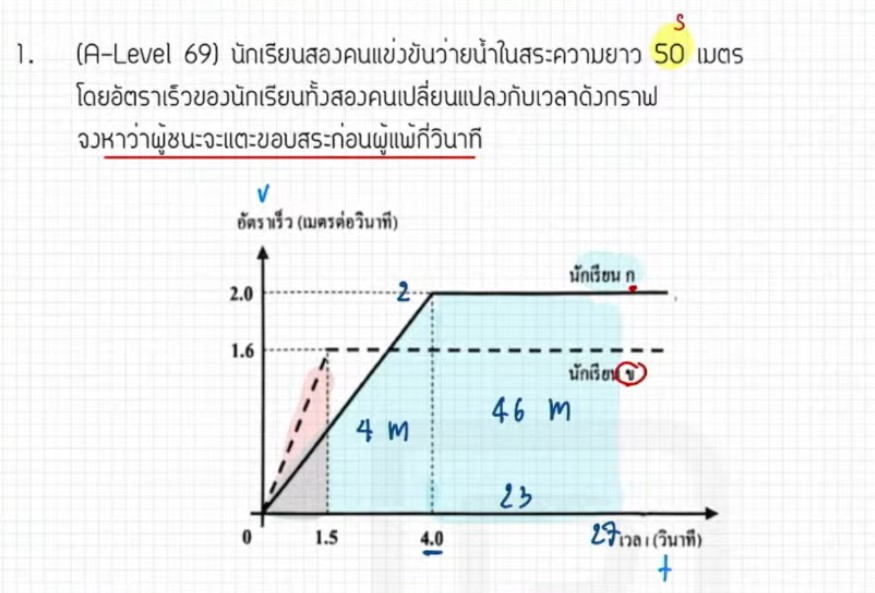

จากการวิเคราะห์ข้อสอบ A-Level ฟิสิกส์ มีนาคม 2569 ข้อที่ 1 จากแหล่งอ้างอิงที่กำหนด มีรายละเอียดวิธีทำและเนื้อหาที่น่าสนใจดังนี้ครับ

### **1. เฉลยวิธีทำโจทย์ข้อ 1 อย่างละเอียด**
โจทย์ข้อนี้เป็นเรื่อง **การเคลื่อนที่แนวตรง** โดยกำหนดระยะทางทั้งหมด ($S$) คือ **50 เมตร** และให้กราฟความเร็วกับเวลา ($v-t$ graph) ของผู้ทดสอบสองคนคือ ก ไก่ และ ข ไข่ มาให้ เพื่อหาว่าใครจะถึงเส้นชัยก่อนกันและชนะกันกี่วินาที

**การคำนวณของ ก ไก่:**
*   จากการวิเคราะห์พื้นที่ใต้กราฟ $v-t$ (ซึ่งคือระยะทาง) ในช่วงแรกพบว่าได้พื้นที่เป็น **4 เมตร**
*   โจทย์ต้องการระยะทางรวม 50 เมตร ดังนั้นเหลือระยะทางที่ต้องวิ่งอีก $50 - 4 = 46$ เมตร
*   เมื่อคำนวณเวลาที่ใช้ในส่วนที่เหลือ (จากกราฟที่มีความเร็วคงที่) จะได้เวลาเพิ่มเติมอีก 23 วินาที
*   **เวลารวมของ ก ไก่** จึงเท่ากับ $4 + 23 = \mathbf{27}$ **วินาที**

**การคำนวณของ ข ไข่:**
*   ในช่วงเริ่มต้น (ช่วงกราฟเส้นเฉียง) พื้นที่ใต้กราฟคำนวณได้เป็น **1.2 เมตร** โดยใช้เวลาไป 1.5 วินาที
*   เหลือระยะทางที่ต้องวิ่งอีก $50 - 1.2 = 48.8$ เมตร
*   ข ไข่ วิ่งด้วยความเร็วคงที่คือ 1.6 เมตรต่อวินาที ดังนั้นเวลาที่ใช้ในช่วงนี้คือ $48.8 / 1.6 = 30.5$ วินาที
*   **เวลารวมของ ข ไข่** จึงเท่ากับ $1.5 + 30.5 = \mathbf{32}$ **วินาที**

**สรุปคำตอบ:**
*   ก ไก่ ถึงก่อน (ใช้เวลาน้อยกว่า)
*   ชนะกันเป็นเวลา $32 - 27 = \mathbf{5}$ **วินาที** (ตอบตัวเลือกที่ 4)

---

### **2. เนื้อหาเพื่อศึกษาเพิ่มเติม**
*   **กราฟการเคลื่อนที่ ($v-t$ graph):** หัวใจสำคัญคือ **พื้นที่ใต้กราฟคือการกระจัดหรือระยะทาง** และ **ความชัน (Slope) คือความเร่ง**
*   **การแบ่งช่วงการเคลื่อนที่:** ในโจทย์จริงมักมีการเปลี่ยนความเร็ว (มีความเร่ง) แล้วตามด้วยความเร็วคงที่ เราต้องคำนวณแยกส่วนแล้วนำมารวมกัน,
*   **ความแม่นยำในการอ่านกราฟ:** ต้องระวังจุดตัดบนแกน $x$ และ $y$ รวมถึงหน่วยที่โจทย์ให้มา

---

### **3. กลยุทธ์แก้โจทย์ประเภทนี้**
*   **อย่าโดนตัวเลขหลอก:** บางครั้งตัวเลขในโจทย์อาจดูน่าเกลียดหรือคำนวณยาก (เช่น 1.6 หรือ 48.8) ให้ตั้งสติและค่อยๆ หารเลข หรือใช้เศษส่วนเข้าช่วย,
*   **ระวังจุดบอดเรื่องเวลา:** บ่อยครั้งที่นักเรียนคำนวณเวลาช่วงหลังได้แล้วลืมนำไปบวกกับเวลาช่วงแรกที่วิ่งมาก่อนหน้า,
*   **การบริหารเวลา:** หากเจอโจทย์ที่ต้องคำนวณเลขเยอะๆ ในห้องสอบและรู้สึกว่าอาจเสียเวลานาน แนะนำให้ข้ามไปทำข้ออื่นที่ง่ายกว่าก่อนแล้วค่อยกลับมาเก็บ
*   **รอบคอบเรื่อง Human Error:** ข้อสอบระดับนี้มักมีจุดหลอกเล็กๆ น้อยๆ การฝึกทำโจทย์บ่อยๆ จะช่วยลดความผิดพลาดที่ไม่ได้เกิดจากความไม่รู้ แต่เกิดจากความประมาท

---

### **4. ตัวอย่างโจทย์เพิ่มเติมเพื่อฝึกทำ (จำลองแนวทางจากแหล่งอ้างอิง)**

**โจทย์:** วัตถุหนึ่งเคลื่อนที่เป็นเส้นตรง โดยมีกราฟ $v-t$ ช่วง 4 วินาทีแรกมีความเร่งคงที่จากหยุดนิ่งจนมีความเร็ว 10 m/s จากนั้นเคลื่อนที่ด้วยความเร็วคงที่ 10 m/s ต่อไปจนได้ระยะทางรวมทั้งหมด 100 เมตร จงหาเวลารวมที่วัตถุนี้ใช้ในการเคลื่อนที่

**วิธีคิด:**
1.  **หาการกระจัดช่วงแรก:** พื้นที่สามเหลี่ยม $= 1/2 \times ฐาน \times สูง = 1/2 \times 4 \times 10 = 20$ เมตร
2.  **หาการกระจัดที่เหลือ:** $100 - 20 = 80$ เมตร
3.  **หาเวลาช่วงที่สอง:** วิ่งด้วยความเร็วคงที่ $v = 10$ m/s ดังนั้น $t = s/v = 80/10 = 8$ วินาที
4.  **เวลารวม:** $4 + 8 = \mathbf{12}$ **วินาที**

*(หมายเหตุ: ตัวอย่างโจทย์นี้เป็นการประยุกต์ใช้หลักการคำนวณจากแหล่งอ้างอิง เพื่อเสริมสร้างความเข้าใจในเนื้อหาที่ปรากฏในวิดีโอ)*