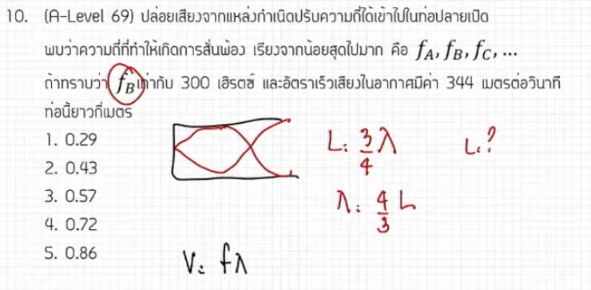

จากการวิเคราะห์ข้อสอบ A-Level ฟิสิกส์ มีนาคม 2569 **ข้อที่ 10** จากแหล่งอ้างอิงของพี่ตั้ว Physics Blueprint พบว่าเป็นเรื่อง **เสียง (การสั่นพ้องในท่อปลายปิด)** ซึ่งมีรายละเอียดวิธีทำและเนื้อหาดังนี้ครับ

### **1. เฉลยวิธีทำโจทย์ข้อ 10 อย่างละเอียด**
โจทย์ข้อนี้ถามหาความยาวของท่อปลายปิดที่ทำให้เกิดการสั่นพ้องในลำดับที่โจทย์กำหนด (จังหวะที่ 2)

**ข้อมูลที่โจทย์กำหนด:**
*   **ลักษณะท่อ:** ท่อปลายปิดหนึ่งด้าน
*   **ลำดับการสั่นพ้อง:** จังหวะที่ 2 (First Overtone)
*   **ความเร็วเสียง ($v$):** 344 เมตรต่อวินาที
*   **ความถี่ ($f$):** 300 เฮิรตซ์

**ขั้นตอนการคำนวณ:**
1.  **วิเคราะห์รูปแบบคลื่นในท่อ:** สำหรับท่อปลายปิด การสั่นพ้องครั้งแรก (ต่ำสุด) คือ $L = \lambda/4$ แต่โจทย์ระบุว่าเป็นจังหวะที่ 2 รูปคลื่นจะเป็น $3/4$ ของความยาวคลื่น
    *   จะได้สมการ: $L = \frac{3}{4}\lambda$
2.  **เปลี่ยน $\lambda$ ให้อยู่ในรูปของ $v$ และ $f$:** จากสูตร $v = f\lambda$ จะได้ $\lambda = v/f$
    *   แทนค่าในสมการแรก: $L = \frac{3}{4} \times (\frac{v}{f})$
3.  **แทนค่าตัวเลขเพื่อหาความยาวท่อ ($L$):**
    *   $L = \frac{3}{4} \times (\frac{344}{300})$
    *   $L = \frac{3 \times 344}{1200} = \frac{1032}{1200}$
    *   $L = \mathbf{0.86}$ **เมตร**
4.  **แปลงหน่วยเป็นเซนติเมตร:** $0.86 \times 100 = \mathbf{86}$ **เซนติเมตร**

**สรุปคำตอบ:** ความยาวของท่อเท่ากับ **86 เซนติเมตร**

---

### **2. เนื้อหาเพื่อศึกษาเพิ่มเติม**
*   **ท่อปลายปิด (Closed Pipe):** จะเกิดบัพ (Node) ที่ปลายปิดและปฏิบัพ (Antinode) ที่ปลายเปิดเสมอ ความยาวท่อที่ทำให้เกิดการสั่นพ้องจะเป็นเลขคี่เท่าของ $\lambda/4$ เสมอ ($1\lambda/4, 3\lambda/4, 5\lambda/4, ...$)
*   **Fundamental และ Overtone:** 
    *   การสั่นพ้องครั้งที่ 1 เรียกว่า Fundamental ($L = \lambda/4$)
    *   การสั่นพ้องครั้งที่ 2 เรียกว่า First Overtone ($L = 3\lambda/4$)
*   **ความเร็วเสียงในอากาศ:** โดยปกติจะขึ้นอยู่กับอุณหภูมิ แต่ในข้อสอบมักจะกำหนดค่าคงที่มาให้ เช่น 340 หรือ 344 เมตรต่อวินาทีเพื่อความสะดวกในการคำนวณ

---

### **3. กลยุทธ์แก้โจทย์ประเภทนี้**
*   **วาดภาพประกอบ:** พี่ตั้วแนะนำให้จำหน่วยเป็น "ภาพ" ของคลื่นในท่อมากกว่าท่องจำสูตร เพราะจะช่วยให้เราไล่ลำดับ $\lambda/4$ ได้เองโดยไม่สับสนระหว่างท่อปลายเปิดและปลายปิด
*   **ระวังคำเรียก:** โจทย์อาจใช้คำว่า "จังหวะที่ 2" "ฮาร์มอนิกที่..." หรือ "โอเวอร์โทนที่..." ต้องแม่นยำว่าแต่ละคำหมายถึงความยาวท่อกี่เท่าของ $\lambda$
*   **การจัดการตัวเลข:** หากเจอเลขที่ดูหารยาก เช่น 344/300 ให้ลองติดเป็นเศษส่วนไว้ก่อนแล้วค่อยตัดทอนภายหลัง จะช่วยลดโอกาสคิดเลขผิด

---

### **4. ตัวอย่างโจทย์เพิ่มเติมเพื่อฝึกทำ**

**โจทย์:** ท่อปลายปิดยาว 50 เซนติเมตร จะเกิดการสั่นพ้องครั้งแรก (Fundamental) กับแหล่งกำเนิดเสียงที่มีความถี่เท่าใด (กำหนดความเร็วเสียงในอากาศ $v = 340$ m/s)

**วิธีคิด:**
1.  **ตั้งสมการสั่นพ้องครั้งแรก:** $L = \lambda/4$ ดังนั้น $\lambda = 4L$
2.  **แทนค่าความยาวท่อ:** $\lambda = 4 \times 0.5$ m $= 2$ เมตร
3.  **หาความถี่จาก $v = f\lambda$:**
    *   $340 = f \times 2$
    *   $f = 340 / 2 = \mathbf{170}$ **เฮิรตซ์**

**เฉลย:** ความถี่เท่ากับ **170 เฮิรตซ์**

*(หมายเหตุ: การวิเคราะห์ขั้นตอนและเทคนิคการคำนวณอ้างอิงตามเนื้อหาจากวิดีโอเฉลยของพี่ตั้ว Physics Blueprint)*,