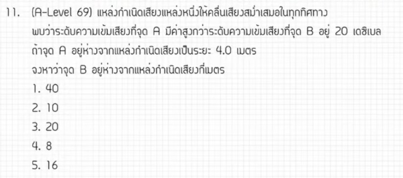

จากการวิเคราะห์ข้อสอบ A-Level ฟิสิกส์ มีนาคม 2569 **ข้อที่ 11** จากแหล่งอ้างอิงของพี่ตั้ว Physics Blueprint พบว่าเป็นเรื่อง **เสียง (ระดับความเข้มเสียง)** ซึ่งมีรายละเอียดวิธีทำและเนื้อหาที่น่าสนใจดังนี้ครับ

### **1. เฉลยวิธีทำโจทย์ข้อ 11 อย่างละเอียด**
โจทย์ข้อนี้เปรียบเทียบระดับความเข้มเสียงจากแหล่งกำเนิดเสียงเดิม (กำลังเสียง $P$ เท่าเดิม) เมื่อเปลี่ยนระยะห่างจากจุดเดิมไปยังจุดใหม่

**ข้อมูลที่โจทย์กำหนด:**
*   **ระยะห่างจุดแรก ($R_1$):** 4 เมตร
*   **ความแตกต่างของระดับความเข้มเสียง ($\Delta \beta$):** 20 เดซิเบล
*   **เงื่อนไขสำคัญ:** กำลังเสียง ($P$) ของแหล่งกำเนิดมีค่าคงที่

**ขั้นตอนการคำนวณ:**
1.  **ตั้งสมการระดับความเข้มเสียง:** ใช้สูตรผลต่างของระดับความเข้มเสียง 
    *   $\Delta \beta = 10 \log(\frac{I_1}{I_2})$
2.  **ความสัมพันธ์กับระยะทาง:** เนื่องจากความเข้มเสียง ($I$) แปรผกผันกับระยะทางยกกำลังสอง ($I \propto \frac{1}{R^2}$) เมื่อกำลังเสียงคงที่ จะได้สมการในรูปของระยะทางคือ:
    *   $\Delta \beta = 10 \log(\frac{R_2}{R_1})^2$ หรือ $\Delta \beta = 20 \log(\frac{R_2}{R_1})$
3.  **แทนค่าเพื่อหาระยะห่างใหม่ ($R_2$):**
    *   $20 = 20 \log(\frac{R_2}{4})$
    *   $1 = \log(\frac{R_2}{4})$
4.  **แก้สมการลอการิทึม:**
    *   $\frac{R_2}{4} = 10^1$
    *   $R_2 = 10 \times 4 = \mathbf{40}$ **เมตร**

**สรุปคำตอบ:** ระยะ $R_2$ มีค่าเท่ากับ **40 เมตร** (ตอบตัวเลือกที่ 2)

---

### **2. เนื้อหาเพื่อศึกษาเพิ่มเติม**
*   **ระดับความเข้มเสียง ($\beta$):** หน่วยเป็นเดซิเบล (dB) เป็นมาตรวัดที่สร้างขึ้นเพื่อเลียนแบบการรับรู้ของหูมนุษย์ที่เป็นแบบลอการิทึม
*   **กฎกำลังสองผกผัน (Inverse Square Law):** สำหรับแหล่งกำเนิดเสียงที่เป็นจุด พลังงานจะแผ่ออกเป็นรูปทรงกลม ทำให้ความเข้มเสียงลดลงตามพื้นที่ผิวที่เพิ่มขึ้น ($I = \frac{P}{4\pi R^2}$)
*   **สมบัติของ Logarithm ที่ใช้บ่อย:** $\log(a^n) = n \log(a)$ และถ้า $\log(x) = y$ แสดงว่า $x = 10^y$,

---

### **3. กลยุทธ์แก้โจทย์ประเภทนี้**
*   **จดจำความสัมพันธ์ลัด:** 
    *   ถ้าความเข้มเสียงเพิ่มขึ้น 10 เท่า $\rightarrow$ ระดับความเข้มเสียงเพิ่มขึ้น 10 dB
    *   ถ้าความเข้มเสียงเพิ่มขึ้น 100 เท่า $\rightarrow$ ระดับความเข้มเสียงเพิ่มขึ้น 20 dB
    *   **สำหรับระยะทาง:** ถ้าระยะทางเพิ่มขึ้น 10 เท่า $\rightarrow$ ระดับความเข้มเสียงจะลดลง 20 dB (เพราะ $10^2 = 100$ เท่าของความเข้ม)
*   **สังเกตตัวแปรคงที่:** ในโจทย์แนวนี้มักกำหนดให้กำลังเสียง ($P$) คงที่ ทำให้เราเปรียบเทียบแค่ระยะทางกับเดซิเบลได้ทันที
*   **เช็คความสมเหตุสมผล:** ถ้าระดับความเข้มเสียงลดลง (เดซิเบลลดลง) ระยะทางใหม่ต้อง **มากกว่า** ระยะทางเดิมเสมอ

---

### **4. ตัวอย่างโจทย์เพิ่มเติมเพื่อฝึกทำ**

**โจทย์:** ณ จุดที่ห่างจากลำโพง 2 เมตร วัดระดับความเข้มเสียงได้ 80 dB หากต้องการให้ระดับความเข้มเสียงลดลงเหลือ 60 dB จะต้องถอยห่างจากลำโพงไปอยู่ที่ระยะกี่เมตร?

**วิธีคิด:**
1.  **หาผลต่างเดซิเบล:** $\Delta \beta = 80 - 60 = 20$ dB
2.  **ใช้สูตรลัดระยะทาง:** การที่เดซิเบลต่างกัน 20 dB หมายถึงความเข้มเสียงต่างกัน $10^2 = 100$ เท่า
3.  **ความสัมพันธ์กับระยะทาง:** $\frac{I_1}{I_2} = (\frac{R_2}{R_1})^2 \rightarrow 100 = (\frac{R_2}{2})^2$
4.  **ถอดรากที่สอง:** $10 = \frac{R_2}{2}$
5.  **คำตอบ:** $R_2 = \mathbf{20}$ **เมตร**

*(หมายเหตุ: การวิเคราะห์และวิธีคำนวณอ้างอิงตามแนวทาง "ข้อมาตรฐานที่ควรทำได้" จากการเฉลยของพี่ตั้ว Physics Blueprint)*