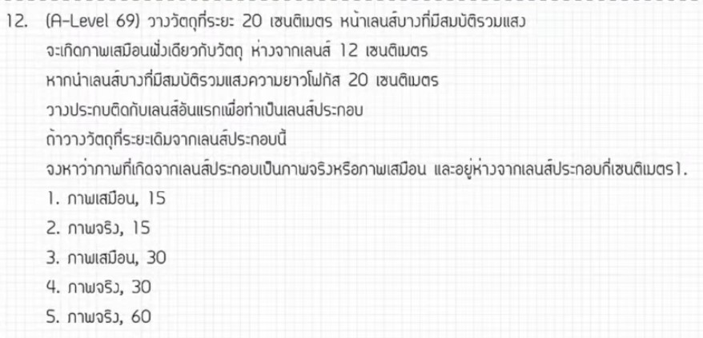

# ข้อสอบ A-Level ฟิสิกส์ มีนาคม 2569 ข้อที่ 12

จากการวิเคราะห์ข้อสอบ A-Level ฟิสิกส์ มีนาคม 2569 **ข้อที่ 12** จากแหล่งอ้างอิงของพี่ตั้ว Physics Blueprint พบว่าเป็นเรื่อง **ทัศนศาสตร์ (เลนส์ประกอบ)** ซึ่งมีรายละเอียดวิธีทำและเนื้อหาที่ควรศึกษาดังนี้ครับ

## 1. เฉลยวิธีทำโจทย์ข้อ 12 อย่างละเอียด

โจทย์ข้อนี้เป็นเรื่องการวางเลนส์สองชนิดต่อกัน โดยแสงจะผ่านเลนส์กระจายแสง (เลนส์เว้า) ก่อน แล้วจึงผ่านเลนส์นูน

**ข้อมูลที่โจทย์กำหนด:**

* **เลนส์ที่ 1 (เลนส์กระจายแสง):** วางวัตถุห่างจากเลนส์ ($s_1$) เป็นระยะ 20 เซนติเมตร
* **ผลจากการหักเหครั้งแรก:** เกิดภาพห่างจากเลนส์แรกเป็นระยะ ($s'_1$) 12 เซนติเมตร (เป็นภาพเสมือนที่เกิดด้านหน้าเลนส์)
* **เลนส์ที่ 2 (เลนส์นูน):** มีความยาวโฟกัส ($f_2$) เท่ากับ +20 เซนติเมตร
* **เงื่อนไขสำคัญ:** ภาพจากการหักเหครั้งแรกจะกลายเป็นวัตถุของการหักเหครั้งที่สอง ($s_2 = 12$ เซนติเมตร)

**ขั้นตอนการคำนวณ:**

1. **วิเคราะห์เลนส์ตัวหลัง (เลนส์นูน):** เราทราบระยะวัตถุ $s_2 = 12$ cm และ $f_2 = 20$ cm
2. **ใช้สูตรช่างทำเลนส์:** $\frac{1}{f} = \frac{1}{s} + \frac{1}{s'}$
    * $\frac{1}{20} = \frac{1}{12} + \frac{1}{s'_2}$
3. **ย้ายข้างเพื่อหา $s'_2$:**
    * $\frac{1}{s'_2} = \frac{1}{20} - \frac{1}{12}$
    * หา ค.ร.น. คือ 60 จะได้ $\frac{1}{s'_2} = \frac{3 - 5}{60} = \frac{-2}{60}$
    * $\frac{1}{s'_2} = -\frac{1}{30}$
4. **สรุปค่า $s'_2$:** ได้ $s'_2 = -30$ เซนติเมตร

**สรุปคำตอบ:** เครื่องหมายลบแสดงว่าเป็น **ภาพเสมือน** โดยเกิดที่ระยะ **30 เซนติเมตร** (ตอบตัวเลือกที่ 3)

---

### **2. เนื้อหาเพื่อศึกษาเพิ่มเติม**

* **กฎของเลนส์ประกอบ:** เมื่อมีเลนส์มากกว่าหนึ่งตัว ให้คิดทีละเลนส์ โดย **ภาพที่เกิดจากเลนส์ตัวแรกจะกลายเป็นวัตถุของเลนส์ตัวถัดไป**
* **เครื่องหมาย (Sign Convention):**
  * $f$ เป็นบวก (+) สำหรับเลนส์นูน และเป็นลบ (-) สำหรับเลนส์เว้า
  * $s'$ เป็นบวก (+) สำหรับภาพจริง (เกิดหลังเลนส์) และเป็นลบ (-) สำหรับภาพเสมือน (เกิดหน้าเลนส์)
* **ตำแหน่งภาพ:** หากระยะวัตถุ ($s$) น้อยกว่าความยาวโฟกัส ($f$) ในเลนส์นูน ภาพที่ได้จะเป็นภาพเสมือนขนาดขยายเสมอ

---

### **3. กลยุทธ์แก้โจทย์ประเภทนี้**

* **ตัดตัวเลือกด้วยทฤษฎี:** จากโจทย์ $s_2 = 12$ และ $f_2 = 20$ เนื่องจากระยะวัตถุน้อยกว่าโฟกัส ($s < f$) ต้องเกิดภาพเสมือนแน่นอน ดังนั้นสามารถ **ตัดตัวเลือกที่เป็น "ภาพจริง" ทิ้งได้ทันที** เพื่อประหยัดเวลา
* **วาดแผนภาพทางเดินแสง (Ray Diagram):** การวาดรูปคร่าวๆ จะช่วยให้เห็นตำแหน่งของภาพเสมือนที่เกิดขึ้นจากการหักเหครั้งแรก และเข้าใจว่ามันไปวางอยู่ตรงไหนเมื่อเทียบกับเลนส์ตัวที่สอง
* **ระวังเรื่องระยะห่างระหว่างเลนส์:** หากเลนส์ทั้งสองวางห่างกัน ต้องนำระยะห่างมาคำนวณหา $s_2$ ใหม่ (แต่ในข้อนี้โจทย์อำนวยความสะดวกให้ใช้ระยะ 12 cm ได้เลย)

---

### **4. ตัวอย่างโจทย์เพิ่มเติมเพื่อฝึกทำ**

**โจทย์:** วางวัตถุห่างจากเลนส์นูนที่มีโฟกัส 10 cm เป็นระยะ 15 cm ภาพที่เกิดขึ้นจะไปเป็นวัตถุให้กับเลนส์นูนตัวที่สองที่มีโฟกัส 20 cm ซึ่งวางห่างจากเลนส์แรก 40 cm จงหาตำแหน่งภาพสุดท้าย

**วิธีคิด:**

1. **หาภาพจากเลนส์แรก ($s'_1$):** $\frac{1}{10} = \frac{1}{15} + \frac{1}{s'_1} \rightarrow \frac{1}{s'_1} = \frac{3-2}{30} \rightarrow s'_1 = 30$ cm (ภาพจริงหลังเลนส์แรก)
2. **หาระยะวัตถุเลนส์ที่สอง ($s_2$):** เลนส์ห่างกัน 40 cm และภาพแรกเกิดห่างมา 30 cm ดังนั้น $s_2 = 40 - 30 = 10$ cm
3. **หาภาพสุดท้าย ($s'_2$):** $\frac{1}{20} = \frac{1}{10} + \frac{1}{s'_2} \rightarrow \frac{1}{s'_2} = \frac{1-2}{20} \rightarrow s'_2 = -20$ cm
**คำตอบ:** เกิดภาพเสมือนห่างจากเลนส์ที่สอง 20 cm

## หมายเหตุ

การวิเคราะห์และขั้นตอนการทำอ้างอิงตามแนวทางการสอนของพี่ตั้ว Physics Blueprint จากแหล่งอ้างอิงที่ได้รับ
