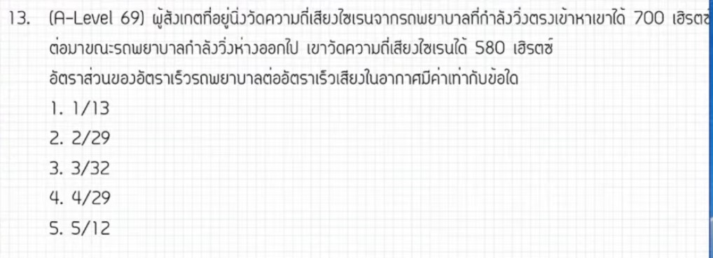

จากการวิเคราะห์ข้อสอบ A-Level ฟิสิกส์ มีนาคม 2569 **ข้อที่ 13** จากแหล่งอ้างอิงของพี่ตั้ว Physics Blueprint พบว่าเป็นเรื่อง **ปรากฏการณ์ดอปเพลอร์ (Doppler Effect)** ซึ่งมีประเด็นสำคัญที่ควรทราบดังนี้ครับ

### **1. เฉลยวิธีทำโจทย์ข้อ 13 อย่างละเอียด**
โจทย์ข้อนี้กล่าวถึงผู้สังเกตที่ยืนอยู่นิ่งริมถนน ขณะที่มีรถพยาบาลวิ่งเข้าหาและวิ่งห่างออกไป โดยวัดความถี่เสียงที่ได้ยินต่างกัน

**ข้อมูลที่โจทย์กำหนด:**
*   **ความถี่เมื่อรถวิ่งเข้าหา:** 700 เฮิรตซ์
*   **ความถี่เมื่อรถวิ่งห่างออกไป:** 580 เฮิรตซ์
*   **ความเร็วผู้ฟัง ($v_L$):** 0 เมตรต่อวินาที (หยุดนิ่ง)
*   **สิ่งที่โจทย์ถาม:** อัตราส่วนความเร็วของรถพยาบาลต่ออัตราเร็วเสียง ($v_s / v$)

**ขั้นตอนการคำนวณ:**
1.  **ตั้งสมการดอปเพลอร์ทั่วไป:** $f_L = f_s \left( \frac{v \pm v_L}{v \mp v_s} \right)$
2.  **กรณีที่ 1: รถวิ่งเข้าหา (เสียงดังขึ้น ตัวหารต้องน้อยลง)**
    *   $700 = f_s \left( \frac{v}{v - v_s} \right)$ — (สมการที่ 1)
3.  **กรณีที่ 2: รถวิ่งห่างออกไป (เสียงทุ้มลง ตัวหารต้องมากขึ้น)**
    *   $580 = f_s \left( \frac{v}{v + v_s} \right)$ — (สมการที่ 2)
4.  **นำสมการที่ 1 หารด้วยสมการที่ 2 เพื่อตัดตัวแปร $f_s$ และ $v$:**
    *   $\frac{700}{580} = \frac{v + v_s}{v - v_s}$
    *   $\frac{35}{29} = \frac{v + v_s}{v - v_s}$
5.  **คูณไขว้เพื่อหาความสัมพันธ์:**
    *   $35v - 35v_s = 29v + 29v_s$
    *   $6v = 64v_s$
    *   $\frac{v_s}{v} = \frac{6}{64} = \mathbf{\frac{3}{32}}$

**สรุปคำตอบ:** อัตราส่วนความเร็วรถต่อความเร็วเสียงคือ **3/32** (ตอบตัวเลือกที่ 3)

---

### **2. เนื้อหาเพื่อศึกษาเพิ่มเติม**
*   **ปรากฏการณ์ดอปเพลอร์:** คือการเปลี่ยนแปลงความถี่ของคลื่นที่ผู้สังเกตได้รับ เนื่องจากการเคลื่อนที่สัมพัทธ์ระหว่างแหล่งกำเนิดและผู้สังเกต
*   **ประเด็นเรื่องหลักสูตร:** พี่ตั้วและพี่ต้นสนระบุว่าเนื้อหาการคำนวณดอปเพลอร์แบบนี้ **"เกินหลักสูตร"** ของ สสวท. ชุดปัจจุบัน ซึ่งไม่ควรนำมาออกข้อสอบ และอาจมีการเสนอให้เป็นข้อฟรี
*   **การกำหนดเครื่องหมาย:**
    *   ถ้าผู้สังเกตและแหล่งกำเนิด **เข้าหากัน** $\rightarrow$ ความถี่ที่ได้รับจะสูงขึ้น ($f_L > f_s$)
    *   ถ้าผู้สังเกตและแหล่งกำเนิด **แยกจากกัน** $\rightarrow$ ความถี่ที่ได้รับจะต่ำลง ($f_L < f_s$)

---

### **3. กลยุทธ์แก้โจทย์ประเภทนี้**
*   **การจำสูตรด้วยความเข้าใจ:** แทนที่จะท่องเครื่องหมาย $\pm$ ให้จำว่า "ถ้าวิ่งเข้าหา เสียงต้องแหลมขึ้น (ตัวหารต้องลดลง)" และ "ถ้าวิ่งหนี เสียงต้องทุ้มลง (ตัวหารต้องเพิ่มขึ้น)"
*   **การกำจัดตัวแปร:** เมื่อโจทย์เปรียบเทียบสองสถานการณ์ (เข้าและออก) การนำสมการมาหารกันจะช่วยตัดตัวแปรที่ไม่ทราบค่าอย่างความถี่แหล่งกำเนิด ($f_s$) ออกไปได้ทันที
*   **ไหวพริบในการทำข้อสอบ:** หากจำสูตรไม่ได้ในห้องสอบเนื่องจากเป็นเนื้อหานอกบทเรียน พี่ต้นสนแนะนำว่าอาจใช้การสังเกตตัวเลือกที่คล้ายกันหรือการประมาณค่าความเร็วในชีวิตจริงช่วยได้บ้าง

---

### **4. ตัวอย่างโจทย์เพิ่มเติมเพื่อฝึกทำ**

**โจทย์:** รถตำรวจเปิดไซเรนความถี่ 1,000 Hz วิ่งเข้าหาชายคนหนึ่งที่ยืนอยู่นิ่งด้วยความเร็ว 20 m/s ถ้าความเร็วเสียงในอากาศคือ 340 m/s ชายคนนี้จะได้ยินเสียงมีความถี่เท่าใด?

**วิธีคิด:**
1.  **เลือกใช้สูตรกรณีวิ่งเข้าหา:** $f_L = f_s \left( \frac{v}{v - v_s} \right)$
2.  **แทนค่า:** $f_L = 1,000 \times \left( \frac{340}{340 - 20} \right)$
3.  **คำนวณ:** $f_L = 1,000 \times \left( \frac{340}{320} \right) = 1,000 \times 1.0625$
4.  **คำตอบ:** **1,062.5 เฮิรตซ์**

*(หมายเหตุ: การวิเคราะห์ประเด็นเรื่องหลักสูตรและเทคนิคการตั้งสมการอ้างอิงตามการเฉลยของพี่ตั้วและพี่ต้นสนจาก Physics Blueprint)*