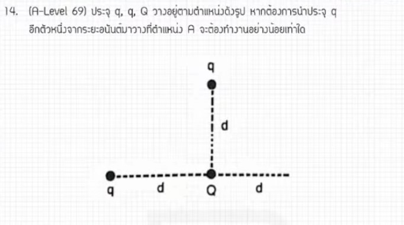

จากการวิเคราะห์ข้อสอบ A-Level ฟิสิกส์ มีนาคม 2569 **ข้อที่ 14** จากแหล่งอ้างอิงของพี่ตั้ว Physics Blueprint พบว่าเป็นเรื่อง **ไฟฟ้าสถิต (งานในการเลื่อนประจุและศักย์ไฟฟ้า)** ซึ่งมีรายละเอียดวิธีทำและเนื้อหาที่ควรศึกษาดังนี้ครับ

### **1. เฉลยวิธีทำโจทย์ข้อ 14 อย่างละเอียด**
โจทย์ข้อนี้ถามหางานที่ใช้ในการเลื่อนประจุจากระยะอนันต์ (Infinity) มายังจุดที่กำหนด ซึ่งอยู่ท่ามกลางกลุ่มประจุบวกตัวอื่นๆ

**ข้อมูลที่โจทย์กำหนด (วิเคราะห์จากขั้นตอนการคำนวณ):**
*   **ประจุที่นำมาเลื่อน:** $q$
*   **จุดเริ่มต้น:** ระยะอนันต์ ซึ่งมีศักย์ไฟฟ้าเป็นศูนย์ ($V_{\infty} = 0$)
*   **ประจุแวดล้อม:** มีประจุบวก $Q$ วางอยู่ตามตำแหน่งต่างๆ ซึ่งส่งผลต่อศักย์ไฟฟ้า ณ จุดปลายทาง
*   **ระยะห่างที่เกี่ยวข้อง:** $2d$, $d$ และ $\sqrt{2}d$ (ขึ้นอยู่กับการจัดวางรูปทรงเรขาคณิตของโจทย์)

**ขั้นตอนการคำนวณ:**
1.  **หาสมการงานในการเลื่อนประจุ ($W$):** งานเท่ากับประจุที่เลื่อนคูณด้วยผลต่างของศักย์ไฟฟ้า
    *   $W_{\infty \rightarrow A} = q(V_A - V_{\infty})$
    *   เนื่องจาก $V_{\infty} = 0$ ดังนั้น $W = qV_A$
2.  **คำนวณศักย์ไฟฟ้าลัพธ์ที่จุดปลายทาง ($V_A$):** ศักย์ไฟฟ้าเป็นปริมาณสเกลาร์ สามารถนำค่าจากประจุแต่ละตัวมาบวกกันได้เลย
    *   $V_A = \frac{kQ}{2d} + \frac{kQ}{d} + \frac{kQ}{\sqrt{2}d}$
3.  **จัดรูปสมการ:** ดึงตัวร่วม $\frac{kQ}{d}$ ออกมา และจัดการกับตัวเลขที่เหลือ
    *   $V_A = \frac{kQ}{d} \left( \frac{1}{2} + 1 + \frac{1}{\sqrt{2}} \right)$
    *   ทำให้ตัวส่วนเป็น $2d$ ทั้งหมด เพื่อให้ตรงกับตัวเลือก:
    *   $V_A = \frac{kQ}{2d} \left( 1 + 2 + \sqrt{2} \right) = \frac{kQ}{2d} \left( 3 + \sqrt{2} \right)$
4.  **หางานรวม ($W$):** นำประจุ $q$ เข้าไปคูณ
    *   $W = \frac{kqQ}{2d} (3 + \sqrt{2})$,

**สรุปคำตอบ:** งานในการเลื่อนประจุคือ **$\frac{kqQ}{2d} (3 + \sqrt{2})$** (ตอบตัวเลือกที่ 5)

---

### **2. เนื้อหาเพื่อศึกษาเพิ่มเติม**
*   **ศักย์ไฟฟ้า ($V$):** คือพลังงานศักย์ไฟฟ้าต่อหนึ่งหน่วยประจุ มีค่าเท่ากับ $kQ/r$ เป็นปริมาณสเกลาร์ (ต้องใส่เครื่องหมายประจุบวก/ลบในการคำนวณด้วย)
*   **งานในการเลื่อนประจุ ($W$):** งานที่ทำโดยแรงภายนอกในการย้ายประจุจากจุดหนึ่งไปยังอีกจุดหนึ่ง โดยไม่ทำให้ความเร็วเปลี่ยน งานจะเป็นบวกหากเราต้อง "ฝืน" แรงไฟฟ้า และเป็นลบหากแรงไฟฟ้าช่วยดึงไป
*   **ศักย์ไฟฟ้าที่ระยะอนันต์:** ในทางฟิสิกส์กำหนดให้ระยะที่ห่างออกไปไกลมากๆ มีค่าศักย์ไฟฟ้าเป็น 0 เพื่อใช้เป็นจุดอ้างอิง

---

### **3. กลยุทธ์แก้โจทย์ประเภทนี้**
*   **อย่าทิ้งไฟฟ้าสถิต:** พี่ตั้วเน้นย้ำว่าโจทย์แนวนี้เป็น "ข้อสอบแจกคะแนน" เพราะเนื้อหาตรงไปตรงมา ไม่ซับซ้อนเท่าเรื่องของไหลหรือความร้อนในบางปี การเก็บเรื่องศักย์ไฟฟ้าจะช่วยดึงคะแนนรวมได้ดี
*   **ระวังเรื่องระยะทาง ($r$):** ตรวจสอบให้ดีว่าระยะห่างจากประจุแต่ละตัวถึงจุดที่สนใจคือเท่าไหร่ โดยเฉพาะระยะแนวทแยงที่ต้องใช้พีทาโกรัสช่วย (เช่น $d\sqrt{2}$)
*   **การจัดรูปตัวแปร:** ข้อสอบ A-Level ช่วงหลังมักติดตัวแปรเยอะ นักเรียนควรฝึกการดึงตัวร่วมและการกำจัดเศษส่วนซ้อนให้คล่องแคล่วเพื่อไม่ให้พลาดในขั้นตอนสุดท้าย

---

### **4. ตัวอย่างโจทย์เพิ่มเติมเพื่อฝึกทำ**

**โจทย์:** มีประจุ $+Q$ สองตัว วางห่างกันเป็นระยะ $2d$ จงหางานในการเลื่อนประจุ $+q$ จากระยะอนันต์มาวางไว้ที่จุดกึ่งกลางระหว่างประจุทั้งสองนั้น

**วิธีคิด:**
1.  **หาระยะจากประจุแต่ละตัวถึงจุดกึ่งกลาง:** ระยะ $r = d$
2.  **หาศักย์ไฟฟ้าลัพธ์ที่จุดกึ่งกลาง ($V$):**
    *   $V = \frac{kQ}{d} + \frac{kQ}{d} = \frac{2kQ}{d}$
3.  **หางาน ($W$):**
    *   $W = qV = q \left( \frac{2kQ}{d} \right) = \frac{2kqQ}{d}$

**เฉลย:** งานที่ใช้คือ **$\frac{2kqQ}{d}$** จูล

*(หมายเหตุ: การวิเคราะห์ขั้นตอนและเทคนิคการจัดรูปตัวแปรอ้างอิงตามแนวทางการสอนของพี่ตั้ว Physics Blueprint จากแหล่งอ้างอิงที่ได้รับ)*