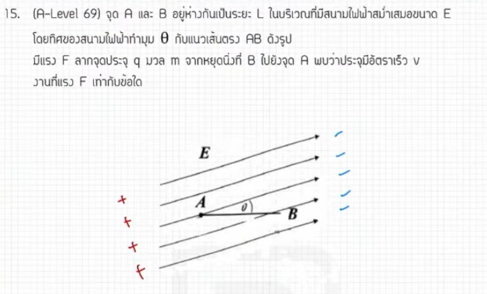

จากการวิเคราะห์ข้อสอบ A-Level ฟิสิกส์ มีนาคม 2569 **ข้อที่ 15** จากแหล่งอ้างอิงของพี่ตั้ว Physics Blueprint พบว่าเป็นเรื่อง **โมเมนตัมและการชนใน 2 มิติ** ซึ่งมีเทคนิคการทำที่น่าสนใจดังนี้ครับ

### **1. เฉลยวิธีทำโจทย์ข้อ 15 อย่างละเอียด**
โจทย์ข้อนี้เป็นเหตุการณ์ที่มวล A วิ่งเข้าชนมวล B ที่หยุดนิ่ง โดยมวลทั้งสองก้อนมีขนาดเท่ากันและการชนเป็นแบบยืดหยุ่น

**ข้อมูลที่โจทย์กำหนด:**
*   **ความเร็วต้นของ A ($u_A$):** 5 เมตรต่อวินาที
*   **มวล:** $m_A = m_B$ (มวลเท่ากัน)
*   **ลักษณะการชน:** การชนแบบยืดหยุ่นใน 2 มิติ โดยหลังชนมวลก้อนหนึ่งเบนไปทำมุม 37 องศากับแนวเดิม

**ขั้นตอนการคำนวณด้วยเทคนิค "ลัทธิสามเหลี่ยม":**
1.  **วิเคราะห์ด้วยกฎการอนุรักษ์โมเมนตัม:** เนื่องจากมวลเท่ากัน ($m$ ตัดกันได้หมด) ความสัมพันธ์ของเวกเตอร์ความเร็วจะเป็น $\vec{u}_A = \vec{v}_A + \vec{v}_B$
2.  **ใช้เงื่อนไขพิเศษ:** ในการชนแบบยืดหยุ่นที่มวลเท่ากันและก้อนหนึ่งหยุดนิ่ง **เวกเตอร์ความเร็วหลังชนของทั้งสองก้อนจะทำมุมฉาก (90 องศา) ต่อกันเสมอ**
3.  **สร้างรูปสามเหลี่ยมเวกเตอร์:**
    *   ด้านตรงข้ามมุมฉากคือความเร็วต้น $u = 5$ m/s
    *   มวลก้อนหนึ่งทำมุม 37 องศา จะเกิดเป็นสามเหลี่ยมมุมฉากที่มีอัตราส่วนด้านเป็น **3 : 4 : 5**
4.  **หาค่าความเร็วหลังชน:**
    *   ความเร็วของก้อนที่ทำมุม 37 องศา ($v_A$) = $5 \cos 37^\circ = 4$ เมตรต่อวินาที
    *   ความเร็วของอีกก้อนหนึ่ง ($v_B$) = $5 \sin 37^\circ = 3$ เมตรต่อวินาที

**สรุปคำตอบ:** ความเร็วของมวลทั้งสองหลังการชนคือ **3 เมตรต่อวินาที และ 4 เมตรต่อวินาที**

---

### **2. เนื้อหาเพื่อศึกษาเพิ่มเติม**
*   **การอนุรักษ์โมเมนตัม (Conservation of Momentum):** ในระบบที่ไม่มีแรงภายนอกมากระทำ ผลรวมโมเมนตัมก่อนชนจะเท่ากับผลรวมโมเมนตัมหลังชนเสมอ ($\sum \vec{P}_i = \sum \vec{P}_f$)
*   **การชนแบบยืดหยุ่น (Elastic Collision):** คือการชนที่พลังงานจลน์รวมของระบบไม่มีการสูญเสีย ($\sum E_{k,i} = \sum E_{k,f}$)
*   **กรณีพิเศษ $m_1 = m_2$ และ $u_2 = 0$:** หากเป็นการชนแบบยืดหยุ่น ทิศทางการเคลื่อนที่ของมวลทั้งสองหลังชนจะทำมุม **90 องศา** ต่อกัน ซึ่งเป็นสมบัติที่ช่วยให้แก้โจทย์ 2 มิติได้รวดเร็วโดยไม่ต้องแยกแกน X และ Y

---

### **3. กลยุทธ์แก้โจทย์ประเภทนี้**
*   **ใช้เรขาคณิตเข้าช่วย:** แทนที่จะตั้งสมการแยกแกน $X$ และ $Y$ ซึ่งใช้เวลานาน ให้ลองวาดเวกเตอร์แบบหางต่อหัวจนเกิดเป็น **รูปสามเหลี่ยม** จะทำให้เห็นความสัมพันธ์ของมุมและขนาดได้ชัดเจนกว่า
*   **สังเกตตัวเลขมาตรฐาน:** ข้อสอบมักใช้มุม $37^\circ$ หรือ $53^\circ$ คู่กับตัวเลขที่เป็นพหุคูณของ 5 (เช่น 5, 10, 15) ซึ่งจะเข้ากฎสามเหลี่ยม **3-4-5** พอดี
*   **ตรวจสอบมวล:** ต้องมั่นใจว่าโจทย์ระบุว่ามวลเท่ากันและชนแบบยืดหยุ่น จึงจะสามารถใช้ทริก "มุมฉากหลังชน" ได้

---

### **4. ตัวอย่างโจทย์เพิ่มเติมเพื่อฝึกทำ**

**โจทย์:** ลูกสนุกเกอร์สองลูกมีมวลเท่ากัน ลูกแรกวิ่งด้วยความเร็ว 10 m/s เข้าชนลูกที่สองที่หยุดนิ่งแบบยืดหยุ่น หลังการชนลูกแรกเบนไปทำมุม 53 องศากับแนวเดิม จงหาขนาดความเร็วของลูกที่สองหลังชน

**วิธีคิด:**
1.  **วิเคราะห์:** มวลเท่ากัน + ชนยืดหยุ่น + ก้อนสองหยุดนิ่ง $\rightarrow$ ความเร็วหลังชนทั้งสองก้อนทำมุมฉากกัน
2.  **สร้างสามเหลี่ยม:** ด้านตรงข้ามมุมฉาก (ความเร็วต้น) = 10 m/s
3.  **หาความเร็วลูกที่สอง ($v_2$):** ลูกแรกทำมุม 53 องศา ดังนั้นลูกที่สองจะทำมุม 37 องศากับแนวเดิม (หรือเป็นด้านที่อยู่ตรงข้ามมุม 53 องศาในสามเหลี่ยมความเร็ว)
4.  **คำนวณ:** $v_2 = 10 \sin 53^\circ = 10 \times (4/5) = \mathbf{8}$ **เมตรต่อวินาที**

**เฉลย:** ความเร็วลูกที่สองเท่ากับ **8 เมตรต่อวินาที**

*(หมายเหตุ: การวิเคราะห์และเทคนิค "ลัทธิสามเหลี่ยม" อ้างอิงตามแนวทางการสอนของพี่ตั้ว Physics Blueprint จากแหล่งอ้างอิงที่ได้รับ)*

สำหรับการวิเคราะห์ข้อสอบ A-Level ฟิสิกส์ มีนาคม 2567 **ข้อที่ 15** จากแหล่งอ้างอิงของพี่ตั้ว Physics Blueprint มีรายละเอียดคำตอบดังนี้ครับ

**คำตอบของข้อ 15:**
ความเร็วของมวลทั้งสองก้อนหลังการชนคือ **3 เมตรต่อวินาที และ 4 เมตรต่อวินาที**

**เหตุผลและแนวคิดในการเลือกคำตอบ:**
*   **ลักษณะการชน:** เป็นการชนแบบยืดหยุ่นใน 2 มิติ โดยมวลทั้งสองก้อนมีค่าเท่ากัน ($m_A = m_B$) และมวลก้อน B หยุดนิ่งอยู่กับที่ก่อนถูกชน
*   **เงื่อนไขพิเศษ:** ในกรณีที่มวลเท่ากันชนแบบยืดหยุ่นและก้อนหนึ่งหยุดนิ่ง เวกเตอร์ความเร็วหลังชนของมวลทั้งสองจะ**ตั้งฉากกัน (90 องศา)** เสมอ
*   **การคำนวณด้วย "ลัทธิสามเหลี่ยม":** 
    *   ความเร็วต้นของมวล A คือ **5 เมตรต่อวินาที** (ทำหน้าที่เป็นด้านตรงข้ามมุมฉากของสามเหลี่ยมความเร็ว)
    *   มวลก้อนหนึ่งเบนไปทำมุม **37 องศา** กับแนวเดิม,
    *   เมื่อใช้หลักการของสามเหลี่ยมมุมฉากที่มีอัตราส่วนด้าน **3 : 4 : 5** จะได้ความเร็วของมวลทั้งสองก้อนเป็น $5 \cos 37^\circ = \mathbf{4}$ **เมตรต่อวินาที** และ $5 \sin 37^\circ = \mathbf{3}$ **เมตรต่อวินาที** ตามลำดับ

ดังนั้น หากในตัวเลือกมีคำตอบที่ระบุความเร็วเป็น 3 และ 4 เมตรต่อวินาที ให้เลือกตัวเลือกนั้นได้เลยครับ (จากแหล่งอ้างอิงไม่ได้ระบุเลขข้อตัวเลือกอย่างชัดเจนเหมือนข้ออื่นๆ แต่เน้นที่ค่าความเร็วที่คำนวณได้),