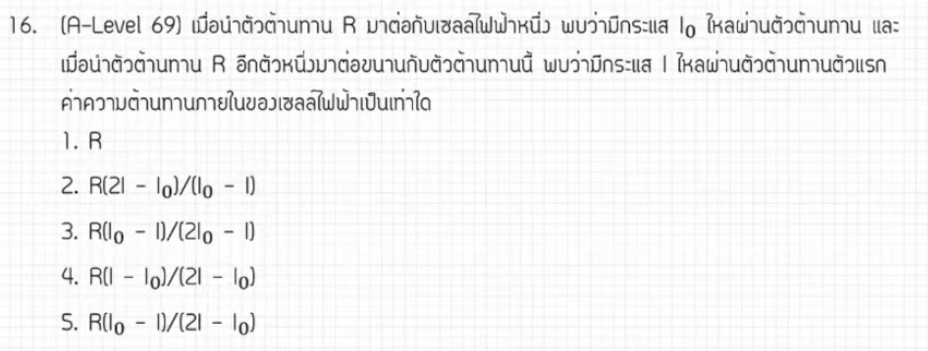

จากการวิเคราะห์ข้อสอบ A-Level ฟิสิกส์ มีนาคม 2569 **ข้อที่ 16** จากแหล่งอ้างอิงของพี่ตั้ว Physics Blueprint พบว่าเป็นเรื่อง **ไฟฟ้ากระแสตรง (แรงเคลื่อนไฟฟ้าและความต้านทานภายใน)** ซึ่งเป็นข้อที่เริ่มมีการใช้ตัวแปรในการคำนวณมากขึ้น มีรายละเอียดดังนี้ครับ

### **1. เฉลยวิธีทำโจทย์ข้อ 16 อย่างละเอียด**
โจทย์ข้อนี้เปรียบเทียบการต่อวงจรไฟฟ้าสองรูปแบบเพื่อหาค่าความต้านทานภายใน ($r$) ของแบตเตอรี่ในรูปของตัวแปรอื่น ๆ,

**สภาวะที่ 1: ต่อแบตเตอรี่ก้อนเดียวเข้ากับตัวต้านทาน $R$**
*   กระแสไฟฟ้าที่ไหลในวงจรคือ $i_0$
*   จากกฎของโอห์มสำหรับวงจรปิด: $i_0 = \frac{e}{R + r}$ — (สมการที่ 1)

**สภาวะที่ 2: ต่อแบตเตอรี่สองก้อนที่เหมือนกันแบบขนานกัน แล้วต่อกับตัวต้านทาน $R$**
*   การต่อแบตเตอรี่แบบขนาน: แรงเคลื่อนไฟฟ้ารวมยังคงเท่ากับ **$e$** แต่ความต้านทานภายในรวมจะลดลงเหลือ **$r/2$**
*   โจทย์กำหนดให้กระแสที่ผ่านแบตเตอรี่แต่ละก้อนคือ $i$ ดังนั้นกระแสรวมที่ไหลผ่าน $R$ คือ **$2i$**
*   ตั้งสมการได้ว่า: $2i = \frac{e}{R + (r/2)}$ — (สมการที่ 2)

**ขั้นตอนการแก้สมการเพื่อหา $r$:**
1.  **กำจัดตัวแปร $e$:** นำสมการที่ 1 หารด้วยสมการที่ 2
    *   $\frac{i_0}{2i} = \frac{R + (r/2)}{R + r}$
2.  **คูณไขว้เพื่อจัดรูป:**
    *   $i_0(R + r) = 2i(R + \frac{r}{2})$
    *   $i_0R + i_0r = 2iR + ir$
3.  **ย้ายข้างเพื่อรวบรวมตัวแปร $r$ ไว้ด้วยกัน:**
    *   $i_0r - ir = 2iR - i_0R$
    *   $r(i_0 - i) = R(2i - i_0)$
4.  **หาคำตอบสุดท้าย:**
    *   $r = \frac{R(2i - i_0)}{i_0 - i}$

**สรุปคำตอบ:** ตอบตัวเลือกที่ 5

---

### **2. เนื้อหาเพื่อศึกษาเพิ่มเติม**
*   **แรงเคลื่อนไฟฟ้า ($e$) และความต้านทานภายใน ($r$):** แบตเตอรี่จริงจะมีความต้านทานภายในที่ทำให้แรงดันไฟฟ้าที่ขั้วแบตเตอรี่ลดลงเมื่อมีกระแสไหล ($V = e - ir$)
*   **การต่อเซลล์ไฟฟ้า:**
    *   **แบบอนุกรม:** $e_{รวม} = \sum e$, $r_{รวม} = \sum r$ (ช่วยเพิ่มแรงดัน)
    *   **แบบขนาน:** $e_{รวม} = e$ (เท่ากับก้อนเดียว), $r_{รวม} = r/n$ (ช่วยให้แบตเตอรี่ใช้งานได้นานขึ้นและลดความต้านทานรวม)
*   **กฎของโอห์มในวงจรปิด:** $I = \frac{\sum E}{\sum R + \sum r}$ เป็นพื้นฐานสำคัญในการตั้งสมการวงจรไฟฟ้า

---

### **3. กลยุทธ์แก้โจทย์ประเภทนี้**
*   **วิเคราะห์ตัวแปรที่โจทย์ไม่ต้องการ:** ในข้อนี้เราไม่ทราบค่า $e$ และโจทย์ไม่ได้ถามหา ดังนั้นกลยุทธ์ที่ดีที่สุดคือ **"การนำสมการมาหารกัน"** เพื่อกำจัด $e$ ออกไป
*   **ระวังกระแสรวม:** เมื่อมีการต่อขนาน อย่าลืมดูว่ากระแสที่โจทย์ให้มาคือกระแสในสาขา ($i$) หรือกระแสรวมของวงจร ($2i$)
*   **จัดรูปตัวแปรอย่างเป็นระบบ:** เมื่อได้สมการติดตัวแปรเยอะ ๆ ให้ใช้วิธีดึงตัวร่วมเพื่อแยกตัวแปรที่ต้องการหา ($r$) ออกมาอย่างชัดเจน

---

### **4. ตัวอย่างโจทย์เพิ่มเติมเพื่อฝึกทำ**

**โจทย์:** ต่อแบตเตอรี่หนึ่งก้อน ($e, r$) กับตัวต้านทาน $R$ วัดกระแสได้ $1$ A ถ้าเปลี่ยนมาต่อแบตเตอรี่แบบอนุกรมกัน $2$ ก้อนเข้ากับ $R$ ตัวเดิม วัดกระแสได้ $1.5$ A จงหาค่าความต้านทานภายใน $r$ ในรูปของ $R$

**วิธีคิด:**
1.  **สภาวะ 1:** $1 = \frac{e}{R + r} \Rightarrow e = R + r$
2.  **สภาวะ 2 (อนุกรม):** $1.5 = \frac{2e}{R + 2r} \Rightarrow 1.5(R + 2r) = 2e$
3.  **แทนค่า $e$:** $1.5R + 3r = 2(R + r)$
4.  **แก้สมการ:** $1.5R + 3r = 2R + 2r \Rightarrow r = 0.5R$
**คำตอบ:** $r = \frac{R}{2}$

*(หมายเหตุ: การวิเคราะห์ขั้นตอนการแก้สมการและการจัดการตัวแปรอ้างอิงตามเทคนิคการสอนของพี่ตั้ว Physics Blueprint จากแหล่งอ้างอิงที่ได้รับ)*,